# The Third Party Exception Decay Problem

## How Vendor Risk Exceptions Rot Across Your Supply Chain: The VEDS Model

**Version:** 1.0  
**Date:** 2026-10-06  
**Series:** What-I-Learned-Today-on-SOC-GRC  
**Author:** hiro001-eth  
**Series Position:** Paper 14 of the GRC Decay Research Program  
**Prequel:** [The Exception Lifecycle Decay Model (ELDM)](./On%2014-09-2026%20-%20THE%20EXCEPTION%20LIFECYCLE%20DECAY%20MODEL%20How%20Accepted%20Risks%20Rot:%20A%20Four%20Drift%20Theory%20of%20GRC%20Exception%20Decay%20and%20Its%20Forensic,%20Detection,%20and%20Audit%20Consequences.md)  
**Classification:** Advanced SOC + GRC Research | Supply Chain Security | Third Party Risk Management | CISO Metrics  
**Target Audience:** Tier 1-3 SOC Analysts, Third Party Risk Teams, Vendor Security Managers, Detection Engineers, GRC Auditors, CISOs

---

## TL;DR

Every model I built before this one looked inward. The ELDM measures how your own exceptions rot. The IR-GRC Closed Loop measures how well your incident data feeds your own governance. But here is the thing I kept running into when I dug deeper: the most dangerous exceptions in most organizations are not the ones you signed. They are the ones your vendors signed, for risks in their environment, using your data, your integrations, and your network trust as the blast radius.

I started pulling at that thread and could not stop.

This paper introduces the **Vendor Exception Decay Score (VEDS)**, the supply chain extension of EDS. Where EDS measures decay inside one organization, VEDS measures how that decay propagates outward across vendor tiers. The mechanism is the same four drifts from ELDM, but they now operate across organizational boundaries where you have no direct telemetry, no enforcement authority, and no visibility when the detection goes dark.

The math is a product of five components. Four are direct analogues of the ELDM drifts. The fifth is new: **Cascade Amplification**, the multiplier that reflects how deeply your vendors are nested into your own operations and how far the damage travels when one of them decays to zero.

The practical output: a scoring model, an audit procedure, a SOAR integration schema, and a board-level framing for third party exception risk that does not rely on annual questionnaires.

---

## Why I Went Down This Rabbit Hole

I want to be honest about where this started.

After writing the ELDM paper, I got a question that I could not answer well: if an exception inside your own organization decays on a predictable schedule because of scope drift, temporal drift, ownership drift, and detection drift, what happens when the exception is not yours? What happens when your most critical vendor has signed a risk waiver that covers the integration point between their environment and yours?

I started mapping it out and realized the problem is not just the same. It is worse. In every dimension.

When your own exception decays, you at least have the data. Your SIEM has telemetry on the asset. Your GRC platform owns the record. Your analysts, however overloaded they are, are in the same building or at least the same Slack workspace as the control that is failing. When a vendor exception decays, you have none of that. You have an annual questionnaire response that says "controls are in place." You have a contract clause that says they will notify you of material changes. You have a trust boundary that both sides agreed to maintain and neither side can measure in real time.

And then somewhere in that trust boundary, something rots. And you do not find out until it shows up in a post-mortem.

That is the problem this paper is about.

---

## The Central Question

Let me put it plainly.

You have fifty vendors. Some of them touch your most sensitive data. Some of them have direct API integrations into your production systems. Some of them run the software that processes your customer payments. And every single one of them has an exception register that you have never seen.

Some of those exceptions are fresh. Some are healthy. Some have compensating controls that actually work.

And some of them have been silently decaying for 18 months, with a scope that now covers infrastructure you depend on, owned by people who left, compensated by a detection rule that stopped firing eight months ago, and authorized by an expiry date that passed without anyone noticing.

Which vendors? Which exceptions? Which decay state? That is what the VEDS Model is designed to answer.

---

## The Central Formula

Everything in this paper builds toward one calculation. The Vendor Exception Decay Score:

```
VEDS(v, e, t) = VSIR(v,e,t) x VAL_n(v,e,t) x VCC(v,e,t) x VCL(v,e,t) x CA(v,e,t)

VEDS = 1.0  --> Healthy vendor exception, verified compensating controls, current authorization
VEDS = 0.0  --> Open attack surface across your supply chain boundary
```

| Component | Full Name | What It Measures | Healthy | Decayed |
| :--- | :--- | :--- | :---: | :---: |
| VSIR | Vendor Scope Integrity Ratio | Does the exception scope match what the vendor actually uses in your context? | 1.0 | Near 0 |
| VAL_n | Vendor Authorization Lag (normalized) | Is the exception still within its authorized window? | 1.0 | Near 0 |
| VCC | Vendor Custodial Continuity | Are the same people who signed this exception still responsible for it? | 1.0 | Near 0 |
| VCL | Vendor Compensation Liveness | Is the compensating control actually detecting anything? | 1.0 | 0 |
| CA | Cascade Amplification | How far does the blast radius reach if this vendor exception is exploited? | Low | High |

The product form is deliberate. It reflects the same attacker logic as the original EDS. An attacker targeting your supply chain does not need all five components to fail. They only need one. And they will find the weakest one first.

The fifth component, CA, is what separates VEDS from EDS. Inside your own organization, a decayed exception hurts you. Across your supply chain, a decayed vendor exception can hurt you, all of your vendor's other customers, and every downstream system that trusts the integration point that just became an open door.

---

## Part I: The Vendor Exception Lifecycle

### 1.1 What Even Is a Vendor Exception and Why Should You Care?

A vendor exception is a risk acceptance made by a third party, for their own internal risk governance, that affects your security posture.

The most common ones I found when I started researching this are not dramatic. They are mundane. A vendor accepts the risk of not patching a legacy component because it would break your integration. A vendor accepts the risk of weaker authentication on the API account they use to connect to your system because adding MFA would require a code change that is not in scope for the current quarter. A vendor accepts the risk of logging gaps in the environment that processes your data because their SIEM does not cover that legacy subnet.

Every one of those decisions is made by your vendor, documented in your vendor's GRC system, and invisible to you. And every one of them, if left unaddressed, will decay on the same schedule as your own exceptions, for the same reasons, except you will not see the signals.

### 1.2 The Five Stages of a Vendor Exception

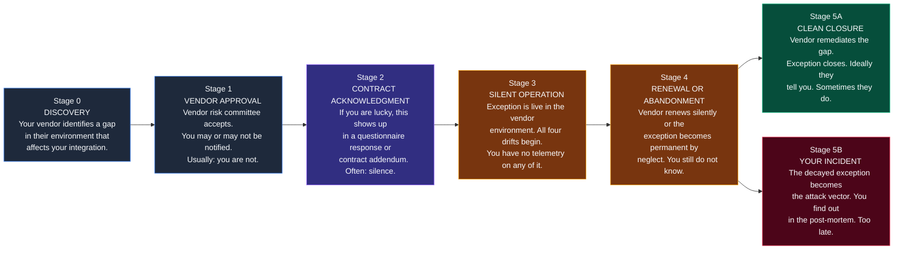

### 1.3 The Two Facts That Make This Worse Than the Internal Version

**Fact 1:** Stage 3 is where all the decay happens. In the internal ELDM model, Stage 3 is the unmeasured interval between approval and incident. In the vendor model, you are not even measuring Stage 0 through 2 in most cases. You start blind and stay blind.

**Fact 2:** The compensating control in the internal ELDM can be built by your own detection engineers, tested by your own SOC, and monitored in your own SIEM. The compensating control in a vendor exception is built by someone in an organization you do not control, tested against tooling you cannot audit, and monitored in a platform you have no access to. When VCL collapses to zero in a vendor context, you do not see the alert stop firing. You just stop receiving the assurance that was built on the assumption that it was firing.

> [!IMPORTANT]
> The fundamental asymmetry of vendor exception decay: you bear the blast radius of their control failure, but you have none of the telemetry that would tell you the control is failing.

---

## Part II: The Five Decay Mechanisms in Vendor Context

Each mechanism from the internal ELDM has a vendor-specific form. The names are similar. The consequences are not.

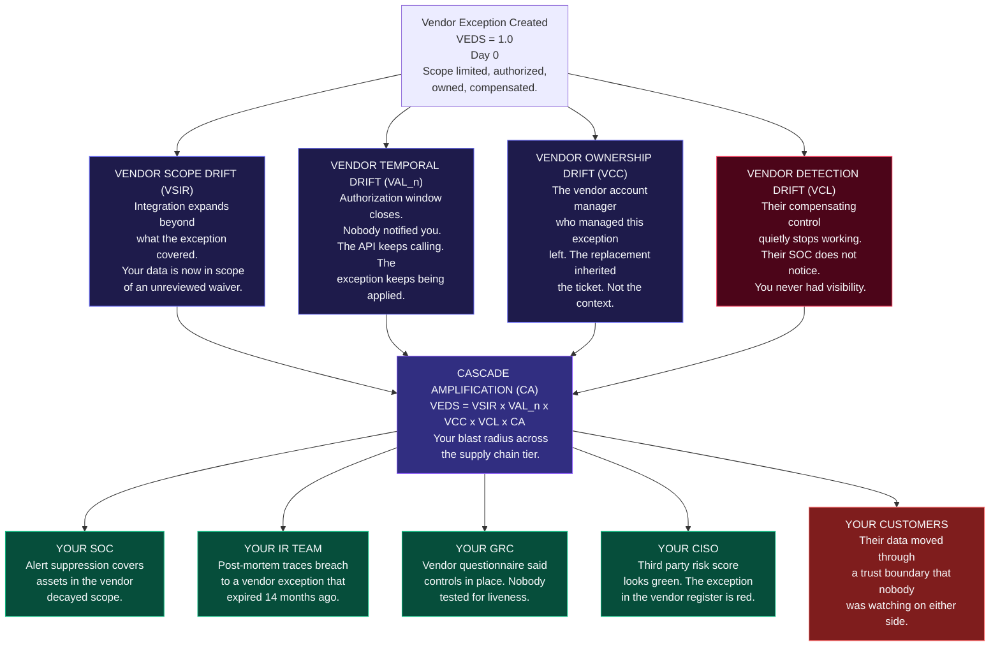

---

### 2.1 Vendor Scope Drift (VSIR)

**What it is:** The vendor exception covers a specific component of their environment. Over time, the integration expands, their environment grows, or the component gets cloned, migrated, or shared with a subcontractor. The exception scope no longer matches what is actually operating under its authorization.

The difference from internal scope drift is access. When your own exception scope drifts, you can run an asset query and find the phantoms. When a vendor exception scope drifts, you see their questionnaire answer from last quarter that says "our scope is correctly bounded."

**How it actually happens:**

- The vendor payment processing API was excepted from a specific logging requirement. Then they migrated the payment processor to a shared services cluster. The cluster runs the excepted logic alongside ten other client integrations. The exception now implicitly covers processing for clients who never agreed to the risk.
- The vendor development environment was excepted from full encryption at rest because it contained only synthetic data. Then a junior engineer connected it to a production dataset for a demo. The exception scope string still says "non-production environments only."
- The vendor signed an exception for a specific legacy integration point. They rebuilt the integration and kept the exception applied to the new implementation without re-approval, because nobody thought the exception was tied to the architecture it was written for.

**What you lose:** Your trust boundary was defined by the exception original scope. When that scope drifts without your knowledge, you are operating under a risk posture that does not match reality. Every security decision you made about that vendor was based on a scope that no longer exists.

**Measure:**

```
VSIR(v,e) = |assets_in_vendor_environment_matching_scope INTERSECT assets_originally_approved|
             -------------------------------------------------------------------------------------
                          |assets_currently_operating_under_exception_coverage|

A Vendor Scope Phantom is any asset operating in the vendor environment that:
  a) Falls within the exception scope string by current interpretation, AND
  b) Was not explicitly included in the original approved scope, AND
  c) Touches your integration boundary, your data, or your trust chain.

VSIR approaches 0 as vendor scope phantoms accumulate.
You cannot compute this without vendor cooperation or direct evidence from integration telemetry.
```

**The detection signal you actually have:** Integration logs. If the vendor API call patterns shift, if new source addresses appear, if data volumes on the integration channel change in ways that are inconsistent with the approved scope of the underlying connection, you are looking at scope drift from the outside. Most organizations are not looking.

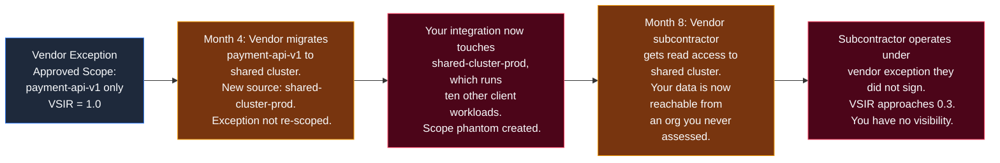

---

### 2.2 Vendor Temporal Drift (VAL_n)

**What it is:** The vendor exception has an expiration date. That date passes. The risk-causing behavior continues. Nobody told you.

This is the most common form of vendor exception decay I kept finding in my research. Not because organizations are negligent, but because the default state of every exception is "continue operating" and the default state of every busy GRC team is "renewal approved, next." The combination produces exceptions that outlive their authorization by years while the integration they cover runs uninterrupted.

The internal version of temporal drift is bad because authorization lapses without human review. The vendor version is worse because you were not part of the authorization to begin with, so you have no mechanism to detect the lapse.

**How this actually plays out:**

A vendor signs a 90-day exception to accommodate a delayed patch cycle during a platform migration. The migration finishes, but the patching is deprioritized because the system is "stable." The 90 days pass. The vendor GRC team sends an internal reminder. The system owner files a renewal request with a new expiry. That renewal gets approved in a five-minute meeting. The cycle repeats three more times. By month 18, the exception is permanent by operational habit, the original justification is irrelevant, and you have been running an integration against an unpatched system for 18 months under an authorization that expired 15 months ago.

Nobody called you. Nothing in your systems flagged it. Your annual questionnaire response for that vendor says "all exceptions are reviewed on a 90-day cycle." That is technically true. The review said "approved." It just forgot to say "for the 12th time in a row."

**Measure:**

```
VAL(v,e) = max(0, days_since(expiry(vendor_exception_e))) when no extension covers current date
VAL = 0                                                   when a valid extension exists in vendor system

VAL_n = 1 / (1 + VAL/90)   normalized form for VEDS calculation

You cannot compute this directly without access to the vendor exception register.
Proxy measurement: contract-based expiry language enforcement and vendor self-reported status.
The honest truth: most organizations are measuring vendor authorization state on a 12-month
questionnaire cycle, for exceptions that can expire and be renewed multiple times within that window.
```

**The renewal chain problem is worse at the vendor level:**

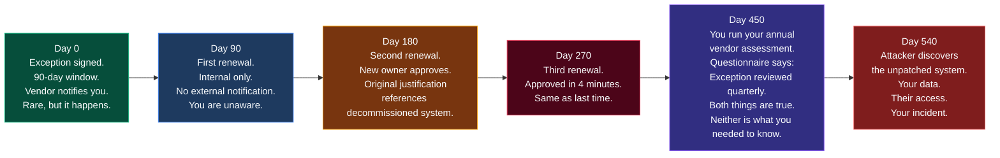

---

### 2.3 Vendor Ownership Drift (VCC)

**What it is:** The people who understood the exception, who knew why it existed, who knew what the compensating control was supposed to do, have left or moved on. Their replacements inherited a ticket. Not the context. Not the worry. Not the institutional memory of why this was flagged as a risk in the first place.

In the internal ELDM, I described ownership drift as the mechanism by which exceptions become unowned. In the vendor context, ownership drift has an additional layer: not only does the exception become unowned inside the vendor, but your relationship with whoever owned it is now broken too. The account manager who briefed you on the exception is now at a different company. The security contact you had is gone. You are talking to someone new who tells you everything is fine because that is what the ticket says.

**The three places ownership drift hits hardest in vendor relationships:**

First is the vendor own internal ownership. The security engineer who built the compensating control left. Their replacement does not know the control exists. It continues running. Nobody tests it. Nobody knows it needs testing.

Second is the boundary owner on your side. The person at your organization who was the relationship owner for this vendor, who attended the briefings, who understood the risk posture, has moved to a different role. Their replacement inherited the vendor relationship along with forty others and treats the questionnaire as the source of truth.

Third is the contractual layer. The exception language exists in a vendor contract or MSA addendum. The legal team that negotiated it is different from the security team that needs to enforce it. The clause says the vendor must notify you of material changes to their exception status. Nobody on either side knows who is responsible for sending or receiving that notification today.

**Measure:**

```
VCC(v,e) = fraction of {vendor_security_contact, vendor_exception_owner, your_vendor_relationship_owner,
            your_third_party_risk_manager} roles occupied by the same person (or documented
            successor with verified briefing) as at original exception documentation.

VCC decays at every personnel transition on both sides of the relationship.
A VCC below 0.5 means the exception is effectively unowned on at least one side
of the boundary that matters.
```

**What unowned vendor exceptions look like in practice:**

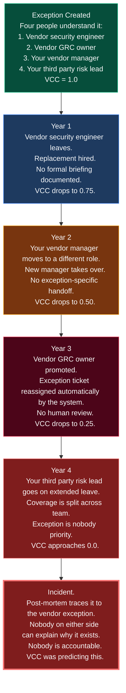

---

### 2.4 Vendor Detection Drift (VCL)

**What it is:** The compensating control that the vendor implemented to make the exception safe stops working. Quietly. Without anyone noticing. On their side or yours.

This is the drift that matters most. It is the one that collapses VEDS to zero regardless of what the other components look like. And in the vendor context, it is essentially undetectable through normal third party risk management channels.

Here is the scenario I kept reconstructing: A vendor accepts the risk of a configuration weakness. In exchange, they commit to a compensating control. Maybe it is enhanced monitoring on the affected component. Maybe it is a weekly vulnerability scan with results reported to your team. Maybe it is a specific SIEM rule that alerts on anomalous activity in the excepted zone.

They build it. It works. They document it. Your questionnaire asks about it. They say yes. You mark the control as verified.

Then, six months later, the SIEM rule stops matching because the asset hostname changed after a routine infrastructure refresh. The rule runs every night. It matches nothing. No alert fires. On both their dashboard and the dashboard they show you, the rule is listed as "active and operational." Both of those statements are technically accurate. Neither of them means the control is working.

**The three failure modes in vendor detection drift:**

- **Rule rot:** The compensating detection logic references specific infrastructure identifiers that changed. The rule keeps running. It finds nothing. Nobody notices because "nothing to find" looks the same as "nothing happening."
- **Telemetry rot:** The log source the rule depends on stopped shipping. Agent update, configuration change, license expiry. The vendor internal SOC may or may not have noticed. You definitely have not.
- **Disposition rot:** The rule still fires. But the vendor analysts have learned to close those alerts because the system owner told them the exception covers this behavior. The compensating control triggers an alert. The alert gets closed. Your data continues flowing through an unmonitored gap.

**Measure:**

```
VCL(v,e) = vendor_input_liveness x vendor_match_liveness x vendor_disposition_liveness

vendor_input_liveness      = are the log sources feeding the compensating rule actually shipping?
                             (verified, not self-reported)
vendor_match_liveness      = does a coverage test produce a fired alert?
                             (run by vendor, observed by you via shared evidence)
vendor_disposition_liveness = of alerts the rule generates, what fraction reach human review
                              rather than auto-closure?

VCL = 1.0 only if all three are independently verified.
The honest default for most vendor relationships: VCL is unknown.
Unknown VCL should be treated as VCL = 0 for VEDS scoring purposes.
```

> [!WARNING]
> If you cannot independently verify that a vendor compensating control is live, you cannot claim it as a mitigating factor in your risk posture. An unverified compensating control is not a control. It is documentation of an intention.

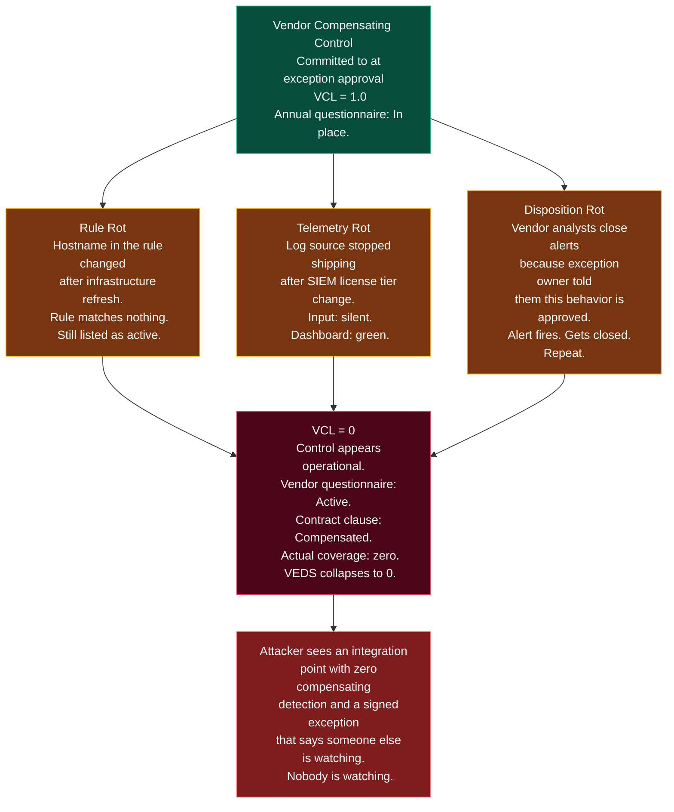

---

### 2.5 Cascade Amplification (CA) — The New Component

This is the one that does not exist in the internal ELDM. And it is what makes the vendor exception decay problem categorically different from the internal version.

**What it is:** A measure of how deeply the vendor exception is embedded into your operations, and how many downstream systems, processes, and trust relationships would be affected if that exception became an attack vector.

An exception in your own environment fails and hurts you. An exception in a critical vendor environment fails and can hurt you, all of your vendor other customers, their other clients who share the same platform, and any downstream system that trusted the integration point that just became an open door.

**How CA is calculated:**

CA is not a single number. It is a weighted composite of four factors:

```
CA(v,e) = f(Integration_Depth, Data_Sensitivity, Vendor_Tier, Shared_Exposure)

Integration_Depth (ID):
  How many of your critical systems have direct dependencies on the integration
  covered by this exception?
  Scale 1-5: 1 = isolated non-critical system, 5 = core production dependency

Data_Sensitivity (DS):
  What classification level of your data transits the integration this exception covers?
  Scale 1-5: 1 = public data only, 5 = PII, financial records, health data, IP

Vendor_Tier (VT):
  Is this a direct vendor (Tier 1) or a vendor's vendor (Tier 2+)?
  Tier 1: direct contract, some visibility. Scale multiplier: 1.0
  Tier 2: subcontractor. Scale multiplier: 1.5
  Tier 3+: you may not even know they exist. Scale multiplier: 2.0+

Shared_Exposure (SE):
  Does this vendor serve other clients using the same infrastructure as yours?
  A compromise that starts at your integration point may propagate horizontally
  to every other client sharing that platform.
  Scale 1-5: 1 = dedicated environment, 5 = fully shared multi-tenant infrastructure
```

The CA score ranges from 1 (low amplification, contained blast radius) to 10+ (high amplification, cross-client systemic risk). It multiplies the base VEDS score, meaning a highly embedded vendor with a decayed exception has a dramatically higher risk contribution than a peripheral vendor with the same level of exception decay.

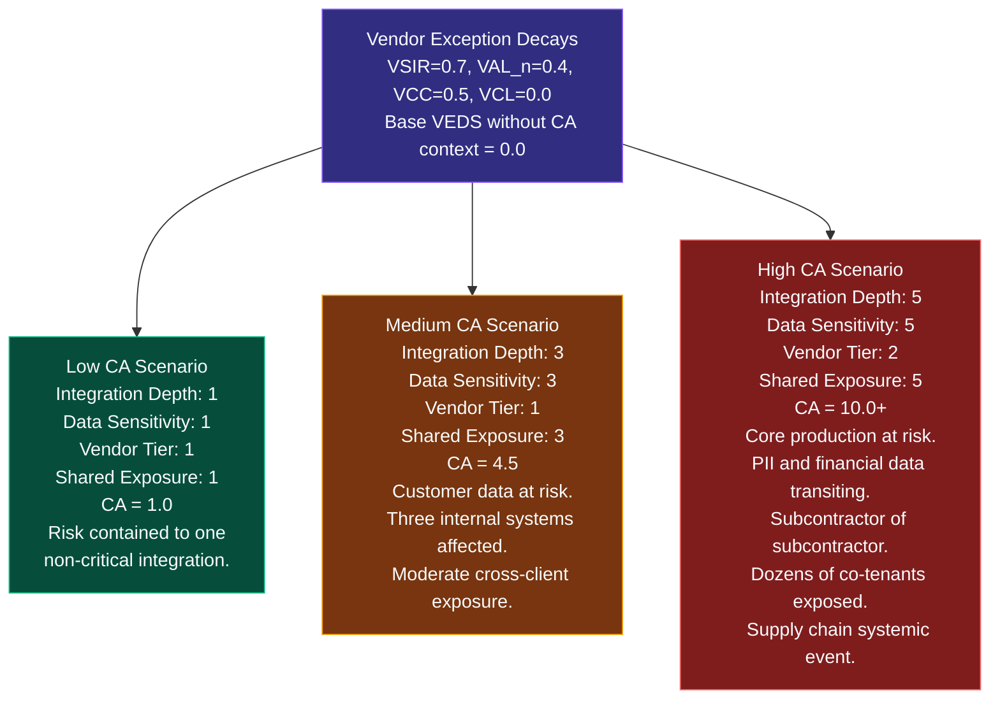

---

## Part III: The Supply Chain Decay Timeline

### 3.1 How a Single Vendor Exception Becomes Your Incident in 28 Months

I built this timeline the same way I built the 39-month internal decay timeline. Every person in this story behaved reasonably. Every decision made sense in the moment it was made. The incident at the end was structurally predictable.

| Month | Event | VSIR | VAL_n | VCC | VCL | CA | VEDS |
|:---:|:---|:---:|:---:|:---:|:---:|:---:|:---:|
| **0** | Vendor exception approved. Compensating control built. You receive notification. | 1.00 | 1.00 | 1.00 | 1.00 | 2.0 | **1.00** |
| **2** | Vendor migrates excepted component to shared cluster without re-scoping. | 0.80 | 1.00 | 1.00 | 0.95 | 3.5 | 0.72 |
| **4** | Vendor security engineer who built the compensating control leaves. No formal handoff. | 0.80 | 1.00 | 0.75 | 0.90 | 3.5 | 0.49 |
| **6** | First exception renewal. Internal only. No external notification to you. | 0.80 | 1.00 | 0.75 | 0.80 | 3.5 | 0.43 |
| **9** | SIEM rule in vendor environment stops matching after infrastructure refresh. | 0.75 | 1.00 | 0.75 | 0.00 | 3.5 | **0.00** |
| **12** | Your annual vendor questionnaire. Vendor reports "all compensating controls active." True in documentation. False operationally. | 0.70 | 1.00 | 0.75 | 0.00 | 4.0 | 0.00 |
| **14** | Your vendor relationship manager moves to a new role. New manager takes over without exception briefing. | 0.70 | 1.00 | 0.50 | 0.00 | 4.0 | 0.00 |
| **18** | Second renewal. Exception now 18 months old. Original justification references a migration that finished in month 3. | 0.65 | 0.70 | 0.50 | 0.00 | 4.0 | 0.00 |
| **21** | Vendor adds subcontractor with access to the shared cluster. You are not informed. CA increases. | 0.55 | 0.55 | 0.50 | 0.00 | 6.0 | 0.00 |
| **24** | Attacker identifies the excepted integration point through passive reconnaissance of vendor public-facing infrastructure. | 0.55 | 0.40 | 0.33 | 0.00 | 6.0 | 0.00 |
| **28** | **YOUR INCIDENT.** Attacker used the vendor unmonitored integration to access your environment. Post-mortem: "third party compromise." | -- | -- | -- | -- | -- | -- |

**The key observation:** VEDS collapses to zero at month 9, the moment VCL hits zero. Everything after that is just time passing while the open door waits for someone to find it. The attacker did not need to find a zero-day. They needed to find the vendor, read the public infrastructure signals that a legacy component was running, probe the integration boundary, and walk through.

### 3.2 The Decay Curve Across Vendor Tiers

The internal ELDM showed a single curve from EDS = 1.0 to incident. The vendor version has multiple curves running in parallel, one per vendor tier, with cascade amplification connecting them.

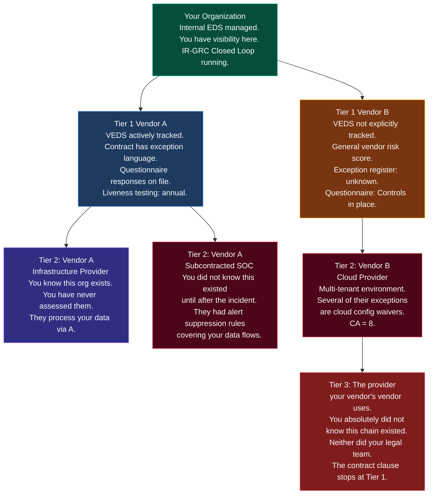

---

## Part IV: The TPRM Problem — Why Annual Questionnaires Cannot Measure VEDS

### 4.1 What Questionnaires Actually Measure

I want to spend time on this because it is where I see the biggest gap between what organizations think they are doing and what they are actually doing.

Annual vendor questionnaires measure intent, documentation, and past state. They ask whether a vendor has policies in place, whether exceptions have been documented, whether controls exist. They do not measure liveness, operational reality, or current decay state.

Here is the translation table:

| Questionnaire Question | What It Actually Measures | What VEDS Needs |
|:---|:---|:---|
| "Do you have an exception management policy?" | Whether a document exists | VSIR: current operational scope vs. approved scope |
| "Are all exceptions reviewed on a regular cadence?" | Whether renewals occur | VAL_n: current authorization state, chain length, renewal history |
| "Are exception owners assigned and current?" | Whether a field is populated | VCC: whether the named person understands the exception they own |
| "Are compensating controls in place for all exceptions?" | Whether a control was documented | VCL: whether the control is currently detecting anything |
| "Do you flow down security requirements to subcontractors?" | Whether a policy clause exists | CA: actual subcontractor scope, their exception registers, their VEDS |

The questionnaire is not useless. It establishes a baseline. But it cannot measure decay. And decay is what kills you.

### 4.2 The Point-in-Time Problem

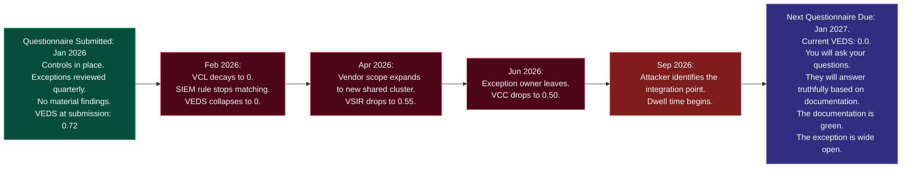

The 12-month assessment cycle has a 12-month blind spot. Anything that decays within that window is invisible until you ask again. By then you are measuring a past state that may no longer exist.

---

## Part V: The VEDS Audit Procedure

### 5.1 What You Actually Need to Assess

I designed this as a companion to the 8-step exception integrity audit from the ELDM. That procedure tests your own exceptions. This one tests your vendors' exceptions to the extent you can reach them.

Honestly: you cannot compute exact VEDS without vendor cooperation. But you can build a good proxy from what you can observe and what you can contractually require. And you can score the uncertainty itself as part of your risk posture.

| Step | Test | VEDS Component | Time | Who |
|:---:|:---|:---:|:---:|:---|
| **1** | Request the vendor exception register extract for all exceptions that touch your integration boundary, data, or trust chain. If they cannot or will not produce this, score that as VCC decay. | All | 2 days | Third Party Risk Manager |
| **2** | For each disclosed exception, verify the current scope against your own integration telemetry. Do their stated scope strings match what you see in your API logs? Mismatches are vendor scope phantoms. | VSIR | 4 hours | Detection Engineer |
| **3** | Check expiry dates on each disclosed exception. For those past expiry, ask for documented renewal records. Email threads do not count. System-of-record entries only. | VAL_n | 2 hours | GRC Auditor |
| **4** | Verify named exception owners against current organizational data. For each owner who has left: ask for documented successor briefing evidence. Undocumented succession equals VCC decay. | VCC | 3 hours | Third Party Risk Manager |
| **5** | Request evidence of compensating control liveness. Not documentation of the control. Evidence it fired recently. Logs, alert exports, coverage test results. Anything that shows the control is detecting, not just existing. | VCL | 1 day | Detection Engineer |
| **6** | Map integration depth: how many of your critical systems depend on the integration covered by each exception? More dependencies equals higher CA. | CA | 3 hours | Security Architect |
| **7** | Map data sensitivity: what data classifications transit each excepted integration? Higher sensitivity equals higher CA. | CA | 2 hours | Data Classification Team |
| **8** | Ask for the vendor subcontractor list for components covered by the exceptions. If they cannot provide it, treat Vendor Tier as unknown and apply Tier 3 CA multiplier. | CA | 2 days | Third Party Risk Manager |
| **9** | Score each exception with VEDS. For any component you cannot verify, treat it as decayed (0) unless you have positive evidence otherwise. | All | 2 hours | GRC Auditor |
| **10** | Prioritize for action by: VEDS x CA score. Lower VEDS combined with higher CA equals higher urgency. | All | 1 hour | CISO |

**Total per critical vendor:** 3-4 days of coordinated effort  
**Realistic coverage per quarter:** Full assessment for top 10 critical vendors, proxy assessment for next 20

### 5.2 The Vendor Exception Evidence Request Template

```
VENDOR EXCEPTION EVIDENCE REQUEST
Requestor: [Your Organization Name]
Vendor: [Vendor Name]
Assessment Date: [Date]
Scope: All exceptions affecting systems, integrations, or data flows involving [your org name]

For each in-scope exception, please provide:

1. SCOPE VERIFICATION
   a) Current scope definition (asset list, subnet ranges, service identifiers)
   b) Integration points with our environment affected by this exception
   c) Any scope changes since original approval (with dates)

2. AUTHORIZATION STATUS
   a) Original expiry date and current status
   b) Renewal history (system-of-record entries only, not email threads)
   c) Current authorization expiry date

3. OWNERSHIP CHAIN
   a) Current named exception owner (name, role, contact)
   b) Current named technical custodian (name, role, contact)
   c) If different from original, evidence of documented handoff

4. COMPENSATING CONTROL EVIDENCE
   a) Description of current compensating control
   b) Evidence of liveness: alert logs from last 30 days, or coverage test results dated
      within 30 days. Not documentation of the control. Evidence it fired.
   c) Log source status confirmation
   d) Escalation rate for alerts generated by the control

5. SUBCONTRACTOR SCOPE
   a) List of subcontractors with access to systems covered by this exception
   b) Whether those subcontractors are subject to equivalent controls
   c) Whether those subcontractors have their own exceptions affecting our data

IMPORTANT: We consider compensating controls unverified unless you provide operational
evidence as described in item 4. Documentation of a control is not evidence of a live control.
```

### 5.3 What to Do When Vendors Will Not Provide This

Most vendors will not provide all of this. Some will not provide any of it. That resistance is itself data.

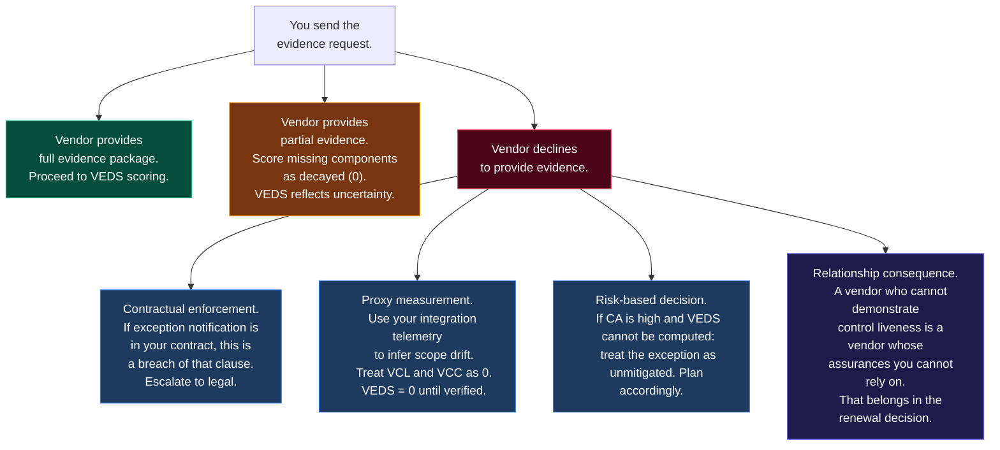

---

## Part VI: Detection Engineering for Vendor Boundary Decay

### 6.1 What You Can Actually Detect From Your Side

You cannot see inside your vendor SIEM. You cannot run queries on their exception register. But you can instrument your side of the trust boundary and derive proxy signals for VEDS decay.

| Control | Targets | What It Detects | Implementation |
|:---|:---:|:---|:---|
| **VDE-1: Integration Baseline Drift** | VSIR | New source addresses, ports, or user agents appearing in the integration that were not present at authorization time. A vendor scope phantom shows up in your logs before it shows up in their exception register. | Daily diff of API traffic source patterns against an approved-sources list maintained per vendor integration. |
| **VDE-2: Data Volume Anomaly** | VSIR + CA | Abnormal data volumes transiting a vendor integration. Scope expansion often means more data flowing through the excepted channel than the original risk acceptance contemplated. | Rolling 30-day baseline with 2-sigma threshold alerts per vendor integration endpoint. |
| **VDE-3: Authentication Pattern Monitor** | VCC | Changes in how the vendor service accounts authenticate to your systems. Credential rotation with no communication, new service account names, anomalous auth times. Ownership drift often produces authentication pattern changes as new people take over. | Auth log monitoring keyed to vendor service account enumeration. Alert on new accounts and on accounts going dark for more than 30 days. |
| **VDE-4: Exception Coverage Test** | VCL | Synthetic test transactions that should trigger the compensating control if it is alive. If the vendor control is supposed to alert on anomalous behavior in the excepted zone, send anomalous behavior and check whether they respond. | Monthly orchestrated test transaction through the integration. If no vendor security response within SLA, flag VCL as potentially decayed. |
| **VDE-5: Subcontractor Network Emergence** | CA | New IP ranges or ASN clusters appearing in integration traffic that map to infrastructure providers not previously observed. This is how Tier 3 subcontractors show up in your telemetry before they show up in your vendor disclosed organization chart. | BGP-level integration traffic analysis and ASN reputation checking per vendor integration. |

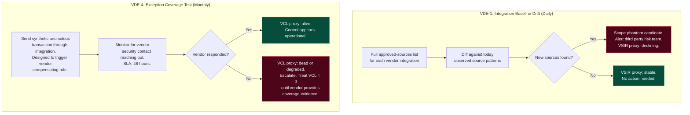

---

## Part VII: CISO and Board Metrics for Vendor Exception Decay

### 7.1 Four Metrics That Tell the Truth

Most third party risk dashboards give executives a vendor risk score. That score is built from questionnaire responses and static assessments. It looks stable because it only moves when you ask and they answer differently than last time.

These four metrics measure state and direction in a way that a questionnaire score cannot.

| Metric | Type | One-Line Board Summary |
|:---|:---:|:---|
| **Decayed Vendor Exception Count (DVEC)** | Stock | "We are carrying N vendor exceptions whose VEDS indicates operational decay, meaning the documented risk acceptance no longer matches the actual risk posture." |
| **Vendor Scope Phantom Count (VSPC)** | Stock | "Our integration boundary telemetry shows N integration source patterns that fall outside the scope of any reviewed and authorized vendor exception." |
| **Verified Compensation Rate (VCR)** | Stock | "X% of our critical vendor exceptions have compensating controls with independently verified liveness. The remaining Y% rely on vendor self-reporting." |
| **Vendor Exception Debt Velocity (VEDV)** | Flow | "For every new vendor exception we accept this quarter, we are closing 0.6 by verified remediation or contract renegotiation. Our vendor exception debt is growing 40% annually." |

### 7.2 The VEDS Register Structure

The VEDS register is not a replacement for your existing vendor risk register. It is a layer on top of it that tracks exception-specific decay state. One row per vendor exception. Updated quarterly at minimum, continuously for critical vendors.

```
VEDS REGISTER ENTRY
Vendor: [Name]
Vendor Tier: [1 / 2 / 3]
Exception ID (Vendor): [Their internal ID if known]
Exception ID (Your ref): [Your cross-reference ID]
Exception Summary: [One line: what risk has the vendor accepted?]
Integration Points Affected: [List of your systems that touch this exception]
Data Classifications Transiting: [What data of yours is covered by this exception?]
Last Evidence Package Received: [Date]

VEDS SCORING
VSIR: [0.0 - 1.0] | Evidence basis: [integration telemetry / vendor provided / questionnaire]
VAL_n: [0.0 - 1.0] | Evidence basis: [contract record / vendor provided / inferred]
VCC: [0.0 - 1.0] | Evidence basis: [vendor provided / personnel check]
VCL: [0.0 - 1.0] | Evidence basis: [coverage test result / vendor provided logs / assumed 0]
CA: [1.0 - 10.0+] | Calculated from: integration depth, data sensitivity, vendor tier, shared exposure

VEDS = [VSIR x VAL_n x VCC x VCL] | CA context: [CA value and interpretation]

PRIORITY SCORE: (1.0 - VEDS) x CA -- higher means more urgent

ACTION REQUIRED: [None / Vendor engagement / Contract enforcement / Integration isolation]
Next Review: [Date]
```

---

## Part VIII: The Vendor Exception Attack Chain

### 8.1 How Attackers Use Vendor Exception Decay

Attackers who target supply chains do not need to break through your defenses. They need to find the vendor whose exception decay has created an open door, and use that door to reach you.

```mermaid
flowchart TD
    ATT["Attacker
    Target: Your Organization
    Direct attack surface: hardened.
    Supply chain: unexplored."]

    ATT --> RECON1["Passive Recon Phase 1:
    Map your disclosed vendor relationships.
    Job postings, LinkedIn, SSL cert SANs,
    API documentation, public architecture talks.
    Who do you depend on?"]

    RECON1 --> RECON2["Passive Recon Phase 2:
    For each identified vendor, look for signals
    of legacy infrastructure, unpatched components,
    long-running integrations with unusual auth patterns.
    Who looks like they have old exceptions?"]

    RECON2 --> RECON3["Active Recon Phase 3:
    Probe the vendor external surface.
    Find the integration endpoints they run for you.
    Look for authentication patterns that suggest
    service account credentials without MFA.
    Test for scope drift signals."]

    RECON3 --> ACCESS["Initial Access:
    The vendor integration boundary is
    authenticated by a service account
    covered by an unmonitored exception.
    No MFA. No anomaly detection.
    The compensating rule stopped
    firing 6 months ago.
    Attacker authenticates.
    Zero alerts. Zero responses."]

    ACCESS --> PIVOT["Lateral Movement:
    From the vendor integration point,
    pivot to your internal systems.
    The trust relationship that
    the integration relies on
    becomes the attack path."]

    PIVOT --> IMPACT["Impact:
    Data exfiltration, ransomware,
    or persistent access.
    All through a door that was
    documented as controlled.
    The control stopped working
    months before they arrived."]

    style ATT fill:#312E81,stroke:#8B5CF6,color:#F8FAFC
    style RECON1 fill:#1E293B,stroke:#475569,color:#F8FAFC
    style RECON2 fill:#1E293B,stroke:#475569,color:#F8FAFC
    style RECON3 fill:#78350F,stroke:#F59E0B,color:#F8FAFC
    style ACCESS fill:#4C0519,stroke:#F43F5E,color:#F8FAFC
    style PIVOT fill:#7F1D1D,stroke:#F87171,color:#F8FAFC
    style IMPACT fill:#7F1D1D,stroke:#F87171,color:#F8FAFC,stroke-width:3px
```

### 8.2 The Vendor Exception Attack Tree

Individual exceptions with individually acceptable risk scores combining into critical attack chains. The same thing happens across vendor tiers.

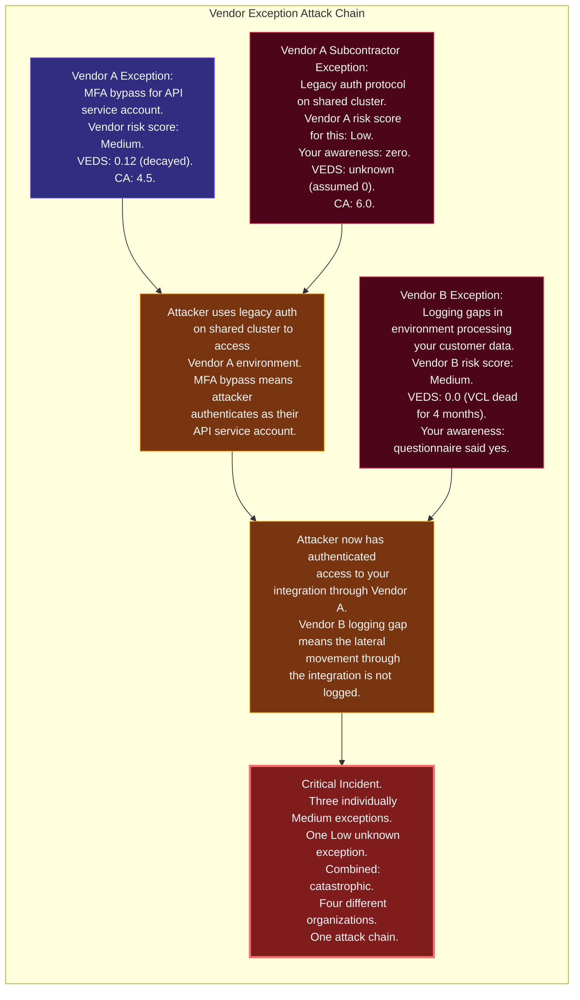

---

## Part IX: Governance Interventions That Actually Work

### 9.1 Five Changes That Target the Root Cause

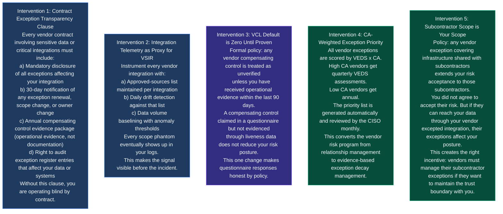

### 9.2 The SOAR Integration Schema for Vendor Exception Decay

Manual VEDS tracking does not scale past your top ten vendors. At twenty vendors, you need automation. At fifty, you need SOAR integration.

```json
{
  "$schema": "https://json-schema.org/draft/2020-12/schema",
  "title": "VEDSScorePayload",
  "type": "object",
  "properties": {
    "vendor_id": { "type": "string" },
    "exception_id_internal": { "type": "string" },
    "assessment_date": { "type": "string", "format": "date-time" },
    "veds_components": {
      "type": "object",
      "properties": {
        "vsir": {
          "type": "number", "minimum": 0, "maximum": 1,
          "evidence_basis": { "type": "string",
            "enum": ["integration_telemetry", "vendor_provided", "questionnaire", "assumed_zero"] }
        },
        "val_n": {
          "type": "number", "minimum": 0, "maximum": 1,
          "evidence_basis": { "type": "string",
            "enum": ["contract_record", "vendor_provided", "inferred", "assumed_zero"] }
        },
        "vcc": {
          "type": "number", "minimum": 0, "maximum": 1,
          "evidence_basis": { "type": "string",
            "enum": ["vendor_provided", "personnel_check", "assumed_zero"] }
        },
        "vcl": {
          "type": "number", "minimum": 0, "maximum": 1,
          "evidence_basis": { "type": "string",
            "enum": ["coverage_test_result", "vendor_provided_logs", "assumed_zero"] }
        },
        "ca": {
          "type": "number", "minimum": 1,
          "breakdown": {
            "integration_depth": { "type": "integer", "minimum": 1, "maximum": 5 },
            "data_sensitivity": { "type": "integer", "minimum": 1, "maximum": 5 },
            "vendor_tier": { "type": "integer", "minimum": 1, "maximum": 3 },
            "shared_exposure": { "type": "integer", "minimum": 1, "maximum": 5 }
          }
        }
      },
      "required": ["vsir", "val_n", "vcc", "vcl", "ca"]
    },
    "veds_score": { "type": "number", "minimum": 0, "maximum": 1 },
    "priority_score": { "type": "number" },
    "action_required": {
      "type": "string",
      "enum": ["none", "vendor_engagement", "contract_enforcement",
               "integration_isolation", "executive_escalation"]
    },
    "next_review_date": { "type": "string", "format": "date" }
  },
  "required": ["vendor_id", "exception_id_internal", "assessment_date",
               "veds_components", "veds_score", "priority_score", "action_required"]
}
```

---

## Part X: Regulatory Context

### 10.1 Where VEDS Fits Your Obligations

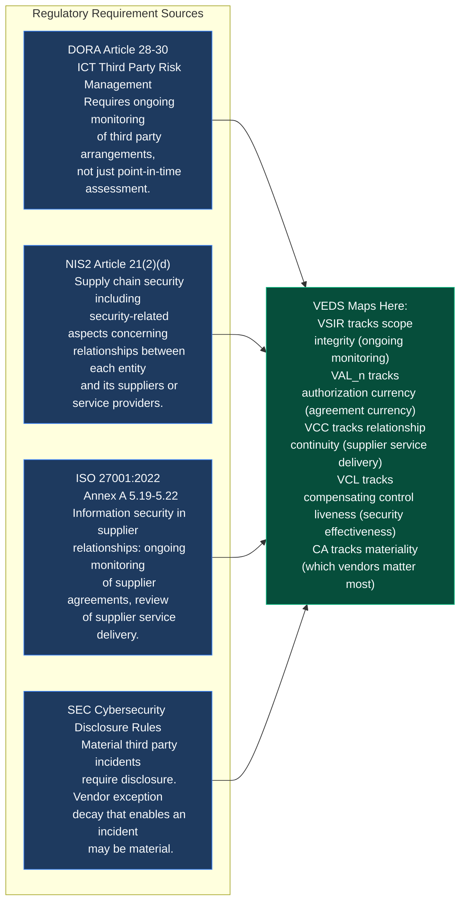

| Framework | Clause | What It Requires | How VEDS Addresses It |
|:---|:---:|:---|:---|
| **DORA** | Art. 28(4)(e) | Monitor and manage ICT third party concentration risk on an ongoing basis. | VEDS provides a continuous decay score per vendor, enabling ongoing monitoring rather than annual snapshots. |
| **DORA** | Art. 30(2)(b) | Exit strategies to minimize disruption from ICT third party failure. | High CA combined with low VEDS equals candidates for integration isolation planning. |
| **NIS2** | Art. 21(2)(d) | Supply chain security measures including relationships with suppliers. | VEDS audit procedure gives auditable evidence of supply chain security monitoring. |
| **ISO 27001:2022** | A.5.19 | Review and monitor supplier services against agreements. | VCL evidence package directly satisfies this review requirement with operational data. |
| **ISO 27001:2022** | A.5.22 | Monitor, review and manage changes to supplier services. | VDE-1 and VDE-3 provide change monitoring signals. |
| **NIST CSF 2.0** | GV.SC-07 | Risks posed by suppliers and their supply chains. | VEDS x CA scoring provides the risk quantification this control function requires. |

---

## Part XI: Limitations

This section exists because every honest piece of research includes it.

**The asymmetric information problem is the model core limitation.** VEDS requires data that you often do not have direct access to. VSIR requires vendor infrastructure inventory. VAL_n requires vendor exception register state. VCC requires vendor organizational charts. VCL requires vendor SIEM telemetry. For most vendor relationships, most of these inputs are unavailable and must be approximated or defaulted to zero. The model is most useful when used to formalize the uncertainty you are already operating under, not to produce a precise number.

**CA is a heuristic, not a derivation.** The four CA factors and their weighting are defensible on logical grounds but have not been empirically validated against incident data. An organization implementing this model should treat CA as a relative ranking tool rather than an absolute risk quantification.

**The product form has the same limitation as EDS.** The multiplicative structure reflects attacker logic but is a modeling choice. Alternative aggregations should be tested empirically in Phase 2 with real register data.

**Cross-vendor attack chain analysis is not modeled here.** The Vendor Exception Attack Tree in Part VIII is qualitative. I did not formalize a cross-vendor chain risk score in this paper. That is the next extension.

**The questionnaire is not useless.** I was harder on questionnaires in this paper than I probably needed to be. They provide structured baseline data and create legal accountability. What they cannot do is measure current decay state. The questionnaire and VEDS are complementary, not competitive.

### Pre-Registered Predictions

| Prediction | Hypothesis | What Would Falsify It |
|:---|:---|:---|
| VP1 | Organizations with formal VEDS tracking programs will report materially lower third party incident rates than organizations using questionnaire-only programs, after controlling for vendor count. | No significant difference in incident rates after 3 years of tracking. |
| VP2 | Integration telemetry-based VSIR proxy measurement will detect vendor scope drift events before they are disclosed in questionnaire responses, with a lead time of at least 60 days. | Scope drift events are detected at questionnaire time at equal or higher rates than via telemetry. |
| VP3 | VCL will be the strongest single predictor of whether a vendor exception eventually contributes to a security incident. | Any other single VEDS component is an equally strong or stronger predictor. |
| VP4 | CA score will moderate the relationship between VEDS and incident severity: equivalent VEDS decay at high-CA vendors produces materially worse outcomes than at low-CA vendors. | CA does not moderate severity above what VEDS alone predicts. |

---

## Part XII: What I Would Do Differently

**Start with integration telemetry, not questionnaires.** I designed the VEDS scoring model before fully thinking through the data collection problem. The questionnaire is the easiest data to get but the least useful for measuring decay. If I were starting this research again, I would build the integration telemetry instrumentation first and design the model around what is actually observable.

**CA needs empirical calibration.** The cascade amplification component is the most novel part of this model and the least empirically grounded. I have logical reasons to believe that integration depth and shared exposure amplify vendor exception risk, but I have not validated the specific weights or the interaction structure.

**The subcontractor scope problem is bigger than I initially thought.** When I started pulling at the "what about your vendor's vendor" thread, I realized that most organizations have essentially no visibility into Tier 2 and Tier 3 relationships. A full paper on Tier 2+ risk modeling would be worth writing separately.

**Liveness testing should be contractual, not optional.** The VDE-4 coverage test control is probably the highest value thing in Part VI and it requires vendor cooperation to work properly. Without a contract clause requiring vendors to permit and respond to synthetic test transactions, you are asking for a favor. The clause needs to be in the contract at procurement, not retrofitted later.

---

## Conclusion

I started this paper trying to answer one question: if exceptions inside your organization decay on a predictable schedule, what happens to the exceptions inside your vendors' organizations?

The answer is: the same thing, but you cannot see it happening.

Every exception your vendors have signed for risks in their environment that touch your data, your integrations, or your trust boundaries is subject to the same four drifts. Scope expands past what was approved. Authorization outlives its window. Ownership dissolves as people move on. Detection rots until the compensating control is watching nothing.

The difference is that you are not watching either. You are relying on an annual questionnaire to tell you about a process that decays continuously, quietly, and without any signal that crosses your organizational boundary until the attacker uses the resulting gap to reach you.

That is the third party exception decay problem. It is not exotic. It is structural. It is happening right now, in the vendor exception registers of your most critical dependencies, for exceptions you have never seen.

The VEDS Model gives you a way to reason about it systematically. Five components. A product that collapses to zero when any of them fail. A cascade amplification term that reflects how far the damage travels. A detection control set that instruments the boundary you can see from your side. An audit procedure that asks vendors for the evidence that actually matters. And a set of contract clauses and governance interventions that shift the default outcome from invisible decay to managed uncertainty.

The questionnaire told you they had controls in place. The VEDS told you nobody had tested whether those controls were still running.

The difference between those two answers is where breaches live.

---

## Immediate Action Checklist

- [ ] Identify your top 10 vendors by CA score using integration depth, data sensitivity, and shared exposure
- [ ] Send the Vendor Exception Evidence Request template to each of those 10 vendors this quarter
- [ ] Instrument VDE-1 integration baseline drift monitoring for every active vendor API integration
- [ ] Default VCL to zero for any vendor exception whose compensating control has not been evidenced in the last 90 days
- [ ] Add the Exception Transparency Clause to your next three vendor contract renewals
- [ ] Build a VEDS register with at minimum VSIR, VAL_n, VCC, VCL, and CA scores for your critical vendors
- [ ] Run VDE-4 coverage tests against your two highest-CA vendor integrations this month
- [ ] Present DVEC, VSPC, VCR, and VEDV to your board or risk committee at next reporting cycle
- [ ] Define what vendor exception decay state triggers integration isolation versus vendor engagement
- [ ] Add vendor exception decay review as a standing item in every vendor QBR and annual review

---

## Vendor Dwell Decomposition Template

Any incident that touches a vendor integration boundary should include this in the post-mortem:

```
VENDOR EXCEPTION DWELL DECOMPOSITION
Vendor Name:          [Name]
Vendor Tier:          [1 / 2 / 3]
Exception Reference:  [Their ID / Your TPRM cross-reference]
Integration Affected: [Your system that the vendor integration touches]

Was this exception on your radar before the incident?
  [ ] Yes - VEDS tracked
  [ ] Partially - vendor assessed but exception not specifically tracked
  [ ] No - exception unknown to your team before incident

Pre-Incident VEDS State (reconstructed):
  VSIR: [value] | When did scope drift begin?
  VAL_n: [value] | Was authorization current at time of incident?
  VCC: [value] | Were owners current on both sides?
  VCL: [value] | Was compensating control live at time of incident?
  CA: [value] | How far did the blast radius reach?

Dwell Time Attribution:
  Attacker Stealth: [portion attributable to evasion technique]
  Vendor Sensor Decay: [portion attributable to VCL collapse]
  Boundary Visibility Gap: [portion attributable to lack of integration telemetry]
  Questionnaire Lag: [portion attributable to gap between last assessment and decay state]

Conclusion: "Vendor exception [ID] exhibited [which drifts] beginning [estimated date].
The compensating control evidence last provided to us was dated [date], [X] months before
the estimated VCL collapse. Our integration telemetry did / did not show signals of
vendor scope drift that were / were not acted on. This was structurally predictable
from [date] and was / was not visible with instrumentation we did / did not have."
```

---

## Related Research in This Series

| Paper | Date | Relationship |
|:---|:---:|:---|
| [Risk Acceptance Backdoors and Compliance Debt](./ON%2010-09-2026%20-%20RISK%20ACCEPTANCE%20BACKDOORS,%20EXCEPTION%20ATTACK%20TREES,%20AND%20THE%20COMPLIANCE%20DEBT%20METRIC.md) | 10-09-2026 | Origin. Established that signed exceptions are backdoors. VEDS shows that vendor exceptions are backdoors you cannot see. |
| [The Exception Lifecycle Decay Model (ELDM)](./On%2014-09-2026%20-%20THE%20EXCEPTION%20LIFECYCLE%20DECAY%20MODEL%20How%20Accepted%20Risks%20Rot:%20A%20Four%20Drift%20Theory%20of%20GRC%20Exception%20Decay%20and%20Its%20Forensic,%20Detection,%20and%20Audit%20Consequences.md) | 14-09-2026 | Direct parent model. VEDS is EDS applied to the supply chain boundary with a fifth cascade component. |
| [The IR-GRC Closed Loop](./On%2015-09-2026%20%20The%20IR-GRC%20Closed%20Loop:%20How%20Incident%20Intelligence%20Flows%20Back%20Into%20the%20Exception%20Register%20Before%20the%20Next%20Attacker%20Arrives.md) | 15-09-2026 | The feedback mechanism. Vendor-originated incidents should feed VEDS register updates through the same closed-loop channels. |
| [The SOC-GRC Entropy Model](./On%2007-09-2026%20%20The%20SOC-GRC%20Entropy-Model:%20A%20Unified%20Framework%20for%20Security%20Program%20Decay%20and%20the%20Architecture%20of%20Anti-Fragile%20Detection.md) | 07-09-2026 | Thermodynamic framing. Vendor exception decay is entropy accumulation at the supply chain boundary. |
| Vendor Exception Attack Chain Modeling *(next paper)* | Upcoming | Formalizing the cross-vendor exception chain risk score. The graph model for multi-tier exception attack paths. |

---

## References

[1] ENISA. (2021). Supply Chain Attacks Report. European Union Agency for Cybersecurity.

[2] Ponemon Institute. (2025). Third Party Risk Management Study. Ponemon Institute LLC.

[3] NIST SP 800-161 Rev. 1 (2022). Cybersecurity Supply Chain Risk Management Practices for Systems and Organizations.

[4] ISO/IEC 27036:2023. Information security for supplier relationships.

[5] DORA - Regulation (EU) 2022/2554. Digital Operational Resilience Act. Article 28-30: ICT Third Party Risk.

[6] NIS2 Directive (EU) 2022/2555. Article 21(2)(d): Supply chain security.

[7] Atlantic Council Cyber Statecraft Initiative. (2022). Broken Trust: Lessons from Sunburst. Atlantic Council.

[8] MITRE ATT&CK Framework (2026). Supply Chain Compromise: T1195. https://attack.mitre.org/techniques/T1195/

[9] Shannon, C.E. (1948). A Mathematical Theory of Communication. Bell System Technical Journal, 27(3), 379-423.

---

*"Your vendors' exceptions are your attack surface. The difference is you did not sign them and you cannot see them decay."*

*-- hiro001-eth | 06-10-2026 | v1.0*
