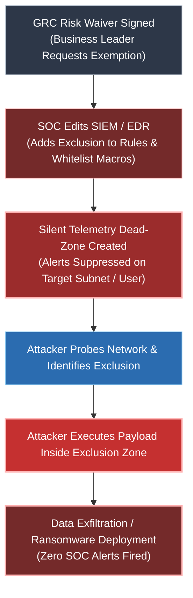
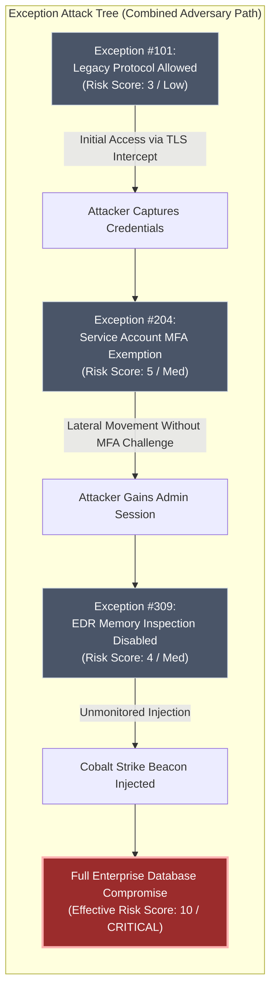
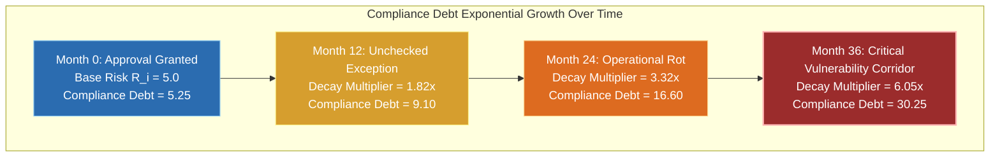
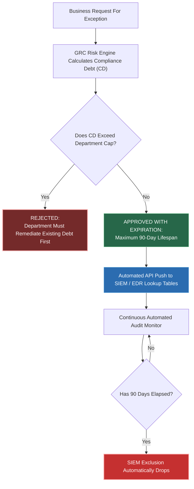

# Risk Acceptance Backdoors, Exception Attack Trees, and the Compliance Debt Metric

**Version:** 1.0 : Operational Field Research  
**Date:** 2026-09-10  
**Classification:** Advanced SOC + GRC Engineering & Risk Governance  
**Target Audience:** Tier 1-3 SOC Analysts, Detection Engineers, GRC Risk Officers, CISO & Enterprise Security Architects  

---

## Executive Summary (From 0-Level Analyst to CISO)

> **For the Tier 1 Analyst (0-Level):** When a business department asks not to install EDR on a server or asks to bypass a detection rule, GRC signs a paper called a Risk Acceptance. SOC then adds an exclusion rule to Splunk or Sentinel. Attackers actively look for these excluded folders, IP ranges, and service accounts. When an alert gets suppressed because of an exception, you are looking at a Risk Acceptance Backdoor.

> **For the CISO & Risk Officer:** Single risk acceptance forms are treated as isolated business approvals. In reality, multiple approved exceptions combine into complete attack chains. This document provides the mathematical formula for **Compliance Debt**, demonstrates how to build **Exception Attack Trees**, and gives your detection team production queries to audit silent risk waivers before they turn into breaches.

---

## Operational Incident: The Approved Breach

It was 3:15 AM when the incident call came in. 

Our perimeter firewalls were quiet. The endpoint detection agent on the core domain controllers reported zero malicious binaries. On paper, the enterprise was 98% compliant with NIST CSF and PCI-DSS. 

Yet, 450 gigabytes of internal financial database backups had just landed on a mega-upload storage bucket in Eastern Europe. 

When we ran the forensic trace back to the initial compromise vector, we did not find a zero-day exploit. We found an internal staging server running Windows Server 2012 R2. The machine was missing 42 critical security patches, had a hardcoded domain admin service account logged in, and had its EDR real-time driver disabled.

I pulled the Splunk detection logic for lateral movement. The alert for `Psexec` combined with LSASS memory dumps had fired three months ago. But an analyst closed it as "Authorized Activity." 

Why? Because attached to the closed ticket was a signed PDF titled `GRC-Risk-Acceptance-2025-089.pdf`. 

The Vice President of Infrastructure had signed off on skipping endpoint agent updates and suppressing alert rules on that subnet to avoid crashing a legacy accounting application. The GRC team logged the ticket, marked the risk as "Accepted," and notified the SOC. The SOC detection engineer added `src_ip=10.0.4.50` and `user="svc_acct_legacy"` to the global whitelist macro.

The attacker did not break through our defenses. They walked through the front door using a backdoor signed by our own executive team.

---

# PART I: THE MECHANICS OF RISK ACCEPTANCE BACKDOORS

## 1.1 How GRC Exception Forms Mutate into SOC SIEM Whitelists

The modern enterprise operates under a dangerous operational disconnect. GRC treats risk acceptance as a static paperwork exercise. SOC treats risk acceptance as an operational directive to edit SIEM detection rules.

When GRC approves a temporary or permanent risk waiver, the request flows to the SOC. The SOC team, overburdened by alert volume, takes the fastest path to compliance: they add an suppression filter.

Consider a standard Microsoft Sentinel KQL query designed to catch credential dumping via `procdump.exe`:

```kql
// Standard Credential Dumping Detection
SecurityEvent
| where EventID == 4688
| where ProcessName endswith "procdump.exe" or CommandLine contains "lsass"
| where TargetUserName !in ("svc_legacy_acct") // GRC Exception Waiver #891
| where Computer !in ("FIN-STBG-SRV01.corp.local") // GRC Exception Waiver #902
```

In Splunk SPL, the same exception manifests as a macro override:

```spl
index=winlogbeat EventCode=4688 (CommandLine="*lsass.dmp*" OR ProcessName="*sqldumper.exe*")
| search NOT [| inputlookup grc_approved_exceptions.csv | fields host, user]
```

At the moment that `inputlookup` or `!in` filter is saved, a blind spot is born. The GRC analyst believes the risk is "understood and tracked in ServiceNow." The SOC analyst believes the alert is "handled according to policy." The attacker sees an open corridor with zero telemetry overhead.

## 1.2 The Silent Reconnaissance: How Threat Actors Find Exclusion Zones

Threat actors do not need internal access to GRC tools like Archer or ServiceNow to find your exceptions. They deduce exclusions through live behavior probing:

1. **Process Injection Probing:** The attacker executes simple administrative utilities (such as `net.exe`, `nltest.exe`, or `whoami.exe`) across multiple endpoints. On 90% of machines, this generates low-priority SOC noise. On the host covered by an exception, no incident responder initiates an endpoint isolate command.
2. **Path Abuse:** Attackers inspect common system directories where EDR exclusions are routinely granted by IT admins (e.g., `C:\ProgramData\Epicor\`, `C:\Oracle\Middleware\`, `D:\Backups\`).
3. **Service Account Mimicry:** Adversaries identify service accounts named in public repositories, local registry keys, or scheduled tasks, then re-use those exact credentials to move laterally because those account names are whitelisted in SIEM suppression tables.



---

# PART II: EXCEPTION ATTACK TREES (EAT)

## 2.1 The Myth of the Isolated Exception

When a risk committee evaluates a risk acceptance request, they evaluate it in isolation.

- Request A: "Allow legacy SSL v3 on payment gateway endpoint." (Assessed Risk: Low)
- Request B: "Exclude backup service account `svc_bck` from MFA enforcement." (Assessed Risk: Medium)
- Request C: "Disable EDR memory inspection on server `SRV-PAY-01` due to high CPU overhead." (Assessed Risk: Medium)

Each individual risk is logged as acceptable. The GRC platform marks three separate tickets as green or yellow.

However, adversaries do not attack single tickets. They link exceptions together into a continuous chain.

## 2.2 Chaining Low-Risk Waivers into Critical Vulnerability Paths

When we combine Request A, Request B, and Request C, the true operational risk changes from Medium to Critical. 

An attacker exploits the legacy SSL protocol (Request A) to perform a man-in-the-middle credential harvest. They capture the plaintext credentials of `svc_bck`. Because `svc_bck` is exempt from MFA (Request B), they authenticate directly to `SRV-PAY-01`. Because `SRV-PAY-01` has memory scanning disabled (Request C), the attacker injects Cobalt Strike directly into LSASS memory without triggering an endpoint defense alert.

This is an **Exception Attack Tree (EAT)**.



## 2.3 Graph Modeling: Representing Exceptions as Connected Nodes

To prevent Exception Attack Trees, security teams must stop logging waivers in static flat spreadsheets or isolated GRC forms. Exceptions must be modeled as directed graphs.

If node $A$ (Asset) has an exception, and node $B$ (Identity) has an exception, and an edge exists between $A$ and $B$ (Network Access / Shared Rights), the risk score of the path is multiplicative, not additive.

In Cypher (Neo4j / BloodHound graph query language), we can identify high-risk exception paths across our network:

```cypher
MATCH (u:User)-[r1:HAS_EXCEPTION]->(e1:Exception)
MATCH (u)-[r2:MEMBER_OF|HAS_RIGHTS]->(m:Computer)
MATCH (m)-[r3:HAS_EXCEPTION]->(e2:Exception)
WHERE e1.type = 'MFA_BYPASS' AND e2.type = 'EDR_DISABLED'
RETURN u.name, m.name, e1.id, e2.id
```

---

# PART III: THE COMPLIANCE DEBT METRIC (CDM)

## 3.1 Defining Compliance Debt

Financial debt incurs interest. If you borrow money to build software faster, you pay interest until the principal is repaid.

**Compliance Debt** is the accumulated operational security risk introduced every time an organization signs a risk acceptance waiver instead of fixing the root vulnerability. 

Compliance Debt accumulates interest in two ways:
1. **Time Decay:** The longer a legacy exception sits un-remediated, the higher the probability that an attacker discovers the vulnerability.
2. **Coupling Velocity:** As system complexity grows, old exceptions interact with newly deployed infrastructure, creating unintended attack surfaces.

## 3.2 The Mathematical Formula for Compliance Debt

To measure enterprise risk accurately, we define the **Compliance Debt Metric ($CD$)** at time $t$:

$$CD(t) = \sum_{i=1}^{N} \Big( R_i \cdot \mathrm{e}^{\lambda \cdot \Delta t_i} \cdot (1 + C_i) \Big)$$

Where:
- $N$ = Total number of active GRC risk acceptances / exceptions.
- $R_i$ = Base risk score of exception $i$ (rated from 1.0 to 10.0 based on severity).
- $\lambda$ = Enterprise risk decay constant (recommended baseline: $\lambda = 0.05$ per month).
- $\Delta t_i$ = Age of exception $i$ in months since initial executive approval.
- $C_i$ = Coupling factor (the count of direct administrative or network connections between the asset in exception $i$ and other sensitive systems).

### Why the Exponential Term ($\mathrm{e}^{\lambda \cdot \Delta t_i}$) Matters

A 30-day risk acceptance for a temporary cloud migration is low risk ($\mathrm{e}^{0.05 \cdot 1} \approx 1.05$). 

However, a risk acceptance that sits in a GRC folder for 36 months without re-certification experiences exponential risk growth ($\mathrm{e}^{0.05 \cdot 36} \approx 6.05$). The base risk score is multiplied by 6.05 because the threat environment has evolved, threat actor tools have automated the exploit, and initial context has been lost due to employee turnover.



---

# PART IV: PRACTICAL IMPLEMENTATION & AUDIT PLAYBOOKS

## 4.1 Tier 1 Analyst (0-Level) Guide: Spotting Exception Abuse in Daily Triage

If you are an analyst reviewing alerts on the front line:

1. **Never close an alert solely because an exclusion rule matches.** Verify whether the host or user activity matches the exact scope of the approved waiver.
2. **Check the exception date.** If the suppression lookup reference refers to a waiver approved over 90 days ago, flag it for GRC re-certification.
3. **Look for collateral activity.** If IP `10.0.4.50` is excluded from PowerShell execution alerts, but you see it initiating outbound SMB connections to non-standard subnets, escalate immediately. The exclusion covers execution, not lateral movement.

## 4.2 Detection Engineer Playbook: Auditing SIEM Whitelists

Every detection engineering team must maintain an automated audit pipeline for SIEM exclusions. 

Below is an actionable Splunk SPL query designed to identify high-volume suppression macros that have not been audited in over 60 days:

```spl
index=_audit action=search search="*grc_approved_exceptions*"
| stats min(_time) as first_seen max(_time) as last_seen count by user search
| eval days_active=round((now()-first_seen)/86400,0)
| where days_active > 60
| table user, search, days_active, count
| sort - days_active
```

For Microsoft Sentinel, run this KQL query to detect service accounts with MFA exemptions executing interactive desktop logons:

```kql
SigninLogs
| where TimeGenerated > ago(7d)
| where UserPrincipalName in (external_mfa_exempt_list)
| where AppDisplayName == "Windows Sign-in" or LogonType == 2
| summarize DirectLogonCount = count(), UniqueIPs = dcount(IPAddress) by UserPrincipalName, Location
| where DirectLogonCount > 0
```

## 4.3 CISO & Executive Framework: Continuous Exception Lifecycle Management (CELM)

To eliminate Risk Acceptance Backdoors without halting business operations, implement a four-part governance framework:

1. **Mandatory Expiration Enums:** Hardcode expiration dates into every SIEM exclusion. When an exception reaches day 90, the exclusion automatically drops, forcing the business owner to re-justify the risk.
2. **Graph-Based Risk Rating:** Replace static 1-to-5 severity scales with Exception Attack Tree impact scores.
3. **Compliance Debt Budgeting:** Assign each business department a maximum Compliance Debt allowance ($CD$). If a department exceeds its debt cap, no further feature releases are permitted until legacy exceptions are remediated.
4. **Bi-Directional Telemetry Sync:** Link your GRC software directly to SIEM lookup tables via API. When a ticket status changes to "Expired" in ServiceNow, the SIEM whitelist macro updates automatically within 15 minutes.



---

## Conclusion & Action Checklist

Security governance is not paperwork. Governance dictates what your telemetry captures and what your SOC ignores. 

When you sign a risk acceptance waiver, you are modifying the defense perimeter of your enterprise. Treat every exception as an active operational liability, calculate your Compliance Debt continuously, and prune your SIEM whitelists before an adversary uses your own sign-off forms as their ingress route.

### Immediate Next Steps
- [ ] Pull all SIEM exclusion lists, lookup tables, and rule suppressions.
- [ ] Cross-reference exclusion entries against active GRC risk tickets.
- [ ] Remove any exclusion older than 90 days that lacks active executive re-certification.
- [ ] Map high-value assets with multiple exceptions into an Exception Attack Tree.
- [ ] Calculate your organization's baseline Compliance Debt Metric ($CD$).
