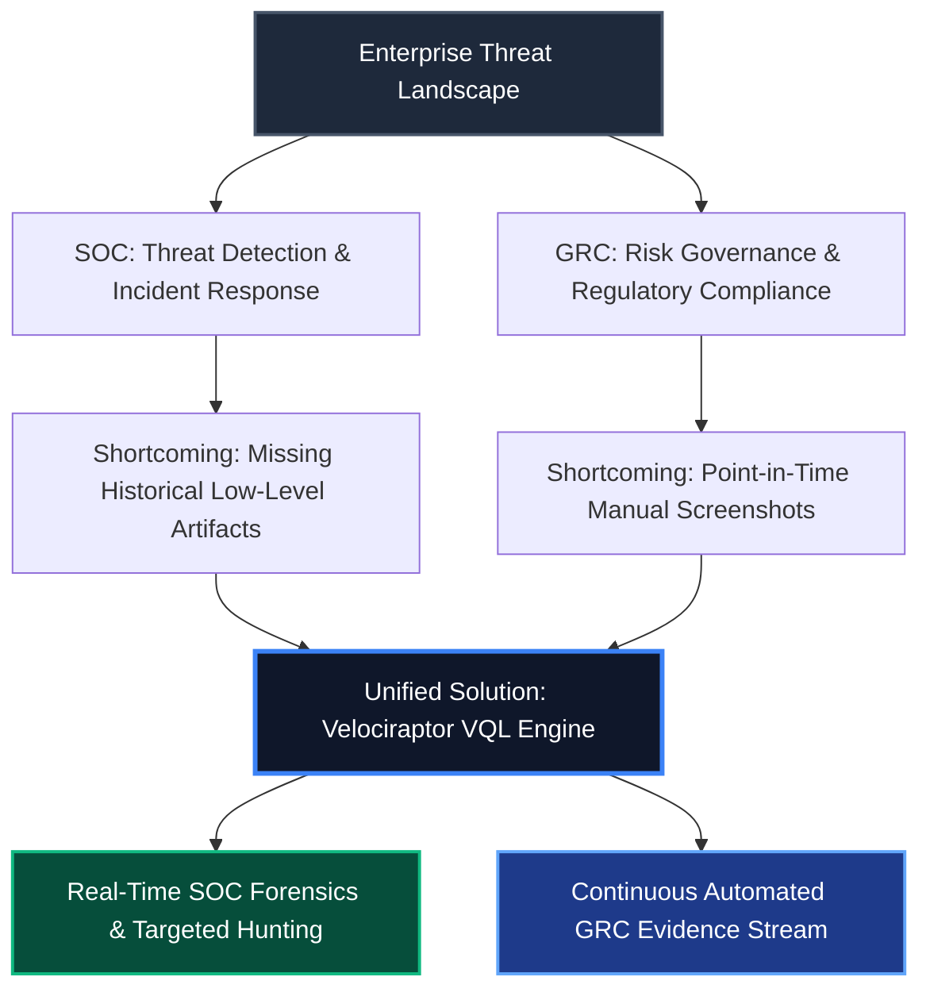
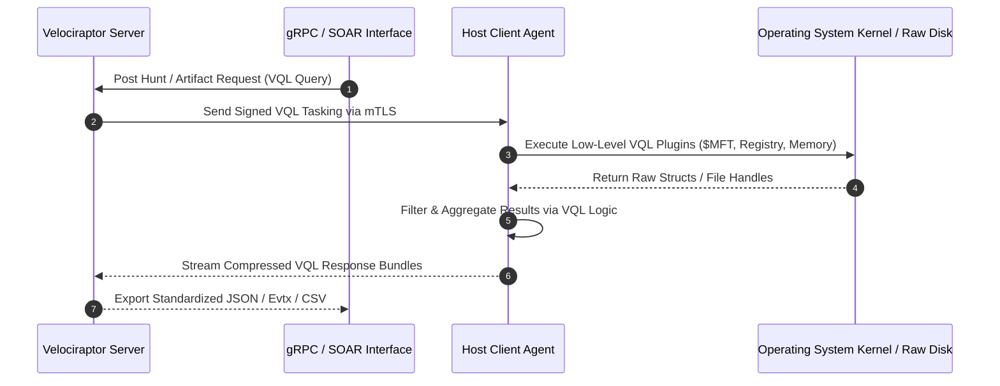
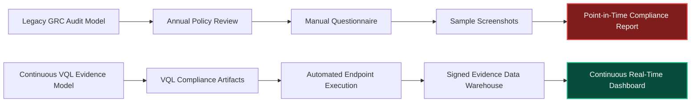

# Velociraptor: A Unified Detection-Forensics Framework for SOC + GRC Attack Chain Research

**Series:** SOC + GRC Advanced Attack Chain Research  
**Topic:** Endpoint Forensics, VQL Artifact Architecture, SOC Detection Engineering & Continuous GRC Audit Automation  
**Date:** 2026-09-01  
**Target Audience:** Detection Engineers, Incident Responders, GRC Lead Auditors, DFIR Specialists, SOC Architects  

---

> [!IMPORTANT]
> **Executive Summary:** Security Operations Center (SOC) teams and Governance, Risk, and Compliance (GRC) departments traditionally operate in isolated silos. SOC teams focus on real-time event logs and endpoint detection metrics, whereas GRC teams rely on point-in-time screenshots and manual evidence sampling. This operational disconnect creates critical blind spots. 
>
> Velociraptor bridges this gap by offering a unified, query-driven endpoint forensics engine powered by Velociraptor Query Language (VQL). By deploying VQL artifacts enterprise-wide, security organizations can perform rapid incident triage, conduct deep-dive artifact analysis, and continuously harvest cryptographic proof of compliance controls from endpoints in seconds.

---

## Table of Contents

1. [The SOC and GRC Operational Disconnect](#1-the-soc-and-grc-operational-disconnect)
2. [Velociraptor Architecture & VQL Engine Foundations](#2-velociraptor-architecture--vql-engine-foundations)
   - [2.1 Client-Server Communication Model](#21-client-server-communication-model)
   - [2.2 VQL Execution Syntax and Primitive Types](#22-vql-execution-syntax-and-primitive-types)
   - [2.3 Performance & Resource Governance](#23-performance--resource-governance)
3. [Deep-Dive Endpoint Forensics & Attack Chain Artifacts](#3-deep-dive-endpoint-forensics--attack-chain-artifacts)
   - [3.1 NTFS Master File Table ($MFT) & USN Journal Analysis](#31-ntfs-master-file-table-mft--usn-journal-analysis)
   - [3.2 Execution Evidence: Amcache, Shimcache, Prefetch, and Event Logs](#32-execution-evidence-amcache-shimcache-prefetch-and-event-logs)
   - [3.3 Persistence Mechanisms: WMI Subscriptions, Scheduled Tasks, and Services](#33-persistence-mechanisms-wmi-subscriptions-scheduled-tasks-and-services)
   - [3.4 Memory Forensics & Process Injection Introspection](#34-memory-forensics--process-injection-introspection)
4. [Production-Grade VQL Artifact Suite](#4-production-grade-vql-artifact-suite)
   - [Artifact 1: Suspicious Parent-Child Process & Memory Hunter](#artifact-1-suspicious-parent-child-process--memory-hunter)
   - [Artifact 2: Timestomping & $MFT Anomaly Parser](#artifact-2-timestomping--mft-anomaly-parser)
   - [Artifact 3: Malicious WMI & Scheduled Task Persistence Scanner](#artifact-3-malicious-wmi--scheduled-task-persistence-scanner)
   - [Artifact 4: Automated GRC Baseline & Endpoint Security Control Auditor](#artifact-4-automated-grc-baseline--endpoint-security-control-auditor)
5. [SOC Integration: Incident Response, Hunting & SOAR Pipelines](#5-soc-integration-incident-response-hunting--soar-pipelines)
   - [5.1 Targeted Enterprise Hunts at Scale](#51-targeted-enterprise-hunts-at-scale)
   - [5.2 Rapid Triage Collection (KAPE Targets Integration)](#52-rapid-triage-collection-kape-targets-integration)
   - [5.3 SOAR & SIEM Automation via gRPC API](#53-soar--siem-automation-via-grpc-api)
6. [Continuous GRC Evidence Automation & Compliance Control Matrix](#6-continuous-grc-evidence-automation--compliance-control-matrix)
   - [6.1 Shifting from Point-in-Time Audits to Continuous Evidence Streams](#61-shifting-from-point-in-time-audits-to-continuous-evidence-streams)
   - [6.2 VQL to Compliance Control Mapping Matrix](#62-vql-to-compliance-control-mapping-matrix)
   - [6.3 Legal Chain of Custody & Cryptographic Non-Repudiation](#63-legal-chain-of-custody--cryptographic-non-repudiation)
7. [Enterprise Deployment Strategy & Operational Governance](#7-enterprise-deployment-strategy--operational-governance)
8. [Architectural Synthesis & Strategic Recommendations](#8-architectural-synthesis--strategic-recommendations)

---

## 1. The SOC and GRC Operational Disconnect

### The Dual-Pillar Security Dilemma

Enterprise cyber defense relies on two operational pillars:
1. **Security Operations Center (SOC):** Focuses on detection engineering, event correlation, threat hunting, and incident triage. SOC teams prioritize high-throughput telemetry streams such as Endpoint Detection and Response (EDR) agents, Syslog, and CloudTrail.
2. **Governance, Risk, and Compliance (GRC):** Focuses on risk management, policy enforcement, regulatory compliance (ISO/IEC 27001, NIST SP 800-53, SOC 2, PCI DSS), and internal audit management. GRC teams traditionally rely on annual policy reviews, manual questionnaires, and sampled screenshots.

### The Failure Modes of Traditional Approaches

The separation between SOC detection data and GRC audit records introduces systemic vulnerabilities:

| Operational Metric | SOC Telemetry Reality | GRC Audit Reality | Combined Vulnerability Window |
| :--- | :--- | :--- | :--- |
| **Data Recency** | Real-time to near real-time (minutes) | Periodic (Quarterly / Annual) | Configuration drift occurs undetected between audit cycles. |
| **Scope of Data** | Ephemeral alert logs, endpoint process trees | Static policy documents, sample host configurations | Technical non-compliance is masked by compliant documentation. |
| **Verification Depth** | EDR heuristics, behavioral telemetry | Manual evidence requests, administrative assertions | Lack of raw cryptographic proof for actual host configurations. |
| **Cost & Overhead** | High SIEM ingestion costs | High labor costs for manual evidence gathering | SOC drops raw forensic logs while GRC gathers stale evidence. |



By using Velociraptor as a shared detection and forensics framework, SOC and GRC teams can query raw host telemetry using standardized VQL code. This approach replaces manual sampling with continuous endpoint verification.

---

## 2. Velociraptor Architecture & VQL Engine Foundations

### 2.1 Client-Server Communication Model

Velociraptor operates on a light-footprint client-server model designed for performance and scale:

- **Velociraptor Client:** A single compiled executable deployed as a native Windows service, Linux daemon, or macOS launchd item. The client runs with administrative privileges, executing VQL queries locally and streaming compressed results back to the server.
- **Velociraptor Server:** Handles client authentication, hunt dispatch, query orchestration, and artifact storage. It features an embedded frontend GUI, a gRPC API interface, and file-backed or cloud-backed storage options.
- **Mutual TLS (mTLS) Channel:** Communication between clients and the server is secured via mTLS with pinned client certificates, preventing unauthorized command execution or payload injection.



### 2.2 VQL Execution Syntax and Primitive Types

Velociraptor Query Language (VQL) is a SQL-like declarative query language. Unlike standard SQL databases, VQL queries do not operate on static database tables; instead, they query live OS data plugins dynamically.

A standard VQL query consists of three primary components:
1. **SELECT Clause:** Specifies the fields, transformations, and functions to compute.
2. **VQL Plugin (FROM Clause):** The data source plugin that accesses kernel memory, parses filesystem structures, reads raw registry hives, or evaluates Event Tracing for Windows (ETW).
3. **WHERE Clause:** Filters rows evaluation based on expressions, regular expressions, or YARA matches.

#### VQL Syntax Blueprint:
```sql
SELECT 
    Fullpath,
    Size,
    Mode.String AS Permissions,
    timestamp(epoch=Mtime.Sec) AS ModifiedTime
FROM glob(globs="C:\\Windows\\System32\\*.dll")
WHERE Size > 1000000 AND ModifiedTime > now() - 86400
```

### 2.3 Performance & Resource Governance

Running deep forensic collections across tens of thousands of endpoints can disrupt host performance if left unmanaged. Velociraptor incorporates built-in resource control mechanisms:

> [!NOTE]
> **Resource Governance Safeguards:**
> - **CPU Rate Limiting:** VQL queries can be throttled using the `ops_per_second` parameter or CPU usage limits (such as capping usage at 15%).
> - **Bytes Read Cap:** Limits total disk bytes processed during raw reads to prevent disk I/O bottlenecks.
> - **Query Timeout:** Automatically terminates long-running VQL queries that exceed configured limits.

---

## 3. Deep-Dive Endpoint Forensics & Attack Chain Artifacts

### 3.1 NTFS Master File Table ($MFT) & USN Journal Analysis

The NTFS file system maintains a Master File Table (`$MFT`) where every file and folder on an NTFS volume is represented by a 1024-byte record.

#### Key $MFT Attributes for Forensics:
- **$STANDARD_INFORMATION ($SI):** Contains timestamps readable and editable by user-space applications (`FILETIME` structure: Created, Modified, MFT Altered, Accessed).
- **$FILE_NAME ($FN):** Contains timestamps updated solely by the NTFS kernel driver when a file is modified or renamed.

#### Detecting Anti-Forensic Timestomping:
Adversaries use timestomping tools to alter `$SI` timestamps to match legitimate system files in `C:\Windows\System32`. However, malware authors frequently fail to modify the `$FN` attribute because doing so requires direct disk manipulation or kernel privileges.

```
+-------------------------------------------------------------------------+
|                          NTFS File Record                               |
|                                                                         |
|  [ $STANDARD_INFORMATION Attribute ]                                    |
|   - Modified: 2019-01-01 12:00:00 (Forged by Adversary)                 |
|                                                                         |
|  [ $FILE_NAME Attribute ]                                               |
|   - Modified: 2026-09-01 04:15:22 (Kernel-Protected True Creation Time) |
|                                                                         |
|  ANOMALY DETECTED: $SI.Modified < $FN.Modified                          |
+-------------------------------------------------------------------------+
```

VQL can parse raw `$MFT` structures using the `parse_mft()` plugin, comparing `$SI` and `$FN` timestamps across millions of records to uncover timestomped binaries.

### 3.2 Execution Evidence: Amcache, Shimcache, Prefetch, and Event Logs

Reconstructing execution history requires combining telemetry across multiple OS artifacts:

1. **Amcache.hve:** A registry hive located at `C:\Windows\appcompat\Programs\Amcache.hve`. Records binary execution, SHA-1 hashes, installation paths, compilation timestamps, and publisher metadata.
2. **Shimcache (Application Compatibility Cache):** Located in the `SYSTEM` registry hive (`SYSTEM\CurrentControlSet\Control\Session Manager\AppCompatCache`). Tracks file paths, file sizes, and last modification dates for binaries executed on the host.
3. **Prefetch (.pf):** Stored in `C:\Windows\Prefetch`. When an application executes, Windows creates a `.pf` file recording execution counts, last run timestamps, referenced DLL paths, and volume serial numbers.
4. **Windows Event Logs:**
   - **Event ID 4688:** Security log process creation with command line audit flags enabled.
   - **Event ID 4104:** ScriptBlock logging capturing de-obfuscated PowerShell script execution blocks.

### 3.3 Persistence Mechanisms: WMI Subscriptions, Scheduled Tasks, and Services

Threat actors establish persistent access through system management interfaces:

- **WMI Event Subscriptions:** Adversaries bind a `__EventFilter` (such as detecting system uptime) to a `__EventConsumer` (such as executing an encoded PowerShell command) using `__FilterToConsumerBinding`. This persistence runs inside `wmiprvse.exe` without creating disk binaries.
- **Scheduled Tasks:** Tasks created via `schtasks.exe` or the `ITaskScheduler` API stored in `C:\Windows\System32\Tasks` and recorded in `Microsoft-Windows-TaskScheduler/Operational` (Event ID 106).
- **Service Registrations:** Malicious drivers or binaries registered in `HKLM\SYSTEM\CurrentControlSet\Services` (Event ID 7045).

### 3.4 Memory Forensics & Process Injection Introspection

Modern threat actors frequently use fileless execution techniques, including process hollowing, reflective DLL injection, and thread execution hijacking.

#### Forensic Memory Indicators:
- **Unbacked Executable Memory:** Memory regions mapped with `PAGE_EXECUTE_READWRITE` (RWX) permissions that are not backed by a valid disk binary.
- **Process Environment Block (PEB) Mismatch:** Discrepancies between the file path recorded in the PEB and the real image path on disk.
- **LSASS Access:** Processes attempting to open handle rights (`0x1010` or `0x1F0FFF`) to `lsass.exe` for credential dumping.

---

## 4. Production-Grade VQL Artifact Suite

### Artifact 1: Suspicious Parent-Child Process & Memory Hunter

This artifact detects anomalous parent-child relationships (e.g., `cmd.exe` or `powershell.exe` spawned from IIS `w3wp.exe` or SQL Server `sqlserver.exe`) and scans the child process memory space using YARA rules.

```yaml
name: Custom.SOC.SuspiciousProcessTree
description: |
  Hunts for anomalous process execution trees commonly indicative of web shells, 
  database exploitation, and LSASS dumping attempt, combined with YARA memory inspection.
author: Detection Engineering Team
type: CLIENT

parameters:
  - name: SuspiciousParents
    default: "^(w3wp\\.exe|sqlserver\\.exe|nginx\\.exe|httpd\\.exe|lsass\\.exe)$"
    type: regex
  - name: TargetChildren
    default: "^(cmd\\.exe|powershell\\.exe|pwsh\\.exe|certutil\\.exe|rundll32\\.exe|whoami\\.exe)$"
    type: regex
  - name: MemoryYaraRule
    type: string
    default: |
      rule SuspiciousShellcode {
        strings:
          $s1 = "VirtualAlloc" ascii wide
          $s2 = "CreateRemoteThread" ascii wide
          $s3 = "ReflectiveLoader" ascii wide
        condition:
          2 of them
      }

sources:
  - name: ProcessTreeAnomalies
    query: |
      LET processes = SELECT Pid, Ppid, Name, Exe, CommandLine, CreateTime 
                      FROM process_tracker()

      LET suspicious_children = SELECT 
          p.Pid AS ChildPid,
          p.Name AS ChildName,
          p.Exe AS ChildExe,
          p.CommandLine AS ChildCmd,
          parent.Pid AS ParentPid,
          parent.Name AS ParentName,
          parent.Exe AS ParentExe,
          parent.CommandLine AS ParentCmd
      FROM processes AS p
      JOIN processes AS parent ON p.Ppid == parent.Pid
      WHERE parent.Name =~ SuspiciousParents AND p.Name =~ TargetChildren

      SELECT 
          ChildPid,
          ChildName,
          ChildExe,
          ChildCmd,
          ParentPid,
          ParentName,
          ParentCmd,
          proc_yara(pid=ChildPid, rules=MemoryYaraRule) AS YaraMatches
      FROM suspicious_children
```

### Artifact 2: Timestomping & $MFT Anomaly Parser

This artifact scans `$MFT` records on specified drive letters, comparing `$STANDARD_INFORMATION` and `$FILE_NAME` creation and modification timestamps to identify anti-forensic timestomping anomalies.

```yaml
name: Custom.SOC.NTFS.TimestompHunter
description: |
  Parses the raw $MFT to detect files where $STANDARD_INFORMATION timestamps 
  predate $FILE_NAME timestamps, identifying timestomped binaries.
author: DFIR Research Group
type: CLIENT

parameters:
  - name: DriveLetter
    default: "C:"
    type: string
  - name: SearchPath
    default: "\\Windows\\System32"
    type: string

sources:
  - name: TimestompEvents
    query: |
      LET mft_entries = SELECT 
          EntryNumber,
          InUse,
          FileName,
          FullPath,
          SI_Times.Created0 AS SiCreated,
          SI_Times.Modified0 AS SiModified,
          FN_Times.Created0 AS FnCreated,
          FN_Times.Modified0 AS FnModified
      FROM parse_mft(filename=DriveLetter + "\\$MFT")
      WHERE FullPath =~ SearchPath AND NOT IsDir

      SELECT 
          EntryNumber,
          FullPath,
          SiCreated,
          FnCreated,
          SiModified,
          FnModified,
          (SiModified < FnModified) AS IsTimestomped
      FROM mft_entries
      WHERE IsTimestomped == true
```

### Artifact 3: Malicious WMI & Scheduled Task Persistence Scanner

This artifact scans WMI Event Consumers and Scheduled Tasks for obfuscated payloads, base64 commands, and non-standard execution paths.

```yaml
name: Custom.SOC.Persistence.WMIAndTasks
description: |
  Collects WMI Event Consumers and Scheduled Task configurations to identify 
  fileless persistence vectors across enterprise endpoints.
author: Threat Hunting Team
type: CLIENT

sources:
  - name: WMIConsumers
    query: |
      SELECT 
          Name,
          CommandLineTemplate,
          ExecutablePath,
          "WMI_EventConsumer" AS PersistenceType
      FROM wmi(query="SELECT * FROM __EventConsumer", namespace="root\\subscription")
      WHERE CommandLineTemplate =~ "(powershell|cmd|certutil|bitsadmin|wscript)"

  - name: ScheduledTasks
    query: |
      SELECT 
          FullPath,
          Name,
          Actions,
          Triggers,
          Enabled
      FROM parse_tasks()
      WHERE Enabled AND sprintf(fmt="%v", args=Actions) =~ "(powershell|cmd|vbs|encodedcommand)"
```

### Artifact 4: Automated GRC Baseline & Endpoint Security Control Auditor

This artifact evaluates endpoint security controls, extracting status for BitLocker disk encryption, Windows Defender real-time protection, local administrator account memberships, and ScriptBlock logging settings.

```yaml
name: Custom.GRC.Compliance.AuditControls
description: |
  Collects endpoint security configuration posture to generate raw cryptographic 
  proof for ISO 27001, NIST SP 800-53, and SOC 2 audits.
author: Compliance Automation Team
type: CLIENT

sources:
  - name: BitLockerStatus
    query: |
      SELECT 
          DeviceID,
          ProtectionStatus,
          ConversionStatus,
          EncryptionMethod
      FROM wmi(query="SELECT * FROM Win32_EncryptableVolume", namespace="root\\cimv2\\Security\\MicrosoftVolumeEncryption")

  - name: DefenderStatus
    query: |
      SELECT 
          AntivirusEnabled,
          RealTimeProtectionEnabled,
          BehaviorMonitorEnabled,
          IoavProtectionEnabled,
          AntivirusSignatureAge
      FROM wmi(query="SELECT * FROM MSFT_MpComputerStatus", namespace="root\\Microsoft\\Windows\\Defender")

  - name: LocalAdminMembers
    query: |
      SELECT 
          Group,
          Member,
          Domain,
          SID
      FROM net_users(group="Administrators")

  - name: PowerShellLoggingState
    query: |
      SELECT 
          Key,
          EnableScriptBlockLogging,
          EnableScriptBlockInvocationLogging
      FROM glob(globs="HKLM\\SOFTWARE\\Policies\\Microsoft\\Windows\\PowerShell\\ScriptBlockLogging")
```

---

## 5. SOC Integration: Incident Response, Hunting & SOAR Pipelines

### 5.1 Targeted Enterprise Hunts at Scale

Velociraptor allows SOC analysts to run enterprise-wide hunts across tens of thousands of endpoints concurrently.

#### Hunt Execution Sequence:
1. **Define Targeted Artifact:** Analyst selects or uploads a VQL artifact (such as `Custom.SOC.NTFS.TimestompHunter`).
2. **Set Resource Parameters:** CPU cap set to 10%, maximum byte read limit applied.
3. **Dispatch Hunt:** Server dispatches signed VQL instructions across active client mTLS connections.
4. **Real-time Aggregations:** Results stream directly into the server database as endpoints report back.

```
+----------------------------------------------------------------------------+
|                       Velociraptor Enterprise Hunt                         |
|                                                                            |
|   Target: 50,000 Enterprise Endpoints                                     |
|   Query: Custom.SOC.Persistence.WMIAndTasks                                |
|   Execution Time: 42 Seconds                                               |
|   Endpoints Responded: 49,892 (99.78%)                                     |
|   Anomalies Flagged: 3 Host Artifacts                                      |
+----------------------------------------------------------------------------+
```

### 5.2 Rapid Triage Collection (KAPE Targets Integration)

During active containment, full forensic disk imaging over the network is often unfeasible due to bandwidth limits. Velociraptor integrates KAPE (Kroll Artifact Parser and Extractor) file target specifications (`Windows.KapeFiles.Targets`), enabling analysts to pull critical forensic artifacts within minutes.

#### Standard Triage Package Contents:
- Event Log files (`*.evtx`)
- Registry hives (`SYSTEM`, `SOFTWARE`, `SAM`, `NTUSER.DAT`, `Amcache.hve`)
- Web browser history databases (`History`, `Cookies`)
- Master File Table (`$MFT`) and USN Journal (`$UsnJrnl:$J`)
- Prefetch directory files (`*.pf`)

### 5.3 SOAR & SIEM Automation via gRPC API

Velociraptor includes a native gRPC API, enabling integration with Security Orchestration, Automation, and Response (SOAR) platforms such as Shuffle, Cortex XSOAR, and Splunk SOAR.

```python
import grpc
import velociraptor_pb2
import velociraptor_pb2_grpc

# Initialize secure mTLS channel to Velociraptor gRPC API
def trigger_automated_triage(hostname, alert_id):
    credentials = grpc.ssl_channel_credentials(
        root_certificates=open("client.crt", "rb").read(),
        private_key=open("client.key", "rb").read(),
        certificate_chain=open("client.crt", "rb").read()
    )
    
    with grpc.secure_channel("velociraptor.internal:8001", credentials) as channel:
        stub = velociraptor_pb2_grpc.APIStub(channel)
        
        # Construct VQL query to launch triage collection on host
        vql_query = f"""
            SELECT collect_client(
                client_id='{hostname}',
                artifacts=['Windows.KapeFiles.Targets'],
                env=dict(TargetList=['RegistryHives', 'EventLogs'])
            ) AS CollectionStatus
        """
        
        request = velociraptor_pb2.VQLCollectorRequest(
            Query=[velociraptor_pb2.VQLRequest(Name="SOAR_Trigger", VQL=vql_query)]
        )
        
        response = stub.Query(request)
        for result in response:
            print(f"Alert {alert_id}: Initiated collection on {hostname}")
```

---

## 6. Continuous GRC Evidence Automation & Compliance Control Matrix

### 6.1 Shifting from Point-in-Time Audits to Continuous Evidence Streams

Traditional GRC auditing relies heavily on static, point-in-time evidence collection. This model introduces operational challenges:
- Evidence is gathered manually, consuming hundreds of engineering hours per audit cycle.
- Host configurations can drift out of compliance shortly after evidence collection.
- Sampled evidence may fail to represent the security posture of the wider host environment.

By replacing manual sampling with scheduled VQL queries, GRC teams can convert compliance monitoring into a continuous, real-time telemetry pipeline.



### 6.2 VQL to Compliance Control Mapping Matrix

The table below demonstrates how specific Velociraptor VQL collection artifacts fulfill regulatory requirements across standard framework controls:

| Compliance Framework | Control ID | Control Description | Mandatory Evidence Requirement | Applicable Velociraptor VQL Artifact |
| :--- | :--- | :--- | :--- | :--- |
| **ISO/IEC 27001:2022** | A.8.7 | Protection Against Malware | Proof of active antivirus signatures, real-time monitoring state, and file execution blocking settings. | `Custom.GRC.Compliance.AuditControls` (DefenderStatus query) |
| **ISO/IEC 27001:2022** | A.8.9 | Configuration Management | Proof of host configuration baselines, registry lockdown settings, and disabled weak protocols. | `Windows.System.Configuration` & `Custom.GRC.Compliance.AuditControls` |
| **ISO/IEC 27001:2022** | A.8.12 | Data Leakage Prevention | Verification of full-disk encryption (BitLocker) across enterprise laptop endpoints. | `Custom.GRC.Compliance.AuditControls` (BitLockerStatus query) |
| **NIST SP 800-53 R5** | AU-2 | Event Logging | Proof that audit logging (Event ID 4688, PowerShell 4104) is globally configured across all endpoints. | `Custom.GRC.Compliance.AuditControls` (PowerShellLoggingState query) |
| **NIST SP 800-53 R5** | AC-6 | Least Privilege | Audit of local administrator group memberships to verify non-privilege accounts are restricted. | `Custom.GRC.Compliance.AuditControls` (LocalAdminMembers query) |
| **SOC 2 Type II** | CC6.1 | Logical Access Security | Verification that unauthorized local accounts, backdoors, or unapproved software executions are absent. | `Custom.SOC.Persistence.WMIAndTasks` & `Windows.Sys.Programs` |
| **SOC 2 Type II** | CC7.1 | Vulnerability Management | Complete inventory of installed software versions, missing hotfixes, and OS patch levels across all systems. | `Windows.Sys.SubmittedPackages` & `Windows.System.Updates` |
| **PCI DSS v4.0** | Req 5.3 | Anti-Malware Active Auditing | Continuous cryptographic proof of running EDR/AV processes and signature update freshness within 24 hours. | `Custom.GRC.Compliance.AuditControls` |
| **PCI DSS v4.0** | Req 10.5 | Secure Audit Trails | Ensuring system logs and forensic artifacts are cryptographically signed and stored on write-once media. | `Server.Export.StorageSigning` |

### 6.3 Legal Chain of Custody & Cryptographic Non-Repudiation

When evidence is submitted to external auditors or regulatory bodies, establishing proof of authenticity is essential:

1. **Host-Side Collection Signing:** The Velociraptor client signs VQL result payloads using its pinned host certificate key pair.
2. **Server Ingestion Hashing:** The Velociraptor server computes SHA-256 hashes for ingested VQL result streams upon receipt.
3. **Chain of Custody Manifest Generation:** Every collection record generates a JSON metadata manifest capturing host identity, client IP, collection timestamp, user invoking the query, and cryptographic hashes.

```json
{
  "audit_manifest_version": "1.0",
  "collection_id": "C.10928374019283",
  "client_id": "C.8a7b6c5d4e3f2a1b",
  "hostname": "FIN-WORKSTATION-08.internal",
  "artifact_name": "Custom.GRC.Compliance.AuditControls",
  "invoking_user": "grc_automation_service",
  "timestamp_utc": "2026-09-01T14:22:01.092817Z",
  "payload_sha256": "e3b0c44298fc1c149afbf4c8996fb92427ae41e4649b934ca495991b7852b855",
  "server_signature_ecdsa": "3045022100a9b8c7d6e5...4f3e2d1c0a"
}
```

---

## 7. Enterprise Deployment Strategy & Operational Governance

To deploy Velociraptor effectively across enterprise environments, security teams should adhere to baseline operational guidelines:

### Infrastructure Architecture & Sizing Guidelines
- **Server Deployment:** Deploy Velociraptor Server behind an internal layer 4 load balancer using mutual TLS (mTLS).
- **Datastore Recommendations:** For environments exceeding 10,000 active agents, store collected artifacts on cloud-backed object stores (such as AWS S3 or MinIO) rather than local disk storage.
- **Agent Footprint:** Ensure the client agent executable is configured with resource caps (max 15% CPU, max 50MB RAM working set).

### Key Operational Rules:
1. **Scope VQL Queries Appropriately:** Avoid running broad filesystem searches (such as `glob(globs="C:\\**")`) on live production hosts. Target specific directories to minimize disk I/O impact.
2. **Enforce Role-Based Access Control (RBAC):** Restrict GUI and API access. Differentiate access between read-only GRC auditors (permitted to run standard compliance artifacts) and Tier 3 DFIR responders (permitted to run raw memory plugin collections).
3. **Automate Certificate Rotation:** Implement automated certificate rotation for client agents to preserve mTLS trust boundaries.

---

## 8. Architectural Synthesis & Strategic Recommendations

### Unifying Security Operations and Governance

Integrating SOC detection capabilities with continuous GRC evidence collection reduces operational friction and improves security visibility:

- **For Detection Engineers & SOC Leads:** Velociraptor provides low-level endpoint access, enabling rapid triage, enterprise-wide YARA hunts, and targeted forensic collection without overloading network infrastructure.
- **For GRC Auditors & Compliance Officers:** Velociraptor transforms point-in-time compliance reviews into continuous monitoring pipelines, delivering signed cryptographic proof of control execution.

### Next Steps for Implementation:
1. Deploy Velociraptor client agents across a pilot environment (such as a 500-endpoint subnet).
2. Import the production VQL artifacts provided in Section 4 of this guide into the Velociraptor server.
3. Configure gRPC API integration between Velociraptor, your SOAR platform, and your centralized GRC data storage repository.
4. Schedule recurring compliance queries to replace manual screenshot gathering during audit cycles.
