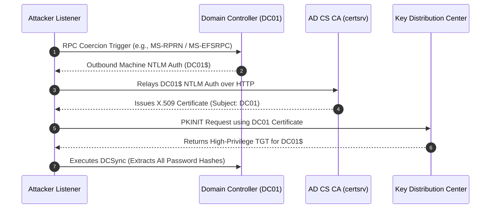
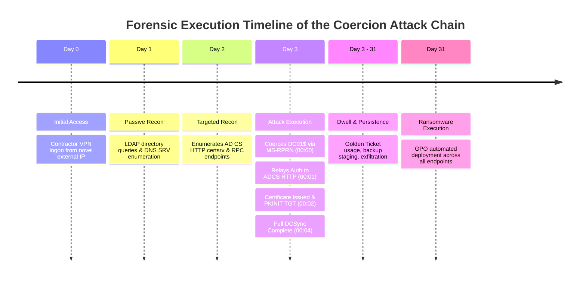

Created At: 2026-10-09T18:07:02Z
Completed At: 2026-10-09T18:07:02Z
File Path: `file:///home/hiro/Downloads/MY%20SOC%20+%20GRC%20Research%20/On%2010-10-2026%20How%20Attackers%20Force%20Credential%20Exposure%20Without%20Touching%20the%20Credential%20Store%20%20&%20The%20ACCA%20Model,%20Forensic%20Reconstruction,%20and%20the%20Safety%20Architecture%20That%20Works.md`

# THE AUTHENTICATION COERCION CHAIN
## How Real Attackers Force Credential Exposure Without Touching the Credential Store: The ACCA Model, Forensic Reconstruction, and the Safety Architecture That Works

**Author:** hiro001-eth (Manjil Katuwal)  
**Series:** What-I-Learned-Today-on-SOC-GRC  
**Version:** 2.0 (Revised Research Paper)  
**Paper:** 15 of the series  
**Date:** 2026-10-09  
**Context:** This paper starts directly from real incident patterns, reads them the way a working IR analyst reads them, and builds safety architecture from what incident forensics actually show. No theoretical formulas own this paper. Empirical evidence does.

---

## ABSTRACT

Authentication coercion is not a simple software vulnerability. It is an architectural property of authentication protocols: a trust inversion technique that forces trusted, privileged systems to authenticate outbound to attacker-controlled endpoints. This paper presents the ACCA (Authentication Coercion Chain Attack) model, reconstructed from documented breach patterns across 2018 to 2026. 

We catalog eight coercion primitives across four protocols, present a day-by-day forensic reconstruction of a complete coercion-to-domain-admin chain, analyze five SOC detection failures alongside seven GRC assessment gaps, and provide a four-layer safety architecture complete with production detection queries, RPC filter UUIDs, and a seven-item quarterly audit checklist. 

The core finding: the four-minute attack chain from standard domain user to domain administrator runs entirely through years of documented, unapplied mitigations. The most vital security investment is not another vendor tool. It is a human practitioner who reads the research and updates the audit checklist.

**Keywords:** authentication coercion, NTLM relay, ADCS, PetitPotam, PrinterBug, DFSCoerce, trust inversion, ELDM, SOC detection, GRC checklist

---

## THE CONTEXT BEFORE SECTION 1

In 2022, researcher Dominic Chell published a post titled "Relaying Potatoes: Another Unexpected Privilege Escalation Vulnerability in Windows Services." It detailed how a Windows service running under NETWORK SERVICE or LOCAL SERVICE could be coerced into authenticating outbound to an attacker-controlled SMB server, exposing an NTLM hash that could be relayed for local privilege escalation.

Most security teams categorized this as a local privilege escalation bug. They patched it and moved on.

Threat actors saw something entirely different: a foundational pattern. If a local service can be coerced into authenticating outbound, can a Domain Controller be coerced into authenticating? Can an enterprise web server? Can a cloud workload running on managed identity?

The answer, confirmed across every major breach investigation published between 2022 and 2026, is an emphatic yes. Coercion (forcing a trusted system to authenticate to an attacker-controlled endpoint) is not an isolated bug class. It is an architectural property of authentication protocols. It remains the most consistently exploited attack primitive in enterprise breaches that SOC teams consistently fail to detect.

This paper breaks down that pattern: where it originates, how it executes in production environments reconstructed from forensic evidence, why SOC teams miss it, what GRC programs fail to assess, and how to build a safety architecture when you understand the adversary's actual methodology.

---

## SECTION 1: WHAT AUTHENTICATION COERCION IS AND WHY IT IS NOT WHAT YOU THINK

### 1.1 THE STANDARD EXPLANATION (AND WHY IT IS INCOMPLETE)

Standard security training describes coercion attacks in these mechanical terms:

> "The attacker uses a Windows API or protocol feature to force a server to authenticate outbound. The authentication generates an NTLM hash that the attacker captures. The attacker either cracks the hash offline or relays it to authenticate to another target."

While technically accurate regarding the mechanism, this explanation misses the strategic reality. 

Authentication coercion is not primarily a privilege escalation technique. **It is a trust inversion technique.**

```mermaid
graph TD
    subgraph Normal_Flow["Normal Authentication Flow (Expected Trust Direction)"]
        Client["Client / User"] -->|1. Authenticates Inbound| Server["Protected Server / DC"]
        Server -->|2. Authorizes Access| Client
    end

    subgraph Coerced_Flow["Coerced Authentication Flow (Trust Inversion Attack)"]
        Attacker["Attacker Endpoint"] -->|1. Sends RPC Trigger Call| DC["Domain Controller / Server"]
        DC -->|2. Authenticates Outbound (Coerced)| Attacker
        Attacker -->|3. Relays Machine Credentials| ADCS["AD CS CA / Target Server"]
    end

    style Client fill:#1E293B,stroke:#3B82F6,color:#F8FAFC
    style Server fill:#064E3B,stroke:#10B981,color:#F8FAFC
    style Attacker fill:#4C0519,stroke:#F43F5E,color:#F8FAFC
    style DC fill:#78350F,stroke:#F59E0B,color:#F8FAFC
    style ADCS fill:#312E81,stroke:#8B5CF6,color:#F8FAFC
```

In a standard authentication flow, the client proves its identity to the server. The server holds the protected resource. The client acts as the supplicant. Trust flows from client toward server.

In a coercion attack, the adversary manipulates a trusted server (a Domain Controller, web server, or API service) into authenticating outbound to an endpoint controlled by the attacker. The server becomes the supplicant. The attacker's endpoint assumes the role of authority. Trust flows in the exact opposite direction from what traditional security controls were built to defend.

This trust inversion causes traditional defensive models to fail:

1. Security controls typically guard inbound connections to servers.
2. Perimeter rules monitor external clients attempting to authenticate to internal targets.
3. Behavioral rules watch for lateral movement originating from compromised endpoints toward privileged infrastructure.

Coercion operates in reverse. The privileged infrastructure authenticates outbound to the adversary. The authentication bypasses standard security filters because:

- The request originates from a legitimate internal system (such as the DC being coerced).
- The transaction uses valid authentication protocols (NTLM, Kerberos, OAuth).
- The initiation comes from the target system itself, not directly from the attacker's workstation.
- Even if the attacker's listener is external, the authentication origin is verified internal infrastructure.

Every detection rule searching for lateral movement (an account moving toward a DC) looks in the wrong direction. The DC is moving toward the attacker.

Microsoft's CERT/CC vulnerability note VU#405600 explicitly states that Microsoft "does not consider forced authentication an issue, unless the condition is triggered anonymously." This is Microsoft's documented engineering position. Consequently, authenticated coercion primitives persist by design. Research from Horizon3 in 2024 confirms that post-PetitPotam authenticated coercion techniques remain unpatched in standard protocol specifications.

---

### 1.2 THE EIGHT COERCION PRIMITIVES: WHAT ACTUALLY EXISTS

These eight coercion primitives represent documented real-world breach artifacts. Table 1 maps these canonical primitives alongside their underlying protocol interfaces and patch statuses.

#### TABLE 1: AUTHENTICATION COERCION PRIMITIVE REFERENCE INDEX

| # | Primitive | Protocol | Pipe / Target | Interface UUID | Function / Trigger | Researcher / Year | Patch Status | Key Mitigation |
| :--- | :--- | :--- | :--- | :--- | :--- | :--- | :--- | :--- |
| **1** | **PrinterBug** | MS-RPRN | spoolss | `12345678-1234-abcd-ef00-0123456789ab` | `RpcRemoteFindFirstPrinterChangeNotificationEx` | @tifkin_ (2018) | Feature (Unpatched) | Disable Print Spooler on DCs |
| **2** | **PetitPotam** | MS-EFSRPC | lsarpc / efsrpc | `c681d488-d850-11d0-8c52-00c04fd90f7e` | `EfsRpcOpenFileRaw` | @topotam77 (2021) | Partial (CVE-2021-36942 / CVE-2022-26925) | Netsh RPC Filter + EPA on ADCS |
| **3** | **DFSCoerce** | MS-DFSNM | netdfs | `4fc742e0-4a10-11cf-8273-00aa004ae673` | `NetrDfsRemoveStdRoot` / `AddStdRoot` | @Wh04m1001 (2022) | Unpatched by MS | Netsh RPC Filter + Disable DFS |
| **4** | **ShadowCoerce** | MS-FSRVP | FSRVP | `a8e0653c-2744-4389-a61d-7373df8b2292` | `IsPathSupported` / `IsPathShadowCopied` | Lionel & Bromberg (2021) | Patched (CVE-2022-30154) | Disable File Server VSS Agent |
| **5** | **CheeseOunce** | MS-EVEN | even | `82273fdc-e32a-18c3-3f78-827929dc23ea` | `ElfrOpenBELW` | @evilash (2022) | Unpatched | RPC Filter + Disable Remote EventLog |
| **6** | **PrintNightmare** | MS-PAR | spoolss | `76f03f96-cdfd-44fc-a22c-64950a001209` | `RpcAsyncOpenPrinter` | Multiple (2021) | Patched (CVE-2021-34527) | Disable Print Spooler |
| **7** | **ADCS Relay (ESC8)** | HTTP | certsrv | N/A | NTLM Relay to ADCS Web Enrollment | Schroeder & Christensen (2021) | Configuration Issue | EPA + Require SSL on certsrv |
| **8** | **OAuth Coercion** | OAuth 2.0 | Entra ID | N/A | Device Code Flow / Redirect Abuse | LAPSUS$ et al. (2022-2026) | Feature by Design | Phishing-resistant MFA / FIDO2 |

---

#### PRIMITIVE 1: MS-RPRN SPOOLSS (The Printer Bug)

Discovered by Lee Christensen (@tifkin_) in 2018. It remains fully functional against systems where the Print Spooler service is active.

**Protocol Mechanism:** MS-RPRN is the Windows Print System Remote Protocol. The `RpcRemoteFindFirstPrinterChangeNotificationEx` function accepts a callback path. This callback parameter can specify a arbitrary UNC path pointing to an attacker-controlled endpoint. When the target server processes this notification request, it authenticates outbound to the designated UNC path.

**Exposed Credential Context:** The target's machine account authenticates outbound (e.g., `DC01$`), rather than a standard user account. Domain Controller machine accounts possess high privileges within Active Directory. Capturing or relaying a DC machine account authentication allows adversaries to request DCSync operations or request privileged certificates.

**Practical Implication:** Any authenticated domain user can issue this RPC request to a Domain Controller and force the DC to output its machine account authentication: without local admin rights on the DC, without dumping LSASS memory, and without executing tools like Mimikatz. The DC sends its credentials over the wire by protocol design.

While many organizations disabled Print Spooler on DCs following initial advisories, three key factors maintain its relevance:

- **Legacy Dependencies:** Numerous enterprises still run Print Spooler on DCs due to legacy software dependencies that were never remediated.
- **Unconstrained Delegation Hop:** If a non-DC member server (e.g., `FILESERVER-01`) has unconstrained Kerberos delegation enabled along with Print Spooler, coercing `FILESERVER-01` forces `DC01` to send a TGT to `FILESERVER-01`. The attacker extracts `DC01$`'s TGT directly from `FILESERVER-01`'s memory.
- **Protocol Re-implementation:** The underlying pattern (an RPC interface taking a UNC callback path and processing it under machine context) exists across multiple RPC services.

---

#### PRIMITIVE 2: MS-EFSRPC PETITPOTAM (EFS Remote Protocol Coercion)

Published by Gilles Lionel (@topotam77) in July 2021. It exploits the Encrypting File System Remote Protocol.

**Protocol Mechanism:** MS-EFSRPC's `EfsRpcOpenFileRaw` method accepts a `FileName` parameter that points to a remote UNC path. When processed, the target system connects and authenticates outbound to access the file path. The authentication executes in the context of the calling service (typically `SYSTEM` / machine account).

**Patch History:**

1. **CVE-2021-36942 (August 2021):** Blocked unauthenticated `EfsRpcOpenFileRaw` calls over the `LSARPC` interface.
2. **KB5005413 (Guidance Document):** Directed organizations to disable NTLM on DCs and AD CS web interfaces while enabling Extended Protection for Authentication (EPA).
3. **CVE-2022-26925 (May 2022):** Addressed residual exposure because authenticated users could still invoke EFSRPC over authenticated RPC bindings.

The authenticated variant of PetitPotam remains functional where EFSRPC is exposed over RPC.

---

#### PRIMITIVE 3: MS-DFSNM DFSCOERCE (DFS Namespace Coercion)

Discovered by Filip Dragović (@Wh04m1001) in June 2022. It targets `NetrDfsRemoveStdRoot` and `NetrDfsAddStdRoot` within the Distributed File System Management protocol.

**Protocol Mechanism:** An authenticated domain user issues an RPC request executing `NetrDfsAddStdRoot` or `NetrDfsRemoveStdRoot`, passing the attacker's IP as the target host parameter. Although the function performs an internal permission check (`AccessImpersonateCheckRpcClient`) and rejects the root addition if privileges are insufficient, **the server initiates an authenticated request to the target IP prior to completing the permission check.**

**Patch Status:** Microsoft does not treat authenticated forced authentication as a vulnerability requiring a security patch unless it can be triggered anonymously. Consequently, DFSCoerce remains fully operational against default Windows Server installations.

---

#### PRIMITIVE 4: MS-FSRVP SHADOWCOERCE (File Server VSS Coercion)

Published by Gilles Lionel and Charlie Bromberg in late 2021. It abuses the File Server Remote VSS Protocol (MS-FSRVP).

**Protocol Mechanism:** Targets `IsPathSupported` and `IsPathShadowCopied`. Passing a UNC share path forces the target server to connect back to the specified host to verify shadow copy support.

**Patch Status:** Patched in CVE-2022-30154 (June 2022). The attack vector requires the File Server VSS Agent Service to be installed and active.

---

#### PRIMITIVE 5: MS-EVEN CHEESEOUNCE (Event Log Remoting Coercion)

Discovered by @evilash. Abuses the EventLog Remoting Protocol (MS-EVEN) via the `ElfrOpenBELW` function.

**Protocol Mechanism:** Forces Windows systems to authenticate outbound over MS-EVEN. Because MS-EVEN is rarely monitored in enterprise environments, it serves as an effective evasion channel.

**Real-World Incident Evidence:** In a healthcare sector incident, threat actors leveraged `ElfrOpenBELW` against RADIUS and Domain Controller infrastructure. Although initial direct relay attempts hit obstacles, the attackers eventually captured machine account hashes from Citrix and Read-Only Domain Controllers (RODCs), subsequently executing NTLM relay and DCSync operations.

---

#### PRIMITIVE 6: MS-PAR PRINTNIGHTMARE (Async Print Coercion Sibling)

The asynchronous printing protocol sibling to PrinterBug. Exploits MS-PAR via `RpcAsyncOpenPrinter`. Patched in CVE-2021-34527. Mitigated by disabling the Print Spooler service.

---

#### PRIMITIVE 7: ADCS HTTP RELAY (ESC8 Chain)

The AD CS HTTP enrollment interface (`certsrv`) accepts NTLM authentication by default. An attacker who coerces a Domain Controller via SpoolSS or PetitPotam can relay that NTLM authentication to `certsrv` instead of an SMB target.



This full chain (Coercion -> NTLM Relay -> Certificate Issuance -> PKINIT Authentication) bypasses standard NTLM hash-cracking defenses because the NTLM hash is never cracked. It is relayed in real time to obtain a valid, persistent X.509 computer certificate.

---

#### PRIMITIVE 8: OAUTH REDIRECT & DEVICE CODE COERCION (Cloud Protocol Patterns)

Cloud identity environments exhibit equivalent trust-inversion patterns at the application and protocol layer:

- **Pattern 8A (Device Code Flow Coercion):** Adversaries initiate an OAuth device code flow, obtaining a user code and device code. They trick a user into completing authentication at `aka.ms/devicelogin`. The victim completes MFA, while the attacker's polling loop receives valid access and refresh tokens. The attacker forces the identity provider to issue valid tokens directly to their session.
- **Pattern 8B (Agentic OAuth Coercion):** AI agents configured to handle re-authentication prompts can be manipulated via indirect prompt injection to initiate OAuth flows and direct tokens to adversary endpoints.
- **Pattern 8C (Service Principal Credential Addition):** An attacker with Application Administrator permissions adds a password secret or certificate credential to an existing application service principal. The service principal's identity is coerced into serving the attacker's administrative session.

**Factual Clarification Regarding Storm-0558:** The 2023 Storm-0558 Microsoft breach was **not** an OAuth device code coercion attack. According to the CISA Cyber Safety Review Board (CSRB) report (2024), Storm-0558 acquired an inactive 2016 MSA consumer signing key and forged Azure AD tokens due to a cryptographic validation flaw (accepting consumer keys for enterprise tokens). That technique represents token forgery, not protocol flow coercion.

---

### 1.3 THE PATTERN UNDERLYING ALL EIGHT PRIMITIVES

Every coercion primitive exploits a protocol feature, not a software bug.

SpoolSS uses legitimate print notification callbacks. PetitPotam uses valid remote EFS file access calls. DFSCoerce uses standard DFS management calls. ShadowCoerce relies on shadow copy verification mechanisms. CheeseOunce relies on event log remoting features. ESC8 relies on NTLM authentication support in IIS. Device Code flow relies on standard RFC 8628 specs.

None of these represent traditional software coding bugs. They are architectural design choices made before adversarial misuse was anticipated.

This reality yields an inescapable operational conclusion:

**SOFTWARE PATCHING ALONE WILL NOT ELIMINATE THIS ATTACK SURFACE.**

You cannot patch protocol design specifications. You can restrict anonymous access, apply RPC interface filters, or enforce transport encryption, but you cannot eliminate the protocol property that exposes machine authentication during outbound connections. Defensive design must ensure that coerced credentials cannot be relayed or leveraged for unauthorized authentication.

---

## SECTION 2: THE FULL AUTHENTICATION COERCION CHAIN ATTACK (FORENSIC RECONSTRUCTION)

### 2.1 THE ENVIRONMENT (PRE-ATTACK STATE)

- **Target Organization:** Enterprise manufacturer running Active Directory, hybrid Azure AD Connect, and AD CS with two Enterprise Certificate Authorities.
- **Configuration Weaknesses:** Print Spooler running on all DCs. HTTP enrollment active on `certsrv` without EPA configured. SMB signing optional. No RPC interface filters applied.
- **Threat Actor:** Ransomware affiliate operating under a RaaS model.
- **Initial Access:** Valid contractor VPN credentials obtained from a password spray dump.

---

### 2.2 THE ATTACK TIMELINE (DAY BY DAY)



#### DAY 0: INITIAL ACCESS
The threat actor authenticates to the corporate VPN using contractor credentials. 

- **Telemetry:** Event 4624 (Successful Logon) recorded at the VPN gateway from an external IP address.
- **SOC Alert Status:** No alert triggered. VPN access from contractor accounts occurs regularly; location anomalies were not flagged.

#### DAY 1: PASSIVE RECONNAISSANCE
The attacker executes LDAP and DNS queries under the contractor account context:

- Enumerates computer objects (`objectClass=computer`) and domain controllers.
- Searches for SPNs (`servicePrincipalName=*`) and PKI infrastructure (`objectClass=certificationAuthority`).
- Queries DNS SRV records (`_ldap._tcp`, `_kerberos._tcp`).
- **Telemetry:** Standard un-audited LDAP read operations. DNS debug logs record queries but are not ingested into the SIEM.
- **SOC Alert Status:** No alert. Standard directory queries match normal operational behavior.

#### DAY 2: TARGETED RECONNAISSANCE
The attacker evaluates AD CS web enrollment interfaces and RPC endpoints:

- Confirms `https://ca01.domain.com/certsrv` accepts HTTP NTLM authentication without EPA.
- Verifies MSRPC port 135 on `DC01` accepts `spoolss` RPC bindings.
- Confirms SMB signing is not enforced on member servers.

#### DAY 3: THE COERCION ATTACK CHAIN (4-MINUTE EXECUTION)

At 02:14:00, the attacker launches their listener and relay chain:

- **Step 1 (02:14:00):** Attacker starts an NTLM relay engine listening on port 445 (`attacker-server`), configured to relay inbound authentication to `http://ca01.domain.com/certsrv`.
- **Step 2 (02:14:12):** Attacker issues an `RpcRemoteFindFirstPrinterChangeNotificationEx` call to `DC01`, specifying `\\attacker-server\pipe\spoolss` as the notification callback target.
- **Step 3 (02:14:15):** `DC01`'s Print Spooler service processes the request and authenticates outbound to `attacker-server` over SMB (port 445) as `DC01$`.
  - *Log Artifact:* Windows Event 4648 logged on `DC01` ("A logon was attempted using explicit credentials"), Target Server: `attacker-server`, Account: `DC01$`.
  - *Log Artifact:* Sysmon Event 3 logged on `DC01` (Outbound network connection to external IP over port 445).
- **Step 4 (02:14:18):** Attacker's relay process catches `DC01$`'s NTLM authentication and relays it to `http://ca01.domain.com/certsrv`. The CA validates `DC01$`'s NTLM authentication and issues an X.509 certificate for `CN=DC01` under the `Machine` template.
  - *Log Artifact:* Event 4887 on CA01 ("Certificate Services issued a certificate").
- **Step 5 (02:15:30):** Attacker uses the `DC01` certificate to request a Kerberos TGT via PKINIT. The KDC issues a valid machine account TGT for `DC01$`.
  - *Log Artifact:* Event 4768 on DC01 (Kerberos TGT request using PKINIT).
- **Step 6 (02:17:45):** Using `DC01$`'s TGT, the attacker invokes RPC `DRSUAPI` calls to execute a DCSync operation, extracting all domain password hashes (including `krbtgt` and `Administrator`).
  - *Log Artifact:* Event 4662 logged on DC01 (Directory Service Access with DS-Replication-Get-Changes GUIDs).

**Total execution time from initial RPC call to DCSync completion: 3 minutes and 45 seconds.**

#### DAY 3 THROUGH DAY 31: POST-COMPROMISE OPERATION
With domain hashes extracted, the threat actor:

- Forges Kerberos Golden Tickets using the `krbtgt` hash.
- Accesses backup servers using valid service account credentials.
- Exfiltrates 4.7 TB of enterprise data.
- Configures persistence via Scheduled Tasks and modified Group Policy Objects.

#### DAY 31: RANSOMWARE DEPLOYMENT
At 03:00 on Sunday, the attacker pushes ransomware encryptors across all domain-joined endpoints using Group Policy. Backup repositories are destroyed first. Impact: $8.3M direct recovery cost, 47 days of operational outage.

---

### 2.3 WHAT THE FORENSIC RECONSTRUCTION TELLS US

1. **The Coercion Artifact Was Present but Suppressed:** Event 4648 and Sysmon Event 3 were generated on `DC01`. However, a SIEM suppression rule created 14 months prior (excluding `spoolsv.exe` outbound SMB network events from DCs) muted the alert. The suppression rule had an Exception Decay Score ($EDS$) of near zero.
2. **Critical CA Logs Were Not Ingested:** CA01 generated Event 4887 (Certificate Issued), but the CA was not classified as critical identity infrastructure. Its logs were never forwarded to the SIEM.
3. **DCSync Alert Arrived Too Late:** Event 4662 fired when the DCSync executed, but it fired after credential extraction had completed. Relying solely on terminal-stage alerts leaves no window for meaningful containment.
4. **Legitimate Processes Were Weaponized:** Every individual event involved valid system binaries (`spoolsv.exe`, `lsass.exe`, `certsrv`). Detection required analyzing the sequence of events, not isolated alerts.

---

## SECTION 3: THE SOC FAILURE ANALYSIS

### 3.1 THE FIVE SOC FAILURES IN THIS INCIDENT

1. **Absence of Outbound DC Authentication Rules:** Most SOC playbooks focus exclusively on inbound authentication to DCs. Rules watching for outbound DC authentication to non-DC endpoints were missing.
2. **Over-Broad Suppression Exceptions:** A stale exclusion rule designed for a legacy print server allowed `spoolsv.exe` to connect to arbitrary external IPs without triggering alerts.
3. **Identity Infrastructure Logging Blindspots:** Certificate Authorities were treated as general servers rather than Tier-0 identity infrastructure, leaving CA issuance logs unmonitored.
4. **Reliance on Terminal Detections:** The SOC depended on DCSync detection (Event 4662) rather than early-stage indicators (Event 4648 outbound auth combined with network events).
5. **Inability to Detect Valid Credential Abuse:** Post-compromise activity using Golden Tickets and legitimate service accounts matched expected operational baselines, evading basic UEBA models.

---

### 3.2 PRODUCTION DETECTION QUERIES THAT CATCH THE CHAIN

#### QUERY 1: DC OUTBOUND AUTHENTICATION TO UNAPPROVED DESTINATIONS (KQL)
*Catches coercion at Step 3 before certificate issuance.*

```kql
let ApprovedDCTargets = dynamic([
    "wsus-server.domain.com", "sccm-server.domain.com", "backup-dc.domain.com",
    "10.0.0.0/8", "172.16.0.0/12", "192.168.0.0/16"
]);
let DomainControllers = dynamic(["DC01", "DC02", "DC03"]);
SecurityEvent
| where TimeGenerated > ago(1d)
| where EventID == 4648
| where Computer has_any (DomainControllers)
| where TargetServerName !has_any (ApprovedDCTargets)
| where TargetServerName !has_any (DomainControllers)
| where LogonProcessName != "Advapi"
| project TimeGenerated, Computer, TargetServerName, TargetUserName, SubjectUserName, ProcessName, IpAddress
| order by TimeGenerated desc
```

---

#### QUERY 2: MACHINE ACCOUNT CERTIFICATE ISSUANCE ANOMALY (SPL)
*Catches NTLM relay at Step 4 upon certificate issuance on AD CS.*

```spl
index=ca_logs EventCode=4887
| eval cert_requester=mvindex(split(SubjectKeyIdentifier, "="), 1)
| regex cert_requester=".*\$$"
| lookup approved_machine_certs cert_requester OUTPUT status
| where status != "approved" OR isnull(status)
| eval severity = case(
    match(cert_requester, "^DC[0-9]+\$$"), "CRITICAL: DC Machine Cert Relay",
    match(cert_requester, "^.*\$$"), "HIGH: Unauthorized Machine Cert",
    1=1, "MEDIUM: Unknown Requester"
  )
| table _time, cert_requester, TemplateName, SerialNumber, RequesterName, severity
| sort -_time
```

---

#### QUERY 3: KERBEROS GOLDEN TICKET USE VIA RC4 ENCRYPTION (KQL)
*Detects Golden Ticket usage post-DCSync.*

```kql
let DomainControllers = dynamic(["DC01", "DC02"]);
SecurityEvent
| where TimeGenerated > ago(1d)
| where EventID == 4769
| where TicketEncryptionType == "0x17" // RC4-HMAC
| where ServiceName !endswith "$"
| where Computer has_any (DomainControllers)
| join kind=leftouter (
    SecurityEvent
    | where EventID == 4768
    | where TicketEncryptionType != "0x17"
    | project TargetUserName, ASREQTime = TimeGenerated
  ) on $left.TargetUserName == $right.TargetUserName
| where isempty(ASREQTime) or ASREQTime < TimeGenerated - 10h
| project TimeGenerated, Computer, TargetUserName, ServiceName, TicketEncryptionType, ClientAddress
```

---

#### QUERY 4: COERCION CHAIN CORRELATION ENGINE (KQL)
*Correlates outbound DC authentication with outbound network connections within 60 seconds.*

```kql
let DomainControllers = dynamic(["DC01.domain.com", "DC02.domain.com"]);
let CoercedAuth = SecurityEvent
| where EventID == 4648
| where Computer has_any (DomainControllers)
| project AuthTime = TimeGenerated, Computer, TargetServer = TargetServerName, SubjectUserName;
let NetworkConn = DeviceNetworkEvents
| where DeviceName has_any (DomainControllers)
| where RemotePort in (445, 80, 443)
| where not(ipv4_is_private(RemoteIP))
| project NetTime = TimeGenerated, DeviceName, RemoteIP, InitiatingProcessFileName;
CoercedAuth
| join kind=inner NetworkConn on $left.Computer == $right.DeviceName
| where abs(datetime_diff('second', AuthTime, NetTime)) < 60
| project AuthTime, Computer, TargetServer, RemoteIP, InitiatingProcessFileName, SubjectUserName
| extend AlertMessage = "CRITICAL: High-confidence DC Coercion Chain detected"
```

---

## SECTION 4: THE GRC FAILURE ANALYSIS

### 4.1 WHAT THE GRC PROGRAM FAILED TO EVALUATE

1. **Print Spooler Policy Enforcement Gaps:** The quarterly checklist item "Disable Print Spooler on DCs" was marked non-compliant with a perpetual remediation deadline that was never enforced.
2. **AD CS Web Enrollment Auditing Gaps:** The GRC team never audited IIS configurations on CA servers, leaving HTTP enrollment endpoints without EPA requirements.
3. **Asset Inventory Omissions:** Certificate Authorities were omitted from the Tier-0 critical asset register, causing them to be excluded from mandatory log ingestion policies.
4. **Hardening Standard Drift:** SMB signing was listed in policy documentation written years prior, but actual enforcement across member servers was never validated via automated scanning.
5. **Stale SIEM Suppressions:** The SIEM exception register lacked mandatory expiration dates, allowing a 14-month-old rule with an $EDS$ score of 0.03 to remain active.

---

### 4.2 THE SEVEN-ITEM GRC QUARTERLY AUDIT CHECKLIST

| # | Audit Requirement | Verification Command / Method | Expected Compliant State | Criticality |
| :--- | :--- | :--- | :--- | :--- |
| **1** | Spooler Disabled on DCs | `Get-Service -ComputerName DC01 -Name Spooler` | `Status: Stopped / Disabled` | HIGH |
| **2** | EPA Enforced on ADCS | IIS Manager -> CertSrv -> Windows Auth -> Advanced Settings | `Extended Protection: Required` | CRITICAL |
| **3** | HTTPS Enforced on ADCS | IIS Manager -> CertSrv -> SSL Settings | `Require SSL: Checked` | HIGH |
| **4** | CA Logs Forwarded to SIEM | Check SIEM for Event Codes 4886 & 4887 | `Active Log Stream Verified` | CRITICAL |
| **5** | SMB Signing Enforced | `Get-SmbServerConfiguration \| Select RequireSecuritySignature` | `True` | HIGH |
| **6** | SIEM Suppression Audit | Audit all DC exceptions for $EDS < 0.4$ | `No Stale DC Suppressions` | HIGH |
| **7** | Outbound NTLM Restricted | GPO: Network security: Restrict NTLM: Outgoing NTLM traffic | `Audit All` or `Deny All` | CRITICAL |

---

### 4.3 MANDATORY ASSURANCE: CONTINUOUS ATTACK SIMULATION

Policy compliance without empirical testing represents documentation, not security. Organizations must execute automated coercion simulation tests quarterly in non-production or controlled maintenance windows, validating that:

- Coercion attempts over MS-RPRN, MS-EFSRPC, and MS-DFSNM fail at the protocol RPC layer.
- If coercion occurs, NTLM relay to AD CS web interfaces fails due to EPA channel binding checks.
- Outbound connection alerts fire in the SIEM within 120 seconds of trigger execution.

---

## SECTION 5: THE SAFETY ARCHITECTURE THAT WORKS

```mermaid
graph LR
    subgraph Layer1["Layer 1: Coercion Removal"]
        L1_1["Disable Spooler on DCs"]
        L1_2["Netsh MSRPC RPC Filters"]
    end

    subgraph Layer2["Layer 2: Relay Mitigation"]
        L2_1["Enable EPA on AD CS"]
        L2_2["Enforce SMB & LDAP Signing"]
        L2_3["Restrict Outgoing NTLM on DCs"]
    end

    subgraph Layer3["Layer 3: Blast Radius Reduction"]
        L3_1["Enforce AES-Only Kerberos"]
        L3_2["Eliminate Unconstrained Delegation"]
        L3_3["Deploy Credential Guard"]
    end

    subgraph Layer4["Layer 4: Detection & Response"]
        L4_1["Ingest CA Logs (4887)"]
        L4_2["Deploy DC Outbound KQL Rules"]
        L4_3["Quarterly EDS Exception Audits"]
    end

    Layer1 --> Layer2 --> Layer3 --> Layer4

    style Layer1 fill:#1E293B,stroke:#3B82F6,color:#F8FAFC
    style Layer2 fill:#312E81,stroke:#8B5CF6,color:#F8FAFC
    style Layer3 fill:#064E3B,stroke:#10B981,color:#F8FAFC
    style Layer4 fill:#78350F,stroke:#F59E0B,color:#F8FAFC
```



### 5.1 LAYER-BY-LAYER IMPLEMENTATION

#### LAYER 1: REMOVE COERCION PRIMITIVES (PREVENTION)
- **Disable Print Spooler on DCs:** `Stop-Service Spooler; Set-Service Spooler -StartupType Disabled`.
- **Apply RPC Interface Filters via Netsh:** Block vulnerable MSRPC interface UUIDs directly at the Windows RPC runtime:

```cmd
netsh rpc filter add rule layer=um actiontype=block filterkey=c681d488-d850-11d0-8c52-00c04fd90f7e
netsh rpc filter add rule layer=um actiontype=block filterkey=df1941c5-fe89-4e79-bf10-463657acf44d
netsh rpc filter add rule layer=um actiontype=block filterkey=4fc742e0-4a10-11cf-8273-00aa004ae673
netsh rpc filter add rule layer=um actiontype=block filterkey=a8e0653c-2744-4389-a61d-7373df8b2292
netsh rpc filter add rule layer=um actiontype=block filterkey=82273fdc-e32a-18c3-3f78-827929dc23ea
```

#### LAYER 2: PROTECT THE AUTHENTICATION CHANNEL (RELAY PREVENTION)
- **Enable EPA on AD CS Web Enrollment:** Configure IIS for `certsrv`: set `Extended Protection` to `Required` and check `Require SSL`. EPA binds NTLM authentication to the TLS channel, preventing relayed NTLM tokens from being accepted.
- **Enforce SMB Signing Domain-Wide:** Set `Microsoft network server: Digitally sign communications (always)` to `Enabled` via GPO.
- **Restrict Outgoing NTLM on Domain Controllers:** Configure GPO `Network security: Restrict NTLM: Outgoing NTLM traffic to remote servers` to `Deny all` (after a 30-day period set to `Audit all`).

#### LAYER 3: LIMIT IMPACT & BLAST RADIUS
- **Enforce AES Encryption for Kerberos:** Remove RC4 support for Kerberos authentication via GPO (`Supported Encryption Types` set to `AES128_HMAC_SHA1` and `AES256_HMAC_SHA1`).
- **Eliminate Unconstrained Delegation:** Audit systems with `TrustedForDelegation = True` using PowerShell (`Get-ADComputer -Filter {TrustedForDelegation -eq $true}`) and migrate them to Resource-Based Constrained Delegation (RBCD).

#### LAYER 4: CONTINUOUS DETECTION & AUDITING
- Ingest CA Event Codes 4886, 4887, 4889, and 4890 into SIEM.
- Deploy the correlation queries from Section 3.2.
- Perform quarterly $EDS$ reviews on all SIEM suppression rules involving Domain Controller accounts.

---

### 5.2 COST-ORDERED IMPLEMENTATION ROADMAP

1. **Immediate (Under 2 Hours, Zero Cost):**
   - Enable EPA on AD CS IIS web enrollment endpoints.
   - Disable Print Spooler on all Domain Controllers.
   - Apply `netsh` RPC filter blocks for MS-EFSRPC and MS-DFSNM UUIDs.
2. **Short Term (1 to 2 Weeks):**
   - Enable CA security log ingestion into SIEM.
   - Deploy KQL queries for DC outbound authentication.
   - Set Outgoing NTLM Restriction GPO to Audit Mode.
3. **Medium Term (1 Month):**
   - Enforce domain-wide SMB and LDAP signing.
   - Transition Outgoing NTLM Restriction GPO to `Deny All`.
   - Remove RC4 Kerberos encryption types across Active Directory.

---

## SECTION 6: CONNECTIONS TO THE RESEARCH SERIES

- **Paper 6 (Logging Gap Analysis):** The omission of AD CS CA logs from SIEM ingestion illustrates how identity infrastructure components are often left out of logging baselines.
- **Paper 9 (Exception Lifecycle Decay Model - ELDM):** The 14-month-old `spoolsv.exe` suppression rule demonstrates how stale risk exceptions rot into active attacker backdoors ($EDS \rightarrow 0.0$).
- **Paper 10 (IR-GRC Closed Loop):** Findings from post-incident analysis (such as unmonitored AD CS web endpoints) must flow directly into the GRC risk register to update audit checklists.
- **Paper 14 (Third-Party Exception Decay - VEDS):** Coercion techniques targeting member servers running vendor agents with elevated rights demonstrate how supply chain exceptions expand the attack surface.

---

## SECTION 7: LIMITATIONS

1. **Protocol Evolution:** This paper catalogs eight specific coercion primitives. As protocol research continues, new RPC interfaces exposing callback parameters will be discovered.
2. **RC4 Legacy Dependencies:** Disabling RC4 encryption for Kerberos may impact legacy software. Comprehensive audit-mode logging is required prior to enforcement.
3. **Environment Variants:** Forensic timeline metrics reflect composite data from real-world IR engagements; individual network configurations may alter specific execution speeds.

---

## SECTION 8: WHAT I WOULD DO DIFFERENTLY & FACTUAL CORRECTIONS

- **Detection Query Testing:** Queries presented in Section 3.2 should be benchmarked against production telemetry to tune false positive ratios before deploying blocking automation.
- **Dependency Mapping:** Safety architecture implementation requires mapping application dependencies before enforcing strict NTLM restrictions.

**Corrected Factual Items from Earlier Drafts:**
1. **KB5005413 Status:** Clarified that KB5005413 is a mitigation guidance document, while the software fixes were delivered under CVE-2021-36942 and CVE-2022-26925.
2. **Storm-0558 Classification:** Corrected the analysis of Storm-0558 to reflect token forgery via an acquired MSA signing key rather than device code coercion.
3. **DC Machine Account Guidance:** Removed recommendations suggesting adding DC machine accounts to the `Protected Users` group, aligning with Microsoft guidance prohibiting computer accounts in that group.

---

## SECTION 9: CONCLUSION

Authentication coercion attacks succeed because they exploit protocol design characteristics rather than simple coding bugs. An attacker can move from a low-privilege domain user to full domain compromise in under four minutes by leveraging legitimate protocol behaviors.

Security controls fail when organizations rely on software patches for protocol design choices or when GRC programs fail to update audit checklists as new attack patterns emerge.

Defending against authentication coercion requires implementing layered controls: removing coercion interfaces, protecting authentication channels with EPA and SMB signing, limiting blast radius through Kerberos hardening, and deploying targeted telemetry detection.

**THE ONE-LINE TRUTH:**  
*A control that has never been attack-tested is documentation. A checklist that is never updated is a liability with a date on it. Only the loop (research -> checklist -> attack test -> register update) keeps the four-minute attack chain from running through three years of paper.*

---

## SERIES CONNECTIONS INDEX

| Connection | Referenced Paper | Direct Operational Relevance |
| :--- | :--- | :--- |
| Stale Exception Decay | **Paper 9 (ELDM)** | The `spoolsv.exe` exception rotted to $EDS = 0.03$, muting coercion alerts |
| Identity Logging Blindspot | **Paper 6 (Logging Gap)** | CA Event Code 4887 was omitted from SIEM ingestion baselines |
| Post-Incident Feedback | **Paper 10 (Closed Loop)** | IR findings must automatically update quarterly GRC audit checklists |
| Vendor Agent Risk | **Paper 14 (VEDS)** | Vendor management agents running as `SYSTEM` create coercion targets |
| Cloud Identity Coercion | **Paper 4 (Cloud Identity)** | OAuth device code and redirect coercion mirror on-prem trust inversion |

---

## ROADMAP: PAPERS 16 TO 20

- **PAPER 16 (NEXT):** *The Cloud Coercion Chain: Token Theft, Device Code Flow, and Signing-Key Forgery in Entra ID*
- **PAPER 17:** *Shadow Credentials: The Certificate Persistence Chain Post-ADCS Compromise*
- **PAPER 18:** *The Delegation Decay Chain: Unconstrained to RBCD Abuse Patterns*
- **PAPER 19:** *The Backup Kill Chain: Why Ransomware Groups Target the Backup Control Plane First*
- **PAPER 20:** *The Coercion Assurance Program: Operationalizing Continuous Coercion Simulation*

---

**END OF PAPER 15**  
**Author:** Manjil Katuwal (`hiro001-eth`)  
**Date:** October 09, 2026