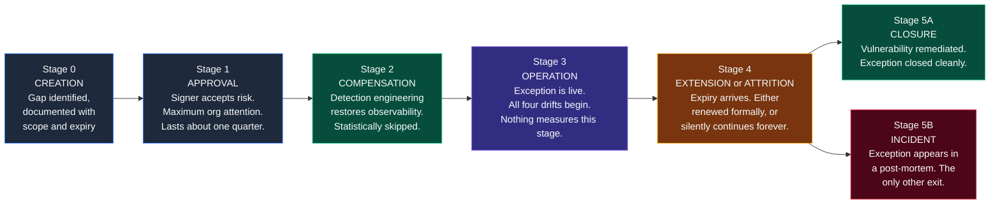
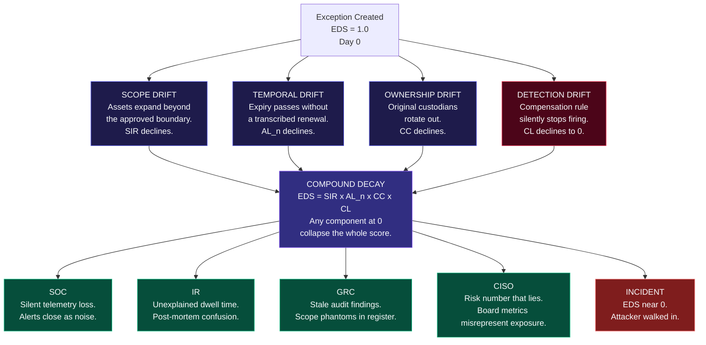
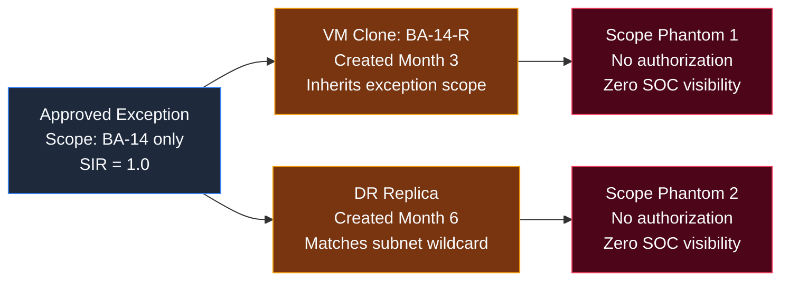
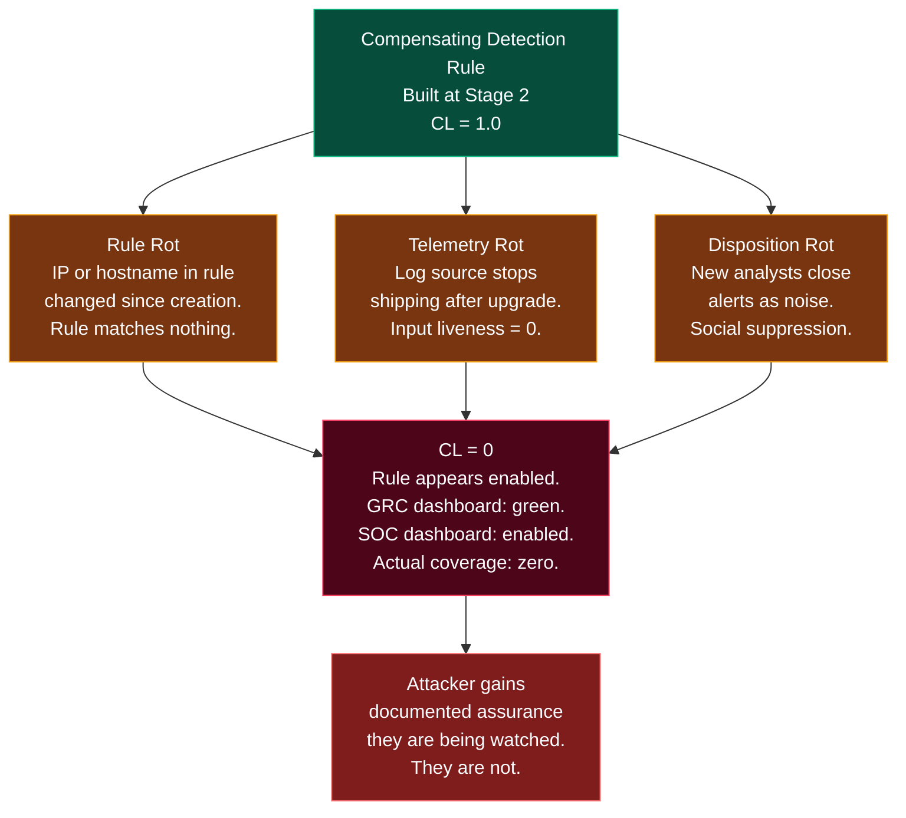
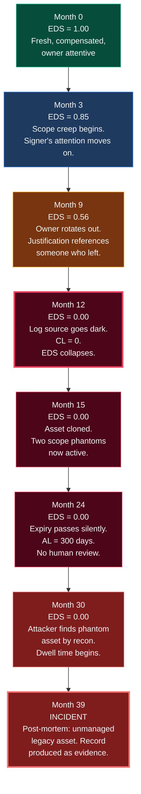
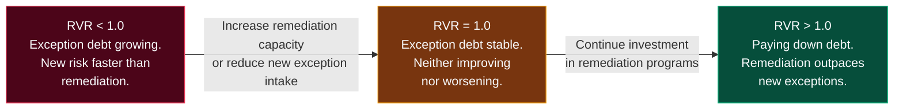
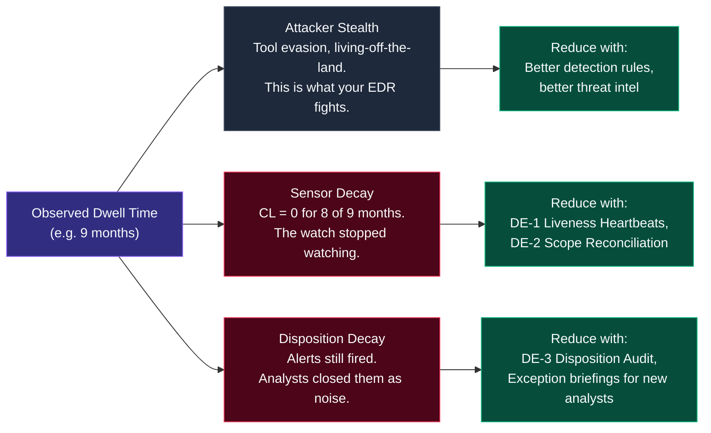
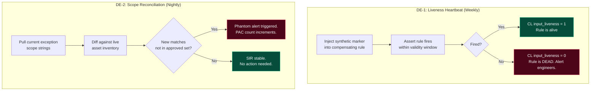
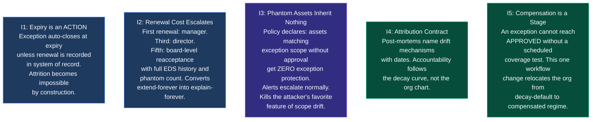

# The Exception Lifecycle Decay Model (ELDM)
## How Accepted Risks Rot: A Four-Drift Theory of GRC Exception Decay and Its Forensic, Detection, and Audit Consequences

**Version:** 1.1 (Post-Review Revision)
**Date:** 2026-09-14
**Series:** What-I-Learned-Today-on-SOC-GRC
**Author:** hiro001-eth
**Prequel:** [Risk Acceptance Backdoors, Exception Attack Trees & Compliance Debt](./ON%2010-09-2026%20-%20RISK%20ACCEPTANCE%20BACKDOORS,%20EXCEPTION%20ATTACK%20TREES,%20AND%20THE%20COMPLIANCE%20DEBT%20METRIC.md)
**Classification:** Advanced SOC + GRC Research | Forensics | Audit Methodology | CISO Metrics
**Target Audience:** Tier 1-3 SOC Analysts, IR Engineers, Detection Engineers, GRC Auditors, CISOs

---

## TL;DR

The backdoors paper showed that a signed risk exception without compensating detection is observationally equivalent to a backdoor. This paper answers what happens *next*: accepted risks don't just exist as backdoors. They rot. On a predictable schedule. Four drift mechanisms operate on every exception from the day it's signed: scope drift, temporal drift, ownership drift, and detection drift. I formalized each as a measurable function, combined them into a single decay score (EDS), and connected the whole model to incident dwell time forensics. The result is the first framework that lets SOC, IR, GRC, and the CISO all read the same exception decay from their own data.

---

## Why This Paper Exists

Read the backdoors paper and every department nods for a different reason.

The SOC analyst nods because they've closed ten thousand "known legacy noise" alerts. The incident responder nods because they've stood in a post-mortem asking why dwell time was nine months. The GRC auditor nods because they've re-tested an exception whose scope no longer matches its ticket. The CISO nods because they've signed an exception that outlived its justification by two re-orgs.

What nobody has is a single model of the rotting process itself. The literature treats exception failure as an event: expired, violated, breached. This paper treats it as a process. Continuous, measurable, and most importantly, predictable.

Predictable decay is the property that converts a complaint into a control.

Here's what each audience gets from this paper:

| Audience | What This Paper Gives You |
| :--- | :--- |
| **SOC Analyst** | A formal account of why alert suppression ages into blindness, with four detection engineering countermeasures |
| **IR / Forensics** | A dwell-time decomposition framework that names which drift killed your visibility before the attacker arrived |
| **GRC / Auditor** | An 8-step audit procedure that tests the exception as it *exists*, not as it was *written* |
| **CISO** | Four board-presentable metrics with honest semantics, and a mechanism to transfer accountability for decay back to the signing layer |

---

## The Central Formula

Every concept in this paper feeds into one equation. The Exception Decay Score:

```
EDS(e,t) = SIR(e,t) x AL_n(e,t) x CC(e,t) x CL(e,t)

EDS = 1.0  -->  Healthy exception, fully controlled
EDS = 0.0  -->  Attacker's open door
```

| Component | Full Name | Healthy Value | Decayed Value |
| :--- | :--- | :---: | :---: |
| SIR | Scope Integrity Ratio | 1.0 | Approaches 0 |
| AL_n | Authorization Lag (normalized) | 1.0 | Approaches 0 |
| CC | Custodial Continuity | 1.0 | Approaches 0 |
| CL | Compensation Liveness | 1.0 | 0 (the killer) |

The product form isn't arbitrary. It reflects how attackers think: they don't need all four drifts. They only need the weakest one. Averaging the four values would let three healthy scores mask one fatal failure. Multiplication doesn't.

---

# PART I: THE SIX-STAGE EXCEPTION LIFECYCLE

## 1.1 Every Exception Follows the Same Path

It doesn't matter whether you're working under ISO 27001, SOC 2, PCI-DSS, or internal policy. Every governance exception travels through six stages. The problem is that governance instruments are dense at Stages 0 and 1, and completely absent at Stages 3 and 4. That's exactly where the decay lives.



## 1.2 Two Structural Facts That Drive Everything Else

**Fact 1:** The exception spends almost all of its life in Stage 3. That's the stage no workflow measures. Governance dashboards are dense at Stages 0-1 and absent at 3-4. The decay occurs precisely in the unmeasured interval.

**Fact 2:** Compensation (Stage 2) is the only stage that fights decay, and it's the least enforced. Decay is structural. Compensation is optional. That asymmetry is the engine of the entire model.

A skipped Stage 2 doesn't create debt to pay later. It creates **EDS = 0 from day one**.

---

# PART II: THE FOUR DRIFT MECHANISMS

Each drift is a process by which an exception's operational reality diverges from its recorded form.



---

## 2.1 Scope Drift

**What it is:** The set of assets, users, or behaviors actually covered by the exception diverges from the scope recorded in the ticket.

It happens three ways:

- **Expansion** - the excepted asset gets cloned, imaged, or re-IP'd. The new instance inherits the weakness but not the ticket's precision. A "BA-14 only" exception silently covers the VM clone `BA-14-R` and the DR replica.
- **Creep** - adjacent teams observe the exception and treat it as precedent. "No MFA for the billing app" becomes "no MFA for billing contractors," then "no MFA for the billing VLAN."
- **Migration residue** - the original asset gets decommissioned. The exception's justification is now void, but the scope string still matches live assets via wildcard or subnet notation.

**What the attacker gains:** Scope phantoms are assets with full exclusion coverage but no authorization. An attacker doing passive reconnaissance can't distinguish a phantom from an unmonitored system, because they're operationally identical. Every scope phantom is free lateral movement surface the attacker didn't have to earn.



**Measure:**
```
SIR(e) = |assets_matching_scope INTERSECT assets_approved|
          ------------------------------------------------
                  |assets_currently_matching_scope|

SIR = 1.0 at creation. Any asset in the matching set but not the approved
set is a SCOPE PHANTOM - an unauthorized acceptance operating under an
authorized signature.
```

**Signatures by department:**
- **SOC:** suppression rules keyed to the ticket's scope string match assets that were never approved
- **Audit:** re-testing passes on documentation, fails on actual network inventory
- **IR:** forensics reveal the compromised asset was "in scope of an exception nobody had looked at in two years"

---

## 2.2 Temporal Drift

**What it is:** The exception continues to operate after its authorization has lapsed, without a recorded renewal decision.

It happens because the expiry passes during a busy quarter and no system ties expiry to an enforced action. Or renewal happens verbally and is never transcribed. Or the renewal IS transcribed but with a new expiry that's itself never enforced. Each extension resets a clock nobody watches.

**What the attacker gains:** Authorization lag converts a time-limited risk acceptance into a permanent one. The attacker who finds an excepted asset at month 25 (AL=300 days past expiry) is operating under an acceptance that expired 300 days ago with zero human review. The window that was supposed to close stayed open indefinitely.

**Measure:**
```
AL(e) = max(0, days_since(expiry(e)))   when no extension record exists
AL = 0                                  when a valid extension covers t

AL_n = 1 / (1 + AL/90)   normalized form used in EDS

Each renewal lowers the odds of ever remediating. Renewal is the
organizational mechanism by which exceptions convert from "debt" to
"architecture."
```

**Signatures by department:**
- **GRC:** register shows "expires 2024-06-30, status: open"; current date 2026. The register's own metadata contradicts itself.
- **Audit:** sampled exceptions show a bimodal age distribution. Many fresh ones, then a fat tail older than 24 months. That tail IS temporal drift.
- **CISO:** the quarterly risk report counts open exceptions as a stable number, hiding that the composition has rotted.

---

## 2.3 Ownership Drift

**What it is:** The humans responsible for the exception change roles or leave, and their replacements inherit a record, not an understanding.

The owner who wrote the justification rotates to another team. The replacement inherits a ticket that says "migration planned Q2 2024." The migration was cancelled in an email thread the replacement never saw. The signer leaves the organization. Renewal decisions now default to "extend," because no one currently employed remembers the risk well enough to argue for remediation spend.

**What the attacker gains:** An unowned exception has no incident response path. When the SOC detects something on an excepted asset and escalates to the owner, the escalation bounces. The analyst closes the ticket. The attacker continues operating. Seeing an attack and having nowhere to escalate it is functionally equivalent to not seeing it.

**Measure:**
```
CC(e) = fraction of {owner, signer, technical-custodian} roles occupied
        by the same person (or documented successor briefing) as at creation

CC decays stepwise at re-org events. When CC drops, the exception has
effectively become unowned. Unowned exceptions are never remediated.
They are only ever extended or breached.
```

**Signatures by department:**
- **SOC:** escalation to the "exception owner" bounces or goes unanswered. Analysts learn to close tickets instead.
- **GRC:** the justification text references projects, systems, or people that no longer exist. A dead reference in the justification field is the fossil record of ownership drift.
- **CISO:** renewal meetings get shorter every cycle. From "should we remediate" to "approved, next" in eighteen months.

---

## 2.4 Detection Drift

**What it is:** Whatever compensation was built at Stage 2 silently degrades to non-functionality while remaining nominally "in place."

This is the drift that kills. Three failure modes:

- **Rule rot** - the analytic references an IP, hostname, or account name that changed. The rule runs every night, matches nothing, and is never audited for liveness. It's a placebo control.
- **Telemetry rot** - the log source the rule depends on stops shipping. Agent upgrade, license change, config drift. The rule's input silently goes dark.
- **Disposition rot** - alerts the compensation still generates get closed as noise by analysts who joined after the exception and were never briefed on it. The detection technically fires. The SOC socially suppresses it.

**What the attacker gains:** A compensation rule with CL=0 isn't a failed control. It's an actively misleading one. The GRC dashboard shows "compensating control: in place." The SOC dashboard shows the rule as "enabled." Both are true. Neither reflects that the control has been watching nothing for nine months.



**Measure:**
```
CL(e) = input_liveness x match_liveness x disposition_liveness

  input_liveness     = are the rule's log sources shipping? (0 or 1)
  match_liveness     = does a coverage test produce a fired alert? (pass/fail)
  disposition_liveness = of alerts fired in trailing 90 days, what fraction
                         were escalated rather than auto-closed?

CL = 1 only if all three hold. This is intentionally the strictest measure.
```

**Signatures by department:**
- **SOC:** a rule with zero escalations in 12 months is either perfectly compensating or perfectly dead. Nothing distinguishes the two cases without a coverage test.
- **IR:** post-mortem finds the "compensating control" was listed as operational but had produced no observable output since months before the intrusion began.
- **Audit:** control tests pass on documentation, fail on execution.

---

# PART III: THE DECAY TIMELINE

## 3.1 39 Months to an Incident

This table is the model's most uncomfortable prediction. Every actor in this timeline behaved reasonably at every step. That's the finding: reasonable behavior, composed over 39 months, reliably produces a backdoor. Decay is the default outcome of the system's design, which is why it must be measured, not moralized.

| Month | Event | SIR | AL_n | CC | CL | EDS |
|:---:|:--- |:---:|:---:|:---:|:---:|:---:|
| **0** | Creation WITH compensation | 1.00 | 1.00 | 1.00 | 1.00 | **1.00** |
| **0** | Creation WITHOUT compensation | 1.00 | 1.00 | 1.00 | 0.00 | **0.00** |
| **3** | Adjacent team scope creep begins | 0.95 | 1.00 | 1.00 | 0.90 | 0.85 |
| **6** | First renewal granted (chain length 1) | 0.95 | 1.00 | 1.00 | 0.90 | 0.85 |
| **9** | Owner rotates to new team | 0.95 | 1.00 | 0.66 | 0.90 | 0.56 |
| **12** | Log source stops shipping after upgrade | 0.90 | 1.00 | 0.66 | 0.00 | **0.00** |
| **15** | Asset cloned, phantom created | 0.70 | 1.00 | 0.66 | 0.00 | 0.00 |
| **18** | New analysts suppress residual alerts as noise | 0.70 | 1.00 | 0.50 | 0.00 | 0.00 |
| **24** | Second expiry passes silently (AL = 300 days) | 0.65 | 0.23 | 0.50 | 0.00 | 0.00 |
| **30** | Attacker finds phantom asset by reconnaissance | 0.65 | 0.23 | 0.33 | 0.00 | 0.00 |
| **39** | **INCIDENT** | -- | -- | -- | -- | -- |

**The key observation:** The moment CL hits 0 at month 12, EDS collapses to 0 regardless of every other component. The product form made visible. The uncompensated exception on row 2 starts at EDS = 0. A skipped Stage 2 isn't a debt to be paid later. It's decay at inception.

## 3.2 The Decay Curve



---

# PART IV: CISO REPORTING METRICS (BOARD-LEVEL)

## 4.1 Four Metrics That Actually Mean Something

Most security dashboards give executives numbers that look stable while the underlying exposure rots. These four metrics don't do that. Three measure stock (state at a point in time). One measures flow (direction of travel). You need all four, because state without direction is useless for budget decisions.

| Metric | Type | One-Line Board Summary |
| :--- | :---: | :--- |
| **Decayed Exception Count (DEC)** | Stock | "We're carrying N accepted risks whose recorded form no longer matches operational reality." |
| **Phantom Asset Count (PAC)** | Stock | "Our network contains N assets with unauthorized risk acceptances wearing authorized signatures." |
| **Compensated Fraction (CF)** | Stock | "X% of accepted risk is tested and observed. It moves only when real engineering work happens." |
| **Remediation Velocity Rate (RVR)** | Flow | "For every 3 new exceptions we open, we close 2 by remediation. Debt grows ~40% annually." |

## 4.2 Why RVR Is Non-Negotiable

DEC tells you how many are sick. PAC tells you how many phantoms exist. CF tells you how many are compensated. RVR tells you whether you're getting better or worse.

```
RVR = (exceptions closed by remediation this quarter)
      ------------------------------------------------
         (new exceptions opened this quarter)

RVR > 1.0 : paying down exception debt
RVR = 1.0 : exception debt is stable
RVR < 1.0 : debt accumulating faster than remediation
```

Without RVR, the board can see the state but not the direction. Direction is what drives budget decisions.



## 4.3 Dashboard Structure (One Page, Quarterly)

- **Top:** DEC and PAC, trended 8 quarters, with RVR as the directional arrow beside them
- **Middle:** EDS histogram of the full exception register (show the long tail, don't average it away)
- **Bottom:** CF per business unit with paydown plan

---

# PART V: FOR IR - THE DWELL TIME CONNECTION

## 5.1 Decomposing Dwell Time

Standard dwell-time analysis attributes long dwell to attacker sophistication. That's partly true, but it's incomplete. The ELDM proposes a measurable decomposition:

```
observed_dwell = attacker_stealth + sensor_decay + disposition_decay

attacker_stealth   = what your tooling fights
sensor_decay       = CL = 0 (the watch that stopped watching)
disposition_decay  = analysts closing what still fires
```

In incidents touching excepted assets, the sum of sensor_decay and disposition_decay dominates, and both are visible in the record BEFORE the incident.



## 5.2 The Forensic Deliverable: Dwell Decomposition Report

Add this as a standard section in every post-mortem on an incident that touched an excepted asset:

```
DWELL DECOMPOSITION REPORT
Exception ID:       [e.g. E-2214]
Incident Asset:     [hostname / IP]
Exception Match:    Did the exception scope match this asset at intrusion time?
CL Pre-Incident:    What was CL for the 12 months before intrusion?
Decay Attribution:
  - Scope Drift (SIR):     [value and date it dropped]
  - Temporal Drift (AL_n): [value and days past expiry]
  - Ownership Drift (CC):  [value and when custodian departed]
  - Detection Drift (CL):  [value and date watch stopped]
Conclusion:         "The watch stopped watching on [DATE]. The post-mortem
                     record shows this was structurally predictable."
```

This converts "the SOC missed it" into "here is the exact month the watch stopped watching, with numbers." That's the difference between blame and engineering.

---

# PART VI: FOR THE SOC - DETECTION ENGINEERING AGAINST DECAY

## 6.1 Four Countermeasures, One Per Drift

| Control | Targets | Frequency | What It Does |
| :--- | :--- | :---: | :--- |
| **DE-1: Liveness Heartbeat** | Detection drift (CL) | Weekly | Injects a synthetic marker matching the rule's logic and asserts it fires. A rule that can't see its own test signal is dead, regardless of its "enabled" flag. Output feeds CL directly. |
| **DE-2: Scope Reconciliation** | Scope drift (SIR) | Nightly | Diffs exception scope strings against live asset inventory. New matches not in the approved set trigger a phantom alert. Subnet and wildcard scopes get mandatory annual re-approval. |
| **DE-3: Disposition Audit** | Detection drift (CL) | Monthly | Samples auto-closed alerts on excepted scopes. A sampled alert re-evaluated as escalation-worthy decays the suppression entry's trust score. Suppression entries carry their own EDS. |
| **DE-4: Ownership Ping** | Ownership drift (CC) | On-change | Flags exceptions whose owner field resolves to a departed employee or defunct distribution list. Treats CC as unmeasurable if escalations bounce. |



---

# PART VII: FOR GRC AND AUDIT - THE EIGHT-STEP EXCEPTION INTEGRITY AUDIT

## 7.1 A Procedure That Tests What Exists, Not What Was Written

Most audits test whether an exception ticket exists. This procedure tests whether the exception is still operating within the conditions of its approval. Time estimates assume the detection queries from Part VI are already in place.

| Step | Test | Drift Targeted | Time |
| :---: | :--- | :--- | :---: |
| **1** | Expiry Reality Test: does a valid, transcribed extension cover today? Email renewals don't count. | Temporal | 2 min |
| **2** | Justification Freshness: do the people, projects, and systems named still exist? Dead references mean the rationale is unverifiable. | Ownership | 3 min |
| **3** | Custodian Test: send a test escalation. Does a human respond within 24 hours? (Run in parallel across all exceptions, wall-clock wait not labor.) | Ownership | 2 min effective |
| **4** | Scope Reconciliation: run the asset inventory query against the scope string. List phantoms. | Scope | 5 min |
| **5** | Compensation Liveness: run the coverage test. Verify input sources are shipping. Review trailing-90-day disposition. | Detection | 5 min |
| **6** | Renewal Chain Review: count chain length. Chain >= 3 triggers mandatory remediation-or-board-level-reacceptance. | Temporal + Ownership | 1 min |
| **7** | Neighborhood Check: pull exceptions sharing assets, owners, or justifications with this one. Decayed exceptions cluster. An exception never rots alone. | All | 2 min |
| **8** | EDS Scoring: compute the four components. Record the vector, not just the score. The vector says which drift to fix. | All | 2 min |

**Total per exception:** ~22 minutes
**Exceptions per analyst-day:** ~20
**Quarterly capacity (two analysts, one day each):** ~40 exceptions
**Triage rule:** sort the register by `age x chain_length` and audit the bottom quartile first

## 7.2 Upgraded Audit Finding Language

Old finding: *"Exception E-2214 expired."*

New finding: *"Exception E-2214 exhibits scope drift (3 phantom assets), temporal drift (untranscribed renewal), ownership drift (custodian departed 2025-03-11), detection drift (compensation input dark since 2025-06-04). EDS = 0.08. Recommend: remediation, or board-level re-acceptance with rebuilt compensation."*

Every clause in the new finding is independently verifiable by the auditee. That's what makes it un-ignorable.

---

# PART VIII: GOVERNANCE INTERVENTIONS

## 8.1 What Actually Slows Decay

These five interventions target the root cause of each drift mechanism, not the symptoms.



---

# PART IX: LIMITATIONS

I'm writing this section because real research includes it, and because every clause I skip here becomes a wrong assumption someone else builds on.

- **The product form of EDS is a modeling decision, not a derivation.** I defended it on attacker-option grounds (attackers choose the weakest mechanism). Alternative aggregations like minimum, or weighted sum with interaction terms, should be tested empirically in Phase 2. This work needs real register data.

- **The decay timeline is composite and illustrative.** The P1-P4 predictions below are pre-registered hypotheses, not findings. The 39-month narrative is built from common patterns across environments, not a single longitudinal dataset. The paper's credibility rests on testing them.

- **SIR requires versioned scope strings.** Organizations whose registers don't version exception scope history must begin doing so. Step 4 of the audit procedure doubles as the instrumentation plan.

- **CL's disposition component involves analyst behavior.** Measuring individual disposition rates will cause analysts to escalate everything defensively to protect their own score. That destroys the signal. Measurement must be aggregate-only, sampled, and anonymized. This is structural protection, not a goodwill ask.

- **Cross-framework generalization is claimed on structural grounds only.** The ELDM's drift mechanisms are framework-agnostic by design. Validate per-framework before quoting numbers against ISO 27001, SOC 2, or PCI-DSS thresholds.

### Pre-Registered Predictions

| Prediction | Hypothesis | Null |
| :--- | :--- | :--- |
| P1 | EDS distribution across a real register is bimodal: a young healthy cohort and a decayed long-tail | Uniform decay |
| P2 | The long-tail cohort correlates with incident-relevant assets in post-mortem data above base rate | No correlation |
| P3 | CL is the single strongest predictor of incident involvement | Equal predictor weight |
| P4 | Renewal chain length predicts permanent status geometrically | No length effect |

---

# PART X: WHAT I'D DO DIFFERENTLY

This is the section I wish more security research included.

**1. Instrument the register first.** SIR requires versioned scope strings. I designed the metric before verifying that most organizations don't version their exception scope fields. Instrumentation should have been Phase 1.

**2. Get real register data before publishing the timeline.** The 39-month composite is plausible, drawn from real patterns. But plausible isn't measured. I should've been louder about that distinction in the headline.

**3. Connect the audit procedure to GRC tooling templates.** The 8-step audit needs Archer, ServiceNow, and Jira query templates for each step. That's Phase 2.

**4. CC is too coarse.** Fraction of named roles still occupied tells you a role is empty, not whether the replacement was actually briefed. A handoff that never happened is indistinguishable from one that did in the current metric.

**5. Build the dwell decomposition template earlier.** The `observed_dwell = attacker_stealth + sensor_decay + disposition_decay` decomposition is the most actionable thing in the IR section. A post-mortem template for that decomposition would have moved it from concept to practice faster.

---

## Conclusion

The risk acceptance backdoor paper showed that governance can sign blindness into existence. This paper shows what happens next: the signature decays on a schedule.

Scope widens past what was approved. Time outlives what was authorized. Ownership dissolves until no one remembers why. Detection rots until the compensation is a documentation artifact. Four drifts, one artifact, and a product law that says the attacker only needs the weakest of them.

Every department already lives inside this model. The SOC closes the alerts. IR writes the dwell time into post-mortems. GRC files the expired ticket. The CISO carries a number that doesn't mean what it says. What's been missing is the shared object: the exception as a decaying thing, with a measurable state and a predictable future.

The ELDM is that object. It converts the oldest complaint in security governance ("we accepted this risk years ago and nobody owns it anymore") into a control with a dashboard, an audit procedure, and a decay curve that can be bent. Measurably. Quarterly. In front of the board.

The closed loop between incident intelligence and the exception register is what bends the curve permanently. That's the next paper. The diagnosis is done. The cure requires one more.

---

## Immediate Action Checklist

- [ ] Run DE-1 liveness heartbeats on every active compensating control this week
- [ ] Build DE-2 scope reconciliation into your daily asset inventory automation
- [ ] Sort your exception register by `age x chain_length` and audit the bottom quartile first
- [ ] Enforce expiry as an action: auto-close unless renewal is recorded in system of record
- [ ] Add a Dwell Decomposition Report section to your post-mortem template
- [ ] Present DEC, PAC, CF, and RVR at the next board meeting
- [ ] Declare in policy that phantom assets inherit no protection from the exception that inadvertently covers them

---

## Related Research in This Series

| Paper | Date | Relationship |
| :--- | :---: | :--- |
| [Risk Acceptance Backdoors & Compliance Debt](./ON%2010-09-2026%20-%20RISK%20ACCEPTANCE%20BACKDOORS,%20EXCEPTION%20ATTACK%20TREES,%20AND%20THE%20COMPLIANCE%20DEBT%20METRIC.md) | 10-09-2026 | Direct prequel. Establishes the backdoor; this paper models its decay. |
| [SOC-GRC Entropy Model](./On%2007-09-2026%20%20The%20SOC-GRC%20Entropy-Model:%20A%20Unified%20Framework%20for%20Security%20Program%20Decay%20and%20the%20Architecture%20of%20Anti-Fragile%20Detection.md) | 07-09-2026 | EDS is the per-exception entropy state. Decay is entropy made visible. |
| [The Detection Paradox](./On%2004-09-2026%20THE%20DETECTION%20PARADOX%20-%20WHY%20THE%20BETTER%20YOUR%20SIEM%20GETS,%20THE%20WORSE%20YOUR%20COVERAGE%20BECOMES.md) | 04-09-2026 | DE-3's disposition decay. KPI gaming as a drift accelerator. |
| [Velociraptor Unified Framework](./On%20%2001-09-2026%20VELOCIRAPTOR:%20A%20UNIFIED%20DETECTION-FORENSICS%20FRAMEWORK%20FOR%20SOC%20+%20GRC%20ATTACK%20CHAIN%20RESEARCH.md) | 01-09-2026 | Lab stack for coverage testing and DE-1 liveness heartbeats. |
| IR-GRC Closed Loop *(next paper)* | Upcoming | The feedback architecture that bends the decay curve. |

---

## References

[1] Shannon, C.E. (1948). A Mathematical Theory of Communication. Bell System Technical Journal, 27(3), 379-423.

[2] Taleb, N.N. (2012). Antifragile: Things That Gain from Disorder. Random House.

[3] NIST SP 800-37 Rev. 2: Risk Management Framework for Information Systems and Organizations.

[4] ISO/IEC 27001:2022. Information Security Management Systems Requirements.

[5] MITRE ATT&CK Framework (2026). https://attack.mitre.org/

---

*"Exceptions don't fail. They decay. The only choice is whether you measure the decay or inherit it."*

*-- hiro001-eth | 14-09-2026 | v1.1*
