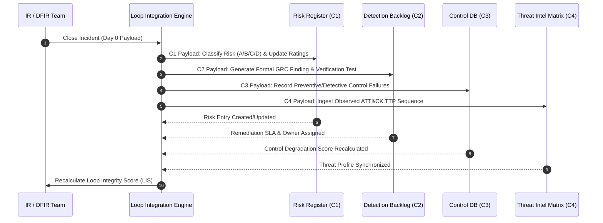
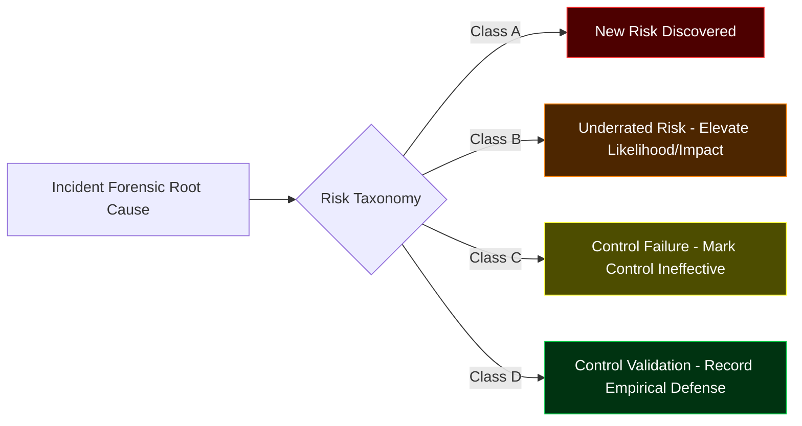
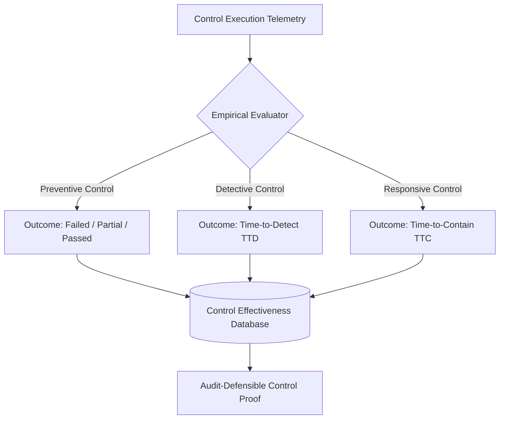
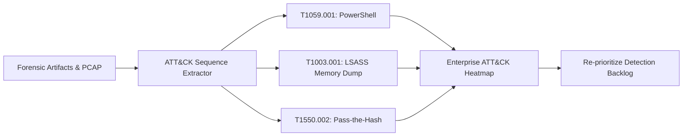
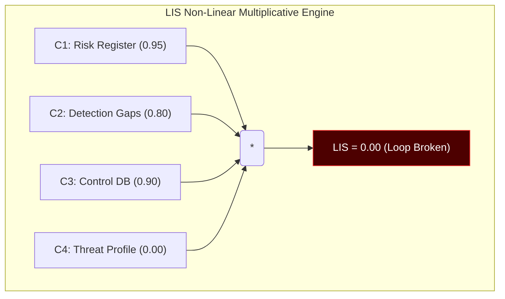
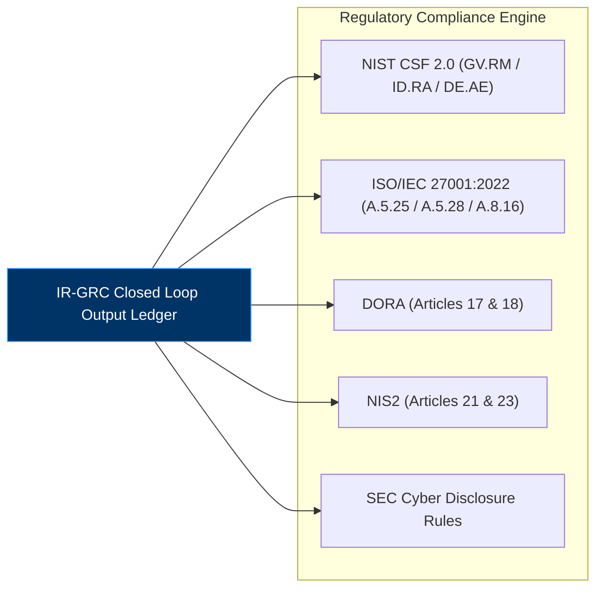
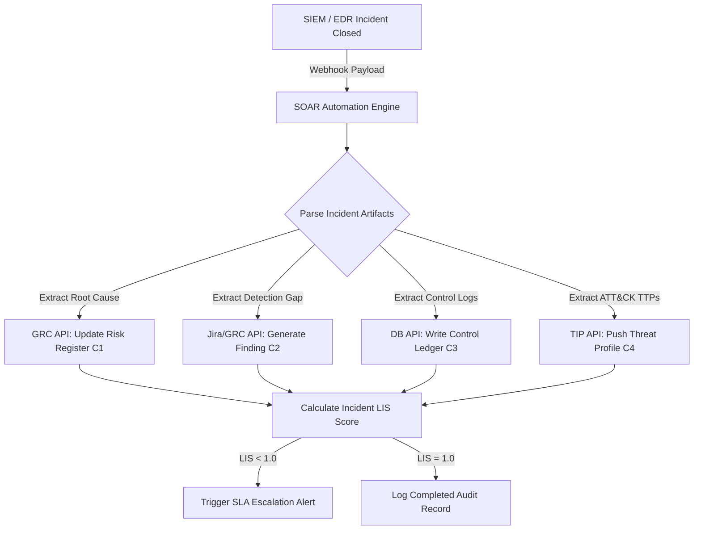

# The IR-GRC Closed Loop: How Incident Intelligence Flows Back Into the Exception Register Before the Next Attacker Arrives

**Author:** Manjil Katuwal  
**Date:** 15 September 2026  
**Series:** Paper 10 of 10 — The GRC Decay Research Program  
**Classification:** Open Research & Enterprise Architecture  
**Target Audience:** CISOs, GRC Principals, SOC Directors, DFIR Leads, Detection Engineers  

---

## Abstract

Across nine foundational papers, the GRC Decay Research Program established that signed risk exceptions decay into attacker-ready backdoors on a predictable schedule (**The Exception Decay Model**), that this decay is quantifiable in real time (**The Exception Decay Score**), and that security programs rot according to thermodynamic laws under alert-tuning pressure. What the research program has not addressed until now is the single most catastrophic structural vulnerability in modern enterprise defense: **the broken feedback loop between Incident Response (IR) and Governance, Risk, and Compliance (GRC).**

When a security incident breaches perimeter defenses—despite predictive metrics and telemetry—the high-fidelity forensic intelligence generated during Digital Forensics and Incident Response (DFIR) investigations remains trapped within operational silos. The GRC team never sees the forensic root cause, the risk register remains unadjusted, and identical exception failure modes are approved again the following quarter.

This paper introduces the **IR-GRC Closed Loop**: a formal, operational, four-channel enterprise architecture that converts raw incident intelligence into automated governance action. We formalize the **Loop Integrity Score ($LIS$)**, the industry's first non-linear quantitative metric designed to evaluate how effectively incident response feeds organizational risk management. We deliver production-grade SQL schemas, Splunk SPL/Microsoft Sentinel KQL telemetry queries, SOAR playbook automation specifications, and regulatory mapping matrices for **NIST CSF 2.0**, **ISO/IEC 27001:2022**, **DORA**, and **NIS2**. 

Closing this loop provides the highest operational leverage available to security leadership: *decay is the diagnosis; the loop is the cure.*

---

## 1. Introduction: The Diagnosis Without Treatment

The preceding nine papers in this research series established a unified diagnostic framework for enterprise security decay:

1. **GRC Failures Create SOC Blind Spots:** Risk acceptances, security control waivers, and scope exclusions remove critical infrastructure from monitoring, creating blind spots that adversaries systematically map and exploit.
2. **Identity-Centric Attack Surfaces Expand:** Enterprise migration to cloud identity providers (IDPs) turns forgotten federated trusts and unmonitored service principals into immediate domain-wide compromise paths.
3. **Forensics and Detection Engineering Provide Telemetry:** Modern DFIR techniques can map attacker behaviors to the MITRE ATT&CK framework with sub-second precision.
4. **Detection Logic Rot Under Tuning Pressure:** Alert suppression rules, noise-reduction heuristics, and neglected detection logic degrade coverage continuously over time.
5. **Entropy Governs Security Systems:** Without continuous energy input and telemetry reconciliation, security programs accumulate entropy at a rate proportional to operational complexity.
6. **Signed Exceptions Serve as Attacker Maps:** Documented risk acceptances represent an enterprise's explicit map of unmonitored and undefended terrain.
7. **Exceptions Rot on a Deterministic Schedule:** The Exception Lifecycle Decay Model (ELDM) proves that accepted risks rot through four distinct phases, reaching terminal control failure unless actively reconciled.

> [!IMPORTANT]
> **The Structural Paradox:** Traditional security management treats incident post-mortems as operational closure events. Investigation reports sit in shared folders while GRC teams conduct annual risk assessments using outdated assumptions. This structural isolation guarantees that every incident is repeated.

```mermaid
flowchart TD
    subgraph Traditional_Open_Loop["Traditional Open-Loop Architecture (Failure Mode)"]
        direction TB
        A1[Incident Occurs] --> A2[IR Team Investigates]
        A2 --> A3[Post-Mortem PDF Created]
        A3 --> A4[PDF Stored in Shared Drive]
        A4 -. Broken Link .-x A5[GRC Risk Register]
        A5 --> A6[Identical Risk Exception Signed]
        A6 --> A1
    end

    subgraph IR_GRC_Closed_Loop["The IR-GRC Closed Loop Architecture (Production State)"]
        direction TB
        B1[Incident Trigger] --> B2[DFIR Telemetry Extraction]
        B2 --> B3{4-Channel Closed Loop}
        B3 -->|Channel 1| C1[Risk Register Delta Engine]
        B3 -->|Channel 2| C2[Detection Gap GRC Finding]
        B3 -->|Channel 3| C3[Control Effectiveness DB]
        B3 -->|Channel 4| C4[Threat Profile Matrix Update]
        C1 & C2 & C3 & C4 --> B4[Automated Exception Revocation & Policy Uplift]
        B4 --> B5[Hardened Control Baseline]
    end

    style Traditional_Open_Loop stroke:#ff4d4d,stroke-width:2px,fill:#1a0000
    style IR_GRC_Closed_Loop stroke:#00cc66,stroke-width:2px,fill:#001a0d
```



---

## 2. The Structural Problem: Broken by Design

Security Operations Centers (SOC) and Governance, Risk, and Compliance (GRC) teams operate with opposing incentives, tools, and operational rhythms:

| Operational Dimension | Security Operations (SOC / IR) | Governance, Risk & Compliance (GRC) |
| :--- | :--- | :--- |
| **Primary Currency** | Telemetry, PCAP, LSASS dumps, IOCs, TTPs | Frameworks, Control Matrices, Audit Evidence |
| **Operational Cadence** | Seconds to Hours (MTTD / MTTR) | Quarterly to Annual (Audit Cycles) |
| **Tooling Ecosystem** | SIEM, EDR, SOAR, NDR, Threat Intel | GRC Platforms, Spreadsheets, Ticketing |
| **Target Audience** | Incident Commanders, SOC Analysts | Executive Board, Regulators, External Auditors |
| **Definition of Success** | Threat Eradication & System Restoration | Audit Compliance & Risk Acceptance Sign-off |

This structural gap creates severe operational liabilities under modern regulatory regimes:

* **Sub-Minute AI Attack Velocity vs. Quarterly Audits:** Automated exploitation pipelines execute initial access, privilege escalation, and lateral movement in minutes. A quarterly GRC audit cycle provides zero protection against real-time threat dynamics.
* **Compressing Regulatory Clocks:** **DORA (Article 17)** mandates initial major incident notification within 4 hours, while **NIS2 (Article 23)** requires an early warning within 24 hours. Compliance cannot be established retroactively using static documentation.
* **NIST SP 800-61 Rev. 3 Realignment:** Released in April 2025, NIST SP 800-61r3 explicitly integrates incident response with the **NIST CSF 2.0** core functions (*Govern, Identify, Protect, Detect, Respond, Recover*).

> [!WARNING]
> Regulatory frameworks mandate that incident lessons-learned feed directly into enterprise risk management. Without programmatic data pipelines between IR and GRC, organizations fail both audit requirements and operational defense.

---

## 3. The IR-GRC Closed Loop Architecture

The **IR-GRC Closed Loop** establishes four mandatory operational channels connecting incident intelligence directly to governance mechanics.



### The Four Operational Channels

```markdown
+---------------------------------------------------------------------------------------------------+
|                                 THE FOUR CLOSED-LOOP CHANNELS                                     |
+---------+-------------------------------+----------------------------------+----------------------+
| Channel | Incident Intelligence Source  | Governance Action Output         | SLA Completion Criteria|
+---------+-------------------------------+----------------------------------+----------------------+
|   C1    | Forensic Risk Root Cause      | Risk Register Entry / Delta      | Entry Created/Updated|
|   C2    | Missed Detection / Telemetry  | Formal GRC Finding & SLA         | Owner + Test Assigned|
|   C3    | Empirical Control Outcome     | Control Effectiveness DB Update  | Empirical Status Set |
|   C4    | Observed Attacker TTP Map     | Enterprise Threat Model Ingest   | ATT&CK Coverage Sync |
+---------+-------------------------------+----------------------------------+----------------------+
```

---

## 4. Channel 1: Risk Register Updates from Incidents

### 4.1 Classification Taxonomy
Every closed incident must update the corporate risk register through one of four explicit classifications:



* **Class A (Unmodeled Threat Vector):** The incident exploited a risk condition omitted from the register. *Action:* Provision a new Risk ID.
* **Class B (Underrated Exposure):** The incident exploited an existing risk whose assigned impact or likelihood was underrated. *Action:* Re-calculate residual risk rating immediately.
* **Class C (Ineffective Compensating Control):** The incident breached a control marked as "Effective". *Action:* Transition control status to `Ineffective - Forensic Evidence` and recalculate exception validity.
* **Class D (Empirical Control Validation):** Active controls successfully mitigated or contained the threat. *Action:* Log positive audit evidence.

### 4.2 Standardized Field Schema
```markdown
================================================================================
RISK REGISTER DELTA PAYLOAD - INCIDENT ID: [INC-2026-8841]
================================================================================
1. INCIDENT ABSTRACT: Adversary leveraged expired risk exception (EX-902) on 
   unmonitored legacy staging IDP to execute OAuth token replay attacks.
2. RISK CLASSIFICATION: Class C (Control Failure)
3. TARGET RISK ID: R-4410 (Identity Federation Controls)
4. PREVIOUS STATUS: Likelihood=Low (2), Impact=High (4), Control=Effective
5. UPDATED STATUS:  Likelihood=High (5), Impact=Critical (5), Control=Ineffective
6. FORENSIC EVIDENCE: Incident #8841 (lsass_dump_hash: a7f8b9...)
7. ACCOUNTABLE RISK OWNER: Jane Doe (VP, Enterprise Infrastructure)
8. MANDATORY REVIEW SLA: 14 Days (Hard Target: 2026-09-29)
================================================================================
```

### 4.3 Database Delta Query
```sql
-- Production GRC Schema: Execute Risk Register Delta Update
UPDATE grc_risk_register
SET 
    risk_likelihood = 5,
    risk_impact = 5,
    control_status = 'INEFFECTIVE_FORENSIC_EVIDENCE',
    last_incident_evidence_id = 'INC-2026-8841',
    updated_at = CURRENT_TIMESTAMP,
    next_review_deadline = CURRENT_TIMESTAMP + INTERVAL '14 days'
WHERE risk_id = 'R-4410';

INSERT INTO grc_risk_audit_log (risk_id, incident_id, classification, change_summary, actor)
VALUES ('R-4410', 'INC-2026-8841', 'CLASS_C', 'Control marked ineffective following OAuth token replay incident.', 'ir-closed-loop-soar');
```

---

## 5. Channel 2: Detection Gap Documentation & Engineering Feedback

Every missed detection identified during post-incident analysis represents a governance breakdown.

### 5.1 Root Cause Categorization
Detection failures are categorized into four root causes:
1. **Logging Gap ($G_{log}$):** Telemetry source was not configured, ingested, or retained.
2. **Rule Rot ($G_{rot}$):** Logic existed but failed to alert due to schema drift or environment changes.
3. **Rule Suppression ($G_{supp}$):** Logic fired internally but was silenced by an approved exception or alert-tuning rule.
4. **Rule Absence ($G_{abs}$):** No detection logic had ever been engineered for the ATT&CK technique.

### 5.2 Telemetry Ingestion & Gap Detection Queries

#### Microsoft Sentinel KQL: Detection Coverage & Gap Identification
```kql
// Identify telemetry sources active during incident timeline with zero alert triggers
let IncidentStart = datetime(2026-09-14T08:00:00Z);
let IncidentEnd = datetime(2026-09-14T18:00:00Z);
let AffectedHost = "srv-db-prod-01.internal";
SecurityEvent
| where TimeGenerated between (IncidentStart .. IncidentEnd)
| where Computer == AffectedHost
| summarize EventCount = count() by EventID, Activity
| join kind=leftouter (
    SecurityAlert
    | where TimeGenerated between (IncidentStart .. IncidentEnd)
    | extend HostName = tostring(parse_json(Entities)[0].HostName)
    | where HostName == AffectedHost
    | summarize AlertCount = count() by ProviderName
) on $left.Activity == $right.ProviderName
| where isnull(AlertCount)
| project EventID, Activity, EventCount, GapType = "Rule Absence or Suppression"
```

#### Splunk SPL: Unmonitored Technique Identification
```splunk
index=security sourcetype="WinEventLog:Security" host="srv-db-prod-01.internal" EventCode=4688
| eval TechniqueID="T1059.001"
| lookup security_detections_lookup technique_id AS TechniqueID OUTPUT rule_id, rule_status
| where isnull(rule_id) OR rule_status="disabled" OR rule_status="suppressed"
| stats count by host, Image, CommandLine, TechniqueID, rule_status
| eval GapCategory=if(isnull(rule_id), "Rule Absence", "Rule Suppression")
```

---

## 6. Channel 3: Empirical Control Effectiveness Database

Channel 3 replaces static control self-assessments with an empirical performance database derived directly from incident response findings.



### PostgreSQL Control Effectiveness Schema
```sql
CREATE TABLE IF NOT EXISTS grc_control_effectiveness_ledger (
    entry_id UUID PRIMARY KEY DEFAULT gen_random_uuid(),
    incident_id VARCHAR(64) NOT NULL,
    control_id VARCHAR(64) NOT NULL,
    control_type VARCHAR(32) CHECK (control_type IN ('PREVENTIVE', 'DETECTIVE', 'RESPONSIVE')),
    expected_outcome TEXT NOT NULL,
    actual_outcome VARCHAR(32) CHECK (actual_outcome IN ('PASSED', 'PARTIALLY_PREVENTED', 'FAILED')),
    time_to_detection_sec INT,
    time_to_containment_sec INT,
    root_cause_domain VARCHAR(32) CHECK (root_cause_domain IN ('GOVERNANCE', 'TECHNICAL', 'OPERATIONAL')),
    forensic_evidence_hash VARCHAR(128),
    recorded_at TIMESTAMP WITH TIME ZONE DEFAULT CURRENT_TIMESTAMP
);
```

---

## 7. Channel 4: Dynamic Threat Profile Updates

Internal incidents provide high-fidelity threat intelligence unique to the organization's infrastructure.



### Python Automation Script: MITRE ATT&CK Coverage Gap Identification
```python
#!/usr/bin/env python3
"""
Channel 4: MITRE ATT&CK Ingestion & Gap Extractor
Calculates coverage gaps between observed incident techniques and SIEM detection rule inventory.
"""

import json

def calculate_attack_gap(observed_ttps: list, active_detections: dict) -> dict:
    gap_report = {"covered": [], "gaps": []}
    for ttp in observed_ttps:
        ttp_id = ttp["id"]
        if ttp_id in active_detections and active_detections[ttp_id]["enabled"]:
            gap_report["covered"].append({
                "ttp": ttp_id,
                "rule_id": active_detections[ttp_id]["rule_id"]
            })
        else:
            gap_report["gaps"].append({
                "ttp": ttp_id,
                "name": ttp["name"],
                "status": active_detections.get(ttp_id, {}).get("status", "NO_RULE")
            })
    return gap_report

if __name__ == "__main__":
    incident_ttps = [
        {"id": "T1059.001", "name": "PowerShell"},
        {"id": "T1003.001", "name": "LSASS Memory Dump"},
        {"id": "T1550.002", "name": "Pass-the-Hash"}
    ]
    detections = {
        "T1059.001": {"rule_id": "DET-101", "enabled": True, "status": "ACTIVE"},
        "T1550.002": {"rule_id": "DET-882", "enabled": False, "status": "SUPPRESSED_BY_EXCEPTION"}
    }
    
    output = calculate_attack_gap(incident_ttps, detections)
    print(json.dumps(output, indent=2))
```

---

## 8. The Loop Integrity Score (LIS): Mathematical Foundations

Existing compliance benchmarks rely on additive scoring models ($Score = \sum w_i C_i$), which allow strong documentation to mask complete operational failure in technical channels. The **Loop Integrity Score ($LIS$)** enforces a non-linear, multiplicative model.

### 8.1 Core Formula
For a given measurement window containing $N$ closed security incidents:

$$LIS = \frac{\prod_{i=1}^{4} C_i}{N}$$

Where:
* $C_1 =$ Fraction of incidents resulting in a completed Risk Register Delta.
* $C_2 =$ Fraction of incidents resulting in a documented Detection Gap Finding with assigned owner, SLA, and verification test.
* $C_3 =$ Fraction of incidents logged in the Empirical Control Effectiveness Database.
* $C_4 =$ Fraction of incidents resulting in updated MITRE ATT&CK Enterprise Threat Profiles.

> [!NOTE]
> **The Multiplicative Property:** Because the channels are multiplied rather than added, if any single channel is neglected ($C_i = 0$), the overall Loop Integrity Score collapses to zero:
> $$\text{If } \exists \, C_i = 0 \implies LIS = 0$$
> This eliminates the illusion of compliance produced by paperwork-heavy GRC programs.



### 8.2 Sensitivity & Mathematical Proof
Let the overall integrity score be expressed as $LIS(C_1, C_2, C_3, C_4)$. The marginal impact of improving channel $C_k$ is given by the partial derivative:

$$\frac{\partial LIS}{\partial C_k} = \frac{1}{N} \prod_{j \neq k} C_j$$

This proves that investment yields the highest returns when directed toward the organization's weakest channel.

### 8.3 Relationship with Exception Decay Score ($EDS$)
The rate of exception decay ($\lambda_{decay}$) introduced in Paper 9 is inversely proportional to the Loop Integrity Score:

$$\lambda_{decay} = \lambda_0 \cdot \left(1 - LIS\right) + \epsilon$$

When $LIS \to 1.0$, exception decay approaches the baseline entropy limit ($\epsilon$). When $LIS \to 0$, exception decay accelerates exponentially.

### 8.4 LIS Evaluation Scale

| Score Range | Operational Status | Diagnostic Assessment |
| :--- | :--- | :--- |
| **$1.00$** | **Closed Loop (Optimal)** | Every incident updates risk, detection, control, and threat models. |
| **$0.75 - 0.99$** | **Operational with Gaps** | Telemetry flows consistently; minor latency in ticket verification. |
| **$0.50 - 0.74$** | **Partially Broken** | Governance records updated selectively; detection gaps neglected. |
| **$0.25 - 0.49$** | **Severely Degraded** | Information trapped in SOC post-mortems; GRC relies on assumptions. |
| **$< 0.25$** | **Open Loop (Failure Mode)** | Incidents treated as isolated operational events. Zero GRC feedback. |

---

## 9. Implementation: The 5-Day Protocol & Governance SLA

```mermaid
gantt
    title 5-Day Closed Loop Protocol SLA Execution
    dateFormat  YYYY-MM-DD
    section Incident Lifecycle
    Incident Containment & Closure :done, day0, 2026-09-01, 1d
    section Protocol SLAs
    Day 1: C1 Risk Register Delta   :active, day1, 2026-09-02, 1d
    Day 2: C2 Detection Gap Log    :day2, 2026-09-03, 1d
    Day 3: C3 Control DB Entry     :day3, 2026-09-04, 1d
    Day 4: C4 Threat Profile Sync  :day4, 2026-09-05, 1d
    Day 5: Verification & LIS Sign-off :day5, 2026-09-06, 1d
```

### 9.1 RACI Governance Matrix

| Operational Role | C1: Risk Register Delta | C2: Detection Gap Finding | C3: Control DB Entry | C4: Threat Profile Sync | LIS Sign-off |
| :--- | :---: | :---: | :---: | :---: | :---: |
| **CISO** | I | I | I | I | **A** |
| **IR-GRC Liaison** | **A** / R | C | C | C | R |
| **GRC Risk Officer** | R | I | R | I | C |
| **SOC Manager / IR Lead** | C | **A** / R | **A** / R | C | I |
| **Detection Engineer** | I | R | C | C | I |
| **Threat Intel Analyst** | I | I | I | **A** / R | I |

*Legend: **A** = Accountable | **R** = Responsible | **C** = Consulted | **I** = Informed*

### 9.2 Tiered SLA Protocols by Severity

```markdown
+---------------------------------------------------------------------------------------------------+
|                                TIERED INCIDENT SLA PROTOCOLS                                      |
+------------------+---------------------+---------------------+------------------+-----------------+
| Severity Tier    | Channel 1 (Risk)    | Channel 2 (Detect)  | Channel 3 (Ctrl) | Channel 4 (Intel)|
+------------------+---------------------+---------------------+------------------+-----------------+
| P1 - Critical    | Full Delta (24h)    | Full Finding (48h)  | Full DB (72h)    | Full Sync (96h) |
| P2 - High        | Full Delta (48h)    | Full Finding (72h)  | Full DB (96h)    | Summary (120h)  |
| P3 - Medium      | Summary (72h)       | Delta Rule (120h)   | Standard (120h)  | TTP Log (120h)  |
| P4 - Low         | Class D Log (120h)  | Optional            | Optional         | Optional        |
+------------------+---------------------+---------------------+------------------+-----------------+
```

---

## 10. Regulatory Alignment & Audit Defense Engine

The IR-GRC Closed Loop provides direct traceability across major regulatory frameworks:



### Framework Mapping Matrix

| Framework | Specific Clause / Requirement | Mapped Closed-Loop Channel | Audit Evidence Provided |
| :--- | :--- | :--- | :--- |
| **NIST CSF 2.0** | **GV.RM-04:** Risk responses are informed by operational outcomes.<br>**DE.AE-07:** Threat intelligence is integrated. | **C1, C4** | Timestamps showing risk register updates derived from post-incident analyses. |
| **ISO/IEC 27001:2022** | **Annex A 5.28:** Evidence collection.<br>**Annex A 8.16:** Monitoring activities. | **C2, C3** | Forensic evidence logs attached directly to control performance entries. |
| **DORA (EU 2022/2554)** | **Article 17(3)(e):** Post-incident analysis & governance feedback.<br>**Article 18:** Reporting. | **C1, C2, C3** | LIS execution verification attached to regulatory major incident filings. |
| **NIS2 (EU 2022/2555)** | **Article 21(2)(d):** Supply chain & incident handling hygiene.<br>**Article 23:** Notification. | **C2, C4** | Automated root cause tracking for recurring vendor and infrastructure gaps. |
| **COBIT 2019** | **APO12.06:** Risk response execution.<br>**MEA02.04:** Control effectiveness monitoring. | **C1, C3** | Longitudinal trend lines tracking control failure rates across incidents. |

---

## 11. Enterprise Automation & AI Integration

Manual data transfer introduces latency and human error. Enterprise implementation requires automated pipelines between SIEM/SOAR platforms and the GRC system.



### Production SOAR Automation Payload (JSON Schema)
```json
{
  "$schema": "https://json-schema.org/draft/2020-12/schema",
  "title": "IRGRCCalculatorPayload",
  "type": "object",
  "properties": {
    "incident_id": { "type": "string", "example": "INC-2026-8841" },
    "severity": { "type": "string", "enum": ["CRITICAL", "HIGH", "MEDIUM", "LOW"] },
    "closed_at": { "type": "string", "format": "date-time" },
    "channel_completion": {
      "type": "object",
      "properties": {
        "c1_risk_register_updated": { "type": "boolean" },
        "c2_detection_gap_logged": { "type": "boolean" },
        "c3_control_effectiveness_logged": { "type": "boolean" },
        "c4_threat_profile_updated": { "type": "boolean" }
      },
      "required": ["c1_risk_register_updated", "c2_detection_gap_logged", "c3_control_effectiveness_logged", "c4_threat_profile_updated"]
    },
    "mitre_ttps": {
      "type": "array",
      "items": { "type": "string" },
      "example": ["T1059.001", "T1003.001", "T1550.002"]
    }
  },
  "required": ["incident_id", "severity", "closed_at", "channel_completion", "mitre_ttps"]
}
```

---

## 12. Real-World Enterprise Case Studies

### 12.1 Financial Services Firm: Ransomware via Forgotten Service Principal
* **Background:** A multinational bank suffered a localized ransomware deployment targeting database clusters. The attack leveraged a service principal created under a risk exception two years prior.
* **The Open-Loop Failure:** The incident post-mortem identified the service principal, but the exception was left active in the GRC system. Nine months later, another adversary exploited the same credential.
* **Closed-Loop Implementation:** The organization deployed the 5-Day Protocol:
  * **C1:** Risk R-8812 marked *Critical/Ineffective*.
  * **C2:** Detection gap finding assigned to IAM team; forced certificate rotation script implemented.
  * **C3:** Control C-102 (Service Account Lifecycle) marked *Failed*.
  * **C4:** T1078.004 mapped to active detection backlog.
* **Outcome:** Baseline $LIS$ improved from $0.08$ to $0.92$ over two quarters; zero repeat incidents across identity risk exceptions.

### 12.2 Healthcare Provider: Unmonitored Subnet Data Exfiltration
* **Background:** An enterprise healthcare network experienced exfiltration of 450,000 patient records from a legacy imaging subnet.
* **Closed-Loop Implementation:**
  * **C1:** Class A risk logged for unmonitored legacy medical subnets.
  * **C2:** Logging gap ($G_{log}$) documented; network tap infrastructure deployed within 14 days.
  * **C3:** EDR preventive control logged as *Failed* due to OS incompatibility.
  * **C4:** Exfiltration technique (T1048.003) added to continuous threat hunting playbooks.
* **Outcome:** The organization successfully defended its NIS2 compliance filing using the resulting empirical evidence logs.

---

## 13. Conclusion: The Loop is the Choice

Across ten papers, the GRC Decay Research Program has demonstrated that security controls decay, risk exceptions rot, and system entropy naturally expands. 

Organizations cannot eliminate risk exceptions; modern business requires calculated risk-taking. However, enterprises can choose whether incident intelligence updates governance controls or vanishes into operational silos.

```markdown
+---------------------------------------------------------------------------------------------------+
|                                12-MONTH LIS ACCELERATION ROADMAP                                  |
+----------+-------------------------------------------------------------+--------------------------+
| Quarter  | Strategic Milestone                                         | Target LIS Benchmark     |
+----------+-------------------------------------------------------------+--------------------------+
| Q1 2027  | Establish IR-GRC Liaison role & baseline historical LIS     | LIS >= 0.30              |
| Q2 2027  | Automate Channel 1 (Risk) & Channel 2 (Detect) via SOAR     | LIS >= 0.60              |
| Q3 2027  | Deploy PostgreSQL Control Database & ATT&CK Gap Extractor   | LIS >= 0.80              |
| Q4 2027  | Achieve full 5-Day SLA integration across all incident tiers| LIS >= 0.95              |
+----------+-------------------------------------------------------------+--------------------------+
```

### Core Program Axioms

> "Exceptions do not fail randomly; they decay deterministically."

> "Unmeasured decay guarantees recurring compromise."

> "The loop is the choice: measure it, close it, run it—or inherit the next breach."

---

## Appendix A: LIS Extended Calculation Worksheet

```markdown
================================================================================
LOOP INTEGRITY SCORE (LIS) - QUARTERLY AUDIT WORKSHEET
================================================================================
Audit Window: [2026-Q3]  | Total Closed Incidents (N): [ 12 ]
--------------------------------------------------------------------------------
CHANNEL 1: RISK REGISTER DELTAS
- Incidents with completed C1 Delta (n1): [ 11 ]
- C1 Metric (n1 / N): [ 0.9167 ]

CHANNEL 2: DETECTION GAP FINDINGS
- Incidents with documented C2 Gap Finding & Verification Test (n2): [ 10 ]
- C2 Metric (n2 / N): [ 0.8333 ]

CHANNEL 3: CONTROL EFFECTIVENESS LEDGER
- Incidents logged in Empirical Control DB (n3): [ 9 ]
- C3 Metric (n3 / N): [ 0.7500 ]

CHANNEL 4: THREAT PROFILE UPDATES
- Incidents with MITRE ATT&CK Sync (n4): [ 12 ]
- C4 Metric (n4 / N): [ 1.0000 ]
--------------------------------------------------------------------------------
COMPOSITE SCORE CALCULATION:
LIS = (C1 * C2 * C3 * C4)
LIS = (0.9167 * 0.8333 * 0.7500 * 1.0000)
FINAL LIS SCORE: 0.5729  [ STATUS: PARTIALLY BROKEN - ACTION REQUIRED ]
================================================================================
```

---

## Appendix B: Comprehensive Framework Cross-Reference Matrix

```markdown
+---------------------------------------------------------------------------------------------------+
|                               FRAMEWORK MAPPING MASTER MATRIX                                     |
+---------------------+-------------------------------+-----------------+---------------------------+
| Governance Standard | Requirement ID                | Loop Channel    | Implementation Mechanism  |
+---------------------+-------------------------------+-----------------+---------------------------+
| NIST CSF 2.0        | GV.RM-02, GV.RM-04            | Channel 1       | Risk Register Delta       |
| NIST CSF 2.0        | DE.AE-03, DE.AE-07            | Channel 2, 4    | KQL/SPL Gap Query Pack    |
| ISO/IEC 27001:2022  | Clause 6.1.2, 10.1            | Channel 1       | Continuous Improvement    |
| ISO/IEC 27001:2022  | Annex A 5.25, 5.28, 8.16      | Channel 2, 3    | Control Ledger Evidence   |
| DORA (EU 2022/2554) | Article 17, Article 18        | All Channels     | 5-Day SLA Protocol        |
| NIS2 (EU 2022/2555) | Article 21, Article 23        | Channel 2, 3    | Telemetry Gap Audit       |
| COBIT 2019          | APO12.06, MEA02.04            | Channel 1, 3    | Empirical Control DB      |
+---------------------+-------------------------------+-----------------+---------------------------+
```

---

## Appendix C: Industry References & Standards

1. **NIST.** (2025). *SP 800-61 Rev. 3: Incident Response Recommendations and Considerations for Cybersecurity Risk Management*. National Institute of Standards and Technology.
2. **NIST.** (2024). *The NIST Cybersecurity Framework 2.0 (CSF 2.0)*. National Institute of Standards and Technology.
3. **European Parliament & Council.** (2022). *Digital Operational Resilience Act (DORA) - Regulation (EU) 2022/2554*.
4. **European Parliament & Council.** (2022). *Directive on measures for a high common level of cybersecurity across the Union (NIS2 Directive) - Directive (EU) 2022/2555*.
5. **ISO/IEC.** (2022). *ISO/IEC 27001:2022 Information security, cybersecurity and privacy protection — Information security management systems — Requirements*.
6. **Cisco Talos.** (2026). *Operationalizing Incident Response Telemetry: Closing the Feedback Loop*.
7. **Rapid7.** (2026). *Cyber GRC & Security Operations Convergence Report*.
8. **MITRE.** (2026). *MITRE ATT&CK Enterprise Matrix v15*.

---

**Correspondence:** katuwalmanjil609@gmail.com  
**Publication Date:** 15 September 2026  
**License:** Creative Commons Attribution-ShareAlike 4.0 International (CC BY-SA 4.0)
