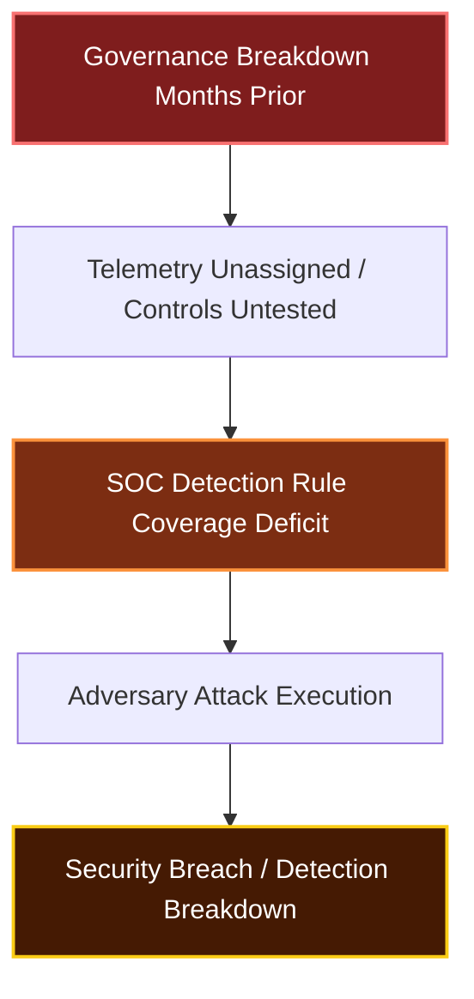
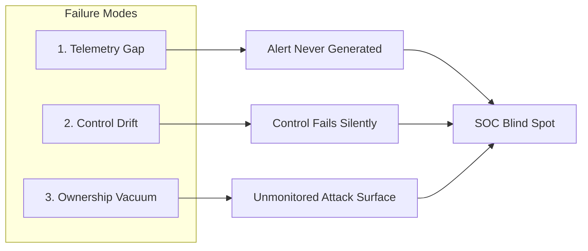
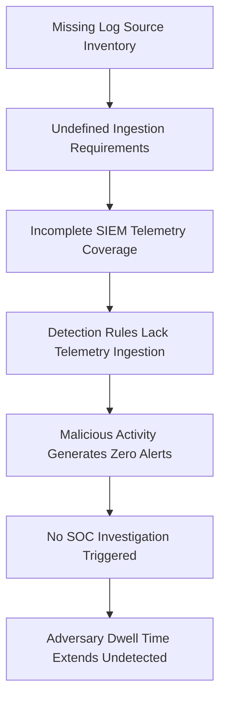
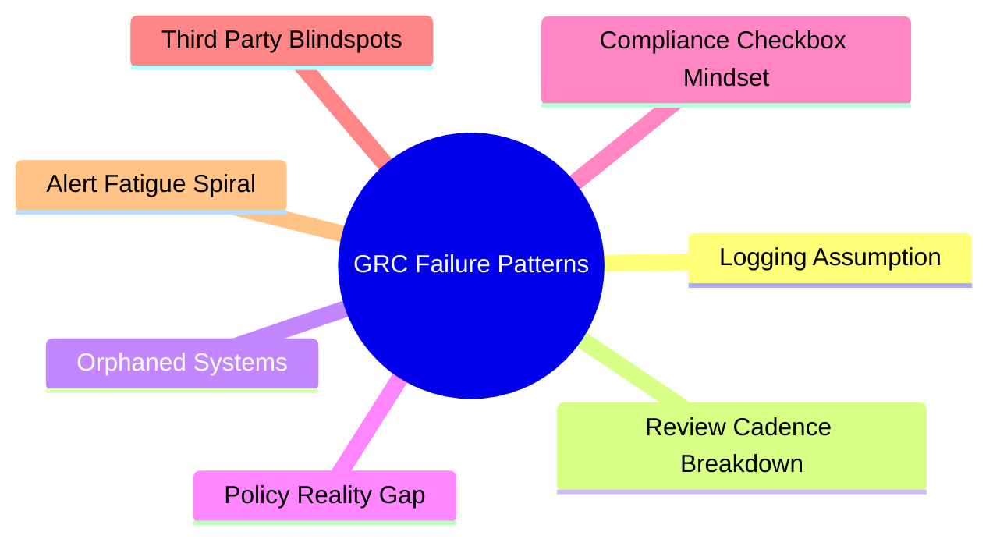
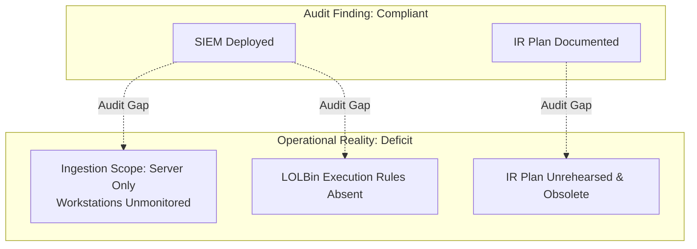
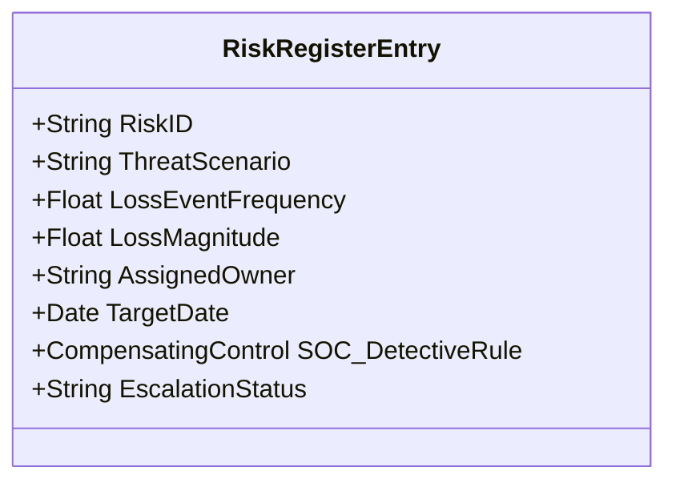
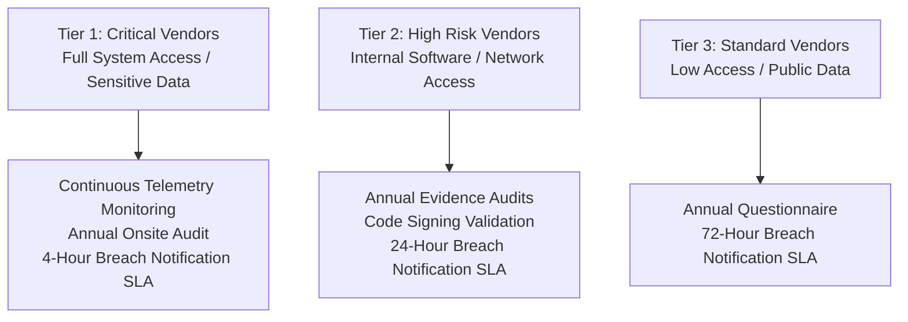
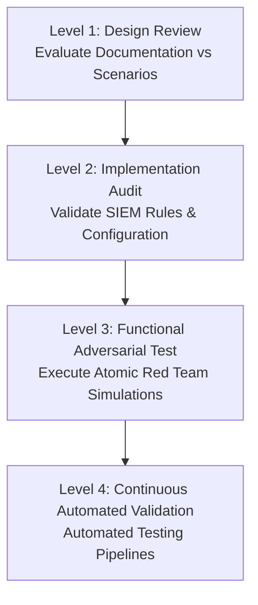
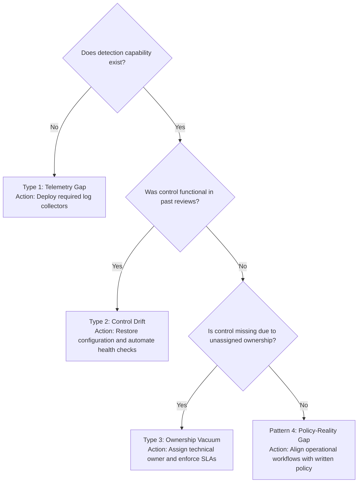

# When Governance Fails First: How GRC Breakdowns Create SOC Blind Spots

**Series:** SOC + GRC Advanced Attack Chain Research 
**Topic:** GRC-Primary Analysis – Security Operations Center (SOC) Failure as a Consequence  
**Date:** 2026-08-20  
**Target Audience:** SOC Managers, GRC Leads, Detection Engineers, Security Architects  

---

> [!IMPORTANT]
> **Key Takeaway:** Traditional breach investigations analyze the technical attack vector first and work backward to locate governance root causes. This research flips that paradigm: it evaluates how governance breakdowns occur first, creating structural blind spots that render SOC detection impossible.
>
> When a breach occurs, the primary root cause is rarely that the SOC missed an alert; rather, the alert never fired because governance failures prevented telemetry ingestion, control validation, or asset tracking.

---

## Table of Contents

1. [The Operational Reality of GRC in Security Operations](#1-the-operational-reality-of-grc-in-security-operations)
2. [The Core Thesis: Pre-Failure as the Primary Root Cause](#2-the-core-thesis-pre-failure-as-the-primary-root-cause)
3. [The Three Failure Modes That Eliminate Detection](#3-the-three-failure-modes-that-eliminate-detection)
4. [Framework Deep Dive: Requirements vs. Operational Gaps](#4-framework-deep-dive-requirements-vs-operational-gaps)
5. [The Seven GRC Failure Patterns in Enterprise Breaches](#5-the-seven-grc-failure-patterns-in-enterprise-breaches)
6. [Case Study 1: Logging Gaps and ADCS ESC1 Exploitation](#6-case-study-1-logging-gaps-and-adcs-esc1-exploitation)
7. [Case Study 2: Static Review Cadence vs. Evolving Attack Surfaces](#7-case-study-2-static-review-cadence-vs-evolving-attack-surfaces)
8. [Case Study 3: Compliance Theater vs. Operational Security](#8-case-study-3-compliance-theater-vs-operational-security)
9. [Case Study 4: Risk Register Management Failures](#9-case-study-4-risk-register-management-failures)
10. [Case Study 5: Third-Party Trust and Supply Chain Vulnerabilities](#10-case-study-5-third-party-trust-and-supply-chain-vulnerabilities)
11. [Bi-Directional SOC-GRC Operational Integration](#11-bi-directional-soc-grc-operational-integration)
12. [Engineering High-Impact GRC Findings](#12-engineering-high-impact-grc-findings)
13. [Adversarial Control Effectiveness Testing Methodology](#13-adversarial-control-effectiveness-testing-methodology)
14. [Automated GRC Blind Spot Detection Rules](#14-automated-grc-blind-spot-detection-rules)
15. [The 90-Day GRC Operational Review Checklist](#15-the-90-day-grc-operational-review-checklist)
16. [Quick Reference: GRC Master Guide](#16-quick-reference-grc-master-guide)
17. [Architectural Closing Synthesis](#17-architectural-closing-synthesis)

---

## 1. The Operational Reality of GRC in Security Operations

### Theoretical Definitions vs. Operational Realities

Standard security frameworks define Governance, Risk, and Compliance (GRC) using abstract academic language:

| Pillar | Academic Definition | Security Operations Operational Reality |
| :--- | :--- | :--- |
| **Governance** | Decision-making structures and accountability frameworks. | Ownership, review cadences, and execution authority for technical controls. |
| **Risk** | Threat identification, assessment, and risk treatment planning. | Documented threat tracking, owner assignment, quarterly updates, and detective control alignment. |
| **Compliance** | Verification of adherence to laws, regulations, and security policies. | Ongoing empirical measurement and operational validation of control performance. |

While academic definitions fulfill audit criteria, they fail to explain why well-funded enterprise SOCs continue to miss adversary activity.

### The SOC Analyst Perspective

For a SOC analyst actively investigating an incident, GRC represents concrete operational boundaries:

* **Governance:** Identifies who owns a security control, who conducts configuration reviews, and who possesses the technical authority to enforce baseline changes. If control ownership defaults to generic entities (such as "IT Operations"), governance has failed.
* **Risk:** Confirms whether an identified vulnerability has been logged, assigned a named technical owner, subjected to quarterly evaluation, and paired with active SIEM alerts. If a risk register remains unmodified between audits, risk management has failed.
* **Compliance:** Measures whether deployed security controls function continuously under real-world conditions. If control effectiveness is evaluated solely during annual audits, compliance assurance has failed.

### The Diagnostic Question

Incident responders frequently focus on immediate technical mechanics: initial access vectors, lateral movement mechanisms, and command-and-control infrastructure. However, preventing systemic recurrence requires answering a fundamental governance question:

> *Which specific governance breakdown rendered this attack path possible and structurally undetectable by the SOC?*

In major security incidents, root causes trace back to governance failures that predated adversary initial access by months or years.

---

## 2. The Core Thesis: Pre-Failure as the Primary Root Cause

### Understanding the Pre-Failure Concept

An adversary compromise is rarely the initial point of failure; it is the downstream consequence of pre-existing governance breakdowns.



Pre-failure occurs long before adversary access:
1. Security logging requirements were never formally specified for a new platform.
2. System review checklists omitted modern Active Directory attack vectors.
3. Asset security ownership was never designated following corporate restructuring.
4. Identified technical risks lacked assigned remediation engineering resources.
5. Decommissioning procedures failed to revoke legacy Kerberos delegations or certificate templates.

The breach simply exposes baseline vulnerabilities that already existed.

---

## 3. The Three Failure Modes That Eliminate Detection



### Mode 1: The Telemetry Gap

* **Operational Manifestation:** Organizational policy dictates that critical systems must ingest logs into the SIEM. Audits confirm SIEM operational status. However, forensic analysis reveals the compromised asset never forwarded telemetry to the centralized collector.
* **Underlying Root Causes:**
  * Logging configurations were applied once during initial deployment without operational health monitoring.
  * Assets were commissioned without security team notification or automated discovery.
  * System criticality definitions remained ambiguous across operations and security teams.
  * Silent log sources generated no operational alerts when ingestion stopped.
* **Failure Cascade:**



---

### Mode 2: The Control Drift

* **Operational Manifestation:** A security control is properly implemented and validated during an initial security evaluation. Over time, environmental changes occur (such as application deprecation, architecture updates, or policy adjustments), causing the control to degrade silently.
* **Decommissioning Gap Analysis:**

```
2019: Application deployed with Unconstrained Kerberos Delegation.
      -> Technical justification documented; temporary exception granted.

2021: Application decommissioned.
      -> Ticket executed: "Server decommissioned and VM destroyed."
      -> Security review: None performed (Decommission workflow lacked security sign-off).
      -> Active Directory Object: Delegation attribute remained configured.

2022-2025: Unconstrained Delegation configuration remained active and unmonitored.
      -> Omitted from quarterly compliance review checklists.
      -> Asset context lost to operations team.

2026: Adversary conducts LDAP recon -> Identifies Delegation -> Captures TGT -> Escalates to Domain Admin.
```

The control drift created an exploitable attack path that persisted for over five years because system decommissioning did not mandate security configuration cleanup.

---

### Mode 3: The Ownership Vacuum

* **Operational Manifestation:** Systems or services operate within the environment without assigned security owners. These assets often originate from deprecated projects, legacy acquisitions, or unmanaged third-party integrations.
* **Operational Risks:**
  * Patch management pipelines bypass unowned systems.
  * SIEM log ingestion definitions exclude uncataloged endpoints.
  * Vulnerability scanners miss unassigned IP ranges or cloud tenants.
  * Legacy services (such as Print Spooler or SMBv1) remain active on unmanaged infrastructure.
* **Diagnostic Indicators:** When identifying asset ownership, responses such as *"IT Ops manages it generically"* or *"Ownership is shared across infrastructure"* indicate an active ownership vacuum.

---

## 4. Framework Deep Dive: Requirements vs. Operational Gaps

### NIST Cybersecurity Framework (CSF) 2.0

#### DETECT (DE) Function

| Subcategory | Standard Requirement | Operational GRC Deficit |
| :--- | :--- | :--- |
| **DE.CM-01** | Networks and assets are monitored to identify anomalous events. | Requires a verified inventory of baseline behavior. Without defined baselines, anomaly detection rules fail. |
| **DE.CM-03** | Personnel activity is monitored to identify potential internal/external threats. | Requires granular user behavior telemetry. If endpoint process creation or authentication logs are omitted, user monitoring is ineffective. |
| **DE.CM-07** | Unauthorized assets, software, and services are detected. | Requires an accurate asset registry. The SOC cannot identify unauthorized assets if authorized assets are unmapped. |
| **DE.AE-02** | Detected events are analyzed to understand contextual impact. | Requires business context mapping. Without asset classification data, SOC analysts cannot accurately prioritize security alerts. |

#### GOVERN (GV) Function

| Subcategory | Standard Requirement | Operational GRC Deficit |
| :--- | :--- | :--- |
| **GV.RM-02** | Risk management priorities are established by organizational leadership. | Without leadership-defined risk tolerance thresholds, security operations cannot establish alert severity baselines. |
| **GV.RM-04** | Strategic decisions are informed by integrated risk assessment findings. | If risk register findings do not inform engineering roadmaps, risk assessments become static audit documentation. |
| **GV.SC-01** | Cyber supply chain risk management processes are defined and executed. | Third-party risk management must enforce continuous technical verification rather than static onboarding questionnaires. |

---

### ISO 27001:2022 Controls Analysis

* **A.8.15 – Logging:** Requires event logs to be produced, stored, protected, and analyzed.
  * *Operational Deficit:* Organizations document SIEM deployment to satisfy audit criteria while failing to monitor whether critical log streams disconnect silently.
* **A.8.16 – Monitoring Activities:** Mandates network, system, and application behavior monitoring for anomalous patterns.
  * *Operational Deficit:* Monitoring configurations default to out-of-the-box SIEM rules rather than adversary techniques mapped to organizational threat models.
* **A.8.8 – Management of Technical Vulnerabilities:** Requires timely identification, evaluation, and remediation of technical vulnerabilities.
  * *Operational Deficit:* Vulnerability scanning reports accumulate without binding remediation SLAs or engineering resource allocation.
* **A.8.7 – Protection Against Malware:** Requires deployment of anti-malware and Endpoint Detection and Response (EDR) solutions.
  * *Operational Deficit:* EDR agents are deployed, but alert queues are left unmonitored or unhandled due to operational alert fatigue.

---

### CIS Controls v8 Alignment

#### CIS Control 8: Audit Log Management

| Safeguard | Description | Practical Implementation Barrier |
| :--- | :--- | :--- |
| **8.2** | Collect Audit Logs | Telemetry is collected from central network devices while domain controllers and PKI systems are omitted. |
| **8.6** | Collect DNS Query Logs | High log volume leads organizations to disable DNS logging, eliminating command-and-control (C2) detection capabilities. |
| **8.9** | Centralize Audit Logs | Audit logs remain isolated on local endpoint disks rather than ingesting into a centralized SIEM pipeline. |
| **8.11** | Conduct Audit Log Reviews | Log ingestion occurs without active automated detection logic or manual analytical reviews. |

---

### SOC 2 Trust Services Criteria Realities

* **CC6.1 & CC6.3 (Access Controls):** Require logical access restrictions and Role-Based Access Control (RBAC).
  * *Operational Deficit:* RBAC roles are established during initial deployment but legacy access rights are rarely audited or revoked during personnel role changes.
* **CC7.1 & CC7.2 (System Operations & Monitoring):** Require configuration tracking and anomaly detection.
  * *Operational Deficit:* Audits confirm monitoring software presence, but fail to validate rule coverage against modern post-exploitation frameworks.

> [!NOTE]
> **SOC 2 Evaluation Limits:** SOC 2 Type II reports evaluate historical controls over a defined period (typically 6–12 months). A clean SOC 2 report verifies that documented controls were sampled successfully during the audit window; it does not guarantee protection against unmonitored attack paths in real-time operations.

---

## 5. The Seven GRC Failure Patterns in Enterprise Breaches



### Pattern 1: The Logging Assumption
Security documentation states that centralized logging is active. The SIEM operates continuously. However, security engineering never validated whether critical telemetry from specific domain components (e.g., ADCS, Active Directory, or DNS) reached the indexer.

### Pattern 2: The Review Cadence Breakdown
Quarterly configuration audits follow fixed checklists designed years earlier. While teams complete reviews on schedule, checklists omit modern attack vectors such as Kerberos delegation abuse, ADCS template misconfigurations, or Shadow Admin permissions.

### Pattern 3: The Orphaned System
Infrastructure components operate without assigned technical owners. These systems lack security patching pipelines, SIEM telemetry integration, vulnerability scanning coverage, and standardized access control baselines.

### Pattern 4: The Policy-Reality Gap
Corporate security policies outline ideal security states while daily operations deviate significantly due to resource limitations or legacy dependencies:

| Written Policy Requirement | Operational Reality | Governance Failure Point |
| :--- | :--- | :--- |
| Service accounts must use Group Managed Service Accounts (gMSA). | Static passwords persist across 50+ legacy service accounts. | Migration project stalled without governance enforcement. |
| Critical systems must ingest event logs into the SIEM. | Legacy enterprise segments bypass log forwarding. | Definition of "critical systems" was never formally established. |
| Privilege assignments must be reviewed quarterly. | Access reviews are repeatedly delayed or auto-approved. | Access review workflows lack executive oversight. |

### Pattern 5: The Compliance Checkbox Mindset
Security architectures are built to satisfy minimum regulatory framework audits rather than address active adversary techniques:

| Compliance Minimum | Defensive Security Engineering Requirement | Consequence of Compliance Mindset |
| :--- | :--- | :--- |
| 90-day log retention window | 365-day indexed log retention | Forensic analysis fails when adversary dwell time exceeds 90 days. |
| Audit scope limited to PCI/HIPAA assets | Enterprise-wide telemetry coverage | Adversaries pivot through unmonitored non-compliance subnet segments. |
| Annual vulnerability scanning | Continuous threat-based vulnerability management | Critical zero-day vulnerabilities remain unpatched between annual scans. |

### Pattern 6: The Third-Party Blindspot
The enterprise enforces robust internal endpoint controls while maintaining unmonitored, persistent network connections to third-party vendors, partners, or managed service providers (MSPs).

### Pattern 7: The Alert Fatigue Spiral
The SOC receives thousands of daily alerts from noisy, un-tuned rules. Analysts default to high-volume alert processing without time for deep analysis, creating noise under which sophisticated adversary techniques pass unnoticed.

---

## 6. Case Study 1: Logging Gaps and ADCS ESC1 Exploitation

### Incident Context
An enterprise insurer experienced a network compromise. The adversary abused Active Directory Certificate Services (ADCS) ESC1 misconfigurations to request a high-privilege certificate and escalate from a low-privileged developer account to Domain Admin within 30 minutes.

### Forensic Discovery Matrix

| Omitted Telemetry Source | Root Cause for Ingestion Omission | Technical Impact on SOC Detection |
| :--- | :--- | :--- |
| **ADCS Certificate Authority Logs** | Event IDs 4886/4887 were not configured for collection. | Certificate requests for arbitrary SANs generated zero SIEM alerts. |
| **Windows PKI Server Event Logs** | CA server was excluded from "critical infrastructure" lists. | Host-level execution logs were omitted from centralization pipelines. |
| **Identity Provider Sign-in Logs** | Cloud identity licensing tier lacked risk-based logging. | Anomalous sign-in patterns were not flagged for analytical review. |
| **DNS Query Logs** | Internal DNS logging was disabled due to storage costs. | C2 communication over DNS tunnels generated zero telemetry. |

### Multi-Layer Root Cause Analysis

1. **Absence of Log Source Registries:** Security engineering lacked an inventory defining mandatory log ingestion baselines per server role.
2. **Ambiguous Infrastructure Classifications:** The CA server was omitted from "critical asset" inventories because operational teams classified "criticality" solely by availability SLAs rather than identity impact.
3. **Missing Health Verification Automations:** The SIEM did not execute health checks to alert administrators when active log sources stopped forwarding data.
4. **Organizational Silos:** The PKI infrastructure was managed by identity teams without coordination with SOC detection engineers.

### Actionable GRC Finding Document

```markdown
FINDING ID: GRC-2026-001
TITLE: Missing Critical Identity Telemetry – ADCS and Infrastructure Logs
SEVERITY: CRITICAL
FRAMEWORK REFERENCES: CIS Controls v8: 8.2, 8.9 | NIST CSF 2.0: DE.CM-01 | ISO 27001: A.8.15

FAILURE CLASSIFICATION: Type 1 (Telemetry Gap)
  The policy required centralized security event logging. However, log source inventories 
  were not maintained, causing newly deployed ADCS infrastructure to operate unmonitored.

ROOT CAUSE:
  1. Log ingestion baselines were not defined per server role.
  2. Asset classification frameworks evaluated availability rather than identity risk.
  3. Log forwarding health monitoring was not implemented within the SIEM.

BUSINESS & TECHNICAL IMPACT:
  - ADCS ESC1 exploitation attempts generated zero SIEM detection events.
  - Incident response teams could not establish adversary dwell time or breach scope.

REMEDIATION REQUIREMENTS:
  1. Establish a mandatory log source registry by server role. [Owner: Security Engineering] [SLA: 30 Days]
  2. Update asset classification guidelines to include identity infrastructure. [Owner: CISO] [SLA: 30 Days]
  3. Deploy automated SIEM log source failure detection alerts. [Owner: SOC Operations] [SLA: 15 Days]

VERIFICATION METHOD:
  Execute a synthetic ADCS certificate request; confirm Event ID 4887 generates an alert within 5 minutes.
```

---

## 7. Case Study 2: Static Review Cadence vs. Evolving Attack Surfaces

### Incident Context
A logistics firm conducted quarterly security configuration reviews covering patch levels, firewall rules, and vulnerability scan reports. However, reviews omitted Kerberos delegation settings, certificate templates, and Active Directory ACL configurations.

### Stale Security Configurations Discovered Post-Breach

| Configuration Item | Creation Date | Last Security Review | Risk Exposure Window |
| :--- | :--- | :--- | :--- |
| Unconstrained Kerberos Delegation (`FILESHARE-02`) | 2017 | Never Reviewed | 7 Years |
| Legacy ADCS Smartcard Template (ESC1 Vulnerable) | 2016 | Never Reviewed | 8 Years |
| Operations Group `WriteDACL` on Domain Object | 2018 | Never Reviewed | 6 Years |
| Over-privileged Service Account (`svc-backup`) | 2019 | Never Reviewed | 5 Years |

### Root Cause Analysis

The organization's review checklist was established in 2015 and updated infrequently. While the threat landscape evolved to prioritize identity-based attack paths (such as Kerberoasting, AS-REP Roasting, and ADCS abuse), audit checklists remained focused on legacy perimeter controls.

```markdown
FINDING ID: GRC-2026-002
TITLE: Security Review Framework Omits Identity Attack Surface
SEVERITY: HIGH
FRAMEWORK REFERENCES: ISO 27001: A.8.8 | CIS Controls v8: 4.1 | NIST CSF 2.0: PR.IP-03

FAILURE CLASSIFICATION: Type 2 (Control Drift & Static Review Failure)
  Quarterly reviews were executed as scheduled, but review criteria failed to incorporate 
  modern Active Directory attack paths and identity security configurations.

ROOT CAUSE:
  1. Review checklists were static and disconnected from Cyber Threat Intelligence (CTI).
  2. System decommissioning processes omitted Active Directory object cleanup.

REMEDIATION REQUIREMENTS:
  1. Incorporate BloodHound ACL analysis and Certipy template audits into quarterly reviews. [Owner: Identity Team] [SLA: 30 Days]
  2. Establish a bi-annual review checklist update driven by CTI threat trends. [Owner: Threat Intel Lead] [SLA: 60 Days]
```

---

## 8. Case Study 3: Compliance Theater vs. Operational Security

### Incident Context
A regional healthcare provider achieved HIPAA compliance and a clean SOC 2 Type II report. Months later, an adversary deployed ransomware across 600 endpoints using Living-off-the-Land Binaries (LOLBins). The SIEM generated zero alerts, and incident response efforts failed due to obsolete documentation.

### Audit Assertions vs. Operational Realities



### Analytical Breakdown of Audit Limitations

* **Sample-Based Testing Limitations:** Auditors sample a small subset of systems over a past timeframe. A control marked "effective" during a sample window can fail across un-sampled assets.
* **Documentation-Centric Evaluations:** Compliance evaluations verify whether documentation exists, rather than assessing whether detection rules successfully identify active adversary techniques.

---

## 9. Case Study 4: Risk Register Management Failures

### Unremediated Risk Scenario

An enterprise risk register contained the following entry documented 18 months prior to a breach:

```yaml
Risk ID: RISK-2025-089
Title: Unconstrained Kerberos Delegation Present on Legacy Infrastructure
Description: Multiple internal application servers retain Unconstrained Delegation flags, 
             enabling TGT theft and lateral domain escalation.
Likelihood: Medium (3/5)
Impact: Critical (5/5)
Risk Score: High (15/25)
Assigned Owner: IT Infrastructure Manager
Target Remediation Date: Q3 2025
Status: Deferred / Open
```

Remediation was deferred repeatedly across four quarters until an adversary exploited the exact configuration path to achieve Domain Admin access.

### Why Identified Risks Remain Unfixed

1. **Absence of Enforced Escalation Paths:** Missed target remediation dates triggered no automatic executive escalations or governance consequences.
2. **Siloed Resource Allocation:** Security teams identified and owned the risk entry, but lacked operational authority to allocate IT engineering resources for application testing.
3. **Disconnection from Detection Operations:** The GRC platform operated independently of the SOC. SOC engineers were unaware of the open risk and did not deploy compensating detection rules.

### Standardized FAIR-Aligned Risk Architecture



---

## 10. Case Study 5: Third-Party Trust and Supply Chain Vulnerabilities

### Incident Context
An enterprise suffered a compromise when an adversary trojanized a third-party engineering software update. While internal endpoint security was maintained, the vendor update mechanisms operated with administrative privileges.

### Vendor Governance Evaluation

| Attribute | Evaluated Status | Operational Reality |
| :--- | :--- | :--- |
| **Vendor Classification** | Tier 2 Software Supplier | Managed with generic questionnaire reviews. |
| **Software Integrity** | Updates Trusted Automatically | Update packages lacked cryptographic signature enforcement. |
| **Reassessment Cadence** | Initial Onboarding (2021) | No technical security evaluations performed in 5 years. |

### 3-Tier Third-Party Risk Management (TPRM) Governance Framework



---

## 11. Bi-Directional SOC-GRC Operational Integration

Integrating Security Operations and GRC functions eliminates operational silos:

```mermaid
graph LR
    subgraph Governance, Risk & Compliance (GRC)
        G1[Classified Asset Registry]
        G2[Open Risk Register Items]
        G3[Control Gap Assessments]
        G4[Approved System Changes]
        G5[Third-Party Access Mapping]
    end

    subgraph Security Operations Center (SOC)
        S1[Detection Gap Intelligence]
        S2[Telemetry Quality Metrics]
        S3[Post-Incident Audit Findings]
        S4[Cyber Threat Intelligence]
    end

    G1 -->|Defines Monitoring Baselines| S2
    G2 -->|Triggers Compensating Rules| S1
    G3 -->|Identifies Coverage Gaps| S1
    G4 -->|Updates Detection Logic| S2
    G5 -->|Drives Vendor Access Monitoring| S2

    S1 -->|Prioritizes Risk Register Entries| G2
    S2 -->|Validates Control Performance| G3
    S3 -->|Updates Compliance Documentation| G2
    S4 -->|Refines Audit Scope| G3
```

---

## 12. Engineering High-Impact GRC Findings

### Finding Quality Comparison

* **Ineffective Finding Example:** *"The organization should improve DNS monitoring capabilities across internal endpoints."*
* **Actionable Technical Finding:** *"DNS query logs from internal resolvers are not forwarded to the SIEM, violating CIS Control 8.6. Adversaries using DNS tunneling (T1048.003) can exfiltrate data without triggering SIEM alerts. Remediation requires configuring syslog forwarding from DNS resolvers to Splunk on UDP/514. Owner: SOC Lead. SLA: 14 Days."*

### Anatomy of an Enterprise GRC Finding

1. **Executive Summary:** Concise non-technical overview of the failure, business exposure, and remediation effort.
2. **Technical Failure Context:** Precise configuration details, affected IP subnets, and impacted server roles.
3. **Framework Cross-Reference:** Direct mapping to specific framework subcategories (e.g., NIST CSF DE.CM-01).
4. **Root Cause Analysis:** Identification of the failure classification (Telemetry Gap, Control Drift, or Ownership Vacuum).
5. **Impact Assessment:** Quantified potential loss metrics and adversary exploitation scenarios.
6. **Specific Remediation Steps:** Step-by-step engineering instructions required to fix the control.
7. **Single Owner & SLA:** Named individual accountable for execution and a clear deadline.
8. **Empirical Verification Test:** Objective technical test used to confirm resolution.

---

## 13. Adversarial Control Effectiveness Testing Methodology

### The Four Levels of Control Assurance



### Atomic Red Team Integration Workflow

1. Select target MITRE ATT&CK techniques mapped to organizational threat models (e.g., `T1048.003` - DNS Exfiltration).
2. Execute corresponding Atomic Red Team test scripts within a monitored staging environment.
3. Inspect SIEM ingestion and alert generation pipelines to confirm detection rule execution.
4. Record control validation results within the GRC platform matrix:

$$\text{Detection Coverage Ratio} = \left( \frac{\text{Validated Detections}}{\text{Executed Adversary Techniques}} \right) \times 100$$

---

## 14. Automated GRC Blind Spot Detection Rules

### Rule 1: Silent Log Source Detection

```yaml
title: Expected Log Source Ingestion Failure
id: f3a4b5c6-d7e8-f9a0-bcde-123456789abc
status: production
description: >
  Detects when a critical log source stops ingesting telemetry into the SIEM 
  for a period exceeding 4 hours. Indicates agent crash, network disruption, 
  or unannounced system modification.
author: Security Operations Engineering
date: 2026/08/20
tags:
  - governance.monitoring_coverage
  - grc.nist_csf_de_cm_1
logsource:
  product: splunk
  category: platform_health
detection:
  selection:
    event_type: 'log_ingestion_health'
    status: 'INACTIVE'
    duration: '>4h'
  condition: selection
falsepositives:
  - Scheduled maintenance windows.
level: high
```

---

### Rule 2: Unconstrained Kerberos Delegation Identification

```yaml
title: Unconstrained Kerberos Delegation Active on Non-DC Computer
id: a4b5c6d7-e8f9-a0b1-cdef-234567890bcd
status: production
description: >
  Identifies Active Directory computer objects configured with Unconstrained 
  Kerberos Delegation that are not Domain Controllers.
author: Detection Engineering
date: 2026/08/20
tags:
  - attack.credential_access
  - attack.t1558
  - grc.cis_4_1
logsource:
  product: windows
  service: security
detection:
  selection:
    EventID: 4742
    UserAccountControl|contains: '%%2093' # TRUSTED_FOR_DELEGATION
  filter_dcs:
    TargetComputerName|endswith: '-DC'
  condition: selection and not filter_dcs
falsepositives:
  - Legacy application servers with documented executive risk acceptance.
level: high
```

---

### Rule 3: Security Agent Service Disablement

```yaml
title: Core Security Agent Service Stopped or Disabled
id: e8f9a0b1-c2d3-e4f5-abcd-678901234fab
status: production
description: >
  Detects service status modifications stopping or disabling EDR, Sysmon, 
  or local auditing agents.
author: Security Operations
date: 2026/08/20
tags:
  - attack.defense_evasion
  - attack.t1562.001
  - grc.control_integrity
logsource:
  product: windows
  service: system
detection:
  selection_stop:
    EventID: 7036
    param1:
      - 'Sysmon'
      - 'CrowdStrike'
      - 'SentinelOne'
      - 'CarbonBlack'
      - 'Windows Defender Antivirus Network Inspection Service'
    param2: 'stopped'
  selection_disable:
    EventID: 7040
    param1:
      - 'Sysmon'
      - 'CrowdStrike'
      - 'Sense' # Microsoft Defender for Endpoint
    param2: 'disabled'
  condition: selection_stop or selection_disable
falsepositives:
  - Authorized security agent updates executed via deployment software.
level: critical
```

---

### Rule 4: Stale Service Account Credentials

```yaml
title: Service Account Password Age Exceeds 90 Days
id: b5c6d7e8-f9a0-b1c2-defa-345678901cde
status: production
description: >
  Identifies static service accounts where password age exceeds policy thresholds 
  without gMSA migration.
author: GRC Operations
date: 2026/08/20
tags:
  - governance.credential_management
  - grc.iso27001_a8_5
logsource:
  product: active_directory
  service: identity
detection:
  selection:
    AccountType: 'ServiceAccount'
    PasswordAgeDays: '>90'
    IsManagedGMSA: 'false'
  condition: selection
falsepositives:
  - Accounts with formal exception approvals on file.
level: medium
```

---

### Rule 5: Unsanctioned Domain Admin Account Creation

```yaml
title: Privileged Group Membership Addition Without Ticket Reference
id: d7e8f9a0-b1c2-d3e4-fabc-567890123efa
status: production
description: >
  Detects user additions to privileged Active Directory groups (e.g., Domain Admins) 
  that lack corresponding change request ticket numbers in event logs.
author: Detection Engineering
date: 2026/08/20
tags:
  - attack.persistence
  - attack.t1136.002
  - grc.access_control
logsource:
  product: windows
  service: security
detection:
  selection:
    EventID: 4728
    TargetGroupName:
      - 'Domain Admins'
      - 'Enterprise Admins'
      - 'Schema Admins'
  filter_provisioning:
    SubjectUserName: 'svc-idm-provisioning'
  condition: selection and not filter_provisioning
falsepositives:
  - Emergency break-glass access procedures.
level: critical
```

---

## 15. The 90-Day GRC Operational Review Checklist

Execute this technical review quarterly to detect configuration drift and governance failures:

### Active Directory Identity Audits

```powershell
# 1. Audit Unconstrained Kerberos Delegation (Non-DC Systems)
Get-ADComputer -Filter {TrustedForDelegation -eq $true -and PrimaryGroupID -ne 516} |
    Select-Object Name, DNSHostName, OperatingSystem

# 2. Identify Accounts with Password Age Exceeding 90 Days
Get-ADUser -Filter {PasswordLastSet -lt (Get-Date).AddDays(-90) -and Enabled -eq $true} -Properties PasswordLastSet |
    Select-Object SamAccountName, PasswordLastSet, UserPrincipalName

# 3. Audit Active Directory AdminSDHolder Permissions
Get-ACL -Path "AD:\CN=AdminSDHolder,CN=System,DC=domain,DC=local" |
    Select-Object -ExpandProperty Access
```

### ADCS Infrastructure Review

- [ ] Execute `certipy find -vulnerable -stdout` to audit certificate templates for ESC1–ESC13 vulnerabilities.
- [ ] Review CA Access Control Lists for unapproved `ManageCA` or `ManageCertificates` user rights.
- [ ] Verify that `EDITF_ATTRIBUTESUBJECTALTNAME2` is disabled across all enterprise Issuing CAs.

### Telemetry Pipeline Audit

- [ ] Compare active SIEM ingestion sources against the master asset inventory; investigate discrepancies.
- [ ] Verify domain-wide enforcement of PowerShell Script Block Logging (Event ID 4104).
- [ ] Confirm DNS query logging ingestion from all internal domain resolvers.

---

## 16. Quick Reference: GRC Master Guide

### Technical Finding to Framework Mapping

| SOC Finding Detail | NIST CSF 2.0 | ISO 27001:2022 | CIS Controls v8 | SOC 2 TSC |
| :--- | :--- | :--- | :--- | :--- |
| Missing Ingestion Telemetry | `DE.CM-01` | A.8.15 | 8.2, 8.9 | CC7.2 |
| Detection Rule Coverage Deficit | `DE.AE-02` | A.8.16 | 8.11 | CC7.3 |
| Outdated Incident Response Plan | `RS.MA-01` | A.5.24 | 17.3 | CC7.4 |
| Unreviewed Privileged Access | `PR.AC-04` | A.9.2.3 | 5.1 | CC6.3 |
| Unmonitored Vendor Connection | `GV.SC-01` | A.5.21 | 15.1 | CC9.2 |
| Deferred Risk Remediation | `GV.RM-04` | Clause 6.1 | 18.3 | CC9.1 |

---

### GRC Failure Mode Decision Logic



---

## 17. Architectural Closing Synthesis

Security operations efficiency depends directly on the governance framework supporting it:

> **Core Principle:** An adversary attack is rarely the initial point of failure; it is the downstream manifestation of governance breakdowns that occurred months or years prior.

### Summary Principles for Advanced Security Practitioners

1. Evaluate security incidents to locate structural governance breakdowns rather than focusing solely on transient technical indicators.
2. Formulate diagnostic root-cause questions during investigations: *"Which governance breakdown rendered this asset unmonitored?"*
3. Replace compliance-driven check-the-box evaluations with continuous, adversarial control validation.
4. Establish bi-directional operational feedback loops connecting SOC detection engineering with GRC risk management roadmaps.
