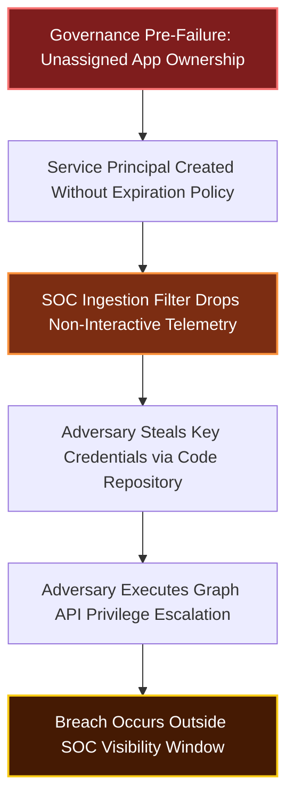
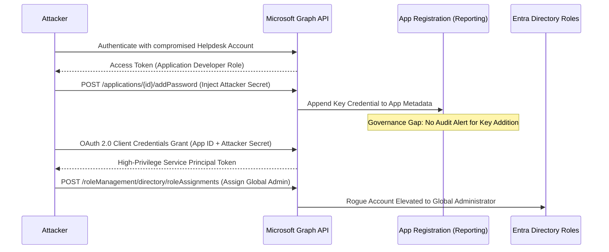
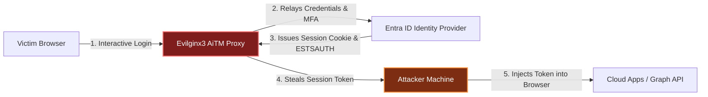

# The Cloud Identity Fabric: Attack Surfaces Most SOC Teams Cannot Currently See

**Series:** SOC + GRC Advanced Attack Chain Research  
**Topic:** Cloud Identity Fabric, Non-Human Identity (NHI) & Telemetry Blind Spots  
**Date:** 2026-08-21  
**Target Audience:** Detection Engineers, SOC Leads, GRC Analysts, Cloud Security Architects  

---

> [!IMPORTANT]
> **Executive Takeaway:** Traditional security monitoring focuses heavily on human authentication: tracking interactive logins, enforcing multi-factor authentication (MFA), and flagging impossible travel. However, modern cloud environments operate on a complex Cloud Identity Fabric powered by Non-Human Identities (NHIs): Service Principals, OAuth applications, Managed Identities, and Workload Identity Federation. 
>
> Attackers have shifted their focus to these unmonitored non-human channels. When an identity breach occurs today, the root cause is rarely a missed brute-force alert. It is almost always a governance gap that allowed an unmonitored service principal or long-lived token to execute administrative operations completely outside the visibility of the Security Operations Center (SOC).

---

## Table of Contents

1. [The Operational Reality of the Cloud Identity Fabric](#1-the-operational-reality-of-the-cloud-identity-fabric)
2. [The Core Thesis: Non-Human Identities as Primary SOC Blind Spots](#2-the-core-thesis-non-human-identities-as-primary-soc-blind-spots)
3. [Five Critical Identity Fabric Attack Surfaces](#3-five-critical-identity-fabric-attack-surfaces)
   - [3.1 Primary Refresh Token (PRT) & Session Token Hijacking](#31-primary-refresh-token-prt--session-token-hijacking)
   - [3.2 OAuth 2.0 Consent Phishing & Malicious App Registrations](#32-oauth-20-consent-phishing--malicious-app-registrations)
   - [3.3 Workload Identity Federation & Cross-Cloud Trust Hijacking](#33-workload-identity-federation--cross-cloud-trust-hijacking)
   - [3.4 Hybrid Identity Sync & Certificate-Based Authentication Exploitation](#34-hybrid-identity-sync--certificate-based-authentication-exploitation)
   - [3.5 Shadow Admins & Over-Privileged Managed Identities](#35-shadow-admins--over-privileged-managed-identities)
4. [Technical Case Studies & Attack Path Visualizations](#4-technical-case-studies--attack-path-visualizations)
   - [Case Study 1: Persistence via Unmonitored Service Principal Key Credentials](#case-study-1-persistence-via-unmonitored-service-principal-key-credentials)
   - [Case Study 2: AiTM Token Theft with Intune Compliance Spoofing](#case-study-2-aitm-token-theft-with-intune-compliance-spoofing)
   - [Case Study 3: Multi-Cloud Lateral Movement via Misconfigured OIDC Federation](#case-study-3-multi-cloud-lateral-movement-via-misconfigured-oidc-federation)
5. [Detection Engineering Toolkit (KQL & SIGMA)](#5-detection-engineering-toolkit-kql--sigma)
   - [KQL 1: Service Principal Credential Addition with High-Risk Permissions](#kql-1-service-principal-credential-addition-with-high-risk-permissions)
   - [KQL 2: Primary Refresh Token Device ID Mismatch Detection](#kql-2-primary-refresh-token-device-id-mismatch-detection)
   - [KQL 3: Anomalous Non-Interactive Service Principal Sign-ins](#kql-3-anomalous-non-interactive-service-principal-sign-ins)
   - [SIGMA Rule: Malicious OAuth App Administrative Consent Grant](#sigma-rule-malicious-oauth-app-administrative-consent-grant)
6. [GRC Governance & Control Matrix for Identity Fabrics](#6-grc-governance--control-matrix-for-identity-fabrics)
7. [90-Day SOC & GRC Identity Audit Checklist](#7-90-day-soc--grc-identity-audit-checklist)
8. [Architectural Closing Synthesis](#8-architectural-closing-synthesis)

---

## 1. The Operational Reality of the Cloud Identity Fabric

### The Evolution Beyond Network Perimeters

The security perimeter no longer stops at firewalls, VPN gateways, or endpoint agents. Modern multi-cloud architectures rely on a distributed Cloud Identity Fabric connecting identity providers (Entra ID, AWS IAM, GCP Cloud IAM, Okta) across infrastructure, software-as-a-service (SaaS) applications, and continuous integration pipelines.

In this fabric, authorization decisions happen dynamically across federated boundaries using OAuth 2.0 tokens, OpenID Connect (OIDC) assertions, and SAML responses.

| Architecture Realm | Legacy On-Premises Security | Cloud Identity Fabric Reality |
| :--- | :--- | :--- |
| **Trust Boundary** | IP Subnets, Active Directory Domains, Kerberos KDC | Token Issuance, IdP Federation, OIDC Trust Relationships |
| **Primary Actors** | Human Users, Active Directory Computer Accounts | Human Users, Non-Human Identities (NHIs), Service Principals |
| **Authentication** | Password + NTLM / Kerberos Ticket | Primary Refresh Token (PRT), OAuth Tokens, Certificate Signatures |
| **SOC Monitoring Focus** | Domain Controller Event Logs (4624, 4672, 4768) | Identity Logs (`SigninLogs`, `AuditLogs`, CloudTrail `AssumeRole`) |

### The Telemetry Asymmetry

Security Operations Centers struggle with a basic operational imbalance:

1. **Human Telemetry is Over-Monitored:** Interactive sign-in events trigger alerts for login attempts, geographic speed violations, and MFA prompts.
2. **Non-Human Telemetry is Under-Monitored:** Service Principals, Managed Identities, and automated API tokens generate millions of daily events. To control SIEM ingestion costs, SOC teams often filter out non-interactive logs (`AADNonInteractiveUserSignInLogs`).

Adversaries exploit this exact operational asymmetry. Once inside a tenant, threat actors avoid interactive human accounts and migrate immediately to non-human identities to maintain stealth.

---

## 2. The Core Thesis: Non-Human Identities as Primary SOC Blind Spots

### The Pre-Failure Paradigm in Identity Governance

A breach involving identity infrastructure is rarely caused by a failure of the SIEM engine. It is caused by governance pre-failures that occur months before the initial intrusion:



Pre-failures in the cloud identity fabric follow predictable patterns:
- **Orphaned Applications:** OAuth apps registered during testing remain active indefinitely without named technical owners.
- **Over-Privileged API Consents:** Delegated permissions like `Directory.ReadWrite.All` or `Mail.Read` granted to third-party tools without security review.
- **Unrestricted Key Credentials:** Service Principal secrets generated without expiration dates or IP location restrictions.
- **Cross-Tenant Federation Gaps:** Open OIDC trust relationships created for workload federation without validating repository claims.

---

## 3. Five Critical Identity Fabric Attack Surfaces

### 3.1 Primary Refresh Token (PRT) & Session Token Hijacking

In Entra ID (Azure AD) joined devices, the Primary Refresh Token (PRT) is a key credential issued to the device to enable single sign-on (SSO). The PRT contains claim details about user identity, MFA verification, and device compliance state.

#### Attack Mechanics
Threat actors use malware (such as Mimikatz, Roadtools, or custom token extractors) running in user context on an enrolled endpoint to extract the PRT and its associated session keys from LSASS or local browser storage.

```
+-------------------------------------------------------------------------+
| PRT TOKEN EXTRACTION & CONDITIONAL ACCESS BYPASS                        |
|                                                                         |
| [ Victim Endpoint ]                                                     |
|   |-- Local User Executable -> Extracts PRT Key from Cryptographic Provider|
|   |-- Obtains Valid Transport Key & Session Cookie                       |
|                                                                         |
| [ Adversary Machine ]                                                   |
|   |-- Injects PRT Cookie into Request Header                            |
|   |-- Authenticates to Cloud App -> Cloud Sees Device as Compliant      |
|   |-- BYPASSES: Password Prompts, FIDO2 Prompts, IP Geofencing          |
+-------------------------------------------------------------------------+
```

Because the stolen token already satisfies MFA and device compliance claims, standard Conditional Access Policies evaluate the session as trusted.

### 3.2 OAuth 2.0 Consent Phishing & Malicious App Registrations

Instead of stealing user credentials directly, adversaries trick users into granting permissions to a malicious OAuth application registered in an attacker-controlled tenant.

#### Delegated vs. Application Permissions
- **Delegated Permissions:** The application acts on behalf of the signed-in user. If the user is an administrator, the app inherits elevated capabilities.
- **Application Permissions:** The application acts independently without user context. Once granted admin consent, the application operates as a background service with full API access.

Key high-risk Graph API permissions exploited by threat actors:
- `RoleManagement.ReadWrite.Directory`: Allows the app to assign directory roles (such as Global Administrator) to any entity.
- `AppRoleAssignment.ReadWrite.All`: Allows the app to grant itself additional application permissions silently.
- `Mail.ReadWrite`: Enables full access to mailbox data without prompting the target user again.

### 3.3 Workload Identity Federation & Cross-Cloud Trust Hijacking

Workload Identity Federation removes the need for storing static secrets (such as AWS access keys or Azure client secrets) in GitHub Actions, GitLab CI, or Kubernetes clusters. It uses OIDC trust relationships to exchange short-lived cloud platform tokens.

#### The Governance Trap
If the OIDC trust policy is configured with loose subject claims (`sub`), any workflow running on the platform can impersonate the target identity.

Example misconfigured AWS IAM Trust Policy:

```json
{
  "Version": "2012-10-17",
  "Statement": [
    {
      "Effect": "Allow",
      "Principal": {
        "Federated": "arn:aws:iam::123456789012:oidc-provider/token.actions.githubusercontent.com"
      },
      "Action": "sts:AssumeRoleWithWebIdentity",
      "Condition": {
        "StringLike": {
          "token.actions.githubusercontent.com:sub": "repo:org-name/*"
        }
      }
    }
  ]
}
```

Because the condition uses a wild-card claim (`repo:org-name/*`), any repository in the organization (including fork pull requests from external contributors) can request a valid token and assume full AWS administrative privileges.

### 3.4 Hybrid Identity Sync & Certificate-Based Authentication Exploitation

Organizations running hybrid identity models sync Active Directory Domain Services (AD DS) to Entra ID using Entra Connect (formerly Azure AD Connect) or ADFS.

#### ADCS ESC1 to Cloud Account Takeover
If Active Directory Certificate Services (ADCS) is vulnerable to certificate template misconfigurations (such as ESC1 or ESC8), an attacker can request a certificate containing the `UserPrincipalName` of a cloud-synchronized Global Administrator.

Using Certificate-Based Authentication (CBA) configured at the tenant root level, the attacker authenticates directly to the cloud IdP, bypassing on-premises domain controllers and standard password rotation policies.

### 3.5 Shadow Admins & Over-Privileged Managed Identities

Managed Identities in cloud providers (Azure System-Assigned Identities, AWS EC2 Instance Profiles, GCP Service Accounts) simplify credential management for virtual machines and serverless functions.

#### The Hidden Escalation Path
Security teams often grant read-only access to infrastructure teams, assuming no risk exists. However, if a developer identity possesses the permission `Microsoft.Compute/virtualMachines/runCommand/action`, they can execute arbitrary shell scripts inside a VM hosting a System-Assigned Managed Identity.

```
[ Developer Account (Low Privileges) ]
       |
       v (Executes runCommand API call)
[ Production VM ]
       |
       v (Retrieves Managed Identity Token from IMDS: 169.254.169.254)
[ High-Privilege Cloud Role (Key Vault Contributor / Subscription Owner) ]
```

This path creates a "Shadow Admin" vulnerability that bypasses standard Privileged Access Management (PAM) monitoring.

---

## 4. Technical Case Studies & Attack Path Visualizations

### Case Study 1: Persistence via Unmonitored Service Principal Key Credentials

**Environment:** Enterprise Azure/Entra ID Tenant with 15,000 users.  
**Initial Access:** Password spray attack compromising a mid-level IT Helpdesk account with the `Application Developer` directory role.  
**Objective:** Maintain long-term administrative persistence that survives password resets and user terminations.

#### Step-by-Step Attack Execution

1. **Reconnaissance:** The attacker enumerates existing application registrations using PowerShell (`Get-MgApplication`). They locate an internal reporting app with `Directory.ReadWrite.All` application permissions.
2. **Credential Injection:** Using the compromised Helpdesk account, the attacker calls the Graph API to add a new RSA certificate credential to the application object:
   `POST /v1.0/applications/{app-object-id}/addPassword`
3. **Impersonation:** The attacker authenticates directly as the Service Principal using the newly added secret key.
4. **Privilege Escalation:** Acting as the application, the attacker grants the `Global Administrator` role to a rogue cloud user account created in step 1.



#### Why SOC Failed to Detect It
- The SOC SIEM rule was configured to monitor user password resets and role assignments performed by *user accounts*.
- The addition of key credentials to *application objects* was logged in `AuditLogs` under `Update application (Certificates and secrets management)`, which was not categorized as high severity.

---

### Case Study 2: AiTM Token Theft with Intune Compliance Spoofing

**Environment:** Hybrid Enterprise with Entra ID, Microsoft Defender for Endpoint, and FIDO2 MFA enforcement.  
**Initial Access:** Adversary-in-the-Middle (AiTM) phishing framework (Evilginx3) targeting an executive user.



#### The Technical Breach
1. The executive completes FIDO2 authentication on the AiTM proxy site.
2. The proxy captures the session cookies (`ESTSAUTH`, `ESTSAUTHPERSISTENT`) and returns them to the attacker.
3. The attacker loads the cookies into a browser session on an unmanaged, personal device.
4. When Entra ID Conditional Access blocks access due to "Non-Compliant Device", the attacker uses a device ID header injection trick:
   `x-ms-device-connection-id` header set to a known compliant device ID extracted from public Azure AD device telemetry.
5. Access is granted. FIDO2 MFA enforcement is completely bypassed because the session token already carries the authentication claim.

---

### Case Study 3: Multi-Cloud Lateral Movement via Misconfigured OIDC Federation

**Environment:** Multi-cloud infrastructure combining GitHub Actions, Azure Cloud, and AWS Workloads.  
**Vector:** Public GitHub repository pull request exploiting OIDC trust.

#### Attack Chain
1. A developer creates an automated deployment pipeline in GitHub Actions that assumes an AWS IAM Role (`arn:aws:iam::112233445566:role/ProductionDeployer`).
2. The AWS IAM Role trust policy specifies:
   `"StringEquals": { "token.actions.githubusercontent.com:aud": "sts.amazonaws.com" }`
3. Notice what is missing: The trust policy does not validate the `repository` claim or `environment` claim.
4. An external attacker submits a pull request containing a malicious workflow script (`deploy.yml`).
5. GitHub Actions executes the workflow on the pull request trigger. The workflow requests an OIDC token from GitHub's token service, sends it to AWS STS via `AssumeRoleWithWebIdentity`, and receives temporary AWS administrative credentials.
6. The attacker uses the AWS credentials to access production S3 buckets and extract database connection strings.

---

## 5. Detection Engineering Toolkit (KQL & SIGMA)

### KQL 1: Service Principal Credential Addition with High-Risk Permissions

This query detects when a user or application adds a password or certificate credential to a Service Principal that possesses sensitive directory permissions.

```kql
// Source: Microsoft Sentinel / Defender XDR AuditLogs
let SensitivePermissions = dynamic([
    "RoleManagement.ReadWrite.Directory",
    "AppRoleAssignment.ReadWrite.All",
    "Directory.ReadWrite.All",
    "User.ReadWrite.All"
]);
AuditLogs
| where OperationName in ("Update application (Certificates and secrets management)", "Add service principal credentials")
| extend TargetAppId = tostring(TargetResources[0].id)
| extend InitiatedByActor = tostring(parse_json(tostring(InitiatedBy.user)).userPrincipalName)
| extend InitiatedByApp = tostring(parse_json(tostring(InitiatedBy.app)).displayName)
| extend Actor = iff(isnotempty(InitiatedByActor), InitiatedByActor, InitiatedByApp)
| join kind=inner (
    AuditLogs
    | where OperationName == "Add app role assignment to service principal"
    | extend AppPermission = tostring(TargetResources[0].displayName)
    | where AppPermission in (SensitivePermissions)
    | extend TargetAppId = tostring(TargetResources[0].id)
) on TargetAppId
| project TimeGenerated, OperationName, Actor, TargetAppId, AppPermission, AdditionalDetails
| sort by TimeGenerated desc
```

### KQL 2: Primary Refresh Token Device ID Mismatch Detection

This query flags interactive sign-ins where the Primary Refresh Token (PRT) was used, but the underlying OS/Browser telemetry does not match the registered device record in Entra ID (indicating potential PRT cookie theft).

```kql
// Source: Microsoft Sentinel SigninLogs
SigninLogs
| where TimeGenerated > ago(24h)
| where AuthenticationProcessingDetails has "IsPRT"
| extend IsPRT = tostring(parse_json(tostring(AuthenticationProcessingDetails))[0].value)
| where IsPRT == "true"
| extend DeviceIdInLog = tostring(DeviceDetail.deviceId)
| extend TrustType = tostring(DeviceDetail.trustType)
| extend OSInLog = tostring(DeviceDetail.operatingSystem)
| where isempty(DeviceIdInLog) or TrustType == ""
| where ResultType == 0 // Successful Authentication
| project TimeGenerated, UserPrincipalName, IPAddress, Location, AppDisplayName, DeviceIdInLog, OSInLog, UserAgent
| sort by TimeGenerated desc
```

### KQL 3: Anomalous Non-Interactive Service Principal Sign-ins

Detects Service Principals authenticating from external, unexpected IP ranges or geographic locations for the first time.

```kql
// Source: Microsoft Sentinel AADNonInteractiveUserSignInLogs
let BaselineDays = 14d;
let TargetDays = 1d;
let HistoricalIPs = 
    AADNonInteractiveUserSignInLogs
    | where TimeGenerated between (ago(BaselineDays) .. ago(TargetDays))
    | summarize HistoricIPSet = make_set(IPAddress) by AppId;
AADNonInteractiveUserSignInLogs
| where TimeGenerated > ago(TargetDays)
| join kind=inner (HistoricalIPs) on AppId
| where not(set_has_element(HistoricIPSet, IPAddress))
| project TimeGenerated, ServicePrincipalName, AppId, IPAddress, Location, ResourceDisplayName, ResultType
| sort by TimeGenerated desc
```

### SIGMA Rule: Malicious OAuth App Administrative Consent Grant

```yaml
title: Malicious OAuth App Administrative Consent Grant
id: e4b291a0-8d5c-4e89-a21f-819a37402123
status: experimental
description: Detects when admin consent is granted to an OAuth application requesting high-risk directory permissions.
author: Detection Engineering Team
date: 2026-08-21
logsource:
  product: azure
  service: auditlogs
detection:
  selection_operation:
    OperationName: 'Consent to application'
  selection_details:
    Result: 'success'
  selection_permissions:
    TargetResources|contains:
      - 'RoleManagement.ReadWrite.Directory'
      - 'AppRoleAssignment.ReadWrite.All'
      - 'Directory.ReadWrite.All'
      - 'Mail.ReadWrite'
  condition: selection_operation and selection_details and selection_permissions
falsepositives:
  - Authorized enterprise application deployment by SOC-approved Global Administrators.
level: high
tags:
  - attack.persistence
  - attack.privilege_escalation
  - attack.t1098.003
```

---

## 6. GRC Governance & Control Matrix for Identity Fabrics

To prevent identity pre-failures, GRC teams must establish operational audit mechanics across the entire lifecycle of non-human identities.

| Governance Domain | Technical Risk | Required GRC Policy Control | Verification Cadence | Automation API / Tooling |
| :--- | :--- | :--- | :--- | :--- |
| **Service Principal Ownership** | Orphaned applications with active high-privilege keys | Mandatory owner tags assigned to all app registrations. Apps without owners automatically disabled after 30 days. | Monthly automated scan | Entra PowerShell / Graph API Script |
| **Key Secret Lifecycle** | Long-lived secrets stored in plain text repositories | Maximum secret lifetime capped at 90 days. Hardcoded secrets strictly prohibited. | Continuous CI/CD scanning | GitGuardian / Trufflehog / Azure Key Vault |
| **OAuth Consent Governance** | Users tricking admin consent for malicious SaaS tools | Admin Consent Workflow enforced. User consent disabled for unverified publishers. | Real-time policy enforcement | Entra ID Consent Policies |
| **Workload Identity Federation** | Wildcard claim trust policies in CI/CD pipelines | OIDC claims must match exact repository, branch, and environment parameters. | Quarterly policy audit | AWS IAM Access Analyzer / Azure Policy |
| **Conditional Access Hygiene** | Legacy protocol bypasses and unmonitored locations | Enforce Continuous Access Evaluation (CAE), block legacy authentication, mandate device compliance. | Bi-weekly configuration check | Azure AD CA Documenter / Sentinel |

---

## 7. 90-Day SOC & GRC Identity Audit Checklist

This roadmap outlines actionable steps for alignment between SOC detection engineers and GRC governance teams over 90 days.

```
+-------------------------------------------------------------------------+
| 90-DAY IDENTITY FABRIC REMEDIATION ROADMAP                              |
|                                                                         |
| DAYS 1 - 30 : Inventory & Logging Alignment                             |
|  [ ] Audit all Service Principals and identify orphaned apps           |
|  [ ] Enable AADNonInteractiveUserSignInLogs in SIEM log collection       |
|  [ ] Disable user consent for unverified OAuth applications             |
|                                                                         |
| DAYS 31 - 60 : Technical Control & Rule Implementation                  |
|  [ ] Deploy KQL detections for key additions & PRT mismatch             |
|  [ ] Restrict secret lifetime to a maximum of 90 days                   |
|  [ ] Implement OIDC trust claim validation across CI/CD pipelines       |
|                                                                         |
| DAYS 61 - 90 : Continuous Governance & Verification                     |
|  [ ] Conduct purple team simulation of Service Principal escalation     |
|  [ ] Integrate CIEM tool to flag over-privileged Managed Identities      |
|  [ ] Establish quarterly bi-directional SOC-GRC review cadence          |
+-------------------------------------------------------------------------+
```

### Phase 1: Days 1 to 30 (Inventory & Telemetry Alignment)
- [ ] **Complete Identity Inventory:** Export all Service Principals, OAuth App Registrations, and Enterprise Applications across Entra ID, AWS, and GCP.
- [ ] **SIEM Ingestion Audit:** Confirm that `AADNonInteractiveUserSignInLogs` and `AuditLogs` are ingested into Microsoft Sentinel or Splunk without blanket exclusion filters.
- [ ] **Lockdown User Consent:** Turn off standard user consent for third-party OAuth apps. Enforce the Admin Consent Request workflow.

### Phase 2: Days 31 to 60 (Detection & Control Hardening)
- [ ] **Deploy High-Risk KQL Detections:** Implement rules for application key creation, PRT device mismatches, and unexpected non-interactive sign-ins.
- [ ] **Enforce Secret Expiration:** Configure automated policy enforcement preventing the creation of application secrets with expiration dates exceeding 90 days.
- [ ] **Hardening OIDC Policies:** Review all AWS IAM Roles Anywhere and Azure Workload Identity Federation trusts to ensure exact repository claim matching.

### Phase 3: Days 61 to 90 (Adversarial Validation & Continuous Assurance)
- [ ] **Emulate Identity Attacks:** Conduct an adversarial exercise simulating PRT cookie extraction and Service Principal privilege escalation.
- [ ] **Implement CIEM Scanning:** Deploy Cloud Infrastructure Entitlement Management (CIEM) tooling to identify and prune unused permissions assigned to Managed Identities.
- [ ] **Establish Audit Rhythm:** Schedule quarterly joint reviews between SOC Leads and GRC Managers to audit identity risk registers.

---

## 8. Architectural Closing Synthesis

Security operations must adapt to the reality of modern cloud environments: **Identity is the infrastructure, and Non-Human Identities represent the most exposed, least monitored attack surface in the enterprise.**

When a cloud breach occurs, analyzing network packets and interactive logins is insufficient. Preventing systemic compromises requires eliminating the governance pre-failures that allow unmonitored service principals, over-privileged OAuth apps, and weak OIDC trusts to exist unnoticed.

By pairing rigorous GRC ownership policies with dedicated SOC detection engineering for non-human identity telemetry, organizations build an authentic, defense-in-depth posture capable of stopping advanced adversaries across the entire Cloud Identity Fabric.
