# BEYOND THE TRIAD: THE MISSING DIMENSIONS
## A Comprehensive Research Supplement to "The Privacy Governance Triad"

[](#)
[](#)
[](#)
[](#)
[](#)

---

### Metadata & Document Controls

| Metadata Field | Value |
| :--- | :--- |
| **Document Title** | Beyond the Triad: The Missing Dimensions — A Comprehensive Research Supplement to "The Privacy Governance Triad" |
| **Author** | Research Supplement (`What-I-Learned-Today-on-SOC-GRC` Series) |
| **Publication Date** | September 25, 2026 |
| **Version Target** | 1.0 (Production Release) |
| **Prerequisites** | *"The Privacy Governance Triad: Three Owners, Zero Accountability"* (Version 1.0, 25-09-2026) |
| **Primary Code Artifacts** | Azure Sentinel KQL, Splunk SPL, ANSI SQL, Python ODS Engine |

---

## Executive Summary & Visual Architecture

The original paper, *"The Privacy Governance Triad: Three Owners, Zero Accountability"*, named the structural flaw dividing the Data Protection Officer (DPO), Security Operations Center (SOC), and Governance, Risk, and Compliance (GRC). It established that accountability breakdown is an **ownership decay problem**, formalizing the **Ownership Decay Score ($ODS$)**, **Role-Responsibility Matrix ($RRM$)**, and **Attested Ownership Chains ($AOC$)**, while positioning the **Privacy Engineer** as the fourth vertex.

This supplement bridges the remaining operational gaps: multi-jurisdictional compliance beyond GDPR, Privacy-Enhancing Technologies (PETs), AI & Agentic Governance, real-world case law post-mortems, automation pipelines, and financial ROI models.

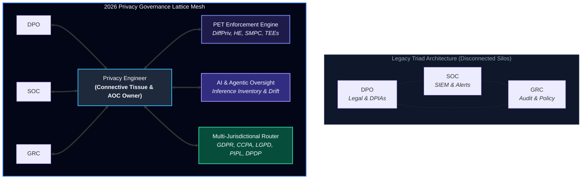

---

## Table of Contents

1. [Preface: Why This Supplement Exists](#preface-why-this-supplement-exists)
2. [Part I: The Regulatory Landscape Beyond GDPR](#part-i-the-regulatory-landscape-beyond-gdpr)
   - [1.1 The Problem with a GDPR-Centric Model](#11-the-problem-with-a-gdpr-centric-model)
   - [1.2 CCPA/CPRA: The Operational Enforcement Era](#12-ccpacpra-the-operational-enforcement-era)
   - [1.3 LGPD: Brazil's Expanding Enforcement Apparatus](#13-lgpd-brazils-expanding-enforcement-apparatus)
   - [1.4 PIPL: China's National Security-Framed Privacy Regime](#14-pipl-chinas-national-security-framed-privacy-regime)
   - [1.5 DPDP: India's New Operational Regime](#15-dpdp-indias-new-operational-regime)
   - [1.6 POPIA: South Africa's Condition for Lawful Processing](#16-popia-south-africas-condition-for-lawful-processing)
   - [1.7 The Cross-Jurisdictional Taxonomy: A Proposal](#17-the-cross-jurisdictional-taxonomy-a-proposal)
3. [Part II: Privacy-Enhancing Technologies as Governance Instruments](#part-ii-privacy-enhancing-technologies-as-governance-instruments)
   - [2.1 Why PETs Matter to the Triad](#21-why-pets-matter-to-the-triad)
   - [2.2 Differential Privacy](#22-differential-privacy)
   - [2.3 Homomorphic Encryption](#23-homomorphic-encryption)
   - [2.4 Secure Multi-Party Computation (SMPC)](#24-secure-multi-party-computation-smpc)
   - [2.5 Federated Learning](#25-federated-learning)
   - [2.6 Trusted Execution Environments (TEEs)](#26-trusted-execution-environments-tees)
   - [2.7 PET Coverage as an ODS Component](#27-pet-coverage-as-an-ods-component)
4. [Part III: AI Governance as Privacy Governance](#part-iii-ai-governance-as-privacy-governance)
   - [3.1 The Convergence](#31-the-convergence)
   - [3.2 The EU AI Act and GDPR Intersection](#32-the-eu-ai-act-and-gdpr-intersection)
   - [3.3 Agentic AI and the New Privacy Risk Surface](#33-agentic-ai-and-the-new-privacy-risk-surface)
   - [3.4 Zero Trust Data Governance](#34-zero-trust-data-governance)
   - [3.5 AI Model Collapse and Data Integrity](#35-ai-model-collapse-and-data-integrity)
5. [Part IV: Frameworks and Standards Alignment](#part-iv-frameworks-and-standards-alignment)
   - [4.1 NIST Privacy Framework 1.1](#41-nist-privacy-framework-11)
   - [4.2 ISO/IEC 27701:2025](#42-isoiec-277012025)
   - [4.3 The Accountability Gap in Current Standards](#43-the-accountability-gap-in-current-standards)
6. [Part V: Empirical Evidence and Case Studies](#part-v-empirical-evidence-and-case-studies)
   - [5.1 The Twitter Case: DPO Not Added to Incident Ticket](#51-the-twitter-case-dpo-not-added-to-incident-ticket)
   - [5.2 The HSE Case: Failure to Communicate with Data Subjects](#52-the-hse-case-failure-to-communicate-with-data-subjects)
   - [5.3 The Capita Case: Failure to Respond to a Security Alert](#53-the-capita-case-failure-to-respond-to-a-security-alert)
   - [5.4 The WUSPI Case: DPO Departure and Regulatory Correspondence](#54-the-wuspi-case-dpo-departure-and-regulatory-correspondence)
   - [5.5 What the Case Law Reveals](#55-what-the-case-law-reveals)
7. [Part VI: Data Classification Automation and the SOC](#part-vi-data-classification-automation-and-the-soc)
   - [6.1 The Visibility Gap](#61-the-visibility-gap)
   - [6.2 The Classification-to-Notification Pipeline](#62-the-classification-to-notification-pipeline)
   - [6.3 The Cost of Automation](#63-the-cost-of-automation)
8. [Part VII: Metrics, Benchmarks, and ROI](#part-vii-metrics-benchmarks-and-roi)
   - [7.1 The 2026 Global Privacy Benchmarks](#71-the-2026-global-privacy-benchmarks)
   - [7.2 The ICO Privacy Dividend](#72-the-ico-privacy-dividend)
   - [7.3 The ISACA PET ROI Study](#73-the-isaca-pet-roi-study)
   - [7.4 The Compensation Benchmark](#74-the-compensation-benchmark)
   - [7.5 The Board Metrics Extended](#75-the-board-metrics-extended)
9. [Part VIII: The Privacy Engineer as a Formal Discipline](#part-viii-the-privacy-engineer-as-a-formal-discipline)
   - [8.1 IAPP Recognition](#81-iapp-recognition)
   - [8.2 The Job Market](#82-the-job-market)
   - [8.3 Skills and Competencies](#83-skills-and-competencies)
   - [8.4 Compensation and Seniority](#84-compensation-and-seniority)
   - [8.5 Where Organizations Are](#85-where-organizations-are)
10. [Part IX: Privacy Debt and Technical Debt](#part-ix-privacy-debt-and-technical-debt)
    - [9.1 The Concept](#91-the-concept)
    - [9.2 Privacy Debt and ODS](#92-privacy-debt-and-ods)
    - [9.3 Quantifying Privacy Debt](#93-quantifying-privacy-debt)
    - [9.4 Privacy Debt as a Board Metric](#94-privacy-debt-as-a-board-metric)
11. [Part X: Organizational Psychology and Change Management](#part-x-organizational-psychology-and-change-management)
    - [10.1 Why Silos Persist](#101-why-silos-persist)
    - [10.2 The MIT Sloan Study](#102-the-mit-sloan-study)
    - [10.3 Change Management Strategies](#103-change-management-strategies)
    - [10.4 The Role of Leadership](#104-the-role-of-leadership)
12. [Part XI: Updated Queries and Implementation Guidance](#part-xi-updated-queries-and-implementation-guidance)
    - [11.1 Enhanced KQL for Multi-Jurisdictional Alert Routing](#111-enhanced-kql-for-multi-jurisdictional-alert-routing)
    - [11.2 SQL for PET Coverage Verification](#112-sql-for-pet-coverage-verification)
    - [11.3 SPL for AI Inference Privacy Risk](#113-spl-for-ai-inference-privacy-risk)
    - [11.4 Python for ODS with PET Component](#114-python-for-ods-with-pet-component)
    - [11.5 Implementation Roadmap](#115-implementation-roadmap)
13. [Part XII: Future Research Directions](#part-xii-future-research-directions)
    - [12.1 Quantum Computing and Privacy Governance](#121-quantum-computing-and-privacy-governance)
    - [12.2 Decentralized Identity](#122-decentralized-identity)
    - [12.3 Global Regulatory Convergence](#123-global-regulatory-convergence)
    - [12.4 Privacy in ESG Reporting](#124-privacy-in-esg-reporting)
    - [12.5 The Privacy Engineer as a Profession](#125-the-privacy-engineer-as-a-profession)
14. [Conclusion: The Cherry Cake Assembled](#conclusion-the-cherry-cake-assembled)
15. [Series Connections & References](#series-connections--references)

---

## Preface: Why This Supplement Exists

The original paper, *"The Privacy Governance Triad: Three Owners, Zero Accountability"*, made a structural argument that needed to be made. It named the three roles—DPO, SOC, GRC—and proved that their separation is not a coordination problem but an ownership decay problem. It introduced the Ownership Decay Score ($ODS$), the Role-Responsibility Matrix ($RRM$), and Attested Ownership Chains ($AOC$). It proposed the Privacy Engineer as the fourth vertex. These are genuine contributions.

But the paper, by its own admission in Section 15 (*"What I Would Do Differently"*), left gaps. It was GDPR-centric. It treated privacy-enhancing technologies as an afterthought. It did not address AI governance, which by 2026 is no longer separable from privacy governance. It did not cite the empirical case law that proves the Triad failure in practice. It did not explore the organizational psychology that keeps silos intact. And it did not provide the market context—compensation, hiring funnels, budget justification—that would make the Privacy Engineer role actionable for a CISO allocating headcount.

> [!NOTE]
> **Thesis Statement**: The Privacy Governance Triad is a necessary but insufficient model for 2026. Three roles, no matter how well-connected, cannot govern privacy in an environment shaped by AI inference, PETs, zero-trust data architectures, and a regulatory landscape spanning six continents. The Triad must evolve into a **Lattice**—a network of roles, technologies, and feedback loops sharing not just data but meaning. The Privacy Engineer is the operational catalyst.

---

## Part I: The Regulatory Landscape Beyond GDPR

### 1.1 The Problem with a GDPR-Centric Model

The original paper's RRM (Section 3) is derived from GDPR obligations. The resolution requires understanding that different regulatory regimes impose different obligation structures, notification timelines, accountability mechanisms, and technical requirements. A DPO under Singapore's PDPA does not have identical obligations to a DPO under California's CCPA/CPRA or Brazil's LGPD.

An organization operating in multiple jurisdictions maintains multiple obligation inventories, each with its own $ODS$. The Privacy Engineer's first task, before building any AOC, is to construct a **unified obligation taxonomy**—a master inventory mapping each regulatory requirement to its jurisdictional source, technical verification query, and ownership chain.

### 1.2 CCPA/CPRA: The Operational Enforcement Era

The California Privacy Protection Agency (CPPA) finalized regulations taking effect on January 1, 2026, covering risk assessments, cybersecurity audits, and automated decision-making[^1]. The CPPA's first enforcement action built specifically on data minimization and purpose limitation requirements—rules non-existent under the original CCPA[^2].

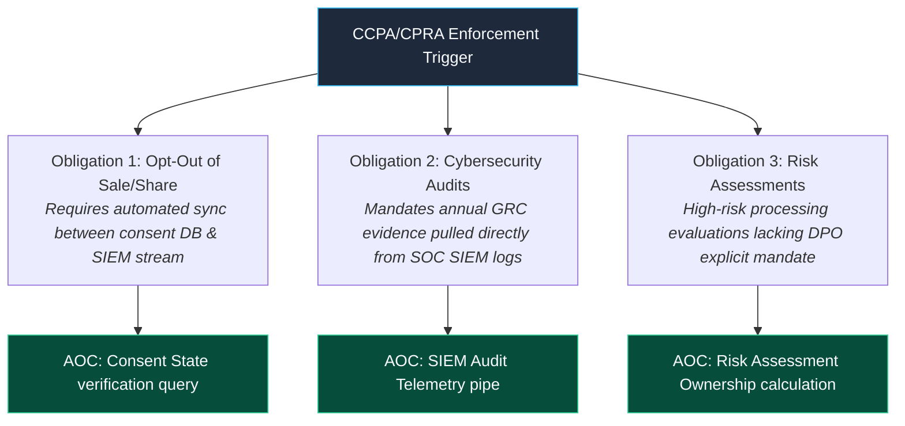

- **Obligation 1: Right to Opt Out of Sale/Sharing**: Requires technical enforcement—a *"Do Not Sell or Share My Personal Information"* link that actively terminates downstream data flows rather than simply writing a preference record.
- **Obligation 2: Cybersecurity Audits for High-Risk Processing**: Annual cybersecurity audits are required for businesses engaged in higher-risk processing[^3]. This GRC obligation depends directly on SOC telemetry for evidence.
- **Obligation 3: Risk Assessments**: CPRA requires risk assessments for processing presenting significant consumer risk. Unlike GDPR DPIAs, CPRA lacks an explicit "consult the DPO" requirement, introducing ownership ambiguity: $Single(o) = 0.5$ if unassigned or co-owned.

### 1.3 LGPD: Brazil's Expanding Enforcement Apparatus

In 2025, Brazil's *Autoridade Nacional de Proteção de Dados* (ANPD) was elevated to a federal regulatory agency with expanded powers[^4]. While LGPD and GDPR share equivalence, LGPD breach notification timelines are defined as "reasonable" rather than a strict 72-hour limit.

> [!WARNING]
> Elastic deadlines weaken operational urgency. Without a 72-hour clock, fragile handoffs between the SOC and the *Encarregado* (Brazilian DPO) decay faster. An AOC for LGPD must build explicit SLA thresholds into verification queries to differentiate reasonable from unreasonable delay.

### 1.4 PIPL: China's National Security-Framed Privacy Regime

China's Personal Information Protection Law (PIPL)[^5] operates in tandem with the Cybersecurity Law (CSL) and Data Security Law (DSL)[^6]. PIPL creates a structural conflict for global organizations: GDPR independence mandates directly conflict with PIPL requirements for data localization, security assessments, and state data access.

The Privacy Engineer resolves this by embedding **jurisdictional segmentation** directly into the AOC architecture. An AOC for breach notification must route incident alerts based on data subject residency.

### 1.5 DPDP: India's New Operational Regime

India's Digital Personal Data Protection (DPDP) Act, 2023, operationalized via the DPDP Rules, 2025 (notified November 13, 2025)[^7], establishes rights to access, correct, erase, and nominate representatives[^8]. It mandates Data Fiduciaries to enforce security safeguards and erase data upon consent withdrawal[^9].

The DPDP framework introduces **Consent Managers**[^10] as formal fiduciary entities—a third-party role mediating consent between data principals and fiduciaries that must be incorporated into AOC handoff logic.

### 1.6 POPIA: South Africa's Condition for Lawful Processing

South Africa's Protection of Personal Information Act (POPIA) requires an Information Officer and enforces eight lawful processing conditions. Prior authorization is mandated for unique identifier processing and credit reporting, generating a GRC obligation dependent on SOC telemetry monitoring.

### 1.7 The Cross-Jurisdictional Taxonomy: A Proposal

We propose a unified obligation taxonomy spanning five operational dimensions:

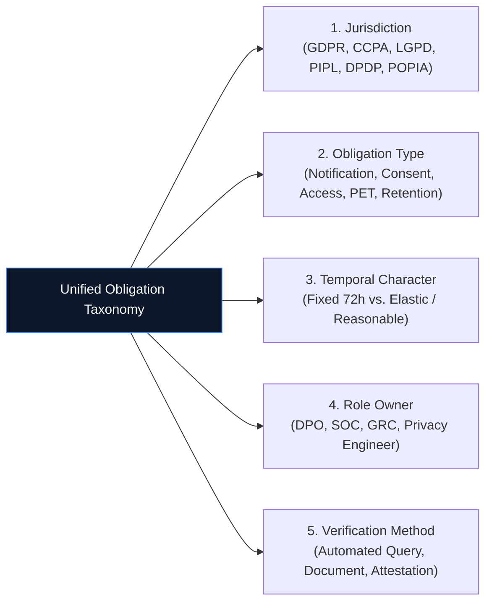

| Jurisdiction | Primary Regulator | Notification Window | Key Technical Mandates | Primary $ODS$ Risk Driver |
| :--- | :--- | :--- | :--- | :--- |
| **EU (GDPR)** | EDPB / National DPAs | 72 Hours (Strict) | Art. 25 Privacy by Design, Art. 32 Technical Security | SOC-to-DPO Telemetry Gap |
| **California (CCPA/CPRA)** | CPPA | 30 Days / Annual Audits | Opt-Out Data Flow Enforcement, Risk Assessments | Unassigned Risk Assessment Ownership |
| **Brazil (LGPD)** | ANPD | "Reasonable Time" | Encarregado Appointment, Data Transfer Checks | SLA Decay due to Elastic Deadlines |
| **China (PIPL)** | CAC | "Immediate" / Priority | Data Localization, Security Impact Assessment | Regulatory Conflict with GDPR Independence |
| **India (DPDP)** | DPB | "Without Undue Delay" | Consent Manager Integration, Fiduciary Erase | Missing DPO in Non-Significant Fiduciaries |
| **South Africa (POPIA)** | Information Regulator | "As Soon As Reasonable" | Prior Authorization for Unique Identifiers | Cross-Role Authorization Evidence Gap |

---

## Part II: Privacy-Enhancing Technologies as Governance Instruments

### 2.1 Why PETs Matter to the Triad

Governance without technical enforcement is documentation. A DPO can approve a DPIA, but if underlying systems lack mathematical protection, compliance remains theoretical. PETs provide the technical enforcement layer, managed and verified by the Privacy Engineer.

### 2.2 Differential Privacy

Differential privacy provides a mathematical guarantee that individual data cannot be reconstructed from analytical queries by injecting calibrated noise[^11].

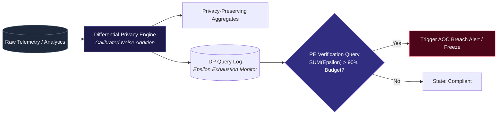

> [!CAUTION]
> **Failure Mode: Epsilon Exhaustion**. Cumulative queries exhaust the privacy budget ($\epsilon$), invalidating guarantees. The Privacy Engineer runs continuous verification queries to track budget consumption:

```sql
-- Differential Privacy Budget Exhaustion Verification Query
SELECT 
    dataset_id, 
    SUM(epsilon_consumed) AS total_epsilon,
    epsilon_budget,
    (SUM(epsilon_consumed) / epsilon_budget) * 100 AS budget_utilization_pct
FROM dp_query_log
WHERE query_date > DATEADD(day, -30, GETDATE())
GROUP BY dataset_id, epsilon_budget
HAVING SUM(epsilon_consumed) > (epsilon_budget * 0.90);
```

### 2.3 Homomorphic Encryption

Fully Homomorphic Encryption (FHE) permits direct computation over encrypted data. Governance centers on key custody:
- **Primary Owner**: Privacy Engineer (Technical custody)
- **Co-Owner**: DPO (Regulatory custody)
- **Verification**: SIEM key access log analysis for anomalous access patterns
- **Handoff SLA**: 1 Hour for key compromise notification

### 2.4 Secure Multi-Party Computation (SMPC)

SMPC enables multi-party joint function computation without disclosing underlying private inputs. The Privacy Engineer negotiates protocol security assumptions and builds verification queries across organizational boundaries.

### 2.5 Federated Learning

Federated learning decentralizes model training across distributed endpoints. The DPO assesses whether model updates constitute personal data under GDPR, while the SOC monitors for gradient inversion attacks targeting update payloads.

### 2.6 Trusted Execution Environments (TEEs)

TEEs provide hardware-isolated execution enclaves. The Privacy Engineer builds automated attestation pipelines to verify enclave integrity.

### 2.7 PET Coverage as an ODS Component

We formalize $PET(o,t)$ as the fifth multiplicative component of the Ownership Decay Score:

$$ODS(o,t) = Single(o) \times Transfer(o,t) \times Visibility(o,t) \times Tenure(o,t) \times PET(o,t)$$

Where $PET(o,t) \in [0.5, 1.0]$:
- **$PET = 1.0$**: Obligation enforced by continuously verified PET architecture.
- **$PET = 0.75$**: Obligation enforced by PET with periodic verification gaps ($>30$ days).
- **$PET = 0.50$**: No technical PET enforcement present (documentation-only floor).

| PET Category | Enforcement Capability | Governance Primary Risk | PE Verification Mechanism |
| :--- | :--- | :--- | :--- |
| **Differential Privacy** | Mathematical Noise Addition | Epsilon Budget Exhaustion | Automated `dp_query_log` budget audit |
| **Homomorphic Encryption** | Encrypted Computation | Key Custody Mismanagement | Hardware Security Module (HSM) telemetry |
| **SMPC** | Multi-Party Private Inputs | Protocol Assumption Failure | Decentralized consensus verification |
| **Federated Learning** | Local Model Parameter Sharing | Gradient Inversion Attacks | Parameter update anomaly detection |
| **TEEs** | Hardware Enclave Isolation | Side-Channel Exploits | Remote attestation report parsing |

---

## Part III: AI Governance as Privacy Governance

### 3.1 The Convergence

By 2029, Gartner projects that most privacy incidents will stem from AI-generated inferences rather than traditional data breaches[^12]. Inferences represent emergent properties rather than static database rows.

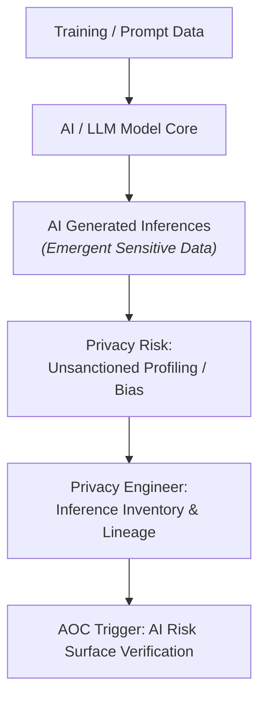

### 3.2 The EU AI Act and GDPR Intersection

The EU AI Act classifies AI systems by risk tier[^13]. EDPB/EDPS joint opinions emphasize that bias mitigation using sensitive data must remain strictly necessary and governed[^14].

> [!IMPORTANT]
> The EU AI Act risks establishing a **fourth organizational silo**: the AI Compliance Officer. The Privacy Engineer prevents this fragmentation by creating AOCs spanning privacy, security, compliance, and AI risk.

### 3.3 Agentic AI and the New Privacy Risk Surface

Agentic AI systems take autonomous actions without real-time human oversight[^15]. If an autonomous agent alters data retention or shares records during execution, accountability becomes diffused across DPO, SOC, and GRC roles.

### 3.4 Zero Trust Data Governance

Gartner predicts 50% of enterprises will adopt zero-trust data governance by 2028[^16]. Zero-trust mandates continuous evaluation of data access against dynamic policy rather than static access controls.

### 3.5 AI Model Collapse and Data Integrity

Model collapse—degradation caused by training on synthetic outputs[^17]—extends GDPR Art. 5(1)(d) (*Data Accuracy*) to synthetic inference streams.

---

## Part IV: Frameworks and Standards Alignment

### 4.1 NIST Privacy Framework 1.1

NIST Privacy Framework 1.1 aligns with CSF 2.0 across five functions: *Identify, Govern, Control, Communicate, Protect*[^18]. AOC mechanisms map directly to NIST subcategories to provide operational proof.

### 4.2 ISO/IEC 27701:2025

ISO 27701:2025 updates Privacy Information Management System (PIMS) mandates[^19]. It provides the audit lifecycle, while $ODS$ measures live operational performance.

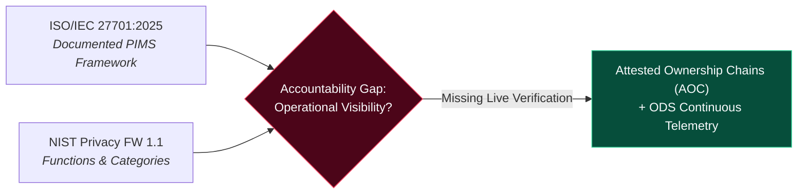

### 4.3 The Accountability Gap in Current Standards

Current standards define accountability by documentation rather than real-time visibility. An organization can maintain ISO 27701 certification while exhibiting an $ODS = 0.20$ for breach response if DPOs lack direct SIEM telemetry access.

---

## Part V: Empirical Evidence and Case Studies

### 5.1 The Twitter Case: DPO Not Added to Incident Ticket

In 2019, Twitter suffered a breach where staff failed to add the DPO to the internal incident ticket, delaying regulatory notification[^20].

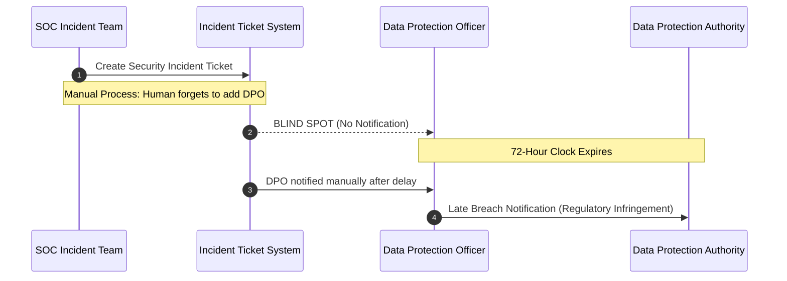

### 5.2 The HSE Case: Failure to Communicate with Data Subjects

The Irish DPC found that the Health Service Executive (HSE) violated GDPR Art. 34 by failing to inform data subjects without undue delay following a ransomware incident[^21].

### 5.3 The Capita Case: Failure to Respond to a Security Alert

The UK ICO penalized Capita plc for failing to address a priority "P2 Alert" promptly, violating UK GDPR Art. 5(f) and 32(1)(b)[^22].

### 5.4 The WUSPI Case: DPO Departure and Regulatory Correspondence

The Philippines National Privacy Commission (NPC) documented that WUSPI experienced notification delays because regulatory notices were routed to a departed DPO's email address[^23].

### 5.5 What the Case Law Reveals

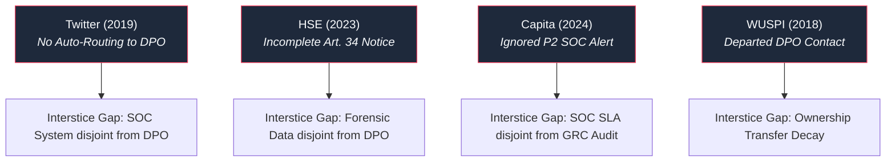

| Enforcement Action | Root Structural Failure | Affected $ODS$ Component | AOC Prevention Mechanism |
| :--- | :--- | :--- | :--- |
| **Twitter (Irish DPC, 2019)** | Ticket missing DPO routing tag | $Visibility(o,t) = 0$ | Automated SIEM-to-DPO SOAR ticket dispatch |
| **HSE (Irish DPC, 2023)** | Forensic scope not mapped to Art. 34 | $Single(o) = 0.5$ | Pre-compiled Art. 34 schema payload query |
| **Capita (UK ICO, 2024)** | P2 Alert SLA ignored by SOC | $Tenure(o,t) \text{ decay}$ | Real-time response SLA monitoring rule |
| **WUSPI (NPC Philippines, 2018)** | Contact details tied to departed DPO | $Transfer(o,t) = 0$ | HR-integrated role attestation handoff |

---

## Part VI: Data Classification Automation and the SOC

### 6.1 The Visibility Gap

Automated data classification tools (Axoflow[^24], Microsoft Sentinel[^25], Skyhigh Security[^26], Securonix[^27], BigID/7AI[^28]) enrich security alerts with privacy tags but require governance routing to be effective.

### 6.2 The Classification-to-Notification Pipeline

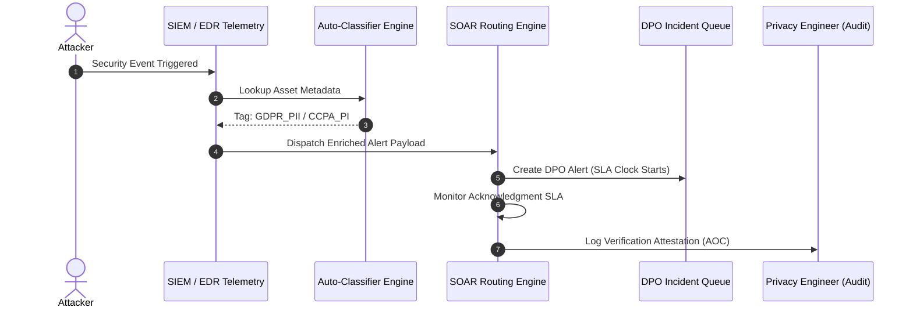

- **Stage 1: Asset Discovery**: Maintain asset catalog tagged by jurisdiction (`GDPR_PII`, `CCPA_PI`, `LGPD_DADOS`, etc.).
- **Stage 2: Alert Enrichment**: SIEM populates `data_classification` field automatically upon alert creation.
- **Stage 3: Routing Decision**: SOAR triggers a parallel DPO workstream if regulatory tags are present.
- **Stage 4: DPO Notification**: Structured alert dispatched containing asset name, classification, and SLA clock.
- **Stage 5: Acknowledgment Tracking**: SOAR tracks DPO response within defined SLAs.
- **Stage 6: Post-Incident Verification**: Privacy Engineer runs queries to confirm workflow completion.

### 6.3 The Cost of Automation

Implementation requires configuration of existing SIEM/SOAR platforms. The primary investment is **organizational change management** led by the Privacy Engineer.

---

## Part VII: Metrics, Benchmarks, and ROI

### 7.1 The 2026 Global Privacy Benchmarks

TrustArc's 2026 Global Privacy Benchmarks Report shows the Global Privacy Index declining to 53%[^29]. Organizations with technology-integrated privacy programs outperform fragmented programs by nearly 4x[^30].

### 7.2 The ICO Privacy Dividend

The UK ICO's *Privacy Dividend* report confirms that proactive prevention yields significantly lower costs than breach remediation[^31].

### 7.3 The ISACA PET ROI Study

ISACA's 2026 PET ROI study confirms that PET deployments reduce audit preparation friction and lower breach risk exposure[^32].

### 7.4 The Compensation Benchmark

By early 2026, technology privacy roles represented 27% of the workforce compared to legal roles at 5%[^33]. The privacy market expanded to \$7.54 Billion[^34], while breach notification failures represented ~40% of ICO penalty notices.

### 7.5 The Board Metrics Extended

We introduce Metrics 5 and 6 to complete the board reporting suite:

$$\text{PET Coverage Ratio (PCR)} = \frac{\text{Obligations with Active PET Enforcement}}{\text{Total Obligations Requiring PET Coverage}}$$

$$\text{AI Inference Inventory Coverage (AIIC)} = \frac{\text{AI Systems with Documented Inference Inventories}}{\text{Total AI Systems Processing Personal Data}}$$

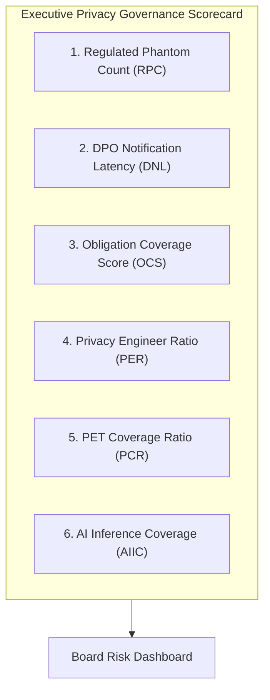

---

## Part VIII: The Privacy Engineer as a Formal Discipline

### 8.1 IAPP Recognition

In May 2026, the International Association of Privacy Professionals (IAPP) appointed Dylan Gilbert as Senior Fellow for Privacy Engineering[^35], formalizing the discipline's body of knowledge[^36].

### 8.2 The Job Market

Job postings for Privacy Engineers grew ~280% between 2021 and 2026[^37].

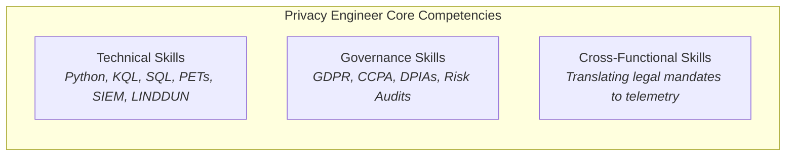

### 8.3 Skills and Competencies

| Domain | Required Skills | Operational Output |
| :--- | :--- | :--- |
| **Technical** | Python/SQL, KQL/SPL, PET Implementation, SIEM/SOAR Configuration | Automated AOC verification queries |
| **Governance** | Privacy by Design, Regulatory Frameworks (GDPR, CCPA, LGPD) | Unified obligation taxonomy mapping |
| **Cross-Functional** | Legal-to-Technical Translation, Stakeholder Management | Triad alignment & board metric reporting |

### 8.4 Compensation and Seniority

Privacy Engineers report jointly to the CISO (technical line) and DPO (functional line), commanding compensation parity with senior security engineering roles.

### 8.5 Where Organizations Are

Large enterprises are rapidly deploying dedicated privacy engineering capabilities, while mid-market organizations risk accumulating unmanaged privacy debt.

---

## Part IX: Privacy Debt and Technical Debt

### 9.1 The Concept

Privacy debt represents the accumulated cost of retrofitting missing privacy controls (Principal) plus ongoing exposure risk (Interest)[^38].

### 9.2 Privacy Debt and ODS

$$\text{Highest Remediation Priority} = \text{High Privacy Debt} + (ODS < 0.50)$$

```mermaid
quadrantChart
    title Privacy Debt vs ODS Prioritization Matrix
    x-axis Low ODS (High Decay) --> High ODS (Managed)
    y-axis Low Privacy Debt --> High Privacy Debt
    quadrant-1 Monitor & Maintain
    quadrant-2 IMMEDIATE REMEDIATION PRIORITY
    quadrant-3 Low Risk / Low Priority
    quadrant-4 Re-assign Ownership (AOC)
    "Legacy Unencrypted DB": [0.15, 0.85]
    "Consent Portal Preference Sync": [0.75, 0.30]
    "SIEM DPO Routing Rule": [0.25, 0.20]
    "Differential Privacy Query Log": [0.85, 0.75]
```

### 9.3 Quantifying Privacy Debt

$$\text{Privacy Debt Principal} = \text{Engineering Hours Required to Implement PET / AOC Controls}$$

$$\text{Privacy Debt Interest} = P(\text{Breach}) \times \text{Expected Penalty} + \text{Post-Incident Remediation Cost}$$

### 9.4 Privacy Debt as a Board Metric

Quarterly reporting presents Privacy Debt trends to the board in explicit financial terms.

---

## Part X: Organizational Psychology and Change Management

### 10.1 Why Silos Persist

Silos persist due to divergent performance incentives:
- **DPO**: Evaluated on legal compliance and documentation completion.
- **SOC**: Evaluated on Mean Time to Detect (MTTD) and Mean Time to Respond (MTTR).
- **GRC**: Evaluated on audit finding closures and static control testing.

### 10.2 The MIT Sloan Study

A 2026 MIT Sloan / IDfy study found enterprises struggle to consistently enforce privacy policies across fragmented infrastructures[^39].

### 10.3 Change Management Strategies

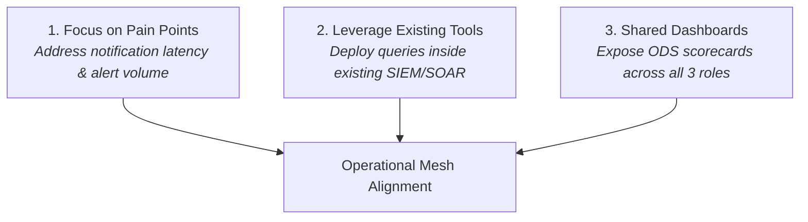

### 10.4 The Role of Leadership

Co-sponsorship by both the CISO and DPO is mandatory for successful Privacy Engineer deployment.

---

## Part XI: Updated Queries and Implementation Guidance

### 11.1 Enhanced KQL for Multi-Jurisdictional Alert Routing

```kql
// Azure Sentinel: Multi-Jurisdictional DPO Incident Routing Query
SecurityAlert
| where TimeGenerated > ago(30d)
| join kind=leftouter (
    AssetClassification
    | where Classification contains "GDPR_PII"
           or Classification contains "CCPA_PI"
           or Classification contains "LGPD_DADOS"
           or Classification contains "PIPL_PI"
           or Classification contains "DPDP_PERSONAL"
    | project AssetName, Classification, Jurisdiction
) on $left.CompromisedEntity == $right.AssetName
| where isnotempty(Classification)
| extend RequiredAuthority = case(
    Jurisdiction == "EU", "DPA_72h",
    Jurisdiction == "CA", "CPPA_30d",
    Jurisdiction == "BR", "ANPD_reasonable",
    Jurisdiction == "CN", "CAC_immediate",
    Jurisdiction == "IN", "DPB_reasonable",
    "UNKNOWN"
  )
| join kind=leftouter (
    DPONotifications
    | project AlertId, NotificationTime, Authority
) on $left.SystemAlertId == $right.AlertId
| where isempty(NotificationTime)
        or Authority != RequiredAuthority
        or (NotificationTime - TimeGenerated) > 4h
| project TimeGenerated, AlertSeverity, CompromisedEntity,
          Classification, Jurisdiction, RequiredAuthority,
          NotificationTime, Authority,
          GapHours = datetime_diff('hour', NotificationTime, TimeGenerated)
| order by TimeGenerated desc
```

### 11.2 SQL for PET Coverage Verification

```sql
-- ANSI SQL: PET Coverage & Stale Attestation Verification
SELECT 
    o.obligation_id,
    o.jurisdiction,
    o.obligation_type,
    p.pet_type,
    p.pet_status,
    p.last_verified,
    DATEDIFF(day, p.last_verified, GETDATE()) AS days_since_verification,
    CASE
        WHEN p.pet_status = 'ACTIVE' AND DATEDIFF(day, p.last_verified, GETDATE()) < 30 
            THEN 'COVERED'
        WHEN p.pet_status = 'ACTIVE' AND DATEDIFF(day, p.last_verified, GETDATE()) >= 30 
            THEN 'STALE_VERIFICATION'
        WHEN p.pet_status = 'DEGRADED' 
            THEN 'DEGRADED'
        ELSE 'NO_COVERAGE'
    END AS coverage_status
FROM obligation_inventory o
LEFT JOIN pet_registry p ON o.obligation_id = p.obligation_id
WHERE o.requires_pet = TRUE
ORDER BY coverage_status, days_since_verification DESC;
```

### 11.3 SPL for AI Inference Privacy Risk

```spl
# Splunk SPL: Uninventoried High-Risk AI Inferences
index=ai_systems status=active
| lookup privacy_inference_inventory system_id OUTPUT inference_type, personal_data_source, risk_level
| where isnull(inference_type)
| eval gap_type="NO_INFERENCE_INVENTORY"
| append [
    search index=ai_systems status=active
    | lookup privacy_inference_inventory system_id OUTPUT inference_type, personal_data_source, risk_level
    | where isnotnull(inference_type) AND risk_level="HIGH"
    | eval gap_type="HIGH_RISK_NO_MITIGATION"
  ]
| table system_id, system_name, inference_type, personal_data_source, risk_level, gap_type
| sort gap_type
```

### 11.4 Python for ODS with PET Component

```python
import datetime

def compute_ods(obligation: dict) -> dict:
    """
    Computes the complete Ownership Decay Score (ODS) including the PET component.
    """
    # 1. Single Ownership
    single = 0.5 if obligation.get('co_roles_count', 0) == 0 else 1.0
    
    # 2. Transfer Validation
    unvalidated_handoffs = len([
        h for h in obligation.get('attestation_history', [])
        if h.get('method') != 'system_record'
    ])
    transfer = max(0.0, 1.0 - (0.3 * unvalidated_handoffs))
    
    # 3. Visibility Assessment
    role_system_access = obligation.get('primary_role_systems', [])
    obligation_data_source = obligation.get('authoritative_system')
    visibility = 1.0 if obligation_data_source in role_system_access else 0.0
    
    # 4. Tenure Decay
    last_attest = obligation.get('last_attestation_date', datetime.date.today())
    days_since = (datetime.date.today() - last_attest).days
    tenure = 1.0 / (1.0 + (days_since / 90.0))
    
    # 5. PET Coverage Component
    pet_status = obligation.get('pet_status', 'NONE')
    pet_last_verified = obligation.get('pet_last_verified')
    
    if pet_status == 'ACTIVE' and pet_last_verified:
        days_since_pet = (datetime.date.today() - pet_last_verified).days
        pet = 1.0 if days_since_pet < 30 else 0.75
    elif pet_status == 'DEGRADED':
        pet = 0.60
    else:
        pet = 0.50
        
    ods_score = single * transfer * visibility * tenure * pet
    
    return {
        'obligation_id': obligation['id'],
        'ods_score': round(ods_score, 3),
        'components': {
            'single': single,
            'transfer': transfer,
            'visibility': visibility,
            'tenure': round(tenure, 3),
            'pet': pet
        },
        'risk_flag': ods_score < 0.50
    }
```

### 11.5 Implementation Roadmap

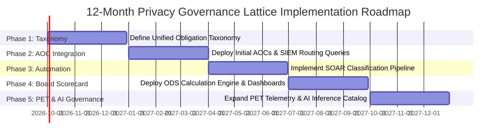

---

## Part XII: Future Research Directions

### 12.1 Quantum Computing and Privacy Governance

Post-Quantum Cryptography (PQC) migration strategies represent a crucial requirement for maintaining long-term technical confidentiality under GDPR Art. 32.

### 12.2 Decentralized Identity

Verifiable Credentials (VCs) alter data minimization models, requiring DPOs to adjust assessment strategies for decentralized assertions.

### 12.3 Global Regulatory Convergence

Monitoring global cross-border privacy rules and adequacy frameworks enables dynamic alignment of AOC taxonomies.

### 12.4 Privacy in ESG Reporting

Integrating privacy metrics ($ODS$, $DNL$, $PCR$) into ESG governance scorecards establishes public corporate accountability.

### 12.5 The Privacy Engineer as a Profession

Milestones include standardized certification tracks beyond CIPT, formal university curricula, and recognized professional registries.

---

## Conclusion: The Cherry Cake Assembled

The original paper asked why three roles sharing privacy responsibility routinely experience governance failures. The root cause is architectural: disconnected systems of record, terminology, and operational definitions of completion.

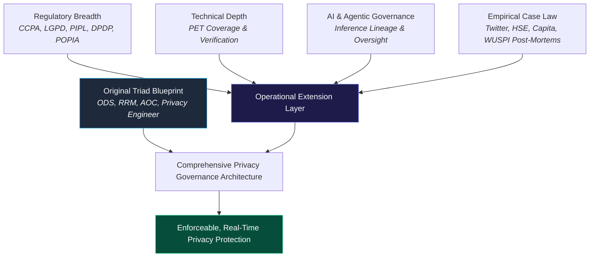

Organizations adopting this Lattice model maintain real-time visibility into their $ODS$, enforce continuous AOC validation, and position the Privacy Engineer to bridge legal requirements with operational telemetry. Governance transitions from an aspirational documentation exercise to an audit-proof technical reality.

---

## Series Connections & References

### Primary Series Connections
- **Primary Foundation Paper**: *"The Privacy Governance Triad: Three Owners, Zero Accountability"* (25-09-2026).
- **Entropy & Decay Models**: *"The SOC-GRC Entropy Model"* (07-09-2026) and *"The Exception Lifecycle Decay Model"* (14-09-2026).
- **Closed Loop Operations**: *"The IR-GRC Closed Loop Architecture"* (15-09-2026).

---

### References & Footnotes

[^1]: California Privacy Protection Agency (CPPA), *Finalized Regulations on Risk Assessments, Cybersecurity Audits, and Automated Decision-Making*, Jan 1, 2026.
[^2]: CPPA Enforcement Division, *Enforcement Advisory: Data Minimization and Purpose Limitation Standards*, 2026.
[^3]: California Consumer Privacy Act (CCPA/CPRA), Cal. Civ. Code § 1798.185(a)(15).
[^4]: Autoridade Nacional de Proteção de Dados (ANPD), *Regulatory Enforcement Framework & Federal Agency Elevation*, 2025.
[^5]: Personal Information Protection Law of the People's Republic of China (PIPL), effective Nov 1, 2021.
[^6]: Cyberspace Administration of China (CAC), *Guidelines on Data Cross-Border Transfer and National Security Assessments*, 2025.
[^7]: Ministry of Electronics and Information Technology (MeitY), India, *Digital Personal Data Protection (DPDP) Rules, 2025*, notified Nov 13, 2025.
[^8]: DPDP Act, 2023, Sections 6–13 (Data Fiduciary Obligations and Principal Rights).
[^9]: DPDP Act, 2023, Section 8(7) (Mandatory Data Erasure Standards).
[^10]: MeitY, *Framework for Registration and Operational Standards of Consent Managers*, 2025.
[^11]: Dwork, C., & Roth, A., *The Algorithmic Foundations of Differential Privacy*, Foundations and Trends in Theoretical Computer Science, 2014.
[^12]: Gartner Research, *Predicts 2026: AI Inferences as the Primary Privacy Incident Vector*, 2026.
[^13]: Regulation (EU) 2024/1689 of the European Parliament and of the Council (EU AI Act), OJ L 2024/1689.
[^14]: EDPB-EDPS Joint Opinion 1/2026 on the Digital Omnibus on Artificial Intelligence and Fundamental Rights Safeguards, 2026.
[^15]: Asia Pacific Privacy Authorities (APPA) Forum, *Roundtable Report: Understanding Agentic AI: Key Data Protection and Privacy Risks*, 2026.
[^16]: Gartner Research, *Zero-Trust Data Governance Architecture Guidelines*, 2026.
[^17]: Gartner Research, *Mitigating AI Model Collapse Through Data Provenance Verification*, 2026.
[^18]: National Institute of Standards and Technology (NIST), *NIST Privacy Framework 1.1: Revision & CSF 2.0 Alignment*, 2026.
[^19]: International Organization for Standardization, *ISO/IEC 27701:2025 Information security, cybersecurity and privacy protection — Privacy information management*, 2025.
[^20]: Data Protection Commission (DPC) Ireland, *Inquiry into Twitter International Company (Data Breach Notification Latency)*, Decision IN-19-1, 2019.
[^21]: Data Protection Commission (DPC) Ireland, *Inquiry into Health Service Executive (Article 34 Compliance)*, 2023.
[^22]: Information Commissioner's Office (ICO) UK, *Penalty Notice: Capita plc (Security Control Effectiveness & Priority Incident SLA)*, 2024.
[^23]: National Privacy Commission (NPC) Philippines, *Administrative Adjudication: WUSPI Breach Correspondence Failure*, 2018.
[^24]: Axoflow, *Real-time Security Data Curation & Privacy Enrichment Pipelines*, 2026.
[^25]: Microsoft Sentinel, *Automated Incident Enrichment with Data Classification Rules*, 2026.
[^26]: Skyhigh Security, *ML Auto Classifiers for Enterprise Data Protection*, 2026.
[^27]: Securonix, *Data Pipeline Agent & Telemetry Governance Architecture*, 2026.
[^28]: BigID & 7AI, *Contextual Data Telemetry for the Agentic SOC*, 2026.
[^29]: TrustArc, *2026 Global Privacy Benchmarks Report: Index Findings across 1,844 Enterprises*, 2026.
[^30]: TrustArc, *Technology Integration and Operational Maturity Benchmarks*, 2026.
[^31]: Information Commissioner's Office (ICO) UK, *The Privacy Dividend: The Business Case for Proactive Privacy Protection*, 2025.
[^32]: ISACA Research, *The Strategic ROI of Privacy Enhancing Technologies in the AI Era*, 2026.
[^33]: Workforce Analytics, *Privacy Engineering Compensation & Demographics Report*, Feb 2026.
[^34]: Industry Research, *Global Privacy Software & Engineering Market Analysis 2026*, 2026.
[^35]: International Association of Privacy Professionals (IAPP), *Appointment of Dylan Gilbert as Senior Fellow for Privacy Engineering*, May 2026.
[^36]: IAPP, *Privacy Engineering Professional Framework and Curriculum*, 2026.
[^37]: LinkedIn Economic Graph, *Privacy Engineering Talent Trends 2021–2026*, 2026.
[^38]: Larrucea, X., Santamaría, I., & Graña Romay, M., *Quantifying Privacy Debt in Complex Software Architectures*, IEEE Software, 2025.
[^39]: MIT Sloan Management Review India & IDfy, *Enterprise Privacy Enforcement at Scale: Empirical Challenges*, 2026.

---

> [!QUOTE]
> **Closing Reflection**: *"Privacy governance has three owners and zero owners. Diffuse ownership is the fastest-decaying ownership there is. The $ODS$ measures how accountability decays. The $AOC$ makes the decay visible. The Privacy Engineer makes the decay fixable. The cherry cake is not a metaphor. It is the integrated architecture of roles, technologies, and metrics that makes privacy governance enforceable rather than aspirational."* — **Research Supplement, September 25, 2026**
