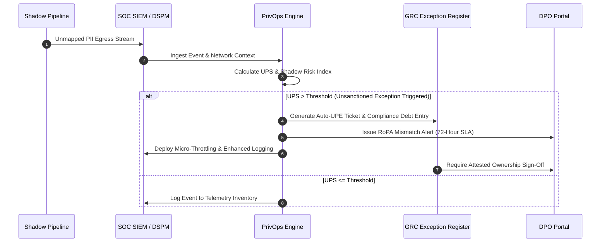
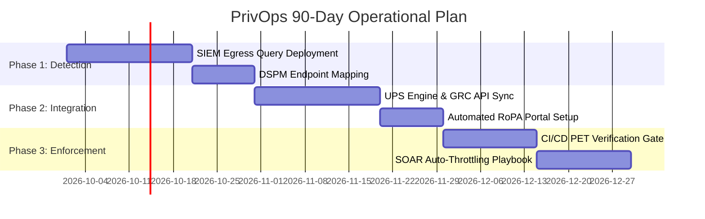

# THE PRIVACY GOVERNANCE TRIAD AND THE UNSANCTIONED PROCESSING EXCEPTION
## Operationalizing Shadow Data Pipeline Detection, Unsanctioned Risk Exceptions, and Automated Privacy Control Verification

[](#)
[](#)

---

### Metadata & Document Controls

| Metadata Field | Value |
| :--- | :--- |
| **Document Title** | The Privacy Governance Triad and the Unsanctioned Processing Exception |
| **Author** | Manjil Katuwal (hiro001-eth) |
| **Publication Date** | September 27, 2026 |
| **Version Target** | 1.0 (Production Release) |
| **Prerequisites** | *"Beyond the Triad: The Missing Dimensions"* (25-09-2026), *"The IR-GRC Closed Loop"* (15-09-2026) |
| **Telemetry & Queries** | Azure Sentinel KQL, Splunk SPL, ANSI SQL, Python PrivOps Engine |

---

## Executive Summary & Visual Architecture

The Privacy Governance Triad—the Data Protection Officer (DPO), Security Operations Center (SOC), and Governance, Risk, and Compliance (GRC)—suffers from a structural breakdown: **Unsanctioned Processing Exceptions (UPE)**. 

When engineering teams deploy shadow microservices, stream PII into external LLM endpoints, or mirror databases into unencrypted cloud staging environments without formal DPIA approval, they create an unsanctioned exception. The DPO remains unaware because static Records of Processing Activities (RoPA) miss live traffic. The SOC treats the outbound TLS connection as routine background noise. GRC tracks formal risk registers while invisible legal and technical debt accumulates.

To bridge this operational void, this paper formalizes the **Unsanctioned Processing Score ($UPS$)**, defines the **Shadow Risk Index ($SRI$)**, and delivers an automated **PrivOps Closed-Loop Engine** that converts detected network telemetry into live GRC exceptions and DPO notifications.

```mermaid
graph TB
    subgraph Legacy_Triad["Legacy Triad Disconnect"]
        DPO["DPO / Legal<br/><i>Static RoPA & DPIAs</i>"]
        SOC["SOC / Operations<br/><i>SIEM & Network Egress</i>"]
        GRC["GRC / Audit<br/><i>Formal Risk Register</i>"]
        
        DPO -.-|"No Live Visibility"| SOC
        SOC -.-|"No Privacy Context"| GRC
        GRC -.-|"No Telemetry Sync"| DPO
    end

    subgraph UPE_Path["Unsanctioned Processing Exception (UPE)"]
        Eng["Engineering / Data Science"] -->|"Unsanctioned ETL / LLM Prompt"| Egress["External Data Egress<br/><i>Unmapped S3 / Third-Party APIs</i>"]
        Egress -->|"PII / Sensitive Leakage"| Fine["Regulatory Breach & Penalties"]
    end

    subgraph PrivOps_Mesh["PrivOps Closed-Loop Mesh"]
        DSPM["DSPM & SIEM Telemetry"] <==> SOC_Engine["KQL / SPL Rule Engine"]
        SOC_Engine <==> PrivOps["PrivOps Risk Engine ($UPS$)"]
        PrivOps <==> GRC_Sync["Auto-GRC Exception Register"]
        GRC_Sync <==> DPO_Sync["Real-Time RoPA & AOC Portal"]
    end

    style Legacy_Triad fill:#0F172A,stroke:#64748B,color:#94A3B8,stroke-width:1px
    style UPE_Path fill:#4C0519,stroke:#F43F5E,color:#F8FAFC,stroke-width:2px
    style PrivOps_Mesh fill:#020617,stroke:#3B82F6,color:#F8FAFC,stroke-width:2px
    style PrivOps fill:#1E293B,stroke:#38BDF8,color:#F8FAFC,stroke-width:2px
```



---

## Mechanics of the Unsanctioned Processing Exception (UPE)

An Unsanctioned Processing Exception occurs when data processing proceeds without explicit legal basis authorization, privacy impact verification, or documented risk acceptance.

### Root Causes of UPE Exposure

1. **Velocity Mismatch**: Software release cycles deploy cloud infrastructure in minutes, while traditional DPIA governance reviews require weeks.
2. **AI Payload Exfiltration**: Developer prompts sent to public third-party LLMs contain raw customer identifiers, diagnostic telemetry, or financial records.
3. **Shadow Analytics & ETL Pipelines**: Unmonitored cron jobs mirror production SQL databases into unencrypted analytics buckets.
4. **Siloed Alert Rules**: SOC detection logic triggers on malware signatures or credential dumping, but ignores compliance deviations such as unencrypted PII crossing geographical boundaries.

### Comparative Governance Analysis

| Operational Scenario | DPO Assumption | SOC Observation | GRC Record | UPE Reality |
| :--- | :--- | :--- | :--- | :--- |
| **Third-Party AI Call** | Standard vendor DPA signed | Outbound HTTPS request to external IP | No risk ticket filed | Customer PII streamed into unapproved AI model |
| **Cloud Staging Bucket** | Data anonymized per retention policy | Internal AWS S3 sync traffic | Exception logged as resolved | Raw PII copied without PET protection |
| **SaaS Analytics Integration** | Processing covered under main ToS | Standard API REST GET/POST payload | No entry in risk register | Third-party tracking script capturing form input |

---

## Mathematical Formalization of Shadow Risk

To eliminate subjective risk assessments, we quantify unsanctioned processing using two mathematical models.

### 1. Unsanctioned Processing Score ($UPS$)

For any data pipeline $p$ operating at time $t$:

$$UPS(p,t) = \frac{S_d(p) \times V_e(p,t) \times T_d(p,t)}{L_c(p) \times P_l(p)}$$

Where:
- $S_d(p) \in [1, 10]$: **Data Sensitivity Index** (1 = Public data, 10 = Biometric / Financial PII).
- $V_e(p,t)$: **Egress Volume** in gigabytes over evaluation window $t$.
- $T_d(p,t)$: **Dwell Duration** in days since pipeline inception without DPO sanction.
- $L_c(p) \in (0, 1]$: **Logging Coverage Ratio** (Fraction of pipeline telemetry ingested by SIEM).
- $P_l(p) \in [1, 5]$: **PET Enforcement Level** (1 = Raw plaintext, 5 = Differential Privacy / HE).

### 2. Shadow Risk Index ($SRI$)

The aggregate organization-wide exposure from all unmapped data processing pipelines $K$:

$$SRI(t) = \sum_{p=1}^{K} UPS(p,t) \times \left(1 - \frac{AOC(p)}{100}\right)$$

Where $AOC(p)$ represents the **Attested Ownership Chain** completeness percentage for pipeline $p$.

---

## Production Telemetry & Detection Logic

Operationalizing UPE detection requires translating network flow logs and endpoint events into compliance-aware alerts.

### 1. Azure Sentinel KQL: Unsanctioned PII Egress to External AI Endpoints

```kql
// Detect Unsanctioned PII Data Egress to External LLM / Cloud Endpoints
let ApprovedAPIs = dynamic(["api.sanctioned-vendor.com", "internal-pii-service.local"]);
let PIITerms = dynamic(["ssn", "credit_card", "passport", "email", "dob", "full_name"]);
CommonSecurityLog
| where DeviceAction == "allowed"
| where DestinationHostName !in (ApprovedAPIs)
| where RequestURL has_any (PIITerms) or AdditionalExtensions has_any (PIITerms)
| summarize EgressBytes = sum(SentBytes), EventCount = count(), FirstSeen = min(TimeGenerated), LastSeen = max(TimeGenerated) by SourceIP, DestinationHostName, RequestURL
| extend DwellDays = datetime_diff('day', LastSeen, FirstSeen)
| extend DataSensitivity = case(RequestURL has "ssn", 10, RequestURL has "credit_card", 9, 6)
| extend UPS_Score = (DataSensitivity * (EgressBytes / 1048576) * max_of(DwellDays, 1)) / 1.0
| where UPS_Score > 50.0
| project FirstSeen, LastSeen, SourceIP, DestinationHostName, EgressBytes, UPS_Score
| sort by UPS_Score desc
```

### 2. Splunk SPL: Identifying Unmapped ETL Microservice Exfiltration

```spl
index=cloud_telemetry sourcetype="aws:cloudwatch:vpcflow" action="ACCEPT"
| lookup sanctioned_processing_inventory.csv dest_ip OUTPUT is_sanctioned, legal_basis, owner
| eval is_sanctioned=if(isnotnull(is_sanctioned), is_sanctioned, "FALSE")
| search is_sanctioned="FALSE"
| stats sum(bytes) as TotalBytes, count as Connections, min(_time) as FirstSeen, max(_time) as LastSeen by src_ip, dest_ip, dest_port
| eval DwellHours = round((LastSeen - FirstSeen)/3600, 2)
| eval MB_Egress = round(TotalBytes / 1048576, 2)
| where MB_Egress > 100
| table FirstSeen, LastSeen, src_ip, dest_ip, dest_port, MB_Egress, DwellHours, is_sanctioned
```

### 3. Python Engine: PrivOps Risk Calculation & GRC Exception Trigger

```python
import time
from typing import Dict, Any

class PrivOpsEngine:
    """Calculates UPS score and automatically triggers GRC exceptions for shadow pipelines."""
    
    def __init__(self, ups_threshold: float = 50.0):
        self.ups_threshold = ups_threshold

    def calculate_ups(self, pipeline: Dict[str, Any]) -> float:
        sensitivity = pipeline.get("data_sensitivity", 1.0)
        egress_gb = pipeline.get("egress_gb", 0.1)
        dwell_days = max(pipeline.get("dwell_days", 1), 1)
        logging_cov = max(pipeline.get("logging_coverage", 0.5), 0.1)
        pet_level = max(pipeline.get("pet_level", 1.0), 1.0)
        
        ups = (sensitivity * egress_gb * dwell_days) / (logging_cov * pet_level)
        return round(ups, 2)

    def evaluate_pipeline(self, pipeline_id: str, payload: Dict[str, Any]) -> Dict[str, Any]:
        ups = self.calculate_ups(payload)
        is_upe = ups > self.ups_threshold
        
        return {
            "pipeline_id": pipeline_id,
            "ups_score": ups,
            "is_unsanctioned_exception": is_upe,
            "action_required": "FLAG_GRC_AND_DPO" if is_upe else "PASS",
            "timestamp": int(time.time())
        }

if __name__ == "__main__":
    engine = PrivOpsEngine(ups_threshold=45.0)
    sample_pipeline = {
        "data_sensitivity": 9.0,
        "egress_gb": 12.5,
        "dwell_days": 14,
        "logging_coverage": 0.8,
        "pet_level": 1.0
    }
    result = engine.evaluate_pipeline("pipe-shadow-llm-09", sample_pipeline)
    print(f"PrivOps Evaluation: {result}")
```

---

## PrivOps Closed-Loop Remediation Workflow

When the telemetry engine identifies an unsanctioned data flow, it initiates an automated remediation sequence across SOC, GRC, and DPO workflows.



---

## Regulatory Mapping & Compliance Framework Matrix

Connecting telemetry alerts directly to regulatory mandates ensures audit enforceability.

| Regulatory Standard | Mandated Control | UPE Failure Mode | PrivOps Automated Solution |
| :--- | :--- | :--- | :--- |
| **GDPR Art. 6 & 9** | Valid legal basis for processing | Shadow ETL lacks documented legal basis | Real-time traffic block on unmapped destinations |
| **GDPR Art. 30** | Records of Processing Activities | RoPA becomes stale within weeks of audit | Dynamic API & DSPM RoPA auto-synchronization |
| **CCPA / CPRA § 1798.100** | Notice at Collection & Purpose Limit | Data routed to unapproved analytics vendor | Automated outbound API schema validation |
| **ISO/IEC 27701:2025** | Control 6.5.2 (Conditions for PII) | Unsanctioned cross-border PII transfer | Network boundary alert on non-compliant geo-IPs |
| **DORA Art. 6 & 11** | ICT Risk & Data Protection | Cloud staging storage lacks encryption | Automated bucket lockdown via SOAR playbooks |

---

## Execution Roadmap

Implementing a PrivOps architecture requires a structured 90-day phase-in.



### 30-60-90 Day Milestones

- **Days 1–30 (Telemetry Baseline)**: Deploy KQL/SPL egress monitoring rules; identify all unapproved external API and cloud destination IPs.
- **Days 31–60 (Governance Integration)**: Connect the $UPS$ calculation engine to the GRC exception register; automate DPO alerting when RoPA mismatches occur.
- **Days 61–90 (Closed-Loop Enforcement)**: Implement mandatory PET verification gates in CI/CD pipelines; deploy SOAR playbooks to throttle unverified high-volume PII streams.

---

## Conclusion

Unsanctioned Processing Exceptions represent an unmonitored failure mode at the intersection of security and privacy operations. By deploying continuous telemetry monitoring, mathematical risk scoring ($UPS$), and automated closed-loop governance, organizations eliminate shadow data pipelines before they escalate into regulatory breaches.
