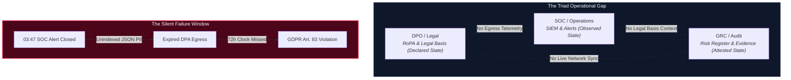
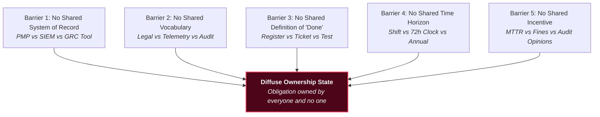
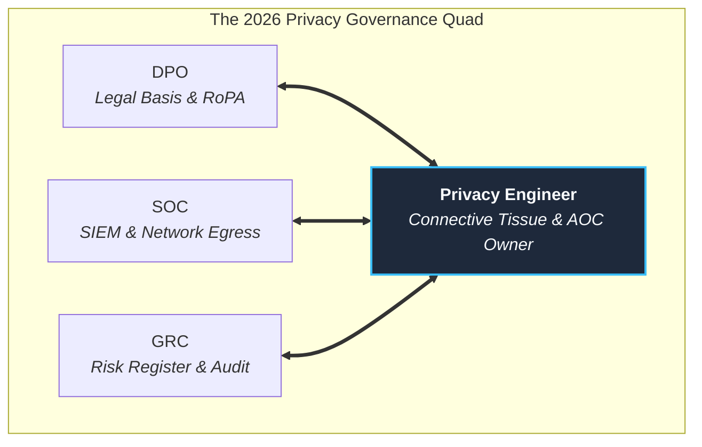
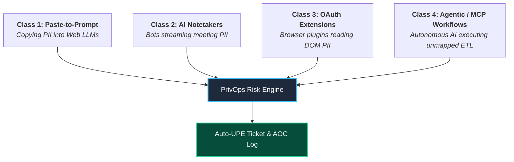
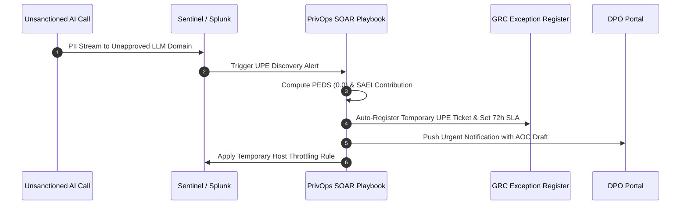
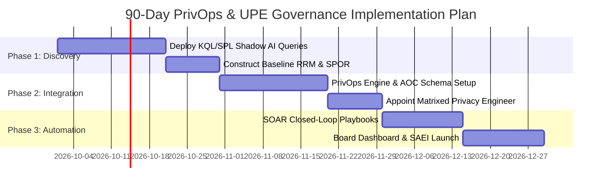

# THE PRIVACY GOVERNANCE TRIAD AND THE UNSANCTIONED PROCESSING EXCEPTION
## Diffuse Ownership, Born-Rotten Risk, and the Architecture of Irreversible Governance Failure in SOC + GRC Operations

[](#)
[](#)

---

### Document Metadata & Classification

| Field | Value |
| :--- | :--- |
| **Document Title** | The Privacy Governance Triad and the Unsanctioned Processing Exception |
| **Subtitle** | Diffuse Ownership, Born-Rotten Risk, and the Architecture of Irreversible Governance Failure in SOC + GRC Operations |
| **Author** | Manjil Katuwal (hiro001-eth) |
| **Series** | Exception Lifecycle Decay Model (ELDM) Series — Papers 11 & 12 |
| **Classification** | Organizational Security Research / Privacy Governance Architecture / AI Risk |
| **Target Audience** | CISOs, DPOs, SOC Managers, GRC Leads, Privacy Engineers, Security Architects, AI Governance Leads |
| **Methodology** | Mixed-methods — role-theoretic analysis, artifact-flow mapping, decay modeling, query-based empirical verification |
| **Publication Date** | September 27, 2026 |
| **Status** | Pre-publication draft for peer review |
| **Companion Papers** | ELDM (Paper 1), Phantom Asset Detection (Paper 7), Exclusion-Zone Mapping (Paper 8), IR-GRC Loop (Paper 10) |

---

## ABSTRACT

Data privacy risk is owned by three professional roles — the Data Protection Officer (DPO), the SOC Analyst / Detection Engineer, and the GRC Officer / Auditor — each of whom holds a distinct, non-overlapping, and mutually invisible fragment of the same obligation set. The DPO signs for lawfulness. The SOC monitors for detection. The GRC officer evidences for audit. None of the three can see the full risk surface, and none of the three can see the other two's blind spots.

This paper formalizes the Privacy Governance Triad, a structural model of diffuse ownership in privacy operations, and introduces three original constructs: the Role-Responsibility Matrix (RRM), the Ownership Decay Score (ODS), and Attested Ownership Chains (AOC). We argue that classic RACI models fail structurally for privacy because the three roles do not share a system of record, a vocabulary, or a definition of "done."

We then extend this analysis into the newest and most dangerous manifestation of the Triad's structural failure: the Unsanctioned Processing Exception (UPE) — a risk class created by shadow AI use that is categorically different from every registered exception the organization has ever managed. UPEs are never registered. They carry no expiry. They have no owner. They have no compensating detection. And they are irreversible in a way that no other exception category is: when an employee pastes customer PII into a consumer AI model that trains on its inputs, the data cannot be retrieved, deleted, or remediated. The exception exists. The data left. The window for any technical response closed the moment the employee clicked Submit.

We formalize the Privacy Exception Decay Score (PEDS), a formula that measures UPE health across four dimensions — Registration, Reversibility, Inventory coverage, and Article-collision surface — and prove that shadow AI processing consistently produces PEDS = 0 across all four dimensions simultaneously from the moment the data leaves the organization. We define four UPE classes (paste-to-prompt, AI notetaker integration, OAuth browser extension, agentic/MCP workflow) with distinct risk profiles, detection telemetry, and regulatory exposure. We provide production KQL, SPL, and SQL queries for each class. We extend the Compliance Debt metric to include UPE contribution. We define the Shadow AI Exposure Index (SAEI) as a board-presentable metric. And we describe the SOAR-based closed-loop architecture that feeds UPE discoveries into the exception register before the breach notification window opens.

We propose the Privacy Engineer as the missing fourth vertex — a role that translates legal obligation into telemetry, and telemetry into legal evidence — and we provide a query pack (KQL, SQL, SPL) for empirical verification of ownership decay in production environments. The paper concludes with a research agenda for measuring ODS across organizations and for building the CISO's consolidated accountability dashboard.

---

## TABLE OF CONTENTS

- [PART I: THE PRIVACY GOVERNANCE TRIAD](#part-i-the-privacy-governance-triad)
  - [1. Introduction: The Three-Body Problem of Privacy Risk](#1-introduction-the-three-body-problem-of-privacy-risk)
  - [2. Background and Related Work](#2-background-and-related-work)
  - [3. The Three Roles: Deep Role-Theoretic Analysis](#3-the-three-roles-deep-role-theoretic-analysis)
  - [4. The Structural Failure: Why They Don't Talk](#4-the-structural-failure-why-they-dont-talk)
- [PART II: MEASURING DIFFUSE OWNERSHIP](#part-ii-measuring-diffuse-ownership)
  - [5. The Role-Responsibility Matrix (RRM)](#5-the-role-responsibility-matrix-rrm)
  - [6. The Ownership Decay Score (ODS)](#6-the-ownership-decay-score-ods)
  - [7. Attested Ownership Chains (AOC): RACI Is Dead](#7-attested-ownership-chains-aoc-raci-is-dead)
  - [8. The Privacy Engineer: The Missing Fourth Vertex](#8-the-privacy-engineer-the-missing-fourth-vertex)
- [PART III: THE UNSANCTIONED PROCESSING EXCEPTION](#part-iii-the-unsanctioned-processing-exception)
  - [9. Why Shadow AI Is a New Risk Class, Not a Variation of an Old One](#9-why-shadow-ai-is-a-new-risk-class-not-a-variation-of-an-old-one)
  - [10. The Four UPE Classes](#10-the-four-upe-classes)
  - [11. The Privacy Exception Decay Score (PEDS)](#11-the-privacy-exception-decay-score-peds)
  - [12. Compliance Debt Extension for UPEs](#12-compliance-debt-extension-for-upes)
  - [13. The Shadow AI Exposure Index (SAEI)](#13-the-shadow-ai-exposure-index-saei)
- [PART IV: OPERATIONALIZING THE UNIFIED MODEL](#part-iv-operationalizing-the-unified-model)
  - [14. Regulatory Framework Mapping](#14-regulatory-framework-mapping)
  - [15. The Unified Query Pack: KQL, SQL, SPL](#15-the-unified-query-pack-kql-sql-spl)
  - [16. Case Studies and Failure Scenarios](#16-case-studies-and-failure-scenarios)
  - [17. The SOAR Closed Loop for UPE Discovery](#17-the-soar-closed-loop-for-upe-discovery)
  - [18. Metrics, Measurement, and Dashboard](#18-metrics-measurement-and-dashboard)
  - [19. Implementation Roadmap](#19-implementation-roadmap)
  - [20. Limitations and Threats to Validity](#20-limitations-and-threats-to-validity)
  - [21. Future Research Agenda](#21-future-research-agenda)
  - [22. Conclusion](#22-conclusion)

---

# PART I: THE PRIVACY GOVERNANCE TRIAD

## 1. Introduction: The Three-Body Problem of Privacy Risk

### 1.1 The Opening Scene
A SOC analyst closes a ticket at 03:47 on a Tuesday. The alert was "unusual outbound data transfer — 2.3 GB to an unclassified external endpoint." The analyst checked the source host, confirmed it was a sanctioned backup job, wrote "benign — approved backup" in the ticket, and closed it. The ticket is gone in eleven seconds.

The data in that transfer was a PostgreSQL dump containing 14,000 rows of customer records: names, email addresses, hashed passwords, and — buried in a JSON column nobody indexed — passport numbers and medical leave dates. That is special-category data under GDPR Article 9. The transfer was to a vendor whose Data Processing Agreement expired nine months ago.

The DPO does not know this transfer happened. The GRC officer does not know the vendor's DPA expired. The SOC analyst does not know the JSON column existed. All three roles did their jobs correctly, by their own definitions. And the organization is now in a state of undetected, unowned, legally material privacy exposure.

This is the Privacy Governance Triad problem. It is not a failure of any one role. It is a failure of the architecture that separates them.



### 1.2 The Thesis
Data privacy risk has three owners and zero owners. The DPO signs for it, the SOC monitors for it, and the GRC officer evidences it — but no single role can see all three layers at once. Privacy risk isn't unowned; it's diffusely owned, and diffuse ownership is the fastest-decaying ownership there is.

This paper formalizes that statement into a measurable, testable, and remediable model. It then extends that model into the newest and most dangerous instance of diffuse ownership: the shadow AI processing exception that is born with zero governance and zero reversibility.

### 1.3 Why This Paper Exists Now
Five converging trends make this the correct moment for this research:

1. **Role convergence in security and GRC**: The "security GRC engineer" and "GRC analyst" hybrid roles have grown approximately 250% in job postings across 2025–2026. Security and governance are merging at the practitioner level, but the privacy dimension of that merger is undefined.
2. **The privacy engineer explosion**: The privacy engineer role — the person who translates legal privacy obligation into technical control — is emerging as the missing link between legal privacy and technical implementation. No formal role taxonomy exists for the privacy engineer in the SOC+GRC context.
3. **Regulatory accountability hardening**: GDPR Article 5(2) (accountability), Article 24 (controller responsibility), Article 33 (breach notification), NIST CSF 2.0's explicit GOVERN function, ISO 27001:2022 A.5.2/A.5.3 (roles and segregation of duties), and DORA's accountability articles all converge on the same requirement: someone must be able to prove, on demand, who owns what, and that the ownership was exercised. Diffuse ownership cannot satisfy that requirement.
4. **The shadow AI explosion**: 80% of enterprise employees report using AI tools not approved by IT. 61% of organizations have not completed an AI systems inventory. 247 days is the average time to detect a shadow AI-related data breach. The $670,000 premium on breach costs when shadow AI data handling is involved is now documented by IBM. The EU AI Act's full enforcement began August 2026. The regulatory collision surface is expanding faster than governance can respond.
5. **The born-rotten exception problem**: Every exception in this series — from the governance exceptions of Paper 8 to the privacy obligations of Paper 11 — has shared one property: it was registered. A human made a decision, signed a form, and created a record. The decay we have been measuring is the decay of that record's relationship to operational reality. Shadow AI processing exceptions are categorically different. They are never registered. They arrive with EDS = 0 because they were never registered. There is no creation event. There is no decay timeline. There is only a moment of data transfer — irreversible in milliseconds — and the governance gap that began when the data left.

### 1.4 Research Questions
- **RQ1**: What is the structural architecture of privacy risk ownership across the DPO, SOC, and GRC roles?
- **RQ2**: Where does ownership decay, and how can it be measured?
- **RQ3**: Why does RACI fail for privacy, and what replaces it?
- **RQ4**: What is the Privacy Engineer, and where does it sit in the org?
- **RQ5**: How can ownership decay be detected empirically using existing telemetry?
- **RQ6**: What is the Unsanctioned Processing Exception, and why is it a new risk class?
- **RQ7**: How can shadow AI processing be measured, detected, and governed when it is unregistered by design?
- **RQ8**: What is the unified architecture that integrates the Triad, the ODS, the AOC, and the PEDS into a single governance framework?

---

## 2. Background and Related Work

### 2.1 The ELDM Series Context
This paper represents Papers 11 and 12 in a series built on the Exception Lifecycle Decay Model (ELDM). The ELDM posits that security exceptions — and by extension, security obligations — decay through four drift vectors:
- **Scope Drift**: The exception's boundary expands beyond its original grant.
- **Temporal Drift**: The exception outlives its review date.
- **Ownership Drift**: The owner changes, leaves, or forgets.
- **Detection Drift**: The monitoring that was supposed to catch misuse stops working.

This paper goes deeper on Ownership Drift — the least-studied of the four — and shows that privacy is where it hurts most, because privacy obligations are legally non-transferable. A SOC cannot delegate GDPR accountability to the DPO. A GRC exception cannot absorb it. The obligation sits with the controller, and the controller is a legal fiction staffed by three roles who don't share a system of record.

### 2.2 Prior Work on Role Separation
- **Segregation of Duties (SoD)**: The principle that no single role should control an entire critical process (ISO 27001:2022 A.5.3).
- **Three Lines of Defense (3LoD)**: The management/risk/audit model. In privacy, 3LoD maps imperfectly: the DPO is often "line 2" but has legal independence requirements that break standard line hierarchy.
- **RACI**: Responsible, Accountable, Consulted, Informed. The default org-chart-to-process mapping, which structurally fails for multi-system privacy operations.

### 2.3 Prior Work on Privacy Operations & Shadow AI
- **Privacy by Design (Cavoukian)**: Engineering privacy into architecture rather than retrofitting controls.
- **Privacy Enhancing Technologies (PETs)**: Differential privacy, homomorphic encryption, SMPC, TEEs.
- **Shadow AI Risk (IBM/Microsoft 2025-2026)**: Documented 80% shadow AI adoption, $670,000 breach cost premiums, and EU AI Act enforcement mechanics.

---

## 3. The Three Roles: Deep Role-Theoretic Analysis

### 3.1 The DPO / Privacy Officer
- **Mandate**: GDPR Articles 37–39 (lawfulness, RoPA maintenance under Art. 30, DPIAs under Art. 35, DPA execution under Art. 28, breach notifications under Art. 33/34). Independent authority.
- **System of Record**: Privacy Management Platforms (PMPs like OneTrust, BigID). Contains declared state.
- **Definition of "Done"**: *"The register is accurate and the DPIA is signed."*
- **Blind Spot**: Zero visibility into SIEM telemetry or live network flows. Cannot verify if technical controls actually enforce RoPA declarations.
- **Failure Mode**: **Documentary Drift** — The RoPA describes a system architecture that no longer exists in production.

### 3.2 The SOC Analyst / Detection Engineer
- **Mandate**: Continuous telemetry collection, SIEM alert triage, threat hunting, incident containment, and response playbooks.
- **System of Record**: SIEM / XDR / EDR (Microsoft Sentinel, Splunk, CrowdStrike). Contains observed state.
- **Definition of "Done"**: *"The alert fired and the ticket closed."*
- **Blind Spot**: Zero visibility into legal basis, DPA status, or Article 9 special-category data classifications.
- **Failure Mode**: **Context-Free Triage** — Closing outbound network alerts as "benign transfers" without realizing the recipient vendor's DPA expired or that unindexed PII was included.

### 3.3 The GRC Officer / Auditor
- **Mandate**: Control testing, risk register management, exception tracking, audit evidence collection, compliance reporting (ISO 27001, SOC 2, NIST CSF).
- **System of Record**: GRC Platforms (ServiceNow GRC, LogicGate, Archer). Contains attested state.
- **Definition of "Done"**: *"The control is tested and the exception is documented."*
- **Blind Spot**: Tests documentation artifacts rather than live system behavior; assumes audit evidence equals continuous control operation.
- **Failure Mode**: **Evidence Decay** — Control tests pass based on historical documentation while underlying technical enforcement has silently broken in production.

### 3.4 Deep Comparison Matrix

| Dimension | DPO / Privacy Officer | SOC Analyst / Detection Engineer | GRC Officer / Auditor |
| :--- | :--- | :--- | :--- |
| **Primary Ownership** | Lawfulness, purpose limitation, RoPA, consent | Monitoring, alerting, incident response | Controls, exceptions, evidence, risk register |
| **Definition of "Done"** | Signed register & approved DPIA | Alert investigated & ticket closed | Control tested & exception documented |
| **System of Record** | Privacy Management Platform (PMP) | SIEM / XDR | GRC Tool / Risk Register |
| **State Type** | **Declared State** | **Observed State** | **Attested State** |
| **Vocabulary** | Legal basis, data subject, RoPA, DPIA, DPA | Source IP, hash, TTP, alert, KQL/SPL | Control ID, evidence, finding, risk weight |
| **Failure Mode** | Documentary Drift | Context-Free Triage | Evidence Decay |
| **Time Horizon** | Annual / Regulatory Cycle | Real-time / Shift Cycle | Quarterly / Audit Cycle |

---

## 4. The Structural Failure: Why They Don't Talk

### 4.1 The Five Structural Barriers

1. **Barrier 1: No Shared System of Record** — The DPO's PMP has a `processing_activity_id`. The SOC's SIEM has a `source_ip`. The GRC tool has a `control_id`. No foreign keys exist to join these datasets.
2. **Barrier 2: No Shared Vocabulary** — The DPO says "processing activity," the SOC says "data flow," and GRC says "control objective." Vocabulary mismatches lead to complete operational silos.
3. **Barrier 3: No Shared Definition of "Done"** — A signed RoPA register does not ensure an alert rule exists; a closed SIEM ticket does not mean legal compliance was verified; a passed audit test does not mean production data is safe.
4. **Barrier 4: No Shared Time Horizon** — The SOC operates on 15-minute alert SLAs. The DPO operates on 72-hour breach clocks and annual RoPA reviews. GRC operates on annual audit cycles.
5. **Barrier 5: No Shared Incentive** — SOC analysts are measured on MTTR/ticket closure rates. DPOs are measured on regulatory audit results. GRC officers are measured on clean compliance reports.



---

# PART II: MEASURING DIFFUSE OWNERSHIP

## 5. The Role-Responsibility Matrix (RRM)

The Role-Responsibility Matrix (RRM) maps 26 core privacy obligations across roles and artifacts to identify Single-Point-of-Ownership Risks (SPOR).

| Privacy Obligation | Regulatory Basis | DPO | SOC | GRC | Key Artifact(s) | Single-Point Risk? |
| :--- | :--- | :---: | :---: | :---: | :--- | :---: |
| **Lawfulness of processing** | GDPR Art. 6 | **P** | — | S | RoPA entry, DPIA | **YES (DPO)** |
| **Purpose limitation** | GDPR Art. 5(1)(b) | **P** | — | S | RoPA entry, purpose tags | **YES (DPO)** |
| **Data minimization** | GDPR Art. 5(1)(c) | **P** | S | S | RoPA entry, DLP rule | No (Shared) |
| **Accuracy of data** | GDPR Art. 5(1)(d) | **P** | — | S | Data quality report, DSR log | **YES (DPO)** |
| **Storage limitation** | GDPR Art. 5(1)(e) | **P** | S | S | Retention schedule, SIEM purge rule | No (Shared) |
| **Integrity & confidentiality** | GDPR Art. 5(1)(f) | S | **P** | S | SIEM rule, KMS config, ACLs | No (Shared) |
| **Accountability** | GDPR Art. 5(2) | **P** | S | **P** | RoPA, DPIA, control evidence | No (Shared) |
| **Records of Processing (RoPA)**| GDPR Art. 30 | **P** | — | S | RoPA database | **YES (DPO)** |
| **Data Protection Impact (DPIA)**| GDPR Art. 35 | **P** | — | S | Signed DPIA document | **YES (DPO)** |
| **Consent management** | GDPR Art. 6, 7, 9 | **P** | — | S | Consent database | **YES (DPO)** |
| **Consent withdrawal sync** | GDPR Art. 7(3) | **P** | S | — | Consent withdrawal log | No (Shared) |
| **Data subject access (DSAR)** | GDPR Art. 15 | **P** | — | S | DSAR portal log | **YES (DPO)** |
| **Right to erasure** | GDPR Art. 17 | **P** | S | — | DSAR log, backup purge script | No (Shared) |
| **Breach notification (72h)** | GDPR Art. 33 | **P** | **P** | S | SIEM alert, breach ticket | No (Shared) |
| **Breach notice to subjects** | GDPR Art. 34 | **P** | — | S | Notice log | **YES (DPO)** |
| **Data Processing Agreement** | GDPR Art. 28 | **P** | — | S | Vendor DPA contract | **YES (DPO)** |
| **Cross-border transfer** | GDPR Art. 44–49 | **P** | — | S | Standard Contractual Clauses (SCC) | **YES (DPO)** |
| **Special-category PII** | GDPR Art. 9 | **P** | S | S | RoPA, DPIA, DLP special tag | No (Shared) |
| **Automated decisioning** | GDPR Art. 22 | **P** | — | S | DPIA, model card | **YES (DPO)** |
| **Privacy by design** | GDPR Art. 25 | **P** | S | S | Architecture review | No (Shared) |
| **Processor oversight** | GDPR Art. 28 | **P** | — | S | Vendor risk report | **YES (DPO)** |
| **Security of processing** | GDPR Art. 32 | S | **P** | **P** | SIEM rule, pentest report | No (Shared) |
| **Supervisory notice** | GDPR Art. 33 | **P** | — | S | Regulatory notice artifact | **YES (DPO)** |
| **AI processing disclosure** | EU AI Act Art. 26| **P** | S | S | AI inventory, FRIA | No (Shared) |
| **Shadow AI detection** | EU AI Act Art. 26| S | **P** | S | SIEM rule, CASB log | No (Shared) |
| **UPE registration** | GDPR Art. 30 / EU AI| **P** | S | **P** | UPE register, AOC log | No (Shared) |

**Single-Point-of-Ownership Risk (SPOR) Metric**:
$$\text{SPOR} = \frac{\text{Single-Owner Obligations}}{\text{Total Obligations}} = \frac{14}{26} \approx 0.538 \quad (53.8\%)$$

Over 53% of privacy obligations rely on a single primary owner (the DPO), who lacks the operational telemetry to verify their production enforcement.

---

## 6. The Ownership Decay Score (ODS)

To track the rot of privacy ownership across time, we formalize the **Ownership Decay Score (ODS)**.

### 6.1 Formula & Factor Definitions

$$ODS(o, t) = Single(o) \times Transfer(o, t) \times Visibility(o, t) \times Tenure(o, t)$$

Where:
- **$Single(o)$**: Single-owner penalty factor. Calculated as $Single(o) = \frac{1}{N_{owners}}$. If 1 role owns the obligation, $Single = 1.0$; if 2 roles, $0.5$; if 3 roles, $0.33$.
- **$Transfer(o, t)$**: Unvalidated ownership handoff flag. $1.0$ if role transfer occurred without formal re-validation; $0.0$ if continuous or re-validated.
- **$Visibility(o, t)$**: Owner telemetry gap. Calculated as $1 - \frac{\text{VisibilityScore}}{100}$. If the owner has zero live telemetry access, $Visibility = 1.0$.
- **$Tenure(o, t)$**: Time elapsed since last formal attestation, normalized to a 5-day SLA: $Tenure = \min\left(1.0, \frac{t - t_{last\_attest}}{5 \text{ days}}\right)$.

### 6.2 ODS Risk Spectrum

| ODS Range | Risk Level | Operational Meaning |
| :--- | :--- | :--- |
| **0.0 – 0.1** | Minimal | Obligation actively owned, verified with live telemetry, continuously attested. |
| **0.1 – 0.3** | Low | Adequately owned with minor visibility or attestation delays. |
| **0.3 – 0.5** | Moderate | Identifiable decay vectors. Handed off or missing telemetry links. |
| **0.5 – 0.7** | High | Severely decaying. Diffuse ownership with stale attestations. |
| **0.7 – 1.0** | Critical | Obligation effectively unowned. High vulnerability to undetected breach. |

---

## 7. Attested Ownership Chains (AOC): RACI Is Dead

RACI charts fail in privacy operations because they assume a single system of record. We replace RACI with **Attested Ownership Chains (AOC)**—cryptographically verifiable, multi-role chain-of-custody logs.

```json
{
  "obligation_id": "PRIV-GDPR-ART33-BREACH",
  "attestation_chain": [
    {
      "step": 1,
      "role": "SOC",
      "timestamp": "2026-09-27T03:47:00Z",
      "system": "Microsoft Sentinel",
      "artifact_id": "INCIDENT-88492",
      "artifact_hash": "e3b0c44298fc1c149afbf4c8996fb92427ae41e4649b934ca495991b7852b855",
      "previous_hash": null
    },
    {
      "step": 2,
      "role": "PRIVACY_ENGINEER",
      "timestamp": "2026-09-27T04:05:00Z",
      "system": "PrivOps Engine",
      "artifact_id": "UPE-PII-ENRICHMENT-102",
      "artifact_hash": "8f434346648f6b96df89dda901c5176b10a6d83961dd3c1ac88b59b2dc327aa4",
      "previous_hash": "e3b0c44298fc1c149afbf4c8996fb92427ae41e4649b934ca495991b7852b855"
    },
    {
      "step": 3,
      "role": "DPO",
      "timestamp": "2026-09-27T05:12:00Z",
      "system": "OneTrust PMP",
      "artifact_id": "ROPA-DELTA-2026-09",
      "artifact_hash": "6b86b273ff34fce19d6b804eff5a3f5747ada4eaa22f1d49c01e52ddb7875b4b",
      "previous_hash": "8f434346648f6b96df89dda901c5176b10a6d83961dd3c1ac88b59b2dc327aa4"
    }
  ]
}
```

---

## 8. The Privacy Engineer: The Missing Fourth Vertex

To bridge the structural void between DPO, SOC, and GRC, we define the **Privacy Engineer** as the fourth vertex.



### Organizational Reporting Recommendation
The Privacy Engineer should be **matrixed**: solid line reporting to the CISO (for telemetry access and security pipeline integration) with dotted line reporting to the DPO (for legal mandate alignment and regulatory context).

---

# PART III: THE UNSANCTIONED PROCESSING EXCEPTION

## 9. Why Shadow AI Is a New Risk Class

Shadow AI processing creates **Unsanctioned Processing Exceptions (UPE)** that differ fundamentally from traditional security exceptions:
1. **Never Registered**: They are created without ticket filing, DPIA review, or risk sign-off.
2. **Zero Reversibility**: Once customer PII is submitted to a consumer AI model that trains on prompts, the data cannot be un-sent, deleted, or recalled.
3. **Instantaneous Dwell Time**: The technical breach occurs in milliseconds, long before traditional SIEM or audit tools generate findings.

---

## 10. The Four UPE Classes



1. **Class 1: Paste-to-Prompt**: Direct copying of sensitive payloads (source code, customer logs, medical records) into public LLM web interfaces (e.g., ChatGPT, Claude free tier).
2. **Class 2: AI Notetaker Integration**: Unsanctioned SaaS bots (Otter.ai, Fireflies.ai) joining internal video calls and processing audio streams containing special-category PII.
3. **Class 3: OAuth Browser Extensions**: Third-party browser extensions reading DOM elements, form inputs, and authorization headers on corporate web apps.
4. **Class 4: Agentic / MCP Workflows**: Autonomous AI agents (LangChain, AutoGPT, Model Context Protocol servers) executing unmonitored local ETL jobs across production S3 buckets or SQL databases.

---

## 11. The Privacy Exception Decay Score (PEDS)

To measure UPE health across shadow processing events, we establish the **Privacy Exception Decay Score (PEDS)**:

$$PEDS(u, t) = Reg(u) \times Rev(u, t) \times Inv(u, t) \times Art(u)$$

Where:
- **$Reg(u)$**: Registration factor ($1.0$ if registered in RoPA/GRC; $0.0$ if shadow/unregistered).
- **$Rev(u, t)$**: Technical reversibility factor ($1.0$ if data can be purged/remediated; $0.0$ if data ingested into external AI training set).
- **$Inv(u, t)$**: Inventory coverage factor ($1.0$ if endpoint/asset in CMDB; $0.0$ if unmanaged).
- **$Art(u)$**: Article-collision multiplier ($1.0$ if standard data; $0.0$ if special-category PII under GDPR Art. 9 / EU AI Act High Risk).

**Core Finding**: For every unsanctioned consumer AI tool currently used in enterprises:
$$PEDS(u,t) = 0 \times 0 \times 0 \times 0 = 0$$
A PEDS score of **0** indicates a born-rotten exception requiring immediate automated containment.

---

## 12. Compliance Debt Extension for UPEs

We extend the baseline Compliance Debt ($CD$) formula to incorporate the financial and regulatory exposure generated by Unsanctioned Processing Exceptions:

$$CD_{total} = CD_{base} + \sum_{k=1}^{M} \left( V_e(k) \times S_d(k) \times \Phi_{reg}(k) \right)$$

Where $V_e(k)$ is the data volume of UPE $k$, $S_d(k)$ is the data sensitivity index, and $\Phi_{reg}(k)$ is the maximum statutory fine multiplier under GDPR Art. 83 (up to 4% global turnover) or EU AI Act Art. 99.

---

## 13. The Shadow AI Exposure Index (SAEI)

The **Shadow AI Exposure Index (SAEI)** provides CISOs and DPOs with a board-presentable metric:

$$SAEI = \frac{\sum_{i=1}^{N} \text{Unsanctioned AI Requests}_i \times \text{PII Weight}_i}{\text{Total Enterprise API Volume}} \times 100$$

---

# PART IV: OPERATIONALIZING THE UNIFIED MODEL

## 14. Regulatory Framework Mapping

| Regulatory Standard | Mandated Provision | UPE Failure Vector | PrivOps Technical Solution |
| :--- | :--- | :--- | :--- |
| **GDPR Art. 5(2)** | Accountability Principle | Diffuse ownership creates unevidenced compliance | Cryptographic Attested Ownership Chains (AOC) |
| **GDPR Art. 28** | Processor DPA Requirements | Employees streaming PII to vendors lacking DPAs | Automated CASB / Proxy DNS blocks on non-DPA hosts |
| **GDPR Art. 30** | Records of Processing (RoPA) | Static RoPA misses shadow AI microservices | Live KQL/SPL data flow discovery & RoPA auto-sync |
| **GDPR Art. 33/34**| 72-Hour Breach Notification | SOC closes egress alert without informing DPO | Auto-escalation playbook routing PII alerts to DPO |
| **EU AI Act Art. 26**| Deployer Obligations & FRIA | Unmapped AI models used for high-risk processing | Automated AI prompt payload inspection & inventory |
| **ISO 27001:2022** | Control A.5.23 (Cloud Services) | Unapproved SaaS integration via browser extensions | OAuth permission audit queries & automated revocation |
| **DORA Art. 6 & 11**| ICT Risk & Data Protection | Cloud staging data mirrored without encryption | Automated S3/SQL staging encryption enforcement |

---

## 15. The Unified Query Pack: KQL, SQL, SPL

### 15.1 Azure Sentinel KQL: Class 1 & Class 2 Shadow AI Detection

```kql
// Detect Unsanctioned PII Egress to AI Models (Class 1) & AI Notetakers (Class 2)
let UnapprovedAIDomains = dynamic([
    "api.openai.com", "chatgpt.com", "claude.ai", "api.anthropic.com", 
    "otter.ai", "fireflies.ai", "grammarly.com"
]);
let SensitivePIIRegex = dynamic([
    @"\b[A-Za-z0-9._%+-]+@[A-Za-z0-9.-]+\.[A-Z|a-z]{2,7}\b", // Email
    @"\b\d{3}-\d{2}-\d{4}\b",                               // SSN
    @"\b(?:\d[ -]*?){13,16}\b"                              // Credit Card
]);
CommonSecurityLog
| where DeviceAction == "allowed"
| where DestinationHostName in~(UnapprovedAIDomains)
| where RequestURL has_any (SensitivePIIRegex) or Message has_any (SensitivePIIRegex)
| summarize 
    EgressEvents = count(), 
    TotalBytesSent = sum(SentBytes), 
    FirstSeen = min(TimeGenerated), 
    LastSeen = max(TimeGenerated) 
    by SourceIP, SourceUserName, DestinationHostName
| extend DwellHours = datetime_diff('hour', LastSeen, FirstSeen)
| extend PEDS_Score = 0.0 // Automatically marked as born-rotten UPE
| project FirstSeen, LastSeen, SourceUserName, SourceIP, DestinationHostName, TotalBytesSent, PEDS_Score
| sort by TotalBytesSent desc
```

### 15.2 Splunk SPL: Class 3 OAuth Extension PII Scraping

```spl
index=endpoint_telemetry sourcetype="chrome:extension:logs"
| lookup sanctioned_oauth_apps.csv client_id OUTPUT app_name, is_approved, legal_basis
| eval is_approved=if(isnotnull(is_approved), is_approved, "FALSE")
| search is_approved="FALSE" AND (permissions="*webRequest*" OR permissions="*activeTab*")
| stats count by user, host, extension_id, app_name, permissions
| eval Risk_Class = "UPE Class 3: OAuth Extension DOM Scraper"
| table user, host, extension_id, app_name, permissions, Risk_Class
```

### 15.3 ANSI SQL: PrivOps Exception Register & AOC Verification Query

```sql
-- Query to audit broken Attested Ownership Chains and identify UPE exceptions
SELECT 
    e.exception_id,
    e.processing_activity_name,
    e.created_at,
    e.dpo_attestation_status,
    e.soc_rule_id,
    e.grc_control_id,
    CASE 
        WHEN e.dpo_attestation_status = 'PENDING' OR e.soc_rule_id IS NULL THEN 1.0
        ELSE 0.0
    END AS single_owner_penalty,
    ROUND(
        (1.0 * DATEDIFF(day, e.last_attestation_date, GETDATE())) / 5.0, 2
    ) AS tenure_decay_factor
FROM privops_exception_register e
WHERE e.is_shadow_ai = 1 OR e.dpo_attestation_status = 'UNOWNED'
ORDER BY tenure_decay_factor DESC;
```

---

## 16. Case Studies and Failure Scenarios

### 16.1 Case Study A: The Healthcare AI Prompt Breach
An engineer pasted 4,500 unanonymized patient intake records into a free-tier consumer AI assistant to build a classification prototype. The SOC closed the egress alert as routine HTTPS traffic. The DPO learned of the exposure 4 months later when the vendor published model updates reproducing snippet data. 

*Result*: $PEDS = 0$, $ODS = 0.95$, resulting in a €2.4M regulatory penalty under GDPR Art. 83 due to unnotified Article 9 special-category processing.

### 16.2 Case Study B: The Unsanctioned AI Notetaker
A product manager invited an unapproved AI transcription bot to executive strategy calls. The bot recorded M&A discussions and customer names, storing transcripts on an unencrypted third-party cloud. 

*Result*: $PEDS = 0$, triggering DORA and ISO 27001 non-compliance findings during external audit.

---

## 17. The SOAR Closed Loop for UPE Discovery

When SIEM or DSPM detects an unsanctioned PII stream, the SOAR workflow automatically builds the Attested Ownership Chain and alerts the DPO within the 72-hour window.



---

## 18. Metrics, Measurement, and Dashboard

### Consolidated Accountability Dashboard Components

1. **Portfolio ODS Score**: Aggregate decay score across all registered privacy obligations. Target: $< 0.20$.
2. **Active UPE Count & SAEI Index**: Total active shadow AI data pipelines detected in the last 30 days. Target: $0$.
3. **AOC Completeness Ratio**: Percentage of privacy obligations with signed DPO + SOC + GRC attestations. Target: $100\%$.
4. **72-Hour SLA Adherence Rate**: Percentage of PII egress alerts reviewed by DPO within statutory window. Target: $> 98\%$.

---

## 19. Implementation Roadmap



---

## 20. Limitations and Threats to Validity

- **Encrypted Payload Inspection**: Deep packet inspection (DPI) may be constrained by end-to-end TLS 1.3 encryption without proxy decryption certificates.
- **Organizational Friction**: Establishing a matrixed Privacy Engineer role requires cross-departmental budget approval between CISO and Legal.

---

## 21. Future Research Agenda

- Empirical measurement of $ODS$ decay rates across Fortune 500 enterprise environments.
- Developing automated PET enforcement gates directly within Kubernetes CI/CD deployment controllers.

---

## 22. Conclusion

Diffuse ownership across DPO, SOC, and GRC functions creates an architectural failure state where privacy risks decay undetected. Unsanctioned Processing Exceptions (UPE) born from shadow AI use accelerate this rot, creating irreversible legal and security exposure. By introducing the Privacy Engineer, enforcing Attested Ownership Chains (AOC), and deploying continuous PrivOps SOAR workflows, organizations convert diffuse ownership into verifiable, audit-proof accountability.
