# SOC + GRC Operational Research: Attack Chain Architecture & Exception Decay

---

## TL;DR

GRC and SOC have always operated in separate silos. This research series shows exactly why that's lethal. Across eleven papers, I've documented how governance failures create detection blind spots, how security controls decay over time, how formally signed risk exceptions quietly rot into attacker-ready backdoors, how incident intelligence flows back into the exception register (**The IR-GRC Closed Loop**), and how privacy governance must evolve beyond the siloed Triad into an operational **Lattice Mesh** (**Beyond the Triad**). Eleven papers, a unified decay model, the non-linear Loop Integrity Score ($LIS$), the Privacy Ownership Decay Score ($ODS$), production telemetry queries (KQL/SPL/SQL), and audit-proof implementation frameworks.

---

## Why I Started This

Honest answer: I kept seeing the same failure mode repeat itself.

A risk exception gets signed. The SOC adds an exclusion rule. Nobody revisits it. Six months later, the log source feeding that rule stops shipping data, nobody notices because the rule isn't alerting, and an attacker walks through the resulting blind spot nine months after that. The post-mortem says "the SOC missed it." That's wrong. The SOC never had a chance to catch it. The exception decayed and took the compensating detection with it.

Every department experiences the same rot differently. The SOC analyst closes the "legacy noise" alert. The incident responder stares at nine months of unexplained dwell time. The auditor re-tests an exception whose scope no longer matches its ticket. The DPO learns of a breach after the 72-hour regulatory clock has run out. The CISO carries a risk number that doesn't mean what it says.

What nobody had was a single model of the rotting process and an architectural mechanism to fix it. That's what this research program delivers.

---

## Research Progression

The papers build on each other deliberately. Start from email header forensics, climb through cloud identity abuse and live endpoint hunting, hit the entropy models and exception decay mechanics, culminate in the closed-loop architecture, and extend into multi-jurisdictional privacy lattice governance.

```mermaid
graph TD
    AUG18["18-08-2026<br/>SOC Phishing & Header Analysis"] --> AUG19["19-08-2026<br/>Governance Failures & Telemetry Blind Spots"]
    AUG19 --> AUG20["20-08-2026<br/>Cross-Functional Remediation Field Guide"]
    AUG20 --> AUG21["21-08-2026<br/>Cloud Identity Fabric Attack Surfaces"]
    AUG21 --> SEP01["01-09-2026<br/>Velociraptor Detection & Forensic Hunting"]
    SEP01 --> SEP04["04-09-2026<br/>The Detection Paradox & Signal Decay"]
    SEP04 --> SEP07["07-09-2026<br/>The SOC-GRC Entropy Decay Model"]
    SEP07 --> SEP10["10-09-2026<br/>Risk Acceptance Backdoors & Compliance Debt"]
    SEP10 --> SEP14["14-09-2026<br/>The Exception Lifecycle Decay Model (ELDM)"]
    SEP14 --> SEP15["15-09-2026<br/>The IR-GRC Closed Loop Architecture"]
    SEP15 --> SEP25["25-09-2026<br/>Beyond the Triad: Privacy Governance Lattice"]

    classDef default fill:#1E293B,stroke:#475569,color:#F8FAFC,stroke-width:1px;
    classDef foundation fill:#0F172A,stroke:#3B82F6,color:#F8FAFC,stroke-width:2px;
    classDef telemetry fill:#1E1B4B,stroke:#6366F1,color:#F8FAFC,stroke-width:2px;
    classDef forensics fill:#064E3B,stroke:#10B981,color:#F8FAFC,stroke-width:2px;
    classDef theoretical fill:#312E81,stroke:#8B5CF6,color:#F8FAFC,stroke-width:2px;
    classDef critical fill:#4C0519,stroke:#F43F5E,color:#F8FAFC,stroke-width:2px;
    classDef new fill:#78350F,stroke:#F59E0B,color:#F8FAFC,stroke-width:2px;
    classDef conclusion fill:#065F46,stroke:#34D399,color:#F8FAFC,stroke-width:2px;
    classDef supplement fill:#0F172A,stroke:#38BDF8,color:#F8FAFC,stroke-width:2px;

    class AUG18,AUG19 foundation;
    class AUG20,AUG21 telemetry;
    class SEP01 forensics;
    class SEP04,SEP07 theoretical;
    class SEP10 critical;
    class SEP14 new;
    class SEP15 conclusion;
    class SEP25 supplement;
```

---

## Who This Is For

| Audience | Start Here | What You'll Get |
| :--- | :--- | :--- |
| **Tier 1 / Junior SOC Analyst** | [18-08-2026](./On%2018-08-2026%20i%20learned%20%20SOC%20Phishing%20&%20Email%20Header%20Analysis%20%20Reference.md), [10-09-2026](./ON%2010-09-2026%20-%20RISK%20ACCEPTANCE%20BACKDOORS,%20EXCEPTION%20ATTACK%20TREES,%20AND%20THE%20COMPLIANCE%20DEBT%20METRIC.md) | Header triage playbooks, SIEM exclusion verification workflows, what a risk acceptance backdoor looks like in your alert queue |
| **Detection Engineer / Threat Hunter** | [21-08-2026](./On%2021-08-2026%20%20Today%20I%20Cover%20The%20Cloud%20Identity%20Fabric%20%20Attack%20Surfaces%20Most%20SOC%20Teams%20Cannot%20Currently%20See.md), [01-09-2026](./On%20%2001-09-2026%20VELOCIRAPTOR:%20A%20UNIFIED%20DETECTION-FORENSICS%20FRAMEWORK%20FOR%20SOC%20+%20GRC%20ATTACK%20CHAIN%20RESEARCH.md), [04-09-2026](./On%2004-09-2026%20THE%20DETECTION%20PARADOX%20-%20WHY%20THE%20BETTER%20YOUR%20SIEM%20GETS,%20THE%20WORSE%20YOUR%20COVERAGE%20BECOMES.md), [15-09-2026](./On%2015-09-2026%20%20The%20IR-GRC%20Closed%20Loop:%20How%20Incident%20Intelligence%20Flows%20Back%20Into%20the%20Exception%20Register%20Before%20the%20Next%20Attacker%20Arrives.md) | KQL/SPL cloud queries, VQL forensic artifacts, detection liveness heartbeat design, Detection-as-Code pipeline, automated detection gap finding logic |
| **GRC Officer / Data Protection Officer (DPO)** | [19-08-2026](./On%2019-08-2026%20i%20learned%20When%20Governance%20Fails%20First:%20How%20GRC%20Breakdowns%20Create%20SOC%20Blind%20Spots.md), [14-09-2026](./On%2014-09-2026%20-%20THE%20EXCEPTION%20LIFECYCLE%20DECAY%20MODEL%20How%20Accepted%20Risks%20Rot:%20A%20Four%20Drift%20Theory%20of%20GRC%20Exception%20Decay%20and%20Its%20Forensic,%20Detection,%20and%20Audit%20Consequences.md), [25-09-2026](./On%2025-09-2026%20BEYOND%20THE%20TRIAD:%20THE%20MISSING%20DIMENSIONS%20A%20Comprehensive%20Research%20Supplement%20to%20%22The%20Privacy%20Governance%20Triad%22.md) | Exception integrity audit procedure, multi-jurisdictional taxonomy (GDPR, CCPA, LGPD, PIPL, DPDP), Attested Ownership Chains (AOC), Privacy Debt valuation, NIST CSF 2.0 / ISO 27001 / DORA mappings |
| **Privacy Engineer / Security Architect** | [25-09-2026](./On%2025-09-2026%20BEYOND%20THE%20TRIAD:%20THE%20MISSING%20DIMENSIONS%20A%20Comprehensive%20Research%20Supplement%20to%20%22The%20Privacy%20Governance%20Triad%22.md) | PET technical enforcement mechanisms (Differential Privacy, HE, SMPC, TEEs), AI inference inventory, agentic risk surface monitoring, automated classification-to-notification SOAR pipeline |
| **CISO / VP of Security** | [07-09-2026](./On%2007-09-2026%20%20The%20SOC-GRC%20Entropy-Model:%20A%20Unified%20Framework%20for%20Security%20Program%20Decay%20and%20the%20Architecture%20of%20Anti-Fragile%20Detection.md), [15-09-2026](./On%2015-09-2026%20%20The%20IR-GRC%20Closed%20Loop:%20How%20Incident%20Intelligence%20Flows%20Back%20Into%20the%20Exception%20Register%20Before%20the%20Next%20Attacker%20Arrives.md), [25-09-2026](./On%2025-09-2026%20BEYOND%20THE%20TRIAD:%20THE%20MISSING%20DIMENSIONS%20A%20Comprehensive%20Research%20Supplement%20to%20%22The%20Privacy%20Governance%20Triad%22.md) | Board-presentable decay metrics (DEC, PAC, CF, RVR, $LIS$, $ODS$, $PCR$, $AIIC$), 5-Day SLA governance protocol, Privacy Engineer ROI business case, 12-Month Acceleration Roadmap |

---

## Chronological Research Index

### 1. [18-08-2026: SOC Phishing & Email Header Analysis Reference](./On%2018-08-2026%20i%20learned%20%20SOC%20Phishing%20&%20Email%20Header%20Analysis%20%20Reference.md)
SMTP transaction mechanics, hop-by-hop header chain reconstruction, SPF/DKIM/DMARC validation, and regex extraction patterns.

### 2. [19-08-2026: When Governance Fails First (Part 1)](./On%2019-08-2026%20i%20learned%20When%20Governance%20Fails%20First:%20How%20GRC%20Breakdowns%20Create%20SOC%20Blind%20Spots.md)
Explores how uncoordinated policy decisions create undetected telemetry blind spots in SOC monitoring.

### 3. [20-08-2026: When Governance Fails First (Field Guide)](./On%2020-08-2026%20%20When%20Governance%20Fails%20First:%20How%20GRC%20Breakdowns%20Create%20SOC%20Blind%20Spots.md)
Cross-functional remediation matrix to validate risk register entries against live SIEM telemetry.

### 4. [21-08-2026: The Cloud Identity Fabric: Attack Surfaces Most SOC Teams Cannot See](./On%2021-08-2026%20%20Today%20I%20Cover%20The%20Cloud%20Identity%20Fabric%20%20Attack%20Surfaces%20Most%20SOC%20Teams%20Cannot%20Currently%20See.md)
KQL and SPL queries targeting non-human identity abuse, OAuth consent grants, and federated trust attack paths.

### 5. [01-09-2026: Velociraptor: Unified Detection-Forensics Framework for SOC + GRC](./On%20%2001-09-2026%20VELOCIRAPTOR:%20A%20UNIFIED%20DETECTION-FORENSICS%20FRAMEWORK%20FOR%20SOC%20+%20GRC%20ATTACK%20CHAIN%20RESEARCH.md)
Leverages Velociraptor VQL for continuous endpoint forensic hunting, feeding audit evidence directly into GRC.

### 6. [04-09-2026: The Detection Paradox: Why the Better Your SIEM Gets, the Worse Your Coverage Becomes](./On%2004-09-2026%20THE%20DETECTION%20PARADOX%20-%20WHY%20THE%20BETTER%20YOUR%20SIEM%20GETS,%20THE%20WORSE%20YOUR%20COVERAGE%20BECOMES.md)
Quantifies signal decay under tuning pressure and provides a Detection-as-Code CI/CD test automation framework.

### 7. [07-09-2026: The SOC-GRC Entropy Model: Unified Framework for Security Program Decay](./On%2007-09-2026%20%20The%20SOC-GRC%20Entropy-Model:%20A%20Unified%20Framework%20for%20Security%20Program%20Decay%20and%20the%20Architecture%20of%20Anti-Fragile%20Detection.md)
Applies thermodynamic entropy and Shannon information theory to calculate structural security control rot ($dS = dQ / T + \sigma$).

### 8. [10-09-2026: Risk Acceptance Backdoors, Exception Attack Trees & Compliance Debt](./ON%2010-09-2026%20-%20RISK%20ACCEPTANCE%20BACKDOORS,%20EXCEPTION%20ATTACK%20TREES,%20AND%20THE%20COMPLIANCE%20DEBT%20METRIC.md)
Demonstrates how signed exceptions map SIEM exclusion zones, formalizes Compliance Debt ($CD$), and introduces Exception Attack Trees.

### 9. [14-09-2026: The Exception Lifecycle Decay Model (ELDM)](./On%2014-09-2026%20-%20THE%20EXCEPTION%20LIFECYCLE%20DECAY%20MODEL%20How%20Accepted%20Risks%20Rot:%20A%20Four%20Drift%20Theory%20of%20GRC%20Exception%20Decay%20and%20Its%20Forensic,%20Detection,%20and%20Audit%20Consequences.md)
Four-drift theory of exception decay (Scope, Temporal, Ownership, Detection) and the composite formula:
$$EDS(e,t) = SIR(e,t) \times AL_n(e,t) \times CC(e,t) \times CL(e,t)$$

### 10. [15-09-2026: The IR-GRC Closed Loop: How Incident Intelligence Flows Back Into the Exception Register Before the Next Attacker Arrives](./On%2015-09-2026%20%20The%20IR-GRC%20Closed%20Loop:%20How%20Incident%20Intelligence%20Flows%20Back%20Into%20the%20Exception%20Register%20Before%20the%20Next%20Attacker%20Arrives.md)
Formalizes the 4-Channel Closed Loop architecture (Risk Register Delta, Detection Gap Findings, Empirical Control DB, Threat Profile Sync), defines the **Loop Integrity Score ($LIS$)**, provides production KQL/SPL/SQL code, SOAR playbook automation schemas, and mappings for NIST CSF 2.0, ISO 27001:2022, DORA, and NIS2.

### 11. [25-09-2026: Beyond the Triad: The Missing Dimensions — Comprehensive Supplement to "The Privacy Governance Triad"](./On%2025-09-2026%20BEYOND%20THE%20TRIAD:%20THE%20MISSING%20DIMENSIONS%20A%20Comprehensive%20Research%20Supplement%20to%20%22The%20Privacy%20Governance%20Triad%22.md)
**Research Supplement.** Expands the Privacy Triad into a 2026 Privacy Governance Lattice. Details multi-jurisdictional compliance (GDPR, CCPA/CPRA, LGPD, PIPL, DPDP, POPIA), Privacy-Enhancing Technologies ($PET(o,t)$ formula), AI inference inventory & agentic risk surfaces, real-world case law post-mortems (Twitter, HSE, Capita, WUSPI), automated classification-to-notification SOAR pipelines, and board metrics ($PCR$, $AIIC$).

---

## Series Changelog

| Date | Paper | Version | Notes |
| :--- | :--- | :---: | :--- |
| 18-08-2026 | SOC Phishing & Email Header Analysis | 1.0 | Initial publication |
| 19-08-2026 | Governance Failures & SOC Blind Spots Part 1 | 1.0 | Initial publication |
| 20-08-2026 | Governance Failures Field Guide | 1.0 | Operational companion to Part 1 |
| 21-08-2026 | Cloud Identity Fabric Attack Surfaces | 1.0 | Initial publication |
| 01-09-2026 | Velociraptor Unified Framework | 1.0 | Initial publication |
| 04-09-2026 | The Detection Paradox | 1.0 | Initial publication |
| 07-09-2026 | SOC-GRC Entropy Model | 3.0 | Empirical validation draft |
| 10-09-2026 | Risk Acceptance Backdoors & Compliance Debt | 1.0 | Initial publication |
| 14-09-2026 | Exception Lifecycle Decay Model (ELDM) | 1.1 | Post-review revision |
| 15-09-2026 | The IR-GRC Closed Loop | 1.0 | Series Conclusion; 4-Channel Architecture, $LIS$ score, SOAR payloads & Regulatory Mappings |
| 25-09-2026 | Beyond the Triad: Privacy Governance Lattice | 1.0 | **Research Supplement**; Multi-jurisdictional taxonomy, PET component, AI governance & board metrics |

---

## About the Author

**I** researches the operational intersection of Security Operations, Privacy Engineering, and Governance, Risk, and Compliance. The focus is on what actually happens when these departments don't share data, models, or vocabulary: controls that degrade silently, exceptions that outlive their authorization, and incidents that were structurally predictable months before they happened.

---

*-- Manjil Katuwal, 25-09-2026*
