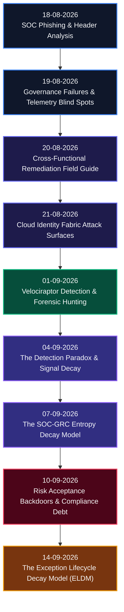
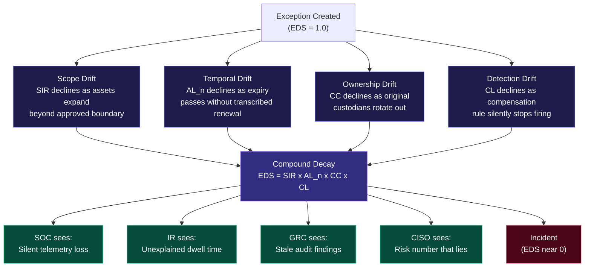

# SOC + GRC Operational Research: Attack Chain Architecture & Exception Decay

[](#)
[](#)
[](#)
[](#)

---

## TL;DR

GRC and SOC have always operated in separate silos. This research series shows exactly why that's lethal. I've been documenting every week how governance failures create detection blind spots, how security controls decay over time, and how formally signed risk exceptions quietly rot into attacker-ready backdoors. Nine papers, a unified decay model, production detection queries, and a forensic audit procedure. All of it grounded in real operational patterns, not theory.

---

## Why I Started This

Honest answer: I kept seeing the same failure mode repeat itself.

A risk exception gets signed. The SOC adds an exclusion rule. Nobody revisits it. Six months later, the log source feeding that rule stops shipping data, nobody notices because the rule isn't alerting, and an attacker walks through the resulting blind spot nine months after that. The post-mortem says "the SOC missed it." That's wrong. The SOC never had a chance to catch it. The exception decayed and took the compensating detection with it.

Every department experiences the same rot differently. The SOC analyst closes the "legacy noise" alert. The incident responder stares at nine months of unexplained dwell time. The auditor re-tests an exception whose scope no longer matches its ticket. The CISO carries a risk number that doesn't mean what it says.

What nobody had was a single model of the rotting process. That's what I'm building here.

---

## Research Progression

The papers build on each other deliberately. Start from email header forensics, climb through cloud identity abuse and live endpoint hunting, then hit the entropy models and exception decay mechanics. Each paper references the ones before it.



---

## Who This Is For

I didn't write these for one audience. I wrote them to be useful across the entire security org, from the analyst triaging alerts at 3 AM to the CISO presenting to the board the next morning.

| Audience | Start Here | What You'll Get |
| :--- | :--- | :--- |
| **Tier 1 / Junior SOC Analyst** | [18-08-2026](./On%2018-08-2026%20i%20learned%20%20SOC%20Phishing%20&%20Email%20Header%20Analysis%20%20Reference.md), [10-09-2026](./ON%2010-09-2026%20-%20RISK%20ACCEPTANCE%20BACKDOORS,%20EXCEPTION%20ATTACK%20TREES,%20AND%20THE%20COMPLIANCE%20DEBT%20METRIC.md) | Header triage playbooks, SIEM exclusion verification workflows, what a risk acceptance backdoor actually looks like in your alert queue |
| **Detection Engineer / Threat Hunter** | [21-08-2026](./On%2021-08-2026%20%20Today%20I%20Cover%20The%20Cloud%20Identity%20Fabric%20%20Attack%20Surfaces%20Most%20SOC%20Teams%20Cannot%20Currently%20See.md), [01-09-2026](./On%20%2001-09-2026%20VELOCIRAPTOR:%20A%20UNIFIED%20DETECTION-FORENSICS%20FRAMEWORK%20FOR%20SOC%20+%20GRC%20ATTACK%20CHAIN%20RESEARCH.md), [04-09-2026](./On%2004-09-2026%20THE%20DETECTION%20PARADOX%20-%20WHY%20THE%20BETTER%20YOUR%20SIEM%20GETS,%20THE%20WORSE%20YOUR%20COVERAGE%20BECOMES.md), [14-09-2026](./On%2014-09-2026%20-%20THE%20EXCEPTION%20LIFECYCLE%20DECAY%20MODEL%20How%20Accepted%20Risks%20Rot:%20A%20Four%20Drift%20Theory%20of%20GRC%20Exception%20Decay%20and%20Its%20Forensic,%20Detection,%20and%20Audit%20Consequences.md) | KQL/SPL cloud queries, VQL forensic artifacts, detection liveness heartbeat design, Detection-as-Code pipeline, compensation drift countermeasures |
| **GRC Officer / Security Auditor** | [19-08-2026](./On%2019-08-2026%20i%20learned%20When%20Governance%20Fails%20First:%20How%20GRC%20Breakdowns%20Create%20SOC%20Blind%20Spots.md), [10-09-2026](./ON%2010-09-2026%20-%20RISK%20ACCEPTANCE%20BACKDOORS,%20EXCEPTION%20ATTACK%20TREES,%20AND%20THE%20COMPLIANCE%20DEBT%20METRIC.md), [14-09-2026](./On%2014-09-2026%20-%20THE%20EXCEPTION%20LIFECYCLE%20DECAY%20MODEL%20How%20Accepted%20Risks%20Rot:%20A%20Four%20Drift%20Theory%20of%20GRC%20Exception%20Decay%20and%20Its%20Forensic,%20Detection,%20and%20Audit%20Consequences.md) | Exception integrity audit procedure (8 steps, ~22 min per exception), phantom asset detection queries, remediation matrices, compliance debt metric |
| **CISO / VP of Security** | [07-09-2026](./On%2007-09-2026%20%20The%20SOC-GRC%20Entropy-Model:%20A%20Unified%20Framework%20for%20Security%20Program%20Decay%20and%20the%20Architecture%20of%20Anti-Fragile%20Detection.md), [14-09-2026](./On%2014-09-2026%20-%20THE%20EXCEPTION%20LIFECYCLE%20DECAY%20MODEL%20How%20Accepted%20Risks%20Rot:%20A%20Four%20Drift%20Theory%20of%20GRC%20Exception%20Decay%20and%20Its%20Forensic,%20Detection,%20and%20Audit%20Consequences.md) | Four board-presentable decay metrics (DEC, PAC, CF, RVR), anti-fragile architecture blueprint, dwell time decomposition for post-mortems |

---

## Chronological Research Index

### 1. [18-08-2026: SOC Phishing & Email Header Analysis Reference](./On%2018-08-2026%20i%20learned%20%20SOC%20Phishing%20&%20Email%20Header%20Analysis%20%20Reference.md)

Where it all started. Email header forensics aren't glamorous, but they're foundational. I wanted to build a reference that Tier 1 analysts could actually use at 2 AM, not a textbook they'd never open again.

This one covers SMTP transaction mechanics, hop-by-hop header chain reconstruction, SPF/DKIM/DMARC validation, and regex extraction patterns you can drop straight into your SIEM. The triage playbook in here has saved time in real environments.

---

### 2. [19-08-2026: When Governance Fails First (Part 1)](./On%2019-08-2026%20i%20learned%20When%20Governance%20Fails%20First:%20How%20GRC%20Breakdowns%20Create%20SOC%20Blind%20Spots.md)

This is the paper that set the direction for everything that came after. The central question was: can a governance failure, not an attacker action, create a SOC blind spot?

Yes. Definitively yes. I document exactly how uncoordinated policy changes and log ingestion pipeline decisions made by GRC and IT without SOC input directly eliminate telemetry coverage. The GRC team doesn't know what they broke. The SOC doesn't know it's broken. The attacker doesn't care who's at fault.

---

### 3. [20-08-2026: When Governance Fails First (Field Guide)](./On%2020-08-2026%20%20When%20Governance%20Fails%20First:%20How%20GRC%20Breakdowns%20Create%20SOC%20Blind%20Spots.md)

The practical companion to Part 1. Less theory, more operational tooling. Includes the cross-functional remediation matrix I use to validate risk register entries against live SIEM telemetry. If you're a detection engineer or GRC auditor looking for something you can run against your environment this week, start here.

---

### 4. [21-08-2026: The Cloud Identity Fabric: Attack Surfaces Most SOC Teams Cannot See](./On%2021-08-2026%20%20Today%20I%20Cover%20The%20Cloud%20Identity%20Fabric%20%20Attack%20Surfaces%20Most%20SOC%20Teams%20Cannot%20Currently%20See.md)

Non-Human Identities. OAuth consent grants. Cross-cloud trust relationships. These don't show up in your standard human authentication logs. I spent time mapping out where the modern cloud identity attack surface actually lives and why traditional log-based monitoring misses it almost entirely.

The KQL and SPL queries in this one target token hijacking, service principal abuse, and anomalous privilege escalations in Azure and AWS environments. Production-ready, not demo quality.

---

### 5. [01-09-2026: Velociraptor: Unified Detection-Forensics Framework for SOC + GRC](./On%20%2001-09-2026%20VELOCIRAPTOR:%20A%20UNIFIED%20DETECTION-FORENSICS%20FRAMEWORK%20FOR%20SOC%20+%20GRC%20ATTACK%20CHAIN%20RESEARCH.md)

Velociraptor VQL is genuinely underused for compliance evidence collection. Most teams deploy it reactively during incidents. I wanted to show how you can run live endpoint forensic hunting continuously and feed the output directly into compliance validation workflows.

This turns incident response artifacts into verifiable audit evidence. That connection between forensics and governance is something I haven't seen documented well anywhere else.

---

### 6. [04-09-2026: The Detection Paradox: Why the Better Your SIEM Gets, the Worse Your Coverage Becomes](./On%2004-09-2026%20THE%20DETECTION%20PARADOX%20-%20WHY%20THE%20BETTER%20YOUR%20SIEM%20GETS,%20THE%20WORSE%20YOUR%20COVERAGE%20BECOMES.md)

This is the part most SIEM tuning guides skip entirely.

When you tune aggressively to reduce false positives, you're also reducing true positives. When you add suppression rules to handle noisy alerts, you're encoding blind spots. The mathematical signal decay formulas in this paper make the hidden cost of tuning visible. The Detection-as-Code CI/CD pipeline design makes it testable.

The core finding: a MITRE ATT&CK heatmap that looks complete can hide coverage that's completely dead underneath. I show you how to tell the difference.

---

### 7. [07-09-2026: The SOC-GRC Entropy Model: Unified Framework for Security Program Decay](./On%2007-09-2026%20%20The%20SOC-GRC%20Entropy-Model:%20A%20Unified%20Framework%20for%20Security%20Program%20Decay%20and%20the%20Architecture%20of%20Anti-Fragile%20Detection.md)

The theoretical backbone of the series. I applied thermodynamic entropy and Shannon information theory to quantify how security controls degrade over time. The Second Law of Thermodynamics isn't just for physics lectures. It applies directly to your detection engineering pipeline.

The entropy decay formula:

```
dS = dQ_suppress / T_coverage + sigma_decay

Where:
  dS            = Net change in system security entropy
  dQ_suppress   = Accumulated alert suppression rules over time
  T_coverage    = Coverage temperature (MITRE ATT&CK depth)
  sigma_decay   = External infrastructure drift rate
```

The anti-fragile architecture blueprint in this paper shows how to build a detection pipeline that gets stronger under adversarial stress instead of just absorbing it.

---

### 8. [10-09-2026: Risk Acceptance Backdoors, Exception Attack Trees & Compliance Debt](./ON%2010-09-2026%20-%20RISK%20ACCEPTANCE%20BACKDOORS,%20EXCEPTION%20ATTACK%20TREES,%20AND%20THE%20COMPLIANCE%20DEBT%20METRIC.md)

This one made some people uncomfortable. Good.

The core finding: a formally signed GRC risk acceptance form is, from an attacker's perspective, a documented map of your SIEM exclusion zones. Attackers don't need to breach your GRC tools. They deduce exclusion zones through behavioral probing, service account reconnaissance, and path testing.

I formalized the Compliance Debt equation here:

```
CD = SUM( V_i * P_i * T_i ) * Omega_bypass

Where:
  V_i           = Asset vulnerability rating
  P_i           = Privilege escalation multiplier
  T_i           = Duration of active risk acceptance exception
  Omega_bypass  = SIEM rule suppression factor (1.0 = fully blind, 0.0 = fully monitored)
```

And introduced the Exception Attack Tree model, which shows how individually approved exceptions chain together into complete lateral movement paths that no single reviewer ever saw in isolation.

---

### 9. [14-09-2026: The Exception Lifecycle Decay Model (ELDM)](./On%2014-09-2026%20-%20THE%20EXCEPTION%20LIFECYCLE%20DECAY%20MODEL%20How%20Accepted%20Risks%20Rot:%20A%20Four%20Drift%20Theory%20of%20GRC%20Exception%20Decay%20and%20Its%20Forensic,%20Detection,%20and%20Audit%20Consequences.md)

Today's paper. The one that brings everything together.

The backdoors paper showed that governance can sign blindness into existence. This paper answers what happens next: how does that blindness rot, and what does the rot look like from each department's vantage point?

**Key Findings:**

- **Exceptions don't fail. They decay.** The decay is continuous, predictable, and measurable from day one.
- **Four drift mechanisms operate simultaneously:** scope drift, temporal drift, ownership drift, and detection drift. Each has a measurable function.
- **The compound decay law uses a product form, not an average.** An exception is as healthy as its weakest mechanism, because that's how attackers think. If you average the four drifts, three healthy values can mask one fatal one.
- **EDS = 0 at inception if compensation is skipped.** A skipped Stage 2 isn't a debt to pay later. It's decay from day one.
- **Every reasonable actor, at every step, made the decay happen.** This isn't about negligence. It's about system design. The timeline runs to 39 months and ends in an incident, built entirely from individually rational decisions.

The central formula:

```
EDS(e,t) = SIR(e,t) * AL_n(e,t) * CC(e,t) * CL(e,t)

Where EDS = 1 is a healthy exception and EDS = 0 is an attacker's open door.
```

---

## The Decay Timeline (Month-by-Month)

This table is from the 14-09-2026 paper. I'm putting it here because it's the most concrete illustration of why the product form matters and why detection drift (CL) is the drift that kills.

| Month | Event | SIR | AL_n | CC | CL | EDS |
|:---:|:--- |:---:|:---:|:---:|:---:|:---:|
| 0 | Creation WITH compensation | 1.00 | 1.00 | 1.00 | 1.00 | **1.00** |
| 0 | Creation WITHOUT compensation | 1.00 | 1.00 | 1.00 | 0.00 | **0.00** |
| 3 | Adjacent team scope creep begins | 0.95 | 1.00 | 1.00 | 0.90 | 0.85 |
| 9 | Owner rotates out | 0.95 | 1.00 | 0.66 | 0.90 | 0.56 |
| 12 | Log source stops shipping | 0.90 | 1.00 | 0.66 | 0.00 | **0.00** |
| 15 | Asset cloned, phantom created | 0.70 | 1.00 | 0.66 | 0.00 | 0.00 |
| 24 | Expiry passes silently (AL=300) | 0.65 | 0.23 | 0.50 | 0.00 | 0.00 |
| 30 | Attacker finds phantom asset | 0.65 | 0.23 | 0.33 | 0.00 | 0.00 |
| 39 | **Incident** | -- | -- | -- | -- | -- |

The moment CL hits 0 at month 12, EDS collapses regardless of every other component. That's the product form made visible.

---

## The Four Drift Mechanisms



---

## Core Analytical Models

### 1. SOC-GRC Entropy Decay (07-09-2026)

| Variable | Meaning |
| :--- | :--- |
| dS | Net change in system security entropy |
| dQ_suppress | Accumulation of alert suppression rules over time |
| T_coverage | Coverage temperature (MITRE ATT&CK depth) |
| sigma_decay | External infrastructure drift rate |

### 2. Compliance Debt Metric (10-09-2026)

| Variable | Meaning |
| :--- | :--- |
| V_i | Asset vulnerability rating |
| P_i | Privilege escalation multiplier |
| T_i | Duration of active risk acceptance |
| Omega_bypass | SIEM rule suppression factor (1.0 = fully blind, 0.0 = fully monitored) |

### 3. Exception Decay Score (14-09-2026)

| Component | Full Name | Measures |
| :--- | :--- | :--- |
| SIR | Scope Integrity Ratio | Fraction of assets currently matched by the exception scope that were actually approved |
| AL_n | Authorization Lag (normalized) | Time past expiry without a transcribed renewal decision, normalized to 1/(1+AL/90) |
| CC | Custodial Continuity | Fraction of owner, signer, and technical custodian roles still occupied or formally succeeded |
| CL | Compensation Liveness | Product of input liveness (log source shipping), match liveness (coverage test passes), and disposition liveness (alerts actually escalated, not auto-closed) |

---

## CISO Reporting Metrics (Board-Level)

These four metrics come out of the 14-09-2026 paper. Three measure stock. One measures direction. You need all four.

| Metric | Type | What It Answers |
| :--- | :--- | :--- |
| **Decayed Exception Count (DEC)** | Stock | How many accepted risks no longer match their recorded form? |
| **Phantom Asset Count (PAC)** | Stock | How many assets carry exclusion coverage from exceptions that never approved them? |
| **Compensated Fraction (CF)** | Stock | What fraction of accepted risk is actually monitored by a tested, live detection rule? |
| **Remediation Velocity Rate (RVR)** | Flow | Are we closing exceptions faster or slower than we open them? RVR > 1.0 means debt is shrinking. |

RVR is the one that drives budget conversations. DEC tells you how many exceptions are sick. RVR tells you whether you're getting better or worse. You need both.

---

## Detection Engineering Countermeasures (ELDM)

These four controls come from Section 8 of the 14-09-2026 paper. They directly address each drift mechanism.

| Control | Targets | What It Does |
| :--- | :--- | :--- |
| **DE-1: Liveness Heartbeat** | Detection drift (CL) | Weekly synthetic marker injection into each compensating rule. If the rule can't see its own test signal, it's dead, regardless of its "enabled" flag. |
| **DE-2: Scope Reconciliation** | Scope drift (SIR) | Nightly diff of exception scope strings against live asset inventory. New matches not in the approved set trigger a phantom alert. |
| **DE-3: Disposition Audit** | Detection drift (CL) | Monthly sampling of auto-closed alerts on excepted scopes. Suppression entries carry their own decay score. |
| **DE-4: Ownership Ping** | Ownership drift (CC) | Flags exceptions whose owner field resolves to a departed employee or defunct distribution list. Treats CC as unmeasurable if escalations bounce. |

---

## Limitations (Stated Honestly)

I'm including this section because real research includes it.

- **The product form of EDS is a modeling decision, not a derivation.** I defended it on attacker-option grounds. Alternative aggregations like min or weighted sum with interaction terms should be compared empirically. Phase 2 of this work needs real register data to validate.
- **The decay timeline in the 14-09-2026 paper is composite and illustrative.** The P1-P4 predictions are pre-registered hypotheses, not findings. Built from common patterns across environments, not a single longitudinal dataset.
- **SIR measurement requires versioned scope strings.** Organizations whose exception registers don't version scope history need to start doing that before SIR is computable. The audit procedure doubles as the instrumentation plan.
- **CL's disposition component involves analyst behavior.** Measuring individual disposition rates will cause analysts to escalate everything defensively, destroying the signal. Measurement has to be aggregate-only, sampled, and anonymized. This is structural, not a goodwill ask.
- **Cross-framework generalization is claimed on structural grounds only.** The ELDM's drift mechanisms are framework-agnostic by design, but validate per-framework before quoting numbers against ISO 27001, SOC 2, or PCI-DSS thresholds.

---

## What I'd Do Differently

This is the section I wish more security research included. Here's what I'd change if I were starting over.

**1. Instrument the register first.** SIR requires versioned scope strings. I designed the metric before I verified that most organizations don't version their exception scope fields. Instrumentation should have been Phase 1, not an afterthought in the limitations.

**2. Get real register data before publishing the decay timeline.** The 39-month composite narrative is plausible, drawn from real patterns. But plausible isn't the same as measured. I stated it as illustrative but I should've been louder about that in the headline.

**3. Connect the audit procedure to actual GRC tooling earlier.** The 8-step exception integrity audit is written as a procedure. It should have come with Archer, ServiceNow, and Jira query templates for each step. That's Phase 2 now.

**4. The CC measure is too coarse.** Fraction of named roles still occupied tells you a role is empty. It doesn't tell you whether the replacement was actually briefed. A documentation handoff that never happened is indistinguishable from one that did in the current metric. I want a briefing-quality test here, not just a name-in-a-field test.

**5. I should have built the dwell decomposition report template earlier.** The observation that `observed_dwell = attacker_stealth + sensor_decay + disposition_decay` is the most actionable thing in the IR section. An actual post-mortem template for that decomposition would have moved it from concept to practice faster.

---

## Operational Guidance

### For Detection Engineering Teams

- Run DE-1 liveness heartbeats on every active compensating control. The ones that return nothing are dead. Find out when they died before your next audit does.
- Build scope reconciliation (DE-2) into your daily asset inventory automation. Phantom assets cost you nothing to find and everything to miss.
- Integrate the Detection Paradox guidelines from [04-09-2026](./On%2004-09-2026%20THE%20DETECTION%20PARADOX%20-%20WHY%20THE%20BETTER%20YOUR%20SIEM%20GETS,%20THE%20WORSE%20YOUR%20COVERAGE%20BECOMES.md) into your continuous rule validation suites.

### For Governance, Risk, and Compliance Teams

- Run the 8-step Exception Integrity Audit from [14-09-2026](./On%2014-09-2026%20-%20THE%20EXCEPTION%20LIFECYCLE%20DECAY%20MODEL%20How%20Accepted%20Risks%20Rot:%20A%20Four%20Drift%20Theory%20of%20GRC%20Exception%20Decay%20and%20Its%20Forensic,%20Detection,%20and%20Audit%20Consequences.md) sorted by `age x chain_length`. That's your decayed exception triage queue.
- Expiry needs to be an enforced action, not a date. Auto-close on expiry unless a renewal is recorded in the system of record. Attrition shouldn't be possible by construction.
- Run exception audit queries from [10-09-2026](./ON%2010-09-2026%20-%20RISK%20ACCEPTANCE%20BACKDOORS,%20EXCEPTION%20ATTACK%20TREES,%20AND%20THE%20COMPLIANCE%20DEBT%20METRIC.md) monthly, not quarterly.

### For Security Executives (CISO / VP)

- Present DEC, PAC, CF, and RVR at your next board meeting. These are the four metrics with semantics that translate outside the security org.
- When RVR < 1.0, you're accumulating exception debt faster than you're remediating it. That number gives you the budget justification to act.
- Demand a Dwell Decomposition Report as a standard section in every post-mortem on an incident that touched an excepted asset. It converts "the SOC missed it" into "here is the exact month the watch stopped watching."

---

## What's Next

The 14-09-2026 paper closes with the open question I'm working toward: how does incident intelligence flow back into the exception register before the next attacker arrives?

The decay model is the diagnosis. The IR-GRC closed loop is the cure. That's the next paper.

---

## References

[1] Shannon, C.E. (1948). A Mathematical Theory of Communication. Bell System Technical Journal, 27(3), 379-423.

[2] Taleb, N.N. (2012). Antifragile: Things That Gain from Disorder. Random House.

[3] Weick, K.E., & Sutcliffe, K.M. (2007). Managing the Unexpected: Resilient Performance in an Age of Uncertainty (2nd ed.). Jossey-Bass.

[4] MITRE ATT&CK Framework (2026). https://attack.mitre.org/

[5] NIST SP 800-37 Rev. 2: Risk Management Framework for Information Systems and Organizations.

[6] ISO/IEC 27001:2022. Information Security Management Systems Requirements.

[7] Velociraptor Project Documentation. https://docs.velociraptor.app/

---

## Series Changelog

| Date | Paper | Version | Notes |
| :--- | :--- | :---: | :--- |
| 18-08-2026 | SOC Phishing & Email Header Analysis | 1.0 | Initial publication |
| 19-08-2026 | Governance Failures & SOC Blind Spots Part 1 | 1.0 | Initial publication |
| 20-08-2026 | Governance Failures Field Guide | 1.0 | Operational companion to Part 1 |
| 21-08-2026 | Cloud Identity Fabric Attack Surfaces | 1.0 | Initial publication |
| 01-09-2026 | Velociraptor Unified Framework | 1.0 | Initial publication |
| 04-09-2026 | The Detection Paradox | 1.0 | Initial publication |
| 07-09-2026 | SOC-GRC Entropy Model | 3.0 | Empirical validation draft |
| 10-09-2026 | Risk Acceptance Backdoors & Compliance Debt | 1.0 | Initial publication |
| 14-09-2026 | Exception Lifecycle Decay Model (ELDM) | 1.1 | Post-review revision; all six review improvements integrated |

---

## About the Author

**hiro001-eth** researches the operational intersection of Security Operations and Governance, Risk, and Compliance. The focus is on what actually happens when these two departments don't share data, models, or vocabulary: controls that degrade silently, exceptions that outlive their authorization, and incidents that were structurally predictable months before they happened.

This repository is a running log of that research. Every paper is a day's serious work documented in public. The goal is to build a unified framework, not a collection of isolated posts.

---

*"Exceptions don't fail. They decay. The only choice is whether you measure the decay or inherit it."*

*-- hiro001-eth, 14-09-2026*
