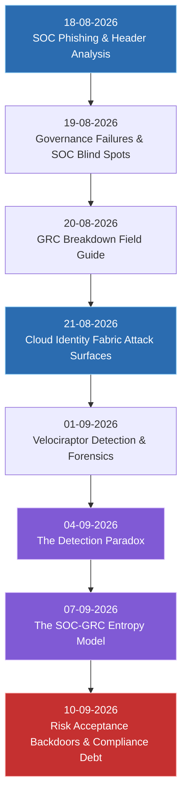

# MY SOC + GRC Research Operations & Attack Chain Repository

Welcome to the **SOC + GRC Operational Research Ecosystem**. This repository bridges the critical divide between **Security Operations Center (SOC)** detection engineering and **Governance, Risk, and Compliance (GRC)** enterprise risk management.

---

## 🎯 Repository Purpose

Traditional cybersecurity programs operate in silos: GRC manages paperwork and audits, while the SOC handles real-time alerts and incident response. This disconnect creates structural blind spots, unmonitored attack surfaces, and silent security decay.

This repository provides actionable research, mathematical models, production detection queries (SPL, KQL, Cypher), and architectural frameworks designed for everyone from **0-Level Junior Analysts** to **CISOs and Executive Directors**.

---

## 📚 Master Research Index & Daily Log Breakdown

Below is the complete chronological index of research entries. Each entry features a concise two-line overview explaining why the research was conducted on that specific day and how it helps solve fundamental operational challenges.

---

### 📅 Chronological Entry Breakdown

#### 1. [18-08-2026: SOC Phishing & Email Header Analysis Reference](file:///home/hiro/Downloads/MY%20SOC%20+%20GRC%20Research%20/On%2018-08-2026%20i%20learned%20%20SOC%20Phishing%20&%20Email%20Header%20Analysis%20%20Reference.md)
* **Why This Was Written:** Demystifies SMTP transaction mechanics, email header structures, and SPF/DKIM/DMARC authentication protocols for front-line analysts.
* **Core Value (0-Level to CISO):** Provides Tier 1-3 triage playbooks, SIEM log queries, and automation workflows to eliminate gateway evasion blind spots.

#### 2. [19-08-2026: When Governance Fails First: How GRC Breakdowns Create SOC Blind Spots (Part 1)](file:///home/hiro/Downloads/MY%20SOC%20+%20GRC%20Research%20/On%2019-08-2026%20i%20learned%20When%20Governance%20Fails%20First:%20How%20GRC%20Breakdowns%20Create%20SOC%20Blind%20Spots.md)
* **Why This Was Written:** Investigates how high-level administrative governance failures directly blind SOC log ingestion pipelines and telemetry collection.
* **Core Value (0-Level to CISO):** Connects audit non-compliance directly to real-world SIEM coverage gaps, helping risk leads and SOC leads speak a common language.

#### 3. [20-08-2026: When Governance Fails First: How GRC Breakdowns Create SOC Blind Spots (Field Guide)](file:///home/hiro/Downloads/MY%20SOC%20+%20GRC%20Research%20/On%2020-08-2026%20%20When%20Governance%20Fails%20First:%20How%20GRC%20Breakdowns%20Create%20SOC%20Blind%20Spots.md)
* **Why This Was Written:** Expands initial governance failure research into an operational field guide with concrete audit remediation matrices.
* **Core Value (0-Level to CISO):** Equips detection engineers and GRC auditors with step-by-step cross-functional workflows to align risk registers with active telemetry.

#### 4. [21-08-2026: The Cloud Identity Fabric: Attack Surfaces Most SOC Teams Cannot See](file:///home/hiro/Downloads/MY%20SOC%20+%20GRC%20Research%20/On%2021-08-2026%20%20Today%20I%20Cover%20The%20Cloud%20Identity%20Fabric%20%20Attack%20Surfaces%20Most%20SOC%20Teams%20Cannot%20Currently%20See.md)
* **Why This Was Written:** Exposes Non-Human Identities (NHIs), OAuth application permissions, and cross-cloud identity trusts that bypass traditional human authentication logs.
* **Core Value (0-Level to CISO):** Delivers production KQL/SPL rules to detect session token hijacking, unmonitored service principals, and cloud identity abuse.

#### 5. [01-09-2026: Velociraptor: A Unified Detection-Forensics Framework for SOC + GRC Attack Chain Research](file:///home/hiro/Downloads/MY%20SOC%20+%20GRC%20Research%20/On%20%2001-09-2026%20VELOCIRAPTOR:%20A%20UNIFIED%20DETECTION-FORENSICS%20FRAMEWORK%20FOR%20SOC%20+%20GRC%20ATTACK%20CHAIN%20RESEARCH.md)
* **Why This Was Written:** Introduces live endpoint forensic hunting using Velociraptor VQL queries to continuously validate security control enforcement.
* **Core Value (0-Level to CISO):** Transforms reactive incident response into automated, verifiable compliance evidence collection across enterprise endpoints.

#### 6. [04-09-2026: The Detection Paradox: Why the Better Your SIEM Gets, the Worse Your Coverage Becomes](file:///home/hiro/Downloads/MY%20SOC%20+%20GRC%20Research%20/On%2004-09-2026%20THE%20DETECTION%20PARADOX%20-%20WHY%20THE%20BETTER%20YOUR%20SIEM%20GETS,%20THE%20WORSE%20YOUR%20COVERAGE%20BECOMES.md)
* **Why This Was Written:** Dissects how performance tuning, alert suppressions, and artificial MITRE map padding create dangerous illusions of enterprise security.
* **Core Value (0-Level to CISO):** Establishes mathematical signal decay models and Detection-as-Code governance to realign SOC metrics with real-world adversary resistance.

#### 7. [07-09-2026: The SOC-GRC Entropy Model: A Unified Framework for Security Program Decay](file:///home/hiro/Downloads/MY%20SOC%20+%20GRC%20Research%20/On%2007-09-2026%20%20The%20SOC-GRC%20Entropy-Model:%20A%20Unified%20Framework%20for%20Security%20Program%20Decay%20and%20the%20Architecture%20of%20Anti-Fragile%20Detection.md)
* **Why This Was Written:** Applies thermodynamics and Shannon entropy formulas to explain why security controls degrade silently over time without continuous maintenance.
* **Core Value (0-Level to CISO):** Teaches security teams how to inject negative entropy into detection pipelines to build resilient, anti-fragile defense architectures.

#### 8. [10-09-2026: Risk Acceptance Backdoors, Exception Attack Trees, and the Compliance Debt Metric](file:///home/hiro/Downloads/MY%20SOC%20+%20GRC%20Research%20/ON%2010-09-2026%20-%20RISK%20ACCEPTANCE%20BACKDOORS,%20EXCEPTION%20ATTACK%20TREES,%20AND%20THE%20COMPLIANCE%20DEBT%20METRIC.md)
* **Why This Was Written:** Reveals how signed GRC risk acceptance forms mutate into hardcoded SIEM exclusion backdoors that threat actors actively detect and exploit.
* **Core Value (0-Level to CISO):** Maps multi-exception attack trees, establishes the mathematical Compliance Debt formula ($CD$), and provides production queries to audit silent risk waivers.

---

## 🛠️ How to Navigate This Research

* **If you are a Tier 1 SOC Analyst (0-Level):** Start with the **18-08-2026** phishing guide and **10-09-2026** Tier 1 triage tips to understand how exclusions affect daily alerts.
* **If you are a Detection Engineer / Threat Hunter:** Focus on **04-09-2026** (Detection Paradox) and **01-09-2026** (Velociraptor) for SPL, KQL, and VQL detection logic.
* **If you are a CISO, Risk Officer, or Lead Auditor:** Review **07-09-2026** (Entropy Model) and **10-09-2026** (Compliance Debt Metric) to quantify organizational risk decay and governance liability.
