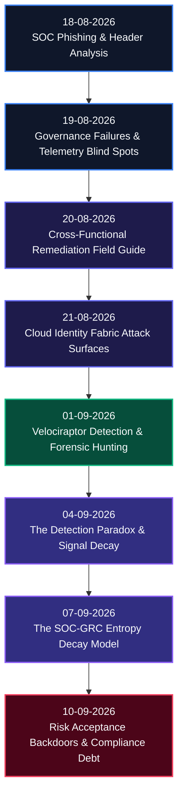

# SOC + GRC Operational Research & Attack Chain Architecture Repository

---

## Executive Overview

The **SOC + GRC Operational Research Repository** establishes a unified technical framework bridging the historical divide between **Security Operations Center (SOC)** detection engineering and **Governance, Risk, and Compliance (GRC)** enterprise risk management.

Historically, enterprise security programs operate in dangerous operational silos: GRC teams manage compliance frameworks and risk registers in isolation, while SOC teams respond to real-time telemetry alerts without visibility into policy waivers. This structural disconnect creates unmonitored attack surfaces, telemetry ingestion blind spots, and silent control degradation.

This repository provides rigorous analytical research, mathematical decay models, actionable SIEM/EDR detection queries (KQL, SPL, Cypher, VQL), and anti-fragile architectural frameworks designed to serve security professionals across all operational tiers—from entry-level SOC analysts to Chief Information Security Officers (CISOs).

---

## Core Research Objectives

* **Bridging Policy & Telemetry:** Aligning compliance risk acceptance forms directly with active SIEM correlation rules and exclusion filters.
* **Quantifying Program Decay:** Applying thermodynamic entropy formulas and signal decay metrics to measure real-time security degradation.
* **Exposing Hidden Attack Surfaces:** Analyzing non-human identity (NHI) fabrics, cloud identity trusts, and OAuth abuse paths obscured from traditional SOC monitoring.
* **Operationalizing Forensics:** Integrating continuous live endpoint forensic hunting (Velociraptor VQL) directly into automated compliance validation workflows.

---

## Research Progression Architecture

The diagram below maps the chronological evolution of research topics in this repository, illustrating the progression from foundational email telemetry to advanced entropy modeling and risk acceptance audit metrics.

---

## Role-Based Navigation Matrix

| Target Audience | Primary Focus Area | Recommended Research Modules | Core Strategic Deliverables |
| :--- | :--- | :--- | :--- |
| **Tier 1 / Junior SOC Analyst** | Telemetry Triage & Evasion Identification | [18-08-2026](./On%2018-08-2026%20i%20learned%20%20SOC%20Phishing%20&%20Email%20Header%20Analysis%20%20Reference.md), [10-09-2026](./ON%2010-09-2026%20-%20RISK%20ACCEPTANCE%20BACKDOORS,%20EXCEPTION%20ATTACK%20TREES,%20AND%20THE%20COMPLIANCE%20DEBT%20METRIC.md) | Header triage playbooks, SIEM exclusion verification workflows |
| **Detection Engineer / Threat Hunter** | Rule Optimization & Live Forensics | [21-08-2026](./On%2021-08-2026%20%20Today%20I%20Cover%20The%20Cloud%20Identity%20Fabric%20%20Attack%20Surfaces%20Most%20SOC%20Teams%20Cannot%20Currently%20See.md), [01-09-2026](./On%20%2001-09-2026%20VELOCIRAPTOR:%20A%20UNIFIED%20DETECTION-FORENSICS%20FRAMEWORK%20FOR%20SOC%20+%20GRC%20ATTACK%20CHAIN%20RESEARCH.md), [04-09-2026](./On%2004-09-2026%20THE%20DETECTION%20PARADOX%20-%20WHY%20THE%20BETTER%20YOUR%20SIEM%20GETS,%20THE%20WORSE%20YOUR%20COVERAGE%20BECOMES.md) | KQL/SPL cloud queries, VQL forensic artifacts, Detection-as-Code pipeline |
| **GRC Officer & Security Auditor** | Policy Remediation & Compliance Auditing | [19-08-2026](./On%2019-08-2026%20i%20learned%20When%20Governance%20Fails%20First:%20How%20GRC%20Breakdowns%20Create%20SOC%20Blind%20Spots.md), [20-08-2026](./On%2020-08-2026%20%20When%20Governance%20Fails%20First:%20How%20GRC%20Breakdowns%20Create%20SOC%20Blind%20Spots.md), [10-09-2026](./ON%2010-09-2026%20-%20RISK%20ACCEPTANCE%20BACKDOORS,%20EXCEPTION%20ATTACK%20TREES,%20AND%20THE%20COMPLIANCE%20DEBT%20METRIC.md) | Remediation matrices, risk acceptance audit scripts, compliance debt metric |
| **CISO & VP of Security** | Program Strategy & Enterprise Risk Metrics | [07-09-2026](./On%2007-09-2026%20%20The%20SOC-GRC%20Entropy-Model:%20A%20Unified%20Framework%20for%20Security%20Program%20Decay%20and%20the%20Architecture%20of%20Anti-Fragile%20Detection.md), [10-09-2026](./ON%2010-09-2026%20-%20RISK%20ACCEPTANCE%20BACKDOORS,%20EXCEPTION%20ATTACK%20TREES,%20AND%20THE%20COMPLIANCE%20DEBT%20METRIC.md) | Anti-fragile detection architecture, thermodynamic decay models, risk quantification |

---

## Chronological Research Index

### 1. [18-08-2026: SOC Phishing & Email Header Analysis Reference](./On%2018-08-2026%20i%20learned%20%20SOC%20Phishing%20&%20Email%20Header%20Analysis%20%20Reference.md)
* **Operational Motivation:** Demystifies SMTP transaction mechanics, hop-by-hop email header structures, and SPF/DKIM/DMARC authentication protocols to eliminate gateway evasion blind spots.
* **Core Value & Deliverables:** Provides Tier 1–3 triage playbooks, regex extraction patterns, and SIEM log correlation queries for malicious email header inspection.

### 2. [19-08-2026: When Governance Fails First: How GRC Breakdowns Create SOC Blind Spots (Part 1)](./On%2019-08-2026%20i%20learned%20When%20Governance%20Fails%20First:%20How%20GRC%20Breakdowns%20Create%20SOC%20Blind%20Spots.md)
* **Operational Motivation:** Investigates how high-level administrative governance failures and uncoordinated policy changes directly blind SOC log ingestion pipelines and cloud telemetry collection.
* **Core Value & Deliverables:** Bridges non-compliance findings directly to SIEM coverage gaps, providing SOC leads and compliance officers with a shared risk classification framework.

### 3. [20-08-2026: When Governance Fails First: How GRC Breakdowns Create SOC Blind Spots (Field Guide)](./On%2020-08-2026%20%20When%20Governance%20Fails%20First:%20How%20GRC%20Breakdowns%20Create%20SOC%20Blind%20Spots.md)
* **Operational Motivation:** Expands foundational governance failure research into an actionable operational field guide featuring concrete remediation workflows and audit matrices.
* **Core Value & Deliverables:** Equips detection engineers and GRC auditors with cross-functional matrices to validate risk register entries against live SIEM telemetry feeds.

### 4. [21-08-2026: The Cloud Identity Fabric: Attack Surfaces Most SOC Teams Cannot See](./On%2021-08-2026%20%20Today%20I%20Cover%20The%20Cloud%20Identity%20Fabric%20%20Attack%20Surfaces%20Most%20SOC%20Teams%20Cannot%20Currently%20See.md)
* **Operational Motivation:** Exposes Non-Human Identities (NHIs), OAuth consent grant permissions, and cross-cloud identity trust relationships that bypass traditional human authentication logs.
* **Core Value & Deliverables:** Delivers production KQL/SPL detection rules to flag token hijacking, unmonitored service principal abuse, and anomalous cloud privilege escalations.

### 5. [01-09-2026: Velociraptor: Unified Detection-Forensics Framework for SOC + GRC Research](./On%20%2001-09-2026%20VELOCIRAPTOR:%20A%20UNIFIED%20DETECTION-FORENSICS%20FRAMEWORK%20FOR%20SOC%20+%20GRC%20ATTACK%20CHAIN%20RESEARCH.md)
* **Operational Motivation:** Establishes live endpoint forensic hunting using Velociraptor VQL queries to validate security control enforcement across enterprise host networks.
* **Core Value & Deliverables:** Transforms reactive incident response into automated, verifiable compliance evidence collection across endpoints.

### 6. [04-09-2026: The Detection Paradox: Why the Better Your SIEM Gets, the Worse Your Coverage Becomes](./On%2004-09-2026%20THE%20DETECTION%20PARADOX%20-%20WHY%20THE%20BETTER%20YOUR%20SIEM%20GETS,%20THE%20WORSE%20YOUR%20COVERAGE%20BECOMES.md)
* **Operational Motivation:** Dissects how aggressive tuning, alert suppressions, and artificial MITRE ATT&CK map padding create dangerous illusions of enterprise defense readiness.
* **Core Value & Deliverables:** Establishes mathematical signal decay formulas and Detection-as-Code CI/CD pipelines to ensure real-world threat coverage.

### 7. [07-09-2026: The SOC-GRC Entropy Model: Unified Framework for Security Program Decay](./On%2007-09-2026%20%20The%20SOC-GRC%20Entropy-Model:%20A%20Unified%20Framework%20for%20Security%20Program%20Decay%20and%20the%20Architecture%20of%20Anti-Fragile%20Detection.md)
* **Operational Motivation:** Applies thermodynamic entropy principles and information theory to quantify how security controls degrade over time without continuous negative entropy injection.
* **Core Value & Deliverables:** Outlines an architectural blueprint for anti-fragile detection engineering pipelines that adapt dynamically under adversarial stress.

### 8. [10-09-2026: Risk Acceptance Backdoors, Exception Attack Trees, and Compliance Debt](./ON%2010-09-2026%20-%20RISK%20ACCEPTANCE%20BACKDOORS,%20EXCEPTION%20ATTACK%20TREES,%20AND%20THE%20COMPLIANCE%20DEBT%20METRIC.md)
* **Operational Motivation:** Demonstrates how formal GRC risk acceptance forms mutate into hardcoded SIEM exclusion backdoors actively targeted by threat actors.
* **Core Value & Deliverables:** Formulates multi-exception attack trees, defines the mathematical Compliance Debt equation, and delivers production audit queries to detect unverified risk waivers.

---

## Strategic Frameworks & Analytical Models

### 1. The SOC-GRC Entropy Decay Model
Quantifies the natural degradation rate of detection rules when decoupled from configuration changes and infrastructure drift:

$$dS = \frac{dQ_{\text{suppress}}}{T_{\text{coverage}}} + \sigma_{\text{decay}}$$

* **$dS$**: Net change in system security entropy.
* **$dQ_{\text{suppress}}$**: Accumulation of alert suppression rules over time.
* **$T_{\text{coverage}}$**: Measured coverage temperature (MITRE ATT&CK depth).
* **$\sigma_{\text{decay}}$**: External infrastructure drift rate.

### 2. The Compliance Debt Metric ($CD$)
Measures total organizational risk exposure resulting from unmonitored policy exceptions and SIEM exclusions:

$$CD = \sum_{i=1}^{n} \left( V_i \cdot P_i \cdot T_i \right) \cdot \Omega_{\text{bypass}}$$

* **$V_i$**: Asset vulnerability rating.
* **$P_i$**: Privilege escalation multiplier.
* **$T_i$**: Time duration of active risk acceptance exception.
* **$\Omega_{\text{bypass}}$**: SIEM rule suppression factor ($1.0$ if rule is completely disabled, $0.0$ if fully monitored).

---

## Enterprise Operational Guidance

1. **For Detection Engineering Teams:**
   - Integrate the Detection Paradox guidelines ([04-09-2026](./On%2004-09-2026%20THE%20DETECTION%20PARADOX%20-%20WHY%20THE%20BETTER%20YOUR%20SIEM%20GETS,%20THE%20WORSE%20YOUR%20COVERAGE%20BECOMES.md)) into your continuous rule validation test suites.
   - Utilize the Velociraptor VQL queries ([01-09-2026](./On%20%2001-09-2026%20VELOCIRAPTOR:%20A%20UNIFIED%20DETECTION-FORENSICS%20FRAMEWORK%20FOR%20SOC%20+%20GRC%20ATTACK%20CHAIN%20RESEARCH.md)) for continuous endpoint compliance auditing.

2. **For Governance, Risk, and Compliance Teams:**
   - Implement the Exception Audit Queries ([10-09-2026](./ON%2010-09-2026%20-%20RISK%20ACCEPTANCE%20BACKDOORS,%20EXCEPTION%20ATTACK%20TREES,%20AND%20THE%20COMPLIANCE%20DEBT%20METRIC.md)) to audit all active risk sign-offs against SIEM exclusion lists monthly.
   - Deploy the GRC Breakdown Remediation Matrix ([20-08-2026](./On%2020-08-2026%20%20When%20Governance%20Fails%20First:%20How%20GRC%20Breakdowns%20Create%20SOC%20Blind%20Spots.md)) to prevent policy drift.

3. **For Security Executives (CISO / VP):**
   - Review the SOC-GRC Entropy Model ([07-09-2026](./On%2007-09-2026%20%20The%20SOC-GRC%20Entropy-Model:%20A%20Unified%20Framework%20for%20Security%20Program%20Decay%20and%20the%20Architecture%20of%20Anti-Fragile%20Detection.md)) to establish metrics for program degradation.
   - Utilize the Compliance Debt Metric to justify technical debt remediation budget allocations.
