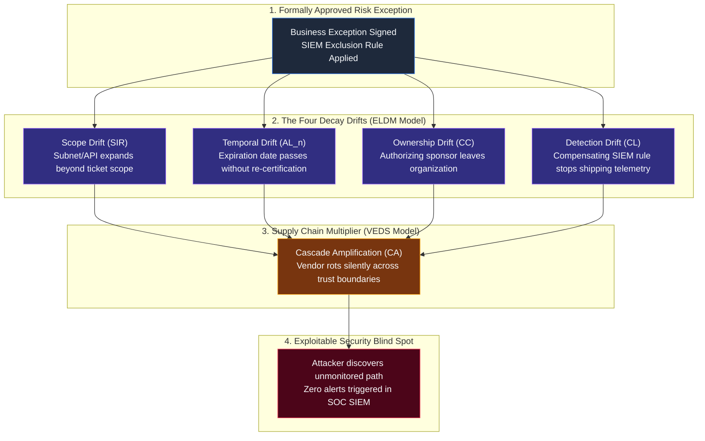
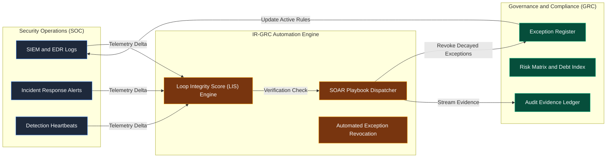

# SOC + GRC Operational Research: Attack Chain Architecture & Exception Decay

---

## TL;DR & The Core Discovery

Security Operations (SOC) and Governance, Risk, and Compliance (GRC) have spent decades operating in isolated silos. SOC analysts focus on alerts, logs, and live threats. GRC specialists focus on policies, risk registers, and compliance audits.

Through fifteen research papers, I set out to prove why this operational disconnect is dangerous. I started with basic email header forensics, climbed through cloud identity abuse and live endpoint hunting, built thermodynamic entropy models for security controls, and uncovered the mechanics of how signed risk exceptions quietly rot into attacker-ready backdoors. 

From there, I designed the IR-GRC Closed Loop framework to automate telemetry back-feeding, expanded governance into multi-jurisdictional Privacy Lattice systems, mapped shadow PII data pipelines, built the AI Security Failure Model to address non-deterministic agentic decay, solved the Third-Party Vendor Exception Decay Problem (VEDS), and mapped how protocol trust inversion drives the Authentication Coercion Chain Attack (ACCA).

Across fifteen papers, this repository provides unified mathematical decay models ($EDS$, $LIS$, $ODS$, $PEDS$, $SAVS$, $AEDM$, $ALL$, $VEDS$), production detection queries (KQL, SPL, SQL, VQL), automated SOAR containment playbooks, and audit-proof implementation frameworks.

---

## Why I Started This Research

I started this project because I kept seeing the exact same post-mortem failure pattern over and over again.

A risk exception gets formally approved and signed. To prevent noisy alerts, the SOC creates a SIEM exclusion rule. Everyone checks their box and moves on. Six months later, the log source feeding that detection pipeline silently stops shipping data. Nobody notices because the suppression rule suppressed the alert context. Nine months after that, an attacker discovers the resulting blind spot and uses it to breach the environment. 

When the post-mortem report comes out, it usually says "the SOC missed the alert." But that diagnosis is completely wrong. The SOC never had a chance. The risk exception rotted over time, took the compensating control down with it, and left the front door wide open.

Each department experiences this decay in a different way:
* **The SOC Analyst** closes alerts labeled as legacy noise without knowing the exception expired three months ago.
* **The Incident Responder** stares at nine months of unexplained attacker dwell time.
* **The Auditor** re-tests a risk exception whose actual operational scope no longer matches the original ticket.
* **The Data Protection Officer (DPO)** learns about a data leak long after the 72-hour regulatory notification clock has run out.
* **The CISO** reports a risk score to the board that no longer reflects real-world operational security.

What security leadership lacked was a single, rigorous framework to model this rotting process and an automated architecture to fix it. That is what I built throughout this fifteen-paper research series.

---

## The Complete Research Map

This diagram illustrates how my research evolved step by step, moving from low-level forensic triage to systemic entropy modeling, automated feedback loops, privacy engineering, AI failure models, supply chain vendor risk, and protocol trust inversion coercion chains.

```mermaid
graph TD
    AUG18["Paper 1: Aug 18, 2026<br/>SOC Phishing and Email Header Analysis"] --> AUG19["Paper 2: Aug 19, 2026<br/>Governance Failures and Telemetry Blind Spots"]
    AUG19 --> AUG20["Paper 3: Aug 20, 2026<br/>Cross-Functional Remediation Field Guide"]
    AUG20 --> AUG21["Paper 4: Aug 21, 2026<br/>Cloud Identity Fabric Attack Surfaces"]
    AUG21 --> SEP01["Paper 5: Sep 01, 2026<br/>Velociraptor Forensic and Detection Framework"]
    SEP01 --> SEP04["Paper 6: Sep 04, 2026<br/>The Detection Paradox and Signal Decay"]
    SEP04 --> SEP07["Paper 7: Sep 07, 2026<br/>The SOC-GRC Entropy Decay Model"]
    SEP07 --> SEP10["Paper 8: Sep 10, 2026<br/>Risk Acceptance Backdoors and Compliance Debt"]
    SEP10 --> SEP14["Paper 9: Sep 14, 2026<br/>Exception Lifecycle Decay Model (ELDM)"]
    SEP14 --> SEP15["Paper 10: Sep 15, 2026<br/>The IR-GRC Closed Loop Architecture"]
    SEP15 --> SEP25["Paper 11: Sep 25, 2026<br/>Beyond the Triad: Privacy Governance Lattice"]
    SEP25 --> SEP27["Paper 12: Sep 27, 2026<br/>Privacy Triad and Unsanctioned Processing (UPE)"]
    SEP27 --> SEP30["Paper 13: Sep 30, 2026<br/>The AI Security Failure Model (SAVS and AEDM)"]
    SEP30 --> OCT06["Paper 14: Oct 06, 2026<br/>Third-Party Exception Decay (VEDS Model)"]
    OCT06 --> OCT09["Paper 15: Oct 09, 2026<br/>Authentication Coercion Chains (ACCA Model)"]

    classDef foundation fill:#0F172A,stroke:#3B82F6,color:#F8FAFC,stroke-width:2px;
    classDef telemetry fill:#1E1B4B,stroke:#6366F1,color:#F8FAFC,stroke-width:2px;
    classDef forensics fill:#064E3B,stroke:#10B981,color:#F8FAFC,stroke-width:2px;
    classDef theoretical fill:#312E81,stroke:#8B5CF6,color:#F8FAFC,stroke-width:2px;
    classDef critical fill:#4C0519,stroke:#F43F5E,color:#F8FAFC,stroke-width:2px;
    classDef breakthrough fill:#78350F,stroke:#F59E0B,color:#F8FAFC,stroke-width:2px;
    classDef privacy fill:#0F172A,stroke:#38BDF8,color:#F8FAFC,stroke-width:2px;
    classDef latest fill:#065F46,stroke:#34D399,color:#F8FAFC,stroke-width:2px;

    class AUG18,AUG19 foundation;
    class AUG20,AUG21 telemetry;
    class SEP01 forensics;
    class SEP04,SEP07 theoretical;
    class SEP10 critical;
    class SEP14 breakthrough;
    class SEP15 theoretical;
    class SEP25,SEP27 privacy;
    class SEP30,OCT06 critical;
    class OCT09 latest;
```

---

## How Exceptions Rot: The 4 Internal Drifts and Third-Party Cascade

To understand why exceptions fail, I broke down the decay process into distinct, quantifiable drift vectors. What starts as a valid business decision degrades over time through four internal mechanisms, plus a fifth multiplier when vendors are involved.

```mermaid
flowchart TD
    subgraph Exception_Origins["1. Formally Approved Risk Exception"]
        EX["Business Exception Signed<br/>SIEM Exclusion Rule Applied"]
    end

    subgraph Four_Drifts["2. The Four Decay Drifts (ELDM Model)"]
        SD["Scope Drift (SIR)<br/>Subnet/API expands beyond ticket scope"]
        TD["Temporal Drift (AL_n)<br/>Expiration date passes without re-certification"]
        OD["Ownership Drift (CC)<br/>Authorizing sponsor leaves organization"]
        DD["Detection Drift (CL)<br/>Compensating SIEM rule stops shipping telemetry"]
    end

    subgraph Third_Party_Extension["3. Supply Chain Multiplier (VEDS Model)"]
        CA["Cascade Amplification (CA)<br/>Vendor rots silently across trust boundaries"]
    end

    subgraph Failure_Point["4. Exploitable Security Blind Spot"]
        BLIND["Attacker discovers unmonitored path<br/>Zero alerts triggered in SOC SIEM"]
    end

    EX --> SD
    EX --> TD
    EX --> OD
    EX --> DD
    SD --> CA
    TD --> CA
    OD --> CA
    DD --> CA
    CA --> BLIND

    style EX fill:#1E293B,stroke:#3B82F6,color:#F8FAFC
    style SD fill:#312E81,stroke:#8B5CF6,color:#F8FAFC
    style TD fill:#312E81,stroke:#8B5CF6,color:#F8FAFC
    style OD fill:#312E81,stroke:#8B5CF6,color:#F8FAFC
    style DD fill:#312E81,stroke:#8B5CF6,color:#F8FAFC
    style CA fill:#78350F,stroke:#F59E0B,color:#F8FAFC
    style BLIND fill:#4C0519,stroke:#F43F5E,color:#F8FAFC
```

---

## Unified SOC-GRC Closed Loop Defense Engine

The core operational solution across all papers is replacing manual annual reviews with automated, continuous feedback loops between incident telemetry and governance records.

```mermaid
flowchart LR
    subgraph SOC_Operations["Security Operations (SOC)"]
        SIEM["SIEM and EDR Logs"]
        IR["Incident Response Alerts"]
        DH["Detection Heartbeats"]
    end

    subgraph Closed_Loop_Engine["IR-GRC Automation Engine"]
        LIS["Loop Integrity Score (LIS) Engine"]
        SOAR["SOAR Playbook Dispatcher"]
        ROBOT["Automated Exception Revocation"]
    end

    subgraph GRC_Governance["Governance and Compliance (GRC)"]
        REG["Exception Register"]
        RISK["Risk Matrix and Debt Index"]
        AUDIT["Audit Evidence Ledger"]
    end

    SIEM -->|Telemetry Delta| LIS
    IR -->|Telemetry Delta| LIS
    DH -->|Telemetry Delta| LIS
    LIS -->|Verification Check| SOAR
    SOAR -->|Revoke Decayed Exceptions| REG
    REG -->|Update Active Rules| SIEM
    SOAR -->|Stream Evidence| AUDIT

    style SIEM fill:#1E293B,stroke:#3B82F6,color:#F8FAFC
    style IR fill:#1E293B,stroke:#3B82F6,color:#F8FAFC
    style DH fill:#1E293B,stroke:#3B82F6,color:#F8FAFC
    style LIS fill:#78350F,stroke:#F59E0B,color:#F8FAFC
    style SOAR fill:#78350F,stroke:#F59E0B,color:#F8FAFC
    style ROBOT fill:#78350F,stroke:#F59E0B,color:#F8FAFC
    style REG fill:#064E3B,stroke:#10B981,color:#F8FAFC
    style RISK fill:#064E3B,stroke:#10B981,color:#F8FAFC
    style AUDIT fill:#064E3B,stroke:#10B981,color:#F8FAFC
```

---

## Recommended Learning Paths

Different roles require different entry points into this research. Below is a guide to help you navigate the series based on your primary responsibilities.

| Role | Recommended Papers | Practical Outcomes & Deliverables |
| :--- | :--- | :--- |
| **Tier 1 & Tier 2 SOC Analysts** | [Paper 1](./On%2018-08-2026%20i%20learned%20%20SOC%20Phishing%20&%20Email%20Header%20Analysis%20%20Reference.md), [Paper 8](./ON%2010-09-2026%20-%20RISK%20ACCEPTANCE%20BACKDOORS,%20EXCEPTION%20ATTACK%20TREES,%20AND%20THE%20COMPLIANCE%20DEBT%20METRIC.md), [Paper 14](./ON%2006-10-2026%20%E2%80%94%20THE%20THIRD%20PARTY%20EXCEPTION%20DECAY%20PROBLEM%20How%20Vendor%20Risk%20Exceptions%20Rot%20Across%20Your%20Supply%20Chain%20The%20VEDS%20Model.md), [Paper 15](./On%2010-10-2026%20How%20Attackers%20Force%20Credential%20Exposure%20Without%20Touching%20the%20Credential%20Store%20%20&%20The%20ACCA%20Model,%20Forensic%20Reconstruction,%20and%20the%20Safety%20Architecture%20That%20Works.md) | SMTP header triage, SIEM exclusion verification, vendor exception alert triage, and detecting DC outbound coercion telemetry. |
| **Threat Hunters & Detection Engineers** | [Paper 4](./On%2021-08-2026%20%20Today%20I%20Cover%20The%20Cloud%20Identity%20Fabric%20%20Attack%20Surfaces%20Most%20SOC%20Teams%20Cannot%20Currently%20See.md), [Paper 5](./On%20%2001-09-2026%20VELOCIRAPTOR:%20A%20UNIFIED%20DETECTION-FORENSICS%20FRAMEWORK%20FOR%20SOC%20+%20GRC%20ATTACK%20CHAIN%20RESEARCH.md), [Paper 6](./On%2004-09-2026%20THE%20DETECTION%20PARADOX%20-%20WHY%20THE%20BETTER%20YOUR%20SIEM%20GETS,%20THE%20WORSE%20YOUR%20COVERAGE%20BECOMES.md), [Paper 10](./On%2015-09-2026%20%20The%20IR-GRC%20Closed%20Loop:%20How%20Incident%20Intelligence%20Flows%20Back%20Into%20the%20Exception%20Register%20Before%20the%20Next%20Attacker%20Arrives.md), [Paper 13](./On%2030-09-2026%20The%20AI%20Security%20Failure%20Model:%20Why%20Your%20SOC%20and%20GRC%20Program%20Is%20Operating%20on%20an%20Invalid%20Map.md), [Paper 15](./On%2010-10-2026%20How%20Attackers%20Force%20Credential%20Exposure%20Without%20Touching%20the%20Credential%20Store%20%20&%20The%20ACCA%20Model,%20Forensic%20Reconstruction,%20and%20the%20Safety%20Architecture%20That%20Works.md) | KQL/SPL cloud identity queries, Velociraptor VQL forensic artifacts, detection liveness heartbeats, AI prompt-drift rules, and DC coercion chain correlation queries. |
| **GRC Officers & Auditors** | [Paper 2](./On%2019-08-2026%20i%20learned%20When%20Governance%20Fails%20First:%20How%20GRC%20Breakdowns%20Create%20SOC%20Blind%20Spots.md), [Paper 9](./On%2014-09-2026%20-%20THE%20EXCEPTION%20LIFECYCLE%20DECAY%20MODEL%20How%20Accepted%20Risks%20Rot:%20A%20Four%20Drift%20Theory%20of%20GRC%20Exception%20Decay%20and%20Its%20Forensic,%20Detection,%20and%20Audit%20Consequences.md), [Paper 11](./On%2025-09-2026%20BEYOND%20THE%20TRIAD:%20THE%20MISSING%20DIMENSIONS%20A%20Comprehensive%20Research%20Supplement%20to%20%22The%20Privacy%20Governance%20Triad%22.md), [Paper 12](./On%2027-09-2026%20THE%20PRIVACY%20GOVERNANCE%20TRIAD%20AND%20THE%20UNSANCTIONED%20PROCESSING%20EXCEPTION.md), [Paper 14](./ON%2006-10-2026%20%E2%80%94%20THE%20THIRD%20PARTY%20EXCEPTION%20DECAY%20PROBLEM%20How%20Vendor%20Risk%20Exceptions%20Rot%20Across%20Your%20Supply%20Chain%20The%20VEDS%20Model.md), [Paper 15](./On%2010-10-2026%20How%20Attackers%20Force%20Credential%20Exposure%20Without%20Touching%20the%20Credential%20Store%20%20&%20The%20ACCA%20Model,%20Forensic%20Reconstruction,%20and%20the%20Safety%20Architecture%20That%20Works.md) | Continuous audit procedures, multi-jurisdictional compliance maps, vendor exception decay scores, and 7-item quarterly AD CS coercion checklists. |
| **Privacy Engineers & Architects** | [Paper 11](./On%2025-09-2026%20BEYOND%20THE%20TRIAD:%20THE%20MISSING%20DIMENSIONS%20A%20Comprehensive%20Research%20Supplement%20to%20%22The%20Privacy%20Governance%20Triad%22.md), [Paper 12](./On%2027-09-2026%20THE%20PRIVACY%20GOVERNANCE%20TRIAD%20AND%20THE%20UNSANCTIONED%20PROCESSING%20EXCEPTION.md), [Paper 13](./On%2030-09-2026%20The%20AI%20Security%20Failure%20Model:%20Why%20Your%20SOC%20and%20GRC%20Program%20Is%20Operating%20on%20an%20Invalid%20Map.md) | Privacy-Enhancing Technology (PET) enforcement formulas, automated shadow PII pipeline detectors, PrivOps engine automation, and AI inference data risk inventorying. |
| **CISOs & Security Executives** | [Paper 7](./On%2007-09-2026%20%20The%20SOC-GRC%20Entropy-Model:%20A%20Unified%20Framework%20for%20Security%20Program%20Decay%20and%20the%20Architecture%20of%20Anti-Fragile%20Detection.md), [Paper 10](./On%2015-09-2026%20%20The%20IR-GRC%20Closed%20Loop:%20How%20Incident%20Intelligence%20Flows%20Back%20Into%20the%20Exception%20Register%20Before%20the%20Next%20Attacker%20Arrives.md), [Paper 13](./On%2030-09-2026%20The%20AI%20Security%20Failure%20Model:%20Why%20Your%20SOC%20and%20GRC%20Program%20Is%20Operating%20on%20an%20Invalid%20Map.md), [Paper 14](./ON%2006-10-2026%20%E2%80%94%20THE%20THIRD%20PARTY%20EXCEPTION%20DECAY%20PROBLEM%20How%20Vendor%20Risk%20Exceptions%20Rot%20Across%20Your%20Supply%20Chain%20The%20VEDS%20Model.md), [Paper 15](./On%2010-10-2026%20How%20Attackers%20Force%20Credential%20Exposure%20Without%20Touching%20the%20Credential%20Store%20%20&%20The%20ACCA%20Model,%20Forensic%20Reconstruction,%20and%20the%20Safety%20Architecture%20That%20Works.md) | Quantitative security decay metrics ($EDS$, $LIS$, $SAVS$, $VEDS$), C-suite presentation slides, and identity trust-inversion defense architectures. |

---

## Chronological Research Index (Papers 1 to 15)

### 1. [18-08-2026: SOC Phishing & Email Header Analysis Reference](./On%2018-08-2026%20i%20learned%20%20SOC%20Phishing%20&%20Email%20Header%20Analysis%20%20Reference.md)
* **Focus:** Deep technical analysis of SMTP transaction mechanics, hop-by-hop header chain reconstruction, SPF/DKIM/DMARC validation checks, and regex extraction patterns.
* **Key Learning:** How attackers forge intermediate headers and how Tier 1 analysts can programmatically extract real client IP origins.

### 2. [19-08-2026: When Governance Fails First (Part 1)](./On%2019-08-2026%20i%20learned%20When%20Governance%20Fails%20First:%20How%20GRC%20Breakdowns%20Create%20SOC%20Blind%20Spots.md)
* **Focus:** Explores how uncoordinated GRC policy decisions create undetected telemetry blind spots in SOC SIEM monitoring environments.
* **Key Learning:** Unpacks the structural disconnect between policy documentation and SIEM data collection.

### 3. [20-08-2026: When Governance Fails First (Field Guide)](./On%2020-08-2026%20%20When%20Governance%20Fails%20First:%20How%20GRC%20Breakdowns%20Create%20SOC%20Blind%20Spots.md)
* **Focus:** Cross-functional remediation field matrix designed to validate risk register entries directly against live SIEM log streams.
* **Key Learning:** Operational step-by-step guidance for auditors and analysts to bridge governance expectations with technical detection.

### 4. [21-08-2026: The Cloud Identity Fabric: Attack Surfaces Most SOC Teams Cannot See](./On%2021-08-2026%20%20Today%20I%20Cover%20The%20Cloud%20Identity%20Fabric%20%20Attack%20Surfaces%20Most%20SOC%20Teams%20Cannot%20Currently%20See.md)
* **Focus:** Advanced KQL and SPL search queries targeting non-human identity abuse, illegal OAuth consent grants, and federated trust attack paths.
* **Key Learning:** Why traditional endpoint-focused SOC telemetry fails to catch cloud control plane compromise.

### 5. [01-09-2026: Velociraptor: Unified Detection-Forensics Framework for SOC + GRC](./On%20%2001-09-2026%20VELOCIRAPTOR:%20A%20UNIFIED%20DETECTION-FORENSICS%20FRAMEWORK%20FOR%20SOC%20+%20GRC%20ATTACK%20CHAIN%20RESEARCH.md)
* **Focus:** Leverages Velociraptor VQL artifact collection for continuous endpoint forensic hunting, feeding audit evidence directly into GRC records.
* **Key Learning:** Turning endpoint forensic artifacts into real-time compliance validation proof.

### 6. [04-09-2026: The Detection Paradox: Why the Better Your SIEM Gets, the Worse Your Coverage Becomes](./On%2004-09-2026%20THE%20DETECTION%20PARADOX%20-%20WHY%20THE%20BETTER%20YOUR%20SIEM%20GETS,%20THE%20WORSE%20YOUR%20COVERAGE%20BECOMES.md)
* **Focus:** Quantifies signal decay under aggressive rule tuning pressure and establishes a Detection-as-Code CI/CD test automation framework.
* **Key Learning:** Tuning out alert noise without automated liveness testing introduces critical blind spots.

### 7. [07-09-2026: The SOC-GRC Entropy Model: Unified Framework for Security Program Decay](./On%2007-09-2026%20%20The%20SOC-GRC%20Entropy-Model:%20A%20Unified%20Framework%20for%20Security%20Program%20Decay%20and%20the%20Architecture%20of%20Anti-Fragile%20Detection.md)
* **Focus:** Applies thermodynamic entropy principles and Shannon information theory to quantify structural security control degradation ($dS = dQ / T + \sigma$).
* **Key Learning:** Proving mathematically that unmonitored security controls degrade toward disorder over time.

### 8. [10-09-2026: Risk Acceptance Backdoors, Exception Attack Trees & Compliance Debt](./ON%2010-09-2026%20-%20RISK%20ACCEPTANCE%20BACKDOORS,%20EXCEPTION%20ATTACK%20TREES,%20AND%20THE%20COMPLIANCE%20DEBT%20METRIC.md)
* **Focus:** Demonstrates how approved risk exceptions create SIEM exclusion zones, formalizes Compliance Debt ($CD$), and constructs Exception Attack Trees.
* **Key Learning:** How adversaries systematically exploit approved risk waivers as low-friction intrusion vectors.

### 9. [14-09-2026: The Exception Lifecycle Decay Model (ELDM)](./On%2014-09-2026%20-%20THE%20EXCEPTION%20LIFECYCLE%20DECAY%20MODEL%20How%20Accepted%20Risks%20Rot:%20A%20Four%20Drift%20Theory%20of%20GRC%20Exception%20Decay%20and%20Its%20Forensic,%20Detection,%20and%20Audit%20Consequences.md)
* **Focus:** Establishes the four-drift theory of exception rot (Scope, Temporal, Ownership, Detection) and introduces the composite mathematical formula:
  $$EDS(e,t) = SIR(e,t) \times AL_n(e,t) \times CC(e,t) \times CL(e,t)$$
* **Key Learning:** Provides a clear numerical score (1.0 healthy to 0.0 dangerous) for any internal risk exception.

### 10. [15-09-2026: The IR-GRC Closed Loop Architecture](./On%2015-09-2026%20%20The%20IR-GRC%20Closed%20Loop:%20How%20Incident%20Intelligence%20Flows%20Back%20Into%20the%20Exception%20Register%20Before%20the%20Next%20Attacker%20Arrives.md)
* **Focus:** Formalizes the 4-Channel Closed Loop architecture, introduces the **Loop Integrity Score ($LIS$)**, provides production KQL/SPL code, SOAR schemas, and maps NIST CSF 2.0, ISO 27001, DORA, and NIS2.
* **Key Learning:** Automates the feedback loop so incident data automatically revokes decayed or compromised risk exceptions.

### 11. [25-09-2026: Beyond the Triad: Privacy Governance Lattice](./On%2025-09-2026%20BEYOND%20THE%20TRIAD:%20THE%20MISSING%20DIMENSIONS%20A%20Comprehensive%20Research%20Supplement%20to%20%22The%20Privacy%20Governance%20Triad%22.md)
* **Focus:** Expands privacy governance into a multi-jurisdictional Privacy Lattice (GDPR, CCPA, LGPD, PIPL, DPDP, POPIA), introducing Privacy-Enhancing Technology modeling ($PET(o,t)$) and AI inference risk metrics ($PCR$, $AIIC$).
* **Key Learning:** Operationalizing privacy compliance across modern complex, distributed cloud environments.

### 12. [27-09-2026: The Privacy Governance Triad & Unsanctioned Processing (UPE)](./On%2027-09-2026%20THE%20PRIVACY%20GOVERNANCE%20TRIAD%20AND%20THE%20UNSANCTIONED%20PROCESSING%20EXCEPTION.md)
* **Focus:** Formalizes diffuse ownership across DPO, SOC, and GRC functions. Introduces Ownership Decay Score ($ODS$), Attested Ownership Chains ($AOC$), Privacy Exception Decay Score ($PEDS$), and Shadow AI Exposure Index ($SAEI$).
* **Key Learning:** Detecting and containing shadow PII pipelines and unsanctioned data processing using production SIEM queries and SOAR workflows.

### 13. [30-09-2026: The AI Security Failure Model (SAVS & AEDM)](./On%2030-09-2026%20The%20AI%20Security%20Failure%20Model:%20Why%20Your%20SOC%20and%20GRC%20Program%20Is%20Operating%20on%20an%20Invalid%20Map.md)
* **Focus:** Analyzes how AI integration invalidates 11 foundational assumptions of legacy SOC and GRC programs. Introduces **Structural Assumption Validity Score ($SAVS$)**, **AI Exception Decay Model ($AEDM$)**, and **AI Loss Ledger ($ALL$)**.
* **Key Learning:** Technical blueprints and SOAR playbooks to manage non-deterministic AI agent behavior, prompt injection risks, and autonomous execution drift.

### 14. [06-10-2026: The Third Party Exception Decay Problem (The VEDS Model)](./ON%2006-10-2026%20%E2%80%94%20THE%20THIRD%20PARTY%20EXCEPTION%20DECAY%20PROBLEM%20How%20Vendor%20Risk%20Exceptions%20Rot%20Across%20Your%20Supply%20Chain%20The%20VEDS%20Model.md)
* **Focus:** Solves the third-party risk blind spot by extending exception decay modeling across supply chain boundaries. Introduces the **Vendor Exception Decay Score ($VEDS$)**:
  $$VEDS(v, e, t) = VSIR(v,e,t) \times VAL_n(v,e,t) \times VCC(v,e,t) \times VCL(v,e,t) \times CA(v,e,t)$$
* **Key Learning:** Quantifying vendor exception decay across zero-visibility trust boundaries, incorporating Cascade Amplification ($CA$), continuous audit workflows, and C-suite reporting.

### 15. [09-10-2026: How Attackers Force Credential Exposure Without Touching the Credential Store: The ACCA Model & Safety Architecture](./On%2010-10-2026%20How%20Attackers%20Force%20Credential%20Exposure%20Without%20Touching%20the%20Credential%20Store%20%20&%20The%20ACCA%20Model,%20Forensic%20Reconstruction,%20and%20the%20Safety%20Architecture%20That%20Works.md)
* **Focus:** Deep forensic reconstruction of authentication coercion primitives (SpoolSS, PetitPotam, DFSCoerce, ShadowCoerce, CheeseOunce, ADCS ESC8 HTTP relay, OAuth device code flow), exposing the trust-inversion attack model and establishing a 4-layer defense architecture.
* **Key Learning:** How adversaries invert protocol trust flow from DC to attacker listeners and how to prevent relay paths using EPA, SMB signing, RPC interface netsh filters, and KQL correlation rules.

---

## Series Changelog

| Date | Paper Title | Version | Major Additions & Key Deliverables |
| :--- | :--- | :---: | :--- |
| **18-08-2026** | SOC Phishing & Email Header Analysis | 1.0 | Initial publication; SMTP hop-by-hop parsing and header regex extraction. |
| **19-08-2026** | Governance Failures & SOC Blind Spots Part 1 | 1.0 | Initial publication; policy breakdown to SIEM telemetry gap analysis. |
| **20-08-2026** | Governance Failures Field Guide | 1.0 | Remediation matrix mapping risk register entries to live SIEM alerts. |
| **21-08-2026** | Cloud Identity Fabric Attack Surfaces | 1.0 | KQL and SPL query library for non-human cloud identities and OAuth grants. |
| **01-09-2026** | Velociraptor Unified Framework | 1.0 | Velociraptor VQL artifact collection playbooks for continuous endpoint auditing. |
| **04-09-2026** | The Detection Paradox | 1.0 | Signal decay mechanics under tuning and Detection-as-Code test pipelines. |
| **07-09-2026** | SOC-GRC Entropy Model | 3.0 | Application of thermodynamic entropy ($dS$) to quantify security control decay. |
| **10-09-2026** | Risk Acceptance Backdoors & Compliance Debt | 1.0 | Exception Attack Trees and mathematical formulation of Compliance Debt ($CD$). |
| **14-09-2026** | Exception Lifecycle Decay Model (ELDM) | 1.1 | Four-drift theory of internal exception rot and the master $EDS$ formula. |
| **15-09-2026** | The IR-GRC Closed Loop | 1.0 | 4-Channel Closed Loop architecture, $LIS$ score, SOAR playbooks, and regulatory maps. |
| **25-09-2026** | Beyond the Triad: Privacy Governance Lattice | 1.0 | Multi-jurisdictional lattice (GDPR, CCPA, PIPL, DPDP), $PET$ formula, and $PCR$ metrics. |
| **27-09-2026** | The Privacy Governance Triad & UPE | 1.0 | $ODS$, $PEDS$, and $SAEI$ formulas, shadow AI detection, PrivOps SOAR schemas. |
| **30-09-2026** | The AI Security Failure Model | 1.0 | Breakdown of 11 AI assumptions, $SAVS$, $AEDM$, $ALL$ metrics, 20+ Mermaid diagrams. |
| **06-10-2026** | Third-Party Exception Decay (VEDS Model) | 1.0 | Supply chain extension of exception decay, $VEDS$ formula, Cascade Amplification ($CA$). |
| **09-10-2026** | Authentication Coercion Chains (ACCA Model) | 2.0 | Catalog of 8 coercion primitives, 4-minute attack timeline, KQL/SPL correlation queries, netsh RPC filters, and 4-layer safety architecture. |

---

## About the Author

This research program was conducted entirely by **Me-Manjil Katuwal** (`hiro001-eth`).

My core research focus lies at the operational intersection of Security Operations, Privacy Engineering, and Governance, Risk, and Compliance. I explore what happens when these functions fail to share real-time data, models, or operational vocabulary: security controls decay silently, exceptions outlive their authorization, and major incidents become structurally inevitable months before an attacker steps through the door.

---

> *"Security exceptions do not break suddenly. They rot quietly over time. Shadow data pipelines do not trigger alerts. They accumulate compliance debt. The only choice you have is whether you automate their discovery today or explain the breach tomorrow."*
> 
> **Manjil Katuwal (hiro001-eth), 2026**
